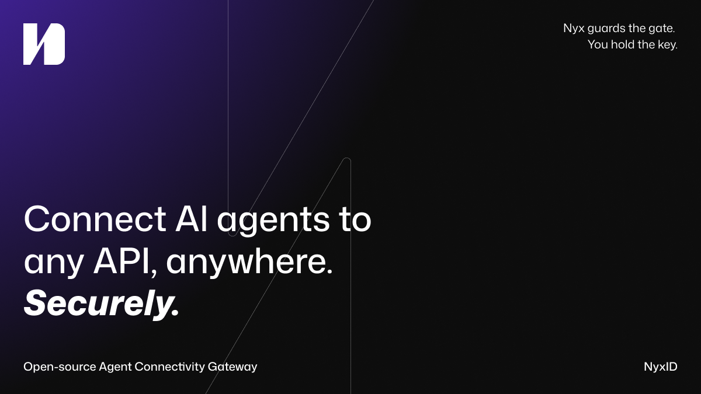
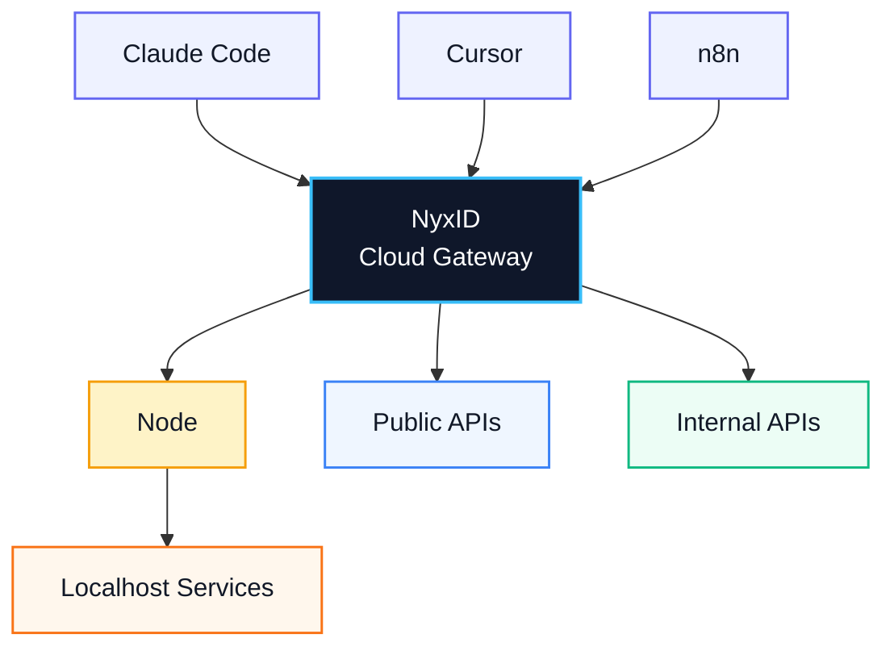
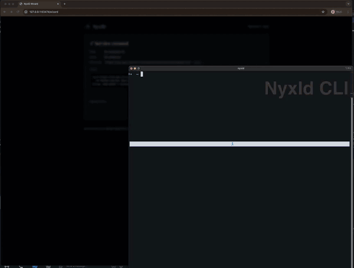

<p align="center">
  
</p>

**Connect AI agents to any API, anywhere. Securely.** Open-source Agent Connectivity Gateway.

[](LICENSE)
[](https://github.com/ChronoAIProject/NyxID)

NyxID lets your AI agents (Claude Code, Cursor, n8n) reach any API you have,
public or private, and handles all the credentials so your agent never sees
a raw key.



NyxID proxies requests, injects credentials automatically, punches through
NAT to reach your local services, and wraps any REST API as MCP tools.

<!-- TODO: Product screenshot
     Replace the ASCII diagram above with a polished architecture diagram or dashboard screenshot.
     <p align="center">
       
     </p>
-->

## What NyxID Does

- **Reach anything** — public APIs, internal APIs, localhost services via credential nodes (`nyxid node`). SSH tunneling (`nyxid ssh`) reaches remote hosts. No VPN, no port forwarding.
- **Never expose keys** — the reverse proxy injects credentials automatically. Your agent talks to NyxID; NyxID talks to the API with the real key.
- **MCP auto-wrap** — REST APIs with OpenAPI specs become MCP tools. `nyxid mcp config --tool cursor` generates the config. Works with Claude Code, Cursor, VS Code, and any MCP client.
- **Per-agent isolation** — each agent gets a scoped token. Agent A accesses Slack and Gmail. Agent B only accesses your internal API. Revoke any session without touching the underlying credentials.
- **Full identity layer** — OIDC/OAuth 2.0 with PKCE, RBAC, service accounts, transaction approval (Telegram + mobile push), LLM gateway for 7 providers.

## Why NyxID

| | NyxID | 1Password UA | Cloudflare Tunnel | Keycloak |
|---|---|---|---|---|
| Open source | Yes | No | No | Yes |
| NAT traversal to localhost | Yes (`nyxid node`) | No | Yes (no credentials) | No |
| Credential injection | Yes (any API) | Partner integrations | No | No |
| REST to MCP auto-wrap | Yes | No | No | No |
| Per-agent isolation | Yes | No | No | No |
| OIDC / OAuth 2.0 | Yes | No | No | Yes |

<!-- TODO: Demo GIF
     15-30 second terminal recording: install CLI → login → proxy a request
     Tools: https://github.com/charmbracelet/vhs or https://asciinema.org
     <p align="center">
       
     </p>
-->

## Quick Start

Pick the path that fits:

| Path | Time | What you need |
|------|------|---------------|
| [Hosted](#hosted-closed-beta) | 2 min | Browser |
| [AI-assisted setup](#ai-assisted-setup) | 3 min | Claude Code, Cursor, or any AI coding assistant |
| [Manual CLI setup](#manual-cli-setup) | 5 min | Terminal + Docker (self-host) or hosted account |

### Hosted (closed beta)

Sign up at the [NyxID console](https://nyx.chrono-ai.fun), add your API credentials through the dashboard, and copy the MCP config from **Settings > MCP** into your AI tool. Currently invitation-only — [join the waitlist](https://nyx.chrono-ai.fun/#waitlist).

### AI-assisted setup

Paste this into Claude Code, Cursor, or any AI coding assistant:

> Help me set up NyxID. Install the CLI (`cargo install --git
> https://github.com/ChronoAIProject/NyxID.git nyxid-cli`), log in with
> `nyxid login`, add my OpenAI API key with `nyxid service add openai`,
> and run `nyxid mcp config --tool claude-code` to configure MCP so I can
> use NyxID-proxied tools from this session.

Your AI agent will walk you through each step interactively.

<!-- AI quickstart maintenance: validate this prompt against actual CLI on each release -->

### Manual CLI setup

#### 1. Start the server (self-host)

```bash
git clone https://github.com/ChronoAIProject/NyxID.git && cd NyxID
cp .env.production.example .env.production

# Generate secrets (keep ENCRYPTION_KEY safe — you need it if you restart)
sed -i '' "s/ENCRYPTION_KEY=.*/ENCRYPTION_KEY=$(openssl rand -hex 32)/" .env.production
sed -i '' "s/MONGO_ROOT_PASSWORD=.*/MONGO_ROOT_PASSWORD=$(openssl rand -hex 24)/" .env.production

docker compose -f docker-compose.prod.yml --env-file .env.production pull
docker compose -f docker-compose.prod.yml --env-file .env.production up -d
```

Open `http://localhost:3000` and register your account. JWT signing keys are auto-generated on first startup.

> For production hardening (custom JWT keys, TLS, domain), see [docs/DEPLOYMENT.md](docs/DEPLOYMENT.md).

#### 2. Install CLI, add credential, configure MCP

```bash
# Install the CLI
cargo install --git https://github.com/ChronoAIProject/NyxID.git nyxid-cli

# Log in (opens browser)
nyxid login                                       # hosted: add --base-url https://nyx.chrono-ai.fun

# Add your first API credential (e.g. OpenAI)
nyxid service add openai --credential-env OPENAI_API_KEY

# Generate MCP config for your AI tool
nyxid mcp config --tool claude-code               # or: --tool cursor, --tool codex
```

Add the output to your MCP config:
**Claude Code** `~/.claude/settings.json` · **Cursor** `.cursor/mcp.json` · **Codex** `~/.codex/config.toml`

#### 3. Verify

```bash
# Verify from the CLI
nyxid proxy request openai /v1/models
```

If the proxy returns a response, the full chain works: credential stored, injected, downstream accepted. Ask your AI agent to list its tools — you should see the API you just connected.

#### Web console

Everything above can also be done through the web console at `http://localhost:3000`:

- **Providers** — connect API keys (OpenAI, Anthropic, GitHub, etc.)
- **Services > Connections** — view connected services, click **Test** to verify credentials work through the proxy
- **Settings > MCP** — copy MCP config snippets for Claude Code, Cursor, or Codex

---

### Reach local services (optional)

Services behind a firewall? Deploy a credential node to punch through NAT and expose them as MCP tools:

```bash
# Register and start a node (outbound WebSocket — no port forwarding, no VPN)
nyxid node register --token <reg-token> --url wss://<your-server>/api/v1/nodes/ws
nyxid node credentials add --service my-local-api --header Authorization --secret-format bearer
nyxid node start

# Register the service and link it to the node
nyxid node credentials setup --service my-local-api --api-url http://localhost:8080

# Import endpoints as MCP tools (if the service has an OpenAPI spec)
nyxid catalog endpoints my-local-api
```

## Use Cases

- Give Claude Code access to your private APIs without sharing keys
- Expose internal microservices to AI agents through a single MCP endpoint
- Secure AI agent access to self-hosted tools (Grafana, Jenkins, n8n) behind your firewall

## Resources

| Topic | Link |
|-------|------|
| API Reference | [docs/API.md](docs/API.md) |
| Architecture | [docs/ARCHITECTURE.md](docs/ARCHITECTURE.md) |
| AI Agent Playbook | [docs/AI_AGENT_PLAYBOOK.md](docs/AI_AGENT_PLAYBOOK.md) |
| Credential Nodes | [docs/NODE_PROXY.md](docs/NODE_PROXY.md) |
| MCP Integration | [docs/MCP_DELEGATION_FLOW.md](docs/MCP_DELEGATION_FLOW.md) |
| SSH Tunneling | [docs/SSH_TUNNELING.md](docs/SSH_TUNNELING.md) |
| Security | [docs/SECURITY.md](docs/SECURITY.md) |
| Environment Variables | [docs/ENV.md](docs/ENV.md) |
| Deployment | [docs/DEPLOYMENT.md](docs/DEPLOYMENT.md) |
| Developer Guide | [docs/DEVELOPER_GUIDE.md](docs/DEVELOPER_GUIDE.md) |

## Contributing

We welcome contributions. See [CONTRIBUTING.md](CONTRIBUTING.md).

## License

[Apache-2.0](LICENSE)
