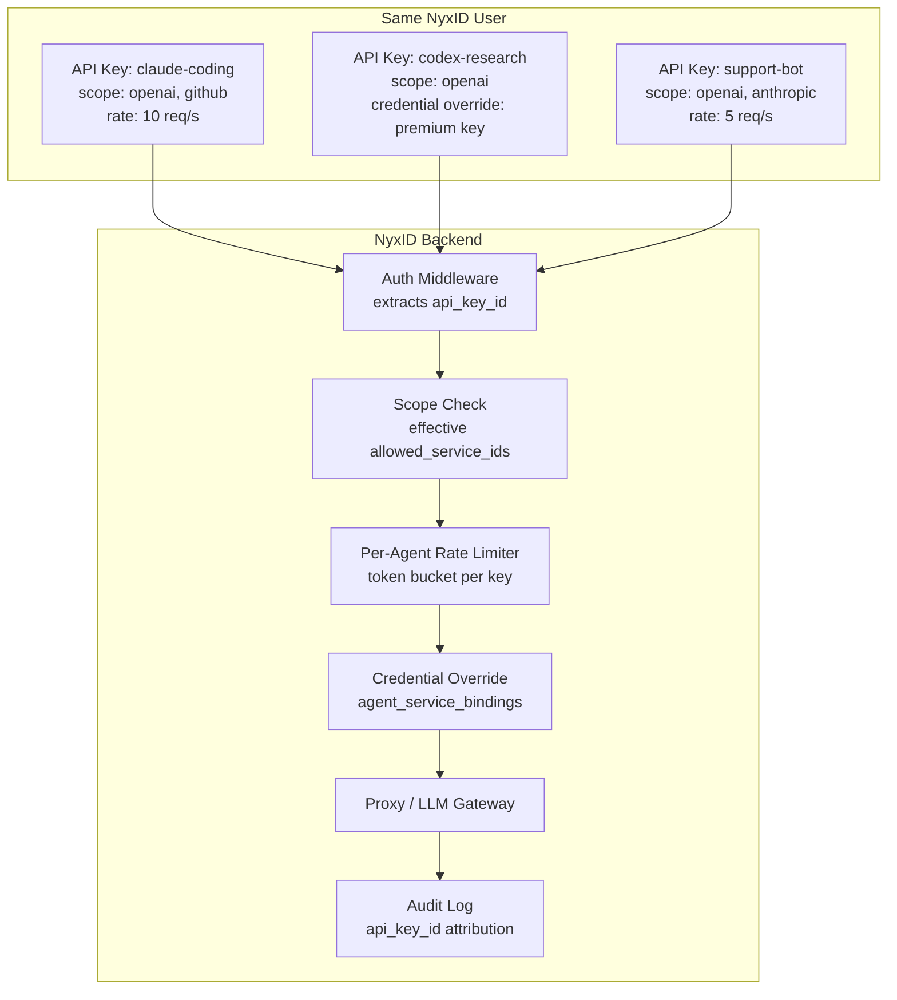
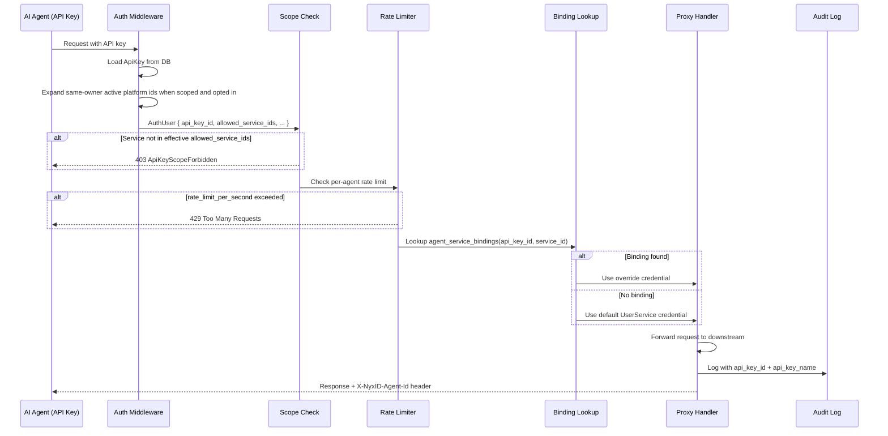
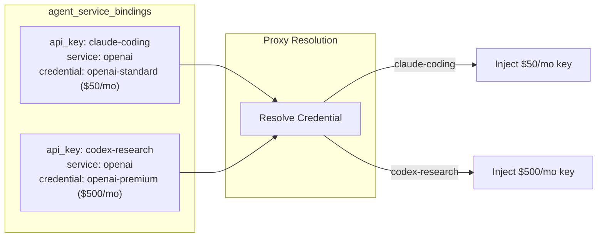
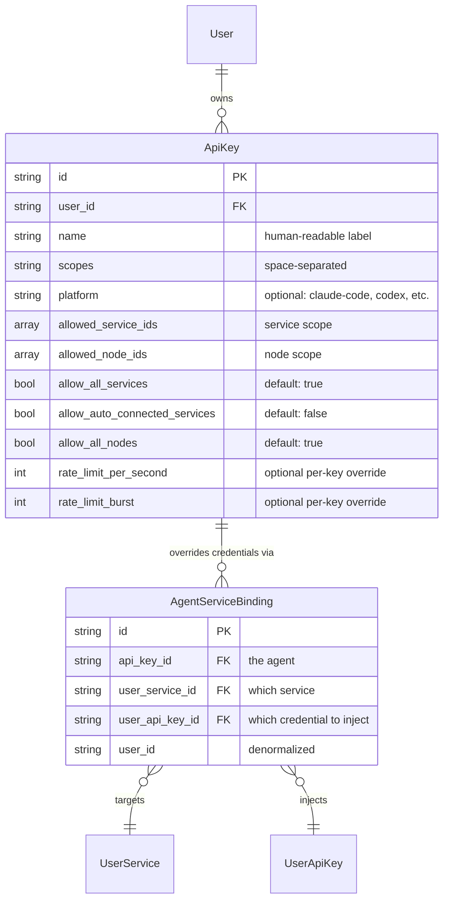
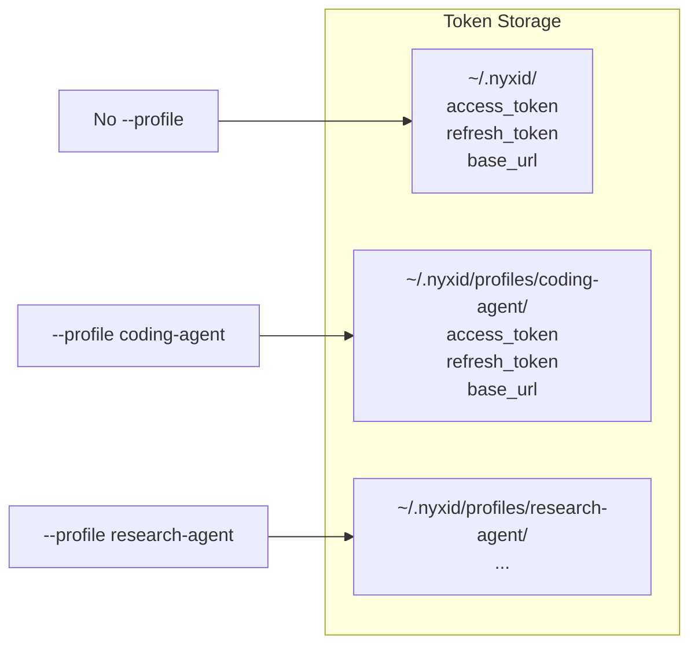
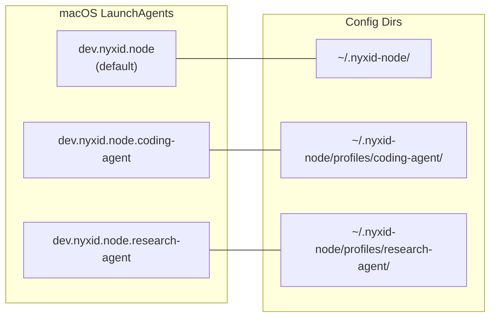
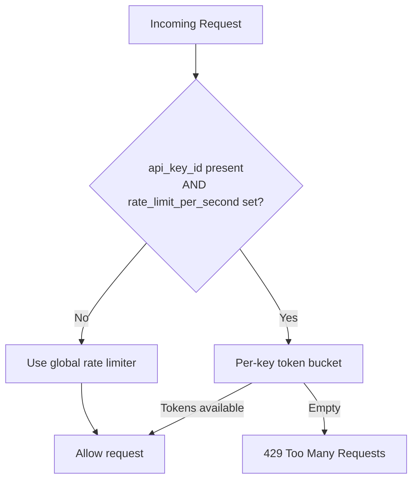

# Agent Isolation

## Login Credentials Bound to a Key

`nyxid login --agent-key` enrolls a CLI profile through explicit human approval in the web console or the mobile app's QR flow. The operator chooses an existing eligible personal/org key or creates a limited key. Each login receives its own `api_key_credentials` child secret; the parent key's primary secret is never recovered, displayed, or silently rotated. New keys also use child credentials, with their undisclosed primary secret discarded.

Authentication resolves the live parent key for scopes, service/node restrictions, per-agent bindings, rate limits, and audit attribution. `AuthUser.api_key_credential_id` identifies the calling login credential while `api_key_id` and `api_key_name` remain the parent identity. Child expiry cannot exceed parent expiry. Parent revocation or rotation invalidates all children, and live parent expiry is checked on every authentication.

`whoami` and `status` identify Agent Key authentication. `logout` revokes only the calling child and clears the profile; individual credentials can also be revoked in the key detail page's Login credentials section. The profile holds a protected `token`, an `auth_kind` marker, and safe `agent_key.json` metadata, with no human refresh token. Rejected credentials never refresh or prompt for account login. Abandoned approved exchanges are revoked after their 60-second delivery window by poll/preview cleanup or the configured background sweep.

Login credential labels combine the sanitized client hostname and requested profile (up to 96 characters), so separate profiles on one machine remain identifiable. Public preview exposes request context and status only; key metadata is available through authenticated selection and self routes or credential delivery. Approval, denial, and delivery audits retain the actor's IP and user agent, with the request ID linking the events. A failed expiry cleanup is logged and retained for retry while the sweep continues processing other exchanges.

## Asset ownership transfer

General Agent Keys with `write` or `admin` scope and `allow_all_services=true`
can transfer their owner's catalog definitions and supported channel bots through
`/api/v1/ownership/{kind}/{id}`. An org-owned key acts as that organization;
a personal key can also act through its owner's active, unrestricted org-admin
membership. Platform-admin status on the key owner grants no cross-owner override.
Proxy-only, scheduled-invocation, and limited connected-service keys cannot
transfer these assets. There is no per-transfer mobile approval. Preview, live
permission checks, transactional receipts and agent-attributed audit still apply.
See [Ownership transfers](ADMIN_OWNERSHIP_TRANSFERS.md) for routes and adapter limits.

## Overview

Agent isolation lets different AI agents (Claude Code, Codex, custom bots, etc.) belonging to the same NyxID user operate with independent credentials, rate limits, scopes, and audit trails. There is no separate "agent" model -- an **API key is the agent identity**.

Unattended scheduled writes use the separate, fail-closed
`scheduled_invocation` key purpose documented in
[Durable Operation Grants](DURABLE_OPERATION_GRANTS.md). General agent keys and
legacy `ApprovalGrant` rows never gain that authority.



## How It Works

### Proxy Request Flow



### Auto-connected platform services

A restricted key can select individual auto-connected `UserService` IDs or set
`allow_auto_connected_services=true`. The effective allowlist is the explicit
`allowed_service_ids` union active rows whose `user_id` equals the key owner and
whose `source` is `auto_provision`. This durable grant follows new services and
replacement row IDs after reconciliation. Disabling the flag leaves explicit
selections intact. `allow_all_services=true` takes precedence; storing both flags
is allowed, and the platform grant becomes effective if the key is later narrowed.

`key_service::effective_allowed_service_ids` expands scope at API-key auth-context
construction, including MCP and channel relay issuance. Proxy, relay JWT, agent
binding and exact-approval consumers use the resulting IDs through their existing
checks. JWT/API-key authentication itself never provisions rows.
The indexed expansion query only runs for restricted, opted-in keys.

Ownership remains authoritative: a personal platform row cannot be selected for
an org key, and expansion never includes a different owner's rows. Version 0.20
includes explicit platform bindings in the auto-connected grant. Human and delegated key listing,
Agent Key login delivery (login options), and device-code approval/onboarding for
the acting person's own account invoke shared provisioning, which may idempotently
create org-owned auto-connected rows only through that person's own active
Member/Admin memberships with `can_proxy()` and explicit platform-key grants.
The 0.19.0 guarantee remains: org-targeted device approval/onboarding resolves
existing org services and never provisions rows for the target org as a side effect
of targeting. These rows appear as
auto-connected in org views. Removing an org grant immediately blocks execution
and the next per-owner reconciliation removes automatic rows and orphan endpoints.
Legacy no-auth/public-master provisioning remains personal-only during inherited
membership traversal.

```bash
nyxid api-key create --name research --scopes proxy --allowed-services github,autoplatform --terminal
nyxid api-key create --name platform-agent --scopes proxy --allow-auto-connected-services --terminal
nyxid api-key update KEY_ID --allow-auto-connected-services true
nyxid api-key update KEY_ID --allow-auto-connected-services false
nyxid device approve USER_CODE --service autoplatform --allow-auto-connected-services
```

`--allowed-services` accepts UUIDs or active service slugs. Slug resolution reads
`/keys`, errors on unknown or ambiguous slugs, and preserves UUID pass-through.
The browser wizard and mobile login approval expose the same individual and
durable selections. Scope plans retain explicit IDs separately from the current
implied service preview, so accepting a plan does not pin implied row identities.
Scheduled-invocation keys continue requiring exact service/operation grants.

### Credential Override

The core new capability. Two agents using the same service (e.g., OpenAI) can inject different API keys:



Without a binding, the proxy falls back to the default credential on the `UserService` (existing behavior).

## Data Model



### Key fields on `ApiKey` (added by this feature)

| Field | Type | Default | Purpose |
|---|---|---|---|
| `allow_auto_connected_services` | `bool` | `false` | Adds active same-owner auto-connected platform services to a restricted key, including future additions |
| `platform` | `Option<String>` | `None` | Display label (claude-code, codex, openclaw, cursor, generic) |
| `rate_limit_per_second` | `Option<u32>` | `None` | Per-key rate limit (falls back to user-level when `None`) |
| `rate_limit_burst` | `Option<u32>` | `None` | Per-key burst capacity |

### Key fields on `AuthUser` (added by this feature)

| Field | Type | Default | Purpose |
|---|---|---|---|
| `api_key_id` | `Option<String>` | `None` | Populated when auth is via API key |
| `api_key_name` | `Option<String>` | `None` | Human-readable label for audit |
| `rate_limit_per_second` | `Option<u32>` | `None` | Copied from ApiKey for middleware |
| `rate_limit_burst` | `Option<u32>` | `None` | Copied from ApiKey for middleware |

Optional metadata uses `serde(default)`; the platform-services grant is a defaulted boolean. Legacy keys keep their existing scope.

## API Endpoints

General agent keys can read org membership through `GET /api/v1/orgs`, `/orgs/{key}`, `/orgs/{key}/authorization`, `/orgs/{org_id}/members`, `/orgs/{org_id}/members/{member_id}/authorization`, and `/orgs/{org_id}/role-scopes` (all under `/api/v1`; `{key}` accepts UUID or slug). No extra scope or service allowlist is required; active membership governs reads and role scopes require admin. The actor is the key owner: person-owned keys see that person's memberships, while org-owned keys list their own org and receive Direct read access, projected as `your_role: "admin"` without a membership row. All writes, invites (including GET), and primary-org changes remain human-only for API keys. Scheduled-invocation keys remain rejected; delegated `account:read` parity is unchanged.

Agent keys can also GET `/keys`, `/keys/{id_or_slug}`, `/keys/{id_or_slug}/authorization`, `/user-services`, `/endpoints` (including authorized `?org_id=`), `/endpoints/{id}/authorization`, `/endpoints/{id}/openapi-endpoints`, `/api-keys/external`, `/api-keys/external/{id}/authorization`, and `/mcp/config`, plus `/catalog`, `/catalog/{slug}`, and `/catalog/{slug}/endpoints`. Catalog GETs require no proxy scope; template metadata and live platform availability do not expose instance overrides or connection state. Instance-backed private catalog access and mounted-spec fallback require an allowed backing UserService and the same Member/Admin org scopes as inventory. MCP `nyx__discover_services` gives unrestricted API keys the same discovery result as the owner's session; credential-free auto-connected templates remain suppressed for all callers. For restricted keys, instance-based suppression uses only visible instances. MCP discovery applies the same visibility rule as `GET /api/v1/catalog` for every caller: public and legacy rows, rows the actor created, and platform-key-enabled rows subject to live availability. `/mcp/config` requires `proxy` or `proxy:*` scope and matches stateless MCP discovery, including mounted instance specs; assistant chat keys discover services before acknowledgement, with grants enforced at execution. These API-key reads perform no auto-provisioning or lazy pending-OAuth reconciliation. Restricted keys are filtered to their effective service allowlist, including auto-connected expansion; endpoints and credentials must back at least one allowed service. Personal keys list personal and org-shared services through active Member/Admin memberships and effective role scopes; Viewer-only org services are excluded. Org-owned keys list their own services with the existing `credential_source.type: "personal"` tag. `/keys` still includes disabled rows within key scope. All inventory writes and the entire NyxID `/api-keys` management router remain human-only for API keys; delegated `account:read` parity is unchanged.

### Credential Bindings

| Method | Path | Description |
|---|---|---|
| `POST` | `/api/v1/api-keys/{key_id}/bindings` | Create credential binding |
| `GET` | `/api/v1/api-keys/{key_id}/bindings` | List bindings for a key |
| `DELETE` | `/api/v1/api-keys/{key_id}/bindings/{id}` | Remove a binding |

### Usage

| Method | Path | Description |
|---|---|---|
| `GET` | `/api/v1/api-keys/usage` | Per-key usage stats (requests, errors, top services) |
| `GET` | `/api/v1/api-keys/{id}/usage` | Usage for a specific key |

### Existing (modified)

| Method | Path | Change |
|---|---|---|
| `POST` | `/api/v1/api-keys` | Accepts optional `platform` and `allow_auto_connected_services` fields |
| `PUT` | `/api/v1/api-keys/{id}` | Accepts `rate_limit_per_second`, `rate_limit_burst`, `platform`, `allow_auto_connected_services` |

## CLI

### API Key Commands

```bash
# Create with optional platform label and service scope
nyxid api-key create --name "coding-agent" --platform claude-code \
  --allowed-services "openai,github" --terminal

# Bind a specific credential to a key for a service
nyxid api-key bind <ID_OR_NAME> --service <SLUG> --credential <LABEL>

# All existing commands unchanged
nyxid api-key list / show / rotate / delete
```

### CLI Profiles

For running multiple agent identities on one machine:

```bash
nyxid login --base-url https://... --profile coding-agent
nyxid proxy request openai /chat/completions --profile coding-agent
NYXID_PROFILE=coding-agent nyxid service list
```



No `--profile` = default path (`~/.nyxid/`). Full backward compatibility.

### Node Multi-Instance

Each profile gets its own daemon process and config directory:

```bash
nyxid node register --token nyx_nreg_... --profile coding-agent
nyxid node daemon install --profile coding-agent
nyxid node daemon start --profile coding-agent
```



### Docker

```bash
# Auto-register + start (no host setup needed)
docker run --user "$(id -u):$(id -g)" \
  -v ~/.nyxid-node:/app/config \
  -e NYXID_NODE_TOKEN=nyx_nreg_... \
  -e NYXID_NODE_URL=wss://... \
  nyxid-node

# Or mount existing config
docker run --user "$(id -u):$(id -g)" \
  -v ~/.nyxid-node:/app/config \
  nyxid-node
```

Containers use the file backend (AES-GCM encrypted). OS keychain is not available in Docker.

## Frontend

- **API key detail page**: platform selector, rate limit editor, credential bindings CRUD, usage stats
- **Keys page**: per-key usage dashboard (requests, errors, error rate, top services, 7-day activity)
- **Admin audit log page**: filterable by `api_key_id`

## Per-Agent Rate Limiting



Implementation: in-memory `PerAgentRateLimiter` with token-bucket per API key. Background cleanup evicts idle buckets after 120 seconds.

When `rate_limit_per_second` is `None` on the key, the per-agent check is a no-op and the global rate limiter applies (unchanged behavior).

## Audit Attribution

Every proxy and LLM gateway request logs `api_key_id` and `api_key_name` in the audit event. This enables:
- Per-agent usage dashboards
- Admin audit log filtering by API key
- `X-NyxID-Agent-Id` response header for downstream observability

## Backward Compatibility

All changes are additive. No breaking changes for existing users:

| Area | Guarantee |
|---|---|
| Platform-services grant | Absent `allow_auto_connected_services` means false. Scope-plan digests remain byte-identical when false or absent; true binds the durable grant and previews current platform rows. |
| Existing API keys | `allow_all_services=true`, `allow_all_nodes=true`, no rate limit override, no bindings. Behavior identical to before. |
| Existing auth paths (JWT, session, SA) | New `AuthUser` fields are `None`. No scope enforcement, no rate limit override. |
| No `--profile` flag | Reads from `~/.nyxid/` (unchanged). |
| No `agent_service_bindings` | Proxy uses default `UserService.api_key_id` (unchanged). |
| API responses | Additive grant fields and `allowed_services[].auto_connected` identify platform access. Existing clients may ignore the new fields. |

## Key Files

| File | Purpose |
|---|---|
| `backend/src/mw/auth.rs` | AuthUser with api_key_id, scopes, rate limits |
| `backend/src/mw/rate_limit.rs` | PerAgentRateLimiter (token bucket) |
| `backend/src/models/agent_service_binding.rs` | Credential override model |
| `backend/src/services/agent_binding_service.rs` | Binding CRUD + lookup |
| `backend/src/services/proxy_service.rs` | resolve_agent_credential_override() |
| `backend/src/handlers/agent_bindings.rs` | Binding REST endpoints |
| `backend/src/handlers/api_keys.rs` | Usage endpoints, bindings_count |
| `cli/src/auth.rs` | Profile-aware token storage |
| `cli/src/commands/api_key.rs` | bind command, --platform flag |
| `cli/docker-entrypoint.sh` | Auto-register in Docker |
