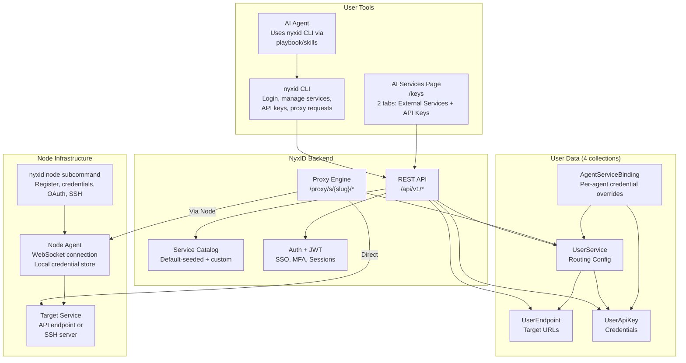
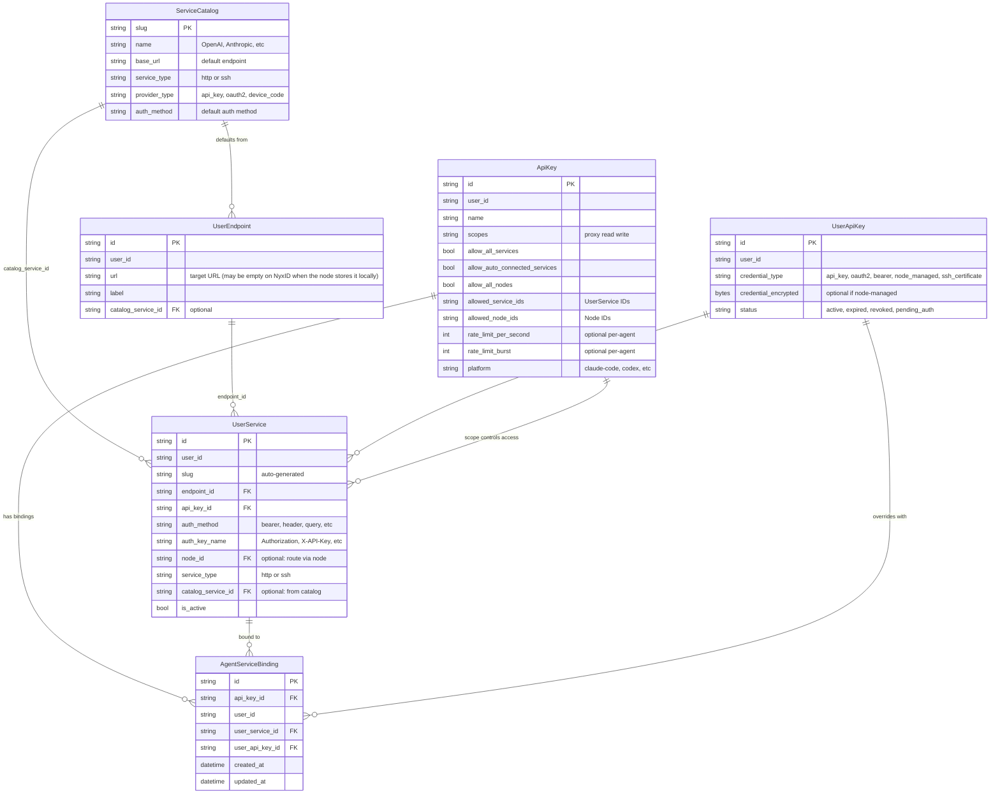
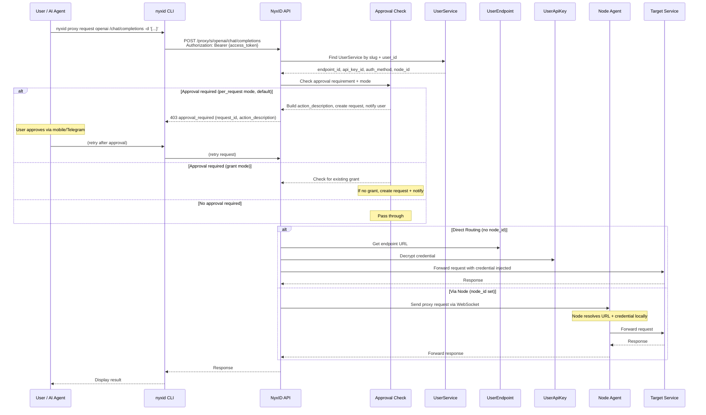
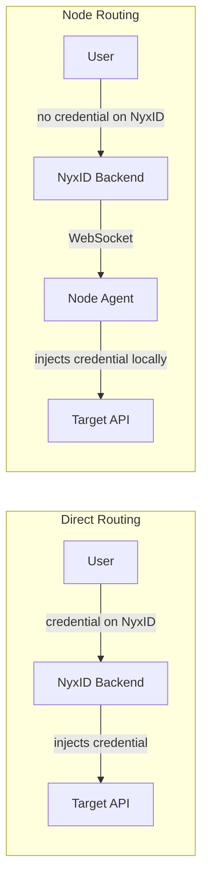
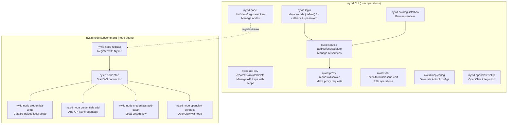
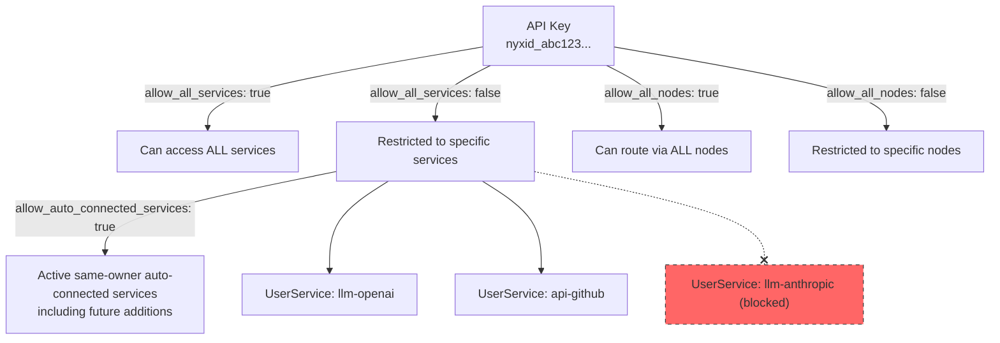
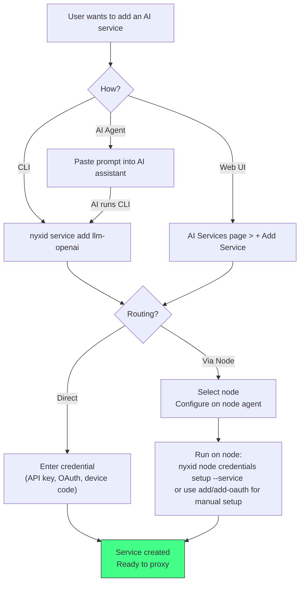
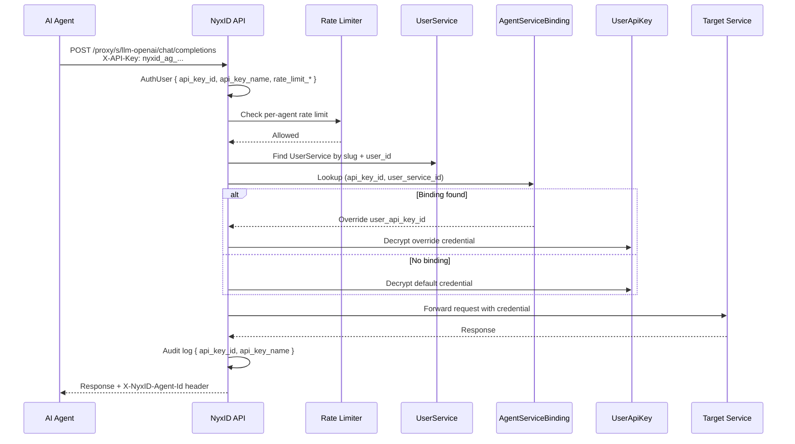

# AI Services Architecture

Admin service creation, provider linking, and legacy vendor retirement are documented in [SERVICE_CONFIGURATION.md](SERVICE_CONFIGURATION.md).

## Overview

NyxID's AI Services system lets users manage external API credentials, SSH services, and proxy routing through a unified interface. Users interact via the **AI Services page** (`/keys`) or the **`nyxid` CLI**.

---

## System Components

## Service-Pool Routing Boundary

NyxID#974 was narrowed to a routing proof before adding a user-facing pool
surface. The proof is recorded in
[SERVICE_POOL_ROUTING_PROOF.md](SERVICE_POOL_ROUTING_PROOF.md).

The important boundary is that `UserService` remains the concrete proxy target
member, while any future `ServicePool` must be selected inside
`proxy_service::resolve_proxy_target_from_user_service()`. The existing
`node_routing_service::resolve_node_route()` / `fallback_node_ids` layer remains
node failover below a selected `UserService`; it is not sufficient by itself to
balance multiple endpoint/credential instances behind one stable slug.

## Data Model Relationships

## Service Lifecycle: Disable vs Delete

There are exactly **two** lifecycle actions on a connection, and they are
exposed under exactly two names on every surface. Use these words — the UI
previously carried four (`Deactivate`/`Activate`/`Pause` and `Revoke`/`Delete`)
for these two actions, which made them read as more than two things.

| | Verb | Reversible | Effect |
|---|---|---|---|
| Pause | **Disable** / **Enable** | Yes | `UserService.is_active = false`. Nothing else is touched. |
| Remove | **Delete** | No | Hard-deletes `UserApiKey` + `UserEndpoint`, cleans agent bindings and org role scopes, optionally revokes upstream. |

Both make the service unusable: the proxy, MCP catalog, discovery and scope
checks all resolve through active-only queries, so a disabled service 404s
exactly like a deleted one.

Naming note: `revoked` is a **credential status** (`UserApiKey.status`) that a
card can render *while the service is otherwise fine*. Keep it out of button
labels for the delete action or the two meanings collide.

### `DELETE /user-services/{id}` is a misnamed disable

Despite the verb it calls `deactivate_user_service`: it sets `is_active = false`
and cleans agent bindings and org role scopes, but **keeps the credential and
endpoint**. Nothing in the product calls it — not the frontend, CLI, mobile or
SDK — and it is reachable only by direct API use.

Before disabled services were listed, this endpoint looked like a delete: the
row vanished while its credential stayed stored. It now correctly shows up as
`Disabled`. Prefer `PUT /user-services/{id} {is_active: false}` to disable and
`DELETE /keys/{id}` to actually delete.

### Delete leaves a tombstone

`Delete` soft-deletes the `UserService` row (`is_active = false`) and hard-deletes
the credential and endpoint. The tombstone is invisible everywhere, including
the management listing, because `list_keys` drops any row whose endpoint is
missing.

### Two listings, deliberately different

| Function | Includes disabled? | Used by |
|---|---|---|
| `list_user_services_with_sources` | No | proxy discovery, MCP catalog, OAuth resource indicators, API-key scope, assistant readiness |
| `list_user_services_with_sources_including_disabled` | **Yes** | `unified_key_service::list_keys` → `GET /keys` **only** |

A disabled service must stay in the management listing or the pause is
unreversible in the product — it would vanish from the screen carrying the
Enable control. It must stay out of every other listing or a disabled service
becomes reachable by an agent.

**Never** point a credential-resolving or catalog path at the
`_including_disabled` variant.

### Resolution asymmetry (do not "fix" this)

`find_user_service_for_actor` (`handlers/keys.rs`, the `/keys/{id_or_slug}`
resolver) matches a **disabled row by UUID but not by slug**:

- **UUID → resolves.** `/keys/{id}` is the management path that hosts Enable.
- **Slug → does not.** Slugs are unique only among *active* rows (the
  `user_services` unique index is partial on `is_active: true`), so a disabled
  slug match is ambiguous — and slug is the shape the proxy uses.

This asymmetry has been removed once before, by `c63ab733`, on the reasoning
that the UUID path was the odd one out. The paths it compared against were
already closed, which is precisely why this one was load-bearing: it was the
last route to the Enable control, so closing it made Disable a one-way door for
five months. `get_key_resolves_disabled_service_by_uuid_but_not_by_slug` asserts
both halves.

### Authentication classes

General API keys can GET `/keys`, `/keys/{id_or_slug}`, `/keys/{id_or_slug}/authorization`,
`/user-services`, `/endpoints`, `/endpoints/{id}/authorization`,
`/endpoints/{id}/openapi-endpoints`, `/api-keys/external`, and
`/api-keys/external/{id}/authorization` under `/api/v1`, without an extra scope.
API-key reads never auto-provision or reconcile services and never lazily reconcile
pending OAuth placeholders. Sessions, access JWTs, and delegated `account:read`
tokens retain their existing behavior, including provisioning and reconciliation.

Restricted keys see only their effective `UserService` allowlist, including the
existing auto-connected expansion. Endpoint and external-credential reads require
a backing allowed service. Resolvable out-of-allowlist details return 403
`ApiKeyScopeForbidden`; missing resources retain their normal 404 behavior.
Personal keys list personal and org-shared services through active Member/Admin
memberships and effective role scopes; Viewer-only org services are excluded for
API keys. Org-owned keys act as the org and list its own rows with the existing
`credential_source.type: "personal"` tag because the actor is the owner.
`/endpoints?org_id=` still requires Direct or org-admin access.
The endpoint and external-credential lists retain their existing owner selection:
`/endpoints` defaults to the actor's own endpoints, and `/api-keys/external` lists
the actor's own credentials. Org-shared service discovery uses `/keys` and
`/user-services`; backing-resource detail reads enforce membership ACLs and key scope.

All inventory writes and the entire NyxID `/api-keys` management router remain
human-only for API keys. Relay and scheduled-invocation tokens remain denied on inventory reads; delegated read parity is unchanged. Service accounts have a separate exact-UUID `GET /keys/{id}` metadata projection, requiring `user-services:read`, a live admin-issued key read grant, and current owner access. It performs no credential resolution or reconciliation; other inventory routes remain denied. See `SERVICE_ACCOUNTS.md` → Connection metadata reads.

### API contract for consumers

`GET /keys` returns disabled services, subject to API-key allowlist filtering.
**Anything consuming it must read
`is_active`** rather than assuming every row is usable — including when
rendering status, since `status` is the *credential's* status and stays healthy
(`active`) while the service is disabled. The CLI centralises this in
`commands::service::display_status`; the frontend renders a `Disabled` badge in
the card, table and chat-plugin surfaces.

Both `GET /keys` and `GET /keys/{id}` keep a service visible when its stored
`api_key_id` no longer resolves. Such rows return `credential_missing: true`;
consumers must present that separately from `credential_type: "none"`, which is
also the healthy representation for a service that requires no credential.
The degraded row may be reconnected or deleted, but it cannot be enabled until
a replacement credential has been attached.

Auto-connected rows (`auto_connected: true`) are platform managed. Their
`endpoint_url` is omitted from both key-list and key-detail responses; clients
must render a neutral platform-managed label rather than treating the missing
field as an unknown or empty user endpoint. `GET /endpoints` follows the same
contract by returning `auto_connected: true` and omitting `url`. The stored
`UserEndpoint.url` remains intact for proxy routing and MCP configuration, and
user-facing endpoint or service mutation routes reject changes to these rows.

Because a disabled row keeps its slug while a new active service may reuse it,
this listing can contain two rows with the same slug. Consumers that resolve by
slug should prefer the active row.

Automatic catalog provisioning checks active rows and user-disabled rows whose
endpoint still exists, for both personal and org owners. Disabled connections
continue to block provisioning, preserving the user's choice and allowing Enable
on the original slug. A deleted tombstone (inactive non-auto row with its endpoint
gone) does not block a fresh automatic connection; the active-only slug lookup and
partial `(user_id, slug)` index let it reuse the catalog slug. We retain non-auto
tombstones rather than reviving deleted endpoints or changing a user's binding.
Inactive automatic rows are reconciled away to release their unique
`(source, source_id)` before recreation.

### Known gaps

1. Creating a service on a disabled row's slug is accepted, then re-enabling the
   old row fails with a raw `E11000` surfaced as a 500. Should be a clean 409 at
   create time.
2. A deleted tombstone can be flipped back to `is_active = true` via
   `PUT /user-services/{id}`, which does not check for the hard-deleted endpoint
   and credential. The result is a zombie: listed in `/user-services`, absent
   from `/keys`, 500 at the proxy.

## Proxy Request Flow

## Two Routing Modes

| Aspect | Direct | Via Node |
|--------|--------|----------|
| Credential stored on | NyxID backend (encrypted) | Node agent (local, encrypted) |
| Endpoint URL | NyxID (UserEndpoint) | Node agent (local config) |
| OAuth refresh | NyxID backend | Node agent locally |
| Use case | Cloud services, simple setup | Self-hosted, privacy-sensitive |

## CLI Tools

## API Key Scoping

For a restricted key, `allowed_service_ids` stores explicit selections.
`allow_auto_connected_services` (default false) adds the IDs of active
`UserService` rows with the same owner and `source = "auto_provision"` whenever
NyxID constructs its auth scope. This union is evaluated on each key
request, so reconciliation can replace row UUIDs and new platform services can
appear without rewriting the key. No provisioning runs on the authentication
path. `allow_all_services` takes precedence, while both flags may be stored.

Service pickers show platform rows separately and offer both individual
selection and an “Allow all auto-connected platform services (includes ones
added later)” control. Turning that control off restores the explicit choices.
Org keys only see their own rows; personal platform services cannot cross the
owner boundary. API responses badge explicit selections with
`allowed_services[].auto_connected`. Scope plans expose the durable flag and
annotate their current service preview, while preserving the historical digest
for false/absent flags.

## Adding a Service: User Flows

## Agent Isolation Data Flow

When a proxy request arrives with an agent-scoped API key (`nyxid_ag_` prefix):

1. **Auth middleware** (`mw/auth.rs`) resolves the API key, extracts `api_key_id` and `api_key_name` into `AuthUser`
2. **Per-agent rate limiter** (`mw/rate_limit.rs`) checks per-agent rate limits from `ApiKey.rate_limit_per_second` / `rate_limit_burst` if configured, using a separate bucket per `api_key_id`
3. **Proxy handler** (`handlers/proxy.rs`) passes `AuthUser` to credential resolution
4. **Credential resolution** checks `agent_service_bindings` for a binding matching `(api_key_id, user_service_id)`
5. **If binding exists**: Uses the override `user_api_key_id` instead of the service's default credential
6. **If no binding**: Falls back to the service's default `api_key_id`
7. **Response header**: `X-NyxID-Agent-Id` is returned on proxy responses when the request was made with an API key
8. **Audit logging** includes `api_key_id` and `api_key_name` in event data for per-agent attribution

## Platform credential binding (0.20)

`UserService.credential_binding` is optional (`platform` or `user`). Absent keeps
legacy resolution: no `api_key_id` plus `source=auto_provision` selects the historical
platform path; other rows use the user path. Catalog `platform_key` grants are live,
owner-scoped, and independent of catalog provider linkage. Person UUIDs grant that
person; org UUIDs grant proxy-capable active members and org-owned connections.
Public grants auto-connect active people in their personal section only. Restricted
grants auto-connect directly allowlisted people and org owners reached through active
`can_proxy()` memberships. Reconciliation and the idempotent startup sweep remove
public-audience org automatic rows and orphan endpoints. Explicit org platform
bindings retain public execution access. Explicit connections remain manageable
after revocation but cannot execute.

`POST /keys {service_slug, label, use_platform_key:true}` creates a server-held
connection without credential, OAuth, destination override or node inputs.
`PUT /keys/{id} {use_platform_key:true}` switches an existing row after live ACL
validation. `false` requires a fresh credential or the existing OAuth-provider flow.
The previous personal key row is retained when switching to platform. Disable/Enable
and Delete keep their existing meanings. Platform-bound connections use the live
catalog URL/auth, never a user-controlled destination or credential node. Normal
routing edits require switching back to BYOK.

`GET /keys` adds `credential_binding`, `platform_key_available`,
`platform_key_pricing`, and `byok_pricing`. Agent keys with
`allow_auto_connected_services` include active same-owner platform-bound rows in
their effective service union, including explicit selections. Grants do not override
normal org membership, operation policy or delegated execution checks. See
[the design](PLATFORM_KEYS_AND_INFERENCE.md) for complete pricing and upgrade rules.

### Credential replacement and admin catalog editing

Admin catalog `PUT /services/{catalog-id}` accepts a write-only master `credential`
through envelope encryption and metadata-only auditing; it never returns credential
bytes or lengths. Absent legacy public master configurations display as “enabled,
public (implicit)”. See [credential replacement and audit](PLATFORM_KEYS_AND_INFERENCE.md#credential-replacement-and-audit).

### Editing platform connections

Explicit platform connections allow label, admin-only visibility, recommended skills,
User-Agent and default-header edits, plus Disable/Enable. Endpoint/auth/node/identity/
delegation settings require switching to a user key; automatic rows stay managed.

### Node transport hardening

Platform master credentials, including legacy internal master rows, always use server
transport. Existing owner-node bindings for those rows are ignored as intentional
hardening; nodes inject their own credentials only.

### Org provisioning and reconciliation

Human and delegated key listing, Agent Key login delivery (login options), and device-code
approval/onboarding for the acting person's own account invoke shared provisioning,
which may idempotently create org-owned auto-connected rows only through that
person's own active Member/Admin memberships with `can_proxy()` and explicit
platform-key grants. The 0.19.0 guarantee remains: org-targeted device
approval/onboarding resolves existing org services and never provisions rows for
the target org as a side effect of targeting. Org views identify
them as auto-connected. Removing the org grant immediately blocks execution and the
next owner reconciliation removes automatic rows and orphan endpoints. This side
effect is limited to explicit platform configurations; inherited legacy no-auth
provisioning remains personal-only. JWT/API-key authentication itself never provisions rows.

Key listing shares one membership and active-owner grant snapshot across org row
loading and availability rendering. Human and delegated callers also reuse it for
personal/org provisioning and stale-row reconciliation; API-key reads skip both.
Provider eligibility is batch-loaded once for the request. Catalog, MCP and LLM
listings likewise reuse grants and provider rows rather than issuing ACL queries per
service. These snapshots last for one request only; the next request rechecks live
membership, owner activity, provider eligibility and catalog configuration.

## Aurinko account credentials

`api-aurinko` is a normal owner-scoped catalog connection backed by an encrypted account bearer credential. Existing active-service, agent-binding, scope, and approval rules apply. The AI Services UI and CLI support account-token entry and the authenticated `/v1/account` probe. The email channel bot stores its own encrypted account token plus the separate application signing secret; credential rotation and deletion are independent across these surfaces. Managed OAuth is not exposed because official Aurinko contracts do not document the PKCE support required by NyxID. See [Aurinko integration](./AURINKO_INTEGRATION.md) for the documented contracts and decision.

## Service authorship and history

Service cards and tables include authorized creator/latest-editor summaries. Instance detail pages, including platform-managed instances, have a History tab. Deleted UUID histories remain discoverable from Services → Deleted service history under current personal-owner/org-admin/resource-scope checks. The transactional journal covers service, endpoint and credential writers; ordinary timestamps, usage and routine refresh do not count as configuration edits. See [SERVICE_HISTORY.md](SERVICE_HISTORY.md) for capture, safe values, writer inventory, audit publication and required MongoDB replica-set migration.
