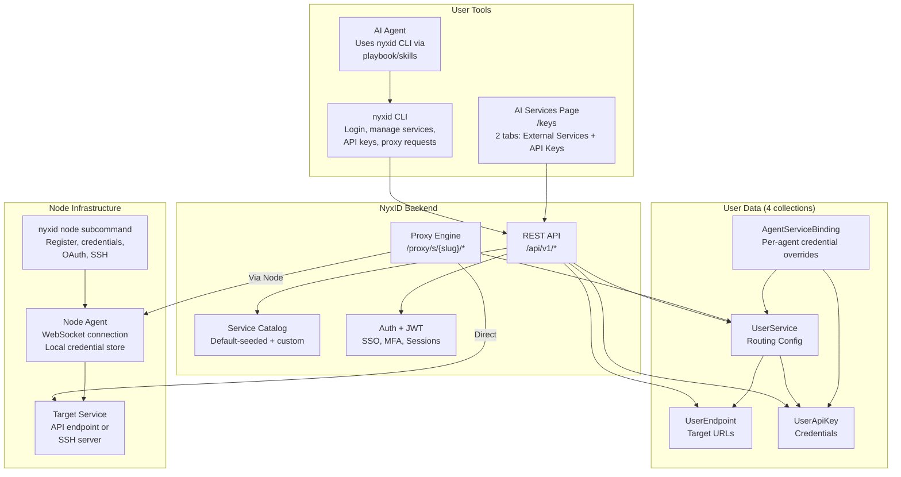
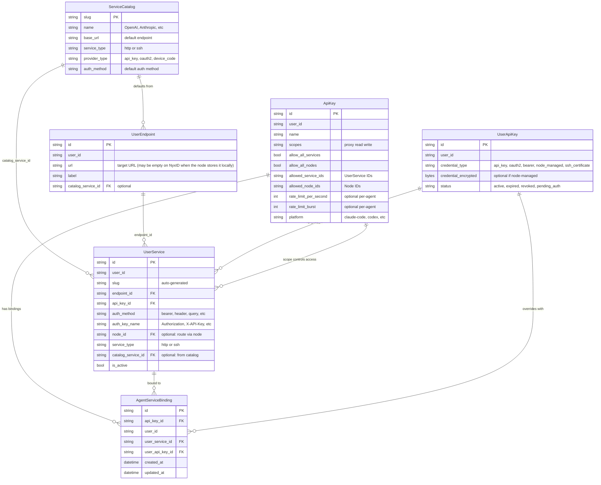
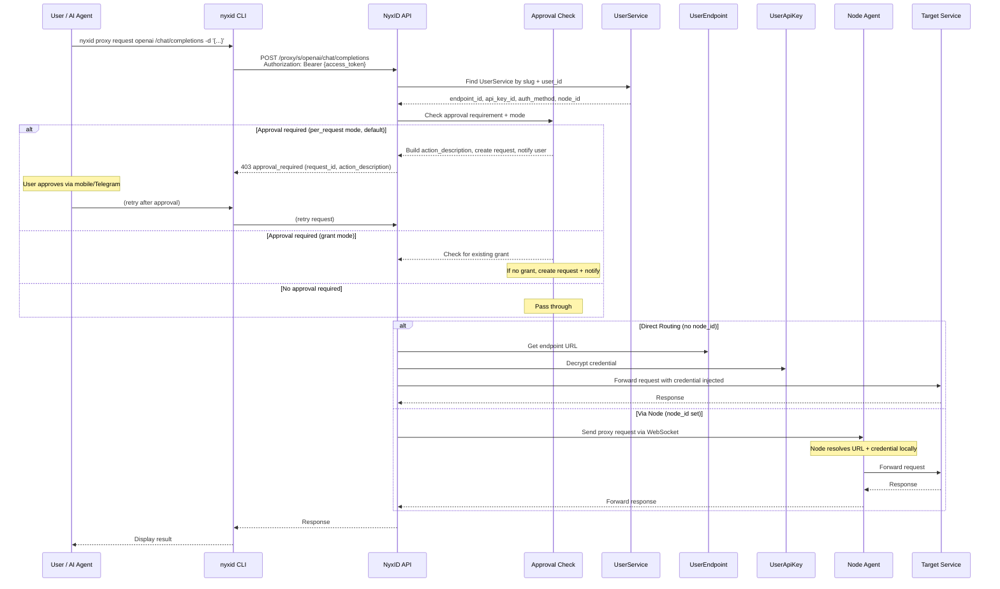
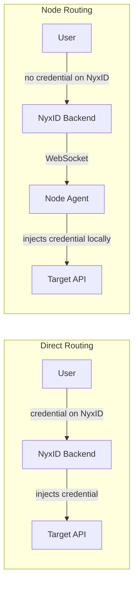
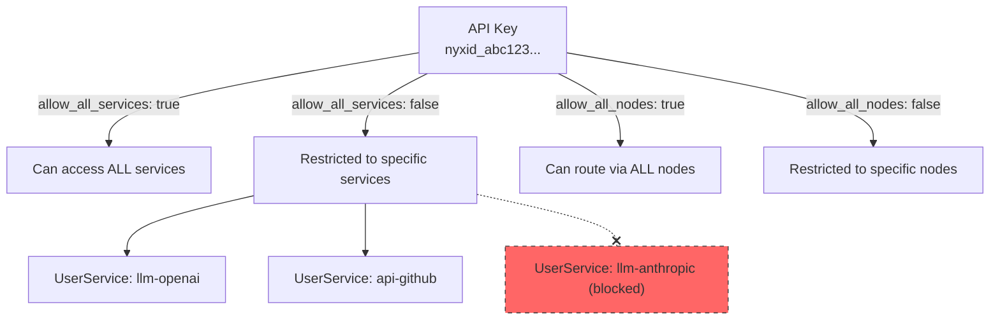
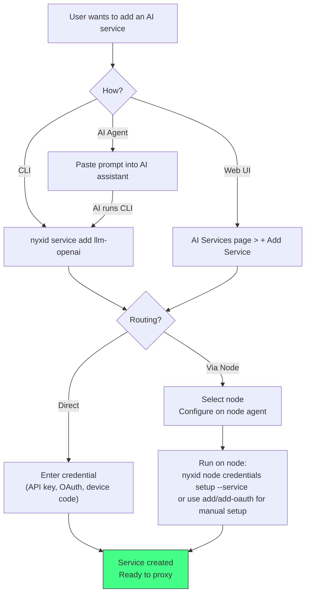
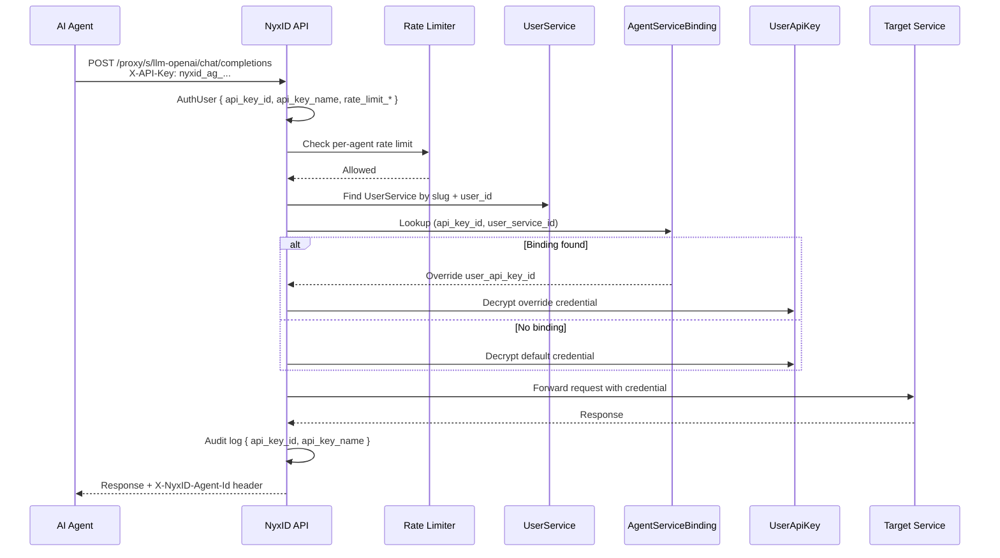

# AI Services Architecture

## Overview

NyxID's AI Services system lets users manage external API credentials, SSH services, and proxy routing through a unified interface. Users interact via the **AI Services page** (`/keys`) or the **`nyxid` CLI**.

---

## System Components

## Service-Pool Routing Boundary

NyxID#974 was narrowed to a routing proof before adding a user-facing pool
surface. The proof is recorded in
[SERVICE_POOL_ROUTING_PROOF.md](SERVICE_POOL_ROUTING_PROOF.md).

The important boundary is that `UserService` remains the concrete proxy target
member, while any future `ServicePool` must be selected inside
`proxy_service::resolve_proxy_target_from_user_service()`. The existing
`node_routing_service::resolve_node_route()` / `fallback_node_ids` layer remains
node failover below a selected `UserService`; it is not sufficient by itself to
balance multiple endpoint/credential instances behind one stable slug.

## Data Model Relationships

## Service Lifecycle: Disable vs Delete

There are exactly **two** lifecycle actions on a connection, and they are
exposed under exactly two names on every surface. Use these words — the UI
previously carried four (`Deactivate`/`Activate`/`Pause` and `Revoke`/`Delete`)
for these two actions, which made them read as more than two things.

| | Verb | Reversible | Effect |
|---|---|---|---|
| Pause | **Disable** / **Enable** | Yes | `UserService.is_active = false`. Nothing else is touched. |
| Remove | **Delete** | No | Hard-deletes `UserApiKey` + `UserEndpoint`, cleans agent bindings and org role scopes, optionally revokes upstream. |

Both make the service unusable: the proxy, MCP catalog, discovery and scope
checks all resolve through active-only queries, so a disabled service 404s
exactly like a deleted one.

Naming note: `revoked` is a **credential status** (`UserApiKey.status`) that a
card can render *while the service is otherwise fine*. Keep it out of button
labels for the delete action or the two meanings collide.

### `DELETE /user-services/{id}` is a misnamed disable

Despite the verb it calls `deactivate_user_service`: it sets `is_active = false`
and cleans agent bindings and org role scopes, but **keeps the credential and
endpoint**. Nothing in the product calls it — not the frontend, CLI, mobile or
SDK — and it is reachable only by direct API use.

Before disabled services were listed, this endpoint looked like a delete: the
row vanished while its credential stayed stored. It now correctly shows up as
`Disabled`. Prefer `PUT /user-services/{id} {is_active: false}` to disable and
`DELETE /keys/{id}` to actually delete.

### Delete leaves a tombstone

`Delete` soft-deletes the `UserService` row (`is_active = false`) and hard-deletes
the credential and endpoint. The tombstone is invisible everywhere, including
the management listing, because `list_keys` drops any row whose endpoint is
missing.

### Two listings, deliberately different

| Function | Includes disabled? | Used by |
|---|---|---|
| `list_user_services_with_sources` | No | proxy discovery, MCP catalog, OAuth resource indicators, API-key scope, assistant readiness |
| `list_user_services_with_sources_including_disabled` | **Yes** | `unified_key_service::list_keys` → `GET /keys` **only** |

A disabled service must stay in the management listing or the pause is
unreversible in the product — it would vanish from the screen carrying the
Enable control. It must stay out of every other listing or a disabled service
becomes reachable by an agent.

**Never** point a credential-resolving or catalog path at the
`_including_disabled` variant.

### Resolution asymmetry (do not "fix" this)

`find_user_service_for_actor` (`handlers/keys.rs`, the `/keys/{id_or_slug}`
resolver) matches a **disabled row by UUID but not by slug**:

- **UUID → resolves.** `/keys/{id}` is the management path that hosts Enable.
- **Slug → does not.** Slugs are unique only among *active* rows (the
  `user_services` unique index is partial on `is_active: true`), so a disabled
  slug match is ambiguous — and slug is the shape the proxy uses.

This asymmetry has been removed once before, by `c63ab733`, on the reasoning
that the UUID path was the odd one out. The paths it compared against were
already closed, which is precisely why this one was load-bearing: it was the
last route to the Enable control, so closing it made Disable a one-way door for
five months. `get_key_resolves_disabled_service_by_uuid_but_not_by_slug` asserts
both halves.

### API contract for consumers

`GET /keys` returns disabled services. **Anything consuming it must read
`is_active`** rather than assuming every row is usable — including when
rendering status, since `status` is the *credential's* status and stays healthy
(`active`) while the service is disabled. The CLI centralises this in
`commands::service::display_status`; the frontend renders a `Disabled` badge in
the card, table and chat-plugin surfaces.

Both `GET /keys` and `GET /keys/{id}` keep a service visible when its stored
`api_key_id` no longer resolves. Such rows return `credential_missing: true`;
consumers must present that separately from `credential_type: "none"`, which is
also the healthy representation for a service that requires no credential.
The degraded row may be reconnected or deleted, but it cannot be enabled until
a replacement credential has been attached.

Because a disabled row keeps its slug while a new active service may reuse it,
this listing can contain two rows with the same slug. Consumers that resolve by
slug should prefer the active row.

### Known gaps

1. Creating a service on a disabled row's slug is accepted, then re-enabling the
   old row fails with a raw `E11000` surfaced as a 500. Should be a clean 409 at
   create time.
2. A deleted tombstone can be flipped back to `is_active = true` via
   `PUT /user-services/{id}`, which does not check for the hard-deleted endpoint
   and credential. The result is a zombie: listed in `/user-services`, absent
   from `/keys`, 500 at the proxy.

## Proxy Request Flow

## Two Routing Modes

| Aspect | Direct | Via Node |
|--------|--------|----------|
| Credential stored on | NyxID backend (encrypted) | Node agent (local, encrypted) |
| Endpoint URL | NyxID (UserEndpoint) | Node agent (local config) |
| OAuth refresh | NyxID backend | Node agent locally |
| Use case | Cloud services, simple setup | Self-hosted, privacy-sensitive |

## CLI Tools

## API Key Scoping

## Adding a Service: User Flows

## Agent Isolation Data Flow

When a proxy request arrives with an agent-scoped API key (`nyxid_ag_` prefix):

1. **Auth middleware** (`mw/auth.rs`) resolves the API key, extracts `api_key_id` and `api_key_name` into `AuthUser`
2. **Per-agent rate limiter** (`mw/rate_limit.rs`) checks per-agent rate limits from `ApiKey.rate_limit_per_second` / `rate_limit_burst` if configured, using a separate bucket per `api_key_id`
3. **Proxy handler** (`handlers/proxy.rs`) passes `AuthUser` to credential resolution
4. **Credential resolution** checks `agent_service_bindings` for a binding matching `(api_key_id, user_service_id)`
5. **If binding exists**: Uses the override `user_api_key_id` instead of the service's default credential
6. **If no binding**: Falls back to the service's default `api_key_id`
7. **Response header**: `X-NyxID-Agent-Id` is returned on proxy responses when the request was made with an API key
8. **Audit logging** includes `api_key_id` and `api_key_name` in event data for per-agent attribution

