# Channel Bot Relay Design

> **ADR-013 update (2026-04-09):** Channel Bot Relay is now a **pure passthrough gateway** per ADR-013. NyxID never stores message bodies, media bytes, outbound captions/filenames, or raw webhook payloads; inbound attachment routing metadata is retained in `channel_messages` for authorized downloads. Synchronous agent replies (HTTP 200 + body) are no longer supported; agents must return 202 and post replies via `POST /api/v1/channel-relay/reply`. See NyxID#221, ADR-013, and [`docs/CHANNEL_EVENT_GATEWAY.md`](./CHANNEL_EVENT_GATEWAY.md) for the full rationale. The earlier deprecation-in-favor-of-service-connections direction (NyxID#191) has been recalled: channel relay and the new HTTP Event Gateway are the first-class inbound paths.

## Overview

NyxID Channel Bot Relay turns NyxID into a **multi-platform messaging gateway**. Users register bots or connect accounts (Telegram, Discord, Lark, Feishu, Slack, WhatsApp, X). Adapter-owned webhooks or polling normalize inbound messages into a common format, route each message to the correct AI agent's callback URL, and relay the agent's asynchronous response back to the chat.

Combined with [Agent Isolation](./AGENT_ISOLATION.md), the same NyxID user can wire different messaging platforms (or even different conversations on the same platform) to different AI agents -- each with independent credentials, rate limits, and audit trails.

---

For Telegram's optional native bot creation, see [Telegram bot creation](TELEGRAM_NEW.md). The **Telegram** option uses the separate `telegram-new` adapter; **Telegram bot token** uses the existing `telegram` adapter and token setup. These are display labels; platform identifiers and existing connections remain unchanged.

## X DM Accounts

X is managed-only: users connect their own X account with OAuth and provide no developer credentials. NyxID uses the account's user-context token to subscribe to incoming unencrypted DMs through the X Activity API and deliver the routed agent's asynchronous reply. Existing polling connections can switch through Verify or Reconnect after an admin configures the webhook credentials. With `BILLING_ENABLED=false`, connections without those credentials retain the existing polling path. Billing-enabled X channels require webhooks and never fall back to paid DM polling. App-only bearer tokens cannot access private DMs. Although X also supports legacy OAuth 1.0a user-context credentials, a BYO path would require users to supply and maintain developer credentials, so this channel deliberately does not expose one.

### X Activity webhook delivery

NyxID uses its shared X developer app and pays the app's API charges. Users authorize this app through the existing OAuth flow; they do not supply developer credentials or need their own developer account. This creates a NyxID channel for an existing X account, not a new X Chat bot identity.

In **Admin > Platform Credentials > X (Twitter)**, configure the **App bearer token** and **API key secret** from the same app as the OAuth Client ID and Client Secret. The API key secret is distinct from the OAuth Client Secret. OAuth credentials remain in the shared `twitter` provider; these two additional secrets are encrypted in `platform_credentials`. Clearing an individual webhook credential does not clear OAuth credentials. Clearing the entire provider clears both backings.

NyxID registers or reuses `{BASE_URL}/api/v1/webhooks/channel/x/platform` using `POST /2/webhooks`, then creates a `dm.received` subscription through `POST /2/activity/subscriptions` with the connected account's user-context token. Webhook management and subscription discovery/cleanup use the app bearer token. The callback must be publicly reachable HTTPS without an explicit port. X's GET CRC receives a JSON `response_token` computed using HMAC-SHA256 and the API key secret; POST signatures are verified against the exact body before routing. Webhook ingress shares the general global and per-IP limits. Size `RATE_LIMIT_PER_SECOND` and `RATE_LIMIT_BURST` for aggregate application traffic and X delivery bursts; X may share delivery IPs across subscriptions.

Each subscription is tagged with the NyxID channel UUID. Setup is serialized across replicas with a renewable platform lease and discovers existing subscriptions before creating one, allowing Verify to recover an interrupted setup without deliberately creating duplicate subscriptions. A successful setup sets `webhook_registered`, cancels the polling lease, and excludes the channel from polling. With billing disabled, failed initial setup leaves polling available and a local error on the detail page. With billing enabled, failed setup marks the channel failed, and a maintenance sweep retries cleanup of any partially installed subscription; select **Verify** to retry setup. Reconnect also rechecks setup. There is no automatic background webhook repair. Clearing webhook credentials does not switch registered channels back to polling; restore the credentials and select Verify. The platform catalog retains `ingestion.mode: "poll"` as the fallback and advertises webhook support through `registration.webhook_ingestion`; each channel's `webhook_registered` and `webhook_ingestion` report its effective delivery mode.

Signed `data.filter.user_id` selects the registered account, and `data.tag` must match its NyxID channel UUID; each message's recipient must match that account. Every delivery revalidates the live owner-bound OAuth connection before routing. Inbound message IDs use the existing channel deduplication and metadata-only relay. NyxID acknowledges promptly and forwards once; it does not queue bodies or retry agent callbacks. Deleting a channel disables its routes and best-effort deletes only subscriptions tagged to that channel. It preserves the shared webhook, other subscriptions, and the OAuth credential. A failed remote cleanup is recorded in the deletion audit as `managed_webhook_cleanup: "failed"` and retains a cleanup marker on the deleted channel. The maintenance sweep retries removal until it succeeds, including when customer billing or polling is disabled. The deleted channel never resumes delivery.

This integration consumes **`dm.received`**, not encrypted **`chat.received`**. X Chat requires separate private-key and encryption support. The documented legacy webhook payload addresses the recipient account; NyxID preserves an explicit conversation ID when supplied, otherwise derives the one-to-one conversation ID. **Webhook channels support recipient-addressed one-to-one DMs only; group-DM delivery is not supported.** Existing polling connections retain group-DM polling behavior only while billing is disabled and they have not switched to webhooks. There is no per-channel delivery-mode selector.

Documentation checked 2026-09-18: [X Activity API](https://docs.x.com/x-api/activity/introduction), [webhook setup and verification](https://docs.x.com/x-api/webhooks/quickstart), and [event payloads](https://docs.x.com/x-api/activity/event-payloads). X Activity documents 1,500 self-serve event subscriptions. This is separate from the Chat bot allowance and from the older Account Activity API's Pay Per Use limit of three accounts. `dm.received` costs $0.010 per delivered event at the published rate; outbound operations are charged separately. X deduplicates billable resources within a 24-hour UTC window; provider usage reports and the Developer Console remain authoritative.

### Platform setup and pricing

Admin > Platform Credentials lists every registered adapter's provider descriptor. Meta uses encrypted `platform_credentials`; X's `ProviderOAuth { provider_slug: "twitter" }` backing reads and writes the **same encrypted Client ID and Client Secret** used by the existing `twitter` OAuth provider. There is no second copy of the OAuth credentials; the webhook API secret and app bearer token use the separate encrypted platform backing. Clearing either OAuth credential clears a shared provider field, retaining the provider record, and stops all of the `twitter` provider's OAuth connections and logins until restored. Clearing the whole provider or either OAuth field requires this impact confirmation; corresponding CLI clears require `--confirm-shared-provider`. Clearing only a webhook credential does not require the OAuth impact confirmation. Update and delete audits record `shared_provider_slug`. Rotating credentials affects all connections using the shared app. Secret values never appear in admin responses. The descriptor supplies fields, setup checklist, backing information and callback URL for the generic API, page and CLI.

Configure a confidential Web App with OAuth 2.0 user authentication and PKCE in the X Developer Console. Set the callback to `{BASE_URL}/api/v1/providers/callback`, exactly as displayed in Platform Credentials. Enable `tweet.read users.read dm.read dm.write media.write offline.access`. Seed migration additively includes these scopes in `twitter.default_scopes`; it does not grant new permissions to old connections. Completion rejects connections without every required scope and requires fresh consent.

**Pricing:** X charges NyxID's developer app. Published prices checked on 2026-09-19 are $0.010 per delivered `dm.received` event, $0.015 per DM send request, and $0.010 per user resource read. The `dm.sent`, `dm.read`, and `dm.indicate_typing` notifications are free; this does not make the send API free. See [X API pricing](https://docs.x.com/x-api/getting-started/pricing). NyxID's customer credit rate is configured separately as described below.

[Current rate limits](https://docs.x.com/x-api/fundamentals/rate-limits): `/2/dm_events` permits 15 reads per 15 minutes per user. Existing-conversation message creation permits 15 per 15 minutes and 1,440 per day per user, plus 1,440 per day per app. X therefore declares a 60-second minimum poll interval. The generic sweep defaults to 30 seconds (`CHANNEL_POLL_INTERVAL_SECS`; `0` disables). A quiet, healthy account normally receives new DMs within roughly 60-90 seconds, plus callback processing; pagination, provider backoff and sweep load can increase latency.

### NyxID channel billing

With `BILLING_ENABLED=true`, X channel activity uses the active `api-twitter` catalog service and the existing BillingService, Lago rate cache, entitlement checks, reservations, allowances, grants, wallet settlement and billing ledger. Enable the billing feature flag for the channel owners who should be charged. Owners outside the rollout remain metered without charges, and `BILLING_ENABLED=false` preserves uncharged operation.

Configure a **Requests** price in `billing.byok_pricing` and wait for it to become `synced`. Shared-app OAuth is classified as `NyxidPlatformOauthApp`, which uses the BYOK lane in the existing billing contract; it is not a `NyxidManagedMaster` platform key and does not use `platform_key_pricing` or a resale charge. Existing legacy platform request pricing is also supported when selected by the normal lane resolver. A missing selected billable lane, missing Lago provider/subscription, incompatible non-request metric, or unavailable rate fails closed for billing-enabled channels. An explicitly configured zero rate or a request allowance can make the customer operation free.

One configured request rate applies to each received DM event, each actual outgoing DM POST, and each successful `/2/users/me` lookup during creation, Verify or Reconnect. Incoming and outgoing X costs differ; this is an admin-authored NyxID credit price, not automatic dollar-for-dollar resale. It also affects ordinary proxy usage of the same X service and lane. Long replies split into multiple DMs consume one unit per accepted chunk; media sends consume a unit for each DM carrying uploaded media. The adapter does not call the separately priced media-metadata API.

The persisted channel owner pays, including the organization wallet for an organization-owned channel. Replies keep the calling API-key attribution but do not transfer the charge to the agent's personal wallet. Funding follows the existing order: request allowance, eligible credit grants, then wallet credits. An incoming event is metered before route lookup, because X has delivered a billable event even when no agent route exists. Billing identities bind the channel UUID and X message ID, so duplicate deliveries do not reserve or charge again; no message body is stored in usage or ledger rows.

Outgoing operations reserve before making the provider request. Successful responses persist settlement intent for the existing reconciliation worker; confirmed client rejections settle zero usage and release their reservation. Transport failures and server errors have unknown provider outcomes: their forwarded reservations remain held for operator reconciliation, and the integration does not automatically resend. X initiated-send idempotency claims remain pending after an error once a provider request has been attempted to prevent an automatic replay of earlier successful chunks; inspect the conversation before issuing a new send. An admission check before subscription setup reserves and releases one request without consuming it.

Insufficient credits or a billing configuration/entitlement failure during inbound delivery, an initiated send, or an asynchronous reply marks the channel failed and removes its tagged X subscription. Cleanup failures retain a durable marker and retry on the channel maintenance sweep, which runs every 60 seconds when polling is disabled. Verify rechecks funding before reactivating the subscription; cleanup and recovery share the platform lease. Existing polling channels fail before their next paid DM read and need Verify after webhook credentials are configured. Creation and Reconnect do not initialize a DM polling cursor when billing is enabled.

Billing-provider outages also stop the subscription when funding cannot be reserved; restore billing and select Verify to recover. X charges for a push event before NyxID can reject it. The event that discovers exhausted credits, in-flight deliveries, and events delivered while remote cleanup is unavailable can therefore still cost the platform. The channel is stopped to bound continued costs; this integration does not create an unbacked customer debit for an event whose reservation failed. Webhook acknowledgments retain the channel relay's immediate-ACK behavior, so a process failure before persisting a meter can also lose accounting for that delivery. Provider usage reports remain authoritative for upstream costs. Keep `BILLING_RECONCILE_INTERVAL_SECS` enabled for durable settlement retries.

### Connect, route and recover

Use Add Channel Bot > X (Twitter), or `nyxid channel-bot register --platform x --managed`. The CLI checks the server's managed bootstrap and prints `/channel-bots?connect=x`; optional label and org scope are preserved. An unconfigured app shows an explicit unavailable state.

`GET /api/v1/channel-bots/managed-onboarding/x` returns `available`, `flow: "oauth_connection"`, `provider_slug`, `required_scopes` and `authorize_start_url`. `POST` to its `/start` endpoint accepts `{label, target_org_id?}` and creates an owner-bound OAuth connection through existing OAuth/PKCE machinery. Channel-started connection rows are tagged `source: "channel_onboarding"` with a unique `source_id`. The existing OAuth refresh sweep deletes pending rows older than one hour, retaining completed connections. Cleanup is disabled when `OAUTH_REFRESH_SWEEP_INTERVAL_SECS=0`. The existing popup completion protocol carries only a nonce and completion status. `POST` to `/complete` accepts `{connection_id, label, target_org_id?}`; this ID is the `user_api_keys` row UUID, not the OAuth protocol's internal connection UUID. Completion validates ownership, platform credential provenance and scopes, verifies `/2/users/me`, initializes a cursor only for legacy unbilled polling and applies the ordinary duplicate-account and bot-limit checks.

All managed bootstrap/start/complete and reconnect routes require an authenticated human. API keys, delegated tokens, service accounts and relay tokens are rejected by the existing human-only middleware. Writes share the existing per-user managed-onboarding rate limit. Org creation and reconnect require the same owning-org admin access as other channel bots; an actor's personal connection cannot back an org bot.

The bot starts `active` with `credential_source: "connection"`. `webhook_registered` indicates whether the X Activity subscription was installed; otherwise the account polls only when billing is disabled. Webhook registration is automatic, and the user does not configure a callback or secret. Configure conversation/default-agent routing exactly as for other channels. Detail and `channel-bot show` include the connected handle, connection UUID, cursor, last/next poll, error count and locally authored failure cause.

Polling, Verify Bot and async replies resolve the live owner-bound connection and reuse `refresh_user_api_key_in_place`. A deleted/revoked connection, insufficient scopes or permanent refresh failure marks the bot `failed` with a metadata-only audit event; there is no stale-token fallback. Transient polling errors back off exponentially, and five consecutive failures stop polling with an audit. Rate limits defer polling without counting as an error. Reconnect runs OAuth again and posts `{connection_id}` to `POST /api/v1/channel-bots/{id}/reconnect`; it requires the same X account, swaps the connection and preserves the committed cursor. For legacy unbilled polling, the next sweep processes DMs received during the failure through the normal bounded page walk and deduplication. Only a missing cursor is initialized to the newest event. Delete removes the bot and routes but **retains the OAuth connection**; revoke that connection separately when appropriate.

### Polling and message semantics

This section applies to legacy X channels with `BILLING_ENABLED=false`. Billing-enabled channels use the webhook lifecycle above.

The adapter's `Ingestion::Poll` and `CredentialResolution::OAuthConnection` hooks drive generic sweeps. Up to eight due bots per adapter are processed concurrently, and a per-bot failure does not stop the other bots in that tick. Each due bot is atomically claimed by `find_one_and_update`, with a 90-second lease renewed every 20 seconds and a 15-minute work deadline. Claims, renewals and cursor commits are fenced; reconnect invalidates the previous claim. All outcomes attempt to release the lease. An abrupt process exit recovers at lease expiry. Backoff, cursors, timestamps and error counts are persisted with BSON datetime compatibility for legacy rows.

[The DM events endpoint](https://docs.x.com/x-api/direct-messages/get-dm-events) does **not** support `since_id`. The adapter requests 100 `MessageCreate` events per page, follows `pagination_token` newest-first until the saved event ID (or an older ID) is reached, and emits the batch chronologically. Own-account messages are skipped. At onboarding it saves the newest existing ID without emitting history; empty accounts use an explicit empty baseline. At most ten pages (about 1,000 events) are walked. When that limit is reached before the cursor, the fetched batch is emitted chronologically and the cursor advances to its newest event after processing. Older DMs are skipped, with a persistent, locally authored `last_poll_notice` on the detail page and CLI; this does not count as an error or fail the bot. A processing error or a 429 before the bounded window completes retains the old cursor. X exposes only the last 30 days of events.

The shared pipeline retains the existing webhook behavior, metadata-only message storage, routing, callback telemetry and touch semantics. X opts into the existing bot/platform/message-ID dedup hook. Overlapping completed batches are suppressed. Callback delivery retains the existing relay semantics: a stored message is not automatically redelivered after callback failure. This is not an exactly-once end-to-end delivery guarantee, and an interrupted provider reply may already have sent an earlier chunk.

X can return HTTP 200 with both DM `data` and an `errors` array ([partial errors](https://docs.x.com/x-api/fundamentals/response-codes-and-errors#partial-errors)). An empty error array is a successful response. When DM events are present, errors limited to optional `user` or `media` expansions do not block those events; missing sender details and unavailable media use the normal normalization fallbacks. Errors about DM events, unclassified errors, malformed error arrays, and nonempty errors without any DM events still fail the poll and retain the cursor.

For reports that only the first DM arrives, test follow-up delivery across separate sweeps: configure an active agent route, send the first DM after onboarding, then send at least six more DMs in the same conversation over successive polls. Check that every message reaches the callback once, the cursor advances, the bot remains active, and an overlapping poll does not redeliver old messages. The database-backed `followup_dms_keep_reaching_agent_across_poll_sweeps` regression exercises this sequence with clean responses, empty error arrays, and unavailable user expansions after the first success. Provider responses and callbacks are mocked; testing the affected X account is still required to establish the incident's cause.

Capture `status`, `error`, `poll_error_count`, `last_polled_at`, `next_poll_at`, `poll_cursor`, and `poll_backoff_until` before reconnecting a failing bot. A failed bot with five poll errors has stopped polling; a future backoff can explain delayed delivery. If polls and the cursor advance, inspect routing and stored message `callback_status`: no route skips delivery, and a failed callback is not retried automatically. Do not capture access tokens or DM bodies in diagnostic logs. After deploying a polling fix, already-failed bots still need reconnecting; reconnect preserves their committed cursor for backlog recovery within X's retention and the bounded polling window.

One-to-one IDs have `{smaller_user_id}-{larger_user_id}` form; group DMs have their own conversation ID. Sender display names and media are normalized from expansions; raw event data is forwarded to the agent and never logged or persisted as a message body. Media URLs are private and may need the connected user's bearer token; the callback never exposes that token. `referenced_tweets` contains shared posts, **not DM reply targets**. Current docs expose no DM reply-reference field; optional `referenced_events` reply references are preserved when supplied, without inventing references from shared posts.

Replies call `POST /2/dm_conversations/{dm_conversation_id}/messages`, supporting existing private/group conversations. Text is split into chunks of at most 10,000 Unicode characters. `attachments` uploads image/video bytes through OAuth2 `POST /2/media/upload` before creating the DM. GIF/video processing is polled for up to 30 seconds before dispatch. Existing `metadata.attachments` still accepts one `{media_id}` uploaded by that user and attaches it to the first text chunk. Existing connections lacking `media.write` must re-consent; the shared OAuth provider defaults include this scope. Editing is unsupported. 401, 403 and 429 errors use local messages and rate-limit retry delay, never upstream error prose. The current v2 schema does not publish a text maximum; the established 10,000-character DM limit could not be independently reconfirmed from the Help Center during implementation (HTTP 403).

### Automation policy and verified limits

Automated replies to inbound DMs are allowed under [X's automation rules](https://help.x.com/en/rules-and-policies/x-automation) subject to user intent, consent and opt-out requirements. Unsolicited automated outbound DMs are not permitted. NyxID's reply authorization binds an inbound message; its initiated-send interface requires human opt-in and addresses an existing X DM conversation. Native capability does not establish recipient consent. Operators remain responsible for consent, opt-out handling and compliant agent responses. X Activity webhooks are available on self-serve plans subject to app access and limits. The polling fallback needs no webhook subscription.

## Problem Statement

Today, connecting an AI agent to a messaging platform requires:

1. **Per-platform bot infrastructure** -- each agent team builds and hosts their own Telegram/Discord/Lark bot
2. **Platform-specific code** -- webhook verification, message parsing, reply formatting differs per platform
3. **No centralized credential management** -- bot tokens scattered across agent configs
4. **No unified audit trail** -- no visibility into which agent handled which message
5. **No agent routing** -- can't send Telegram DMs to Claude and Discord messages to GPT without separate bots

NyxID already solves the equivalent problem for API credentials (proxy gateway). Channel Bot Relay extends this to messaging.

---

## High-Level Architecture

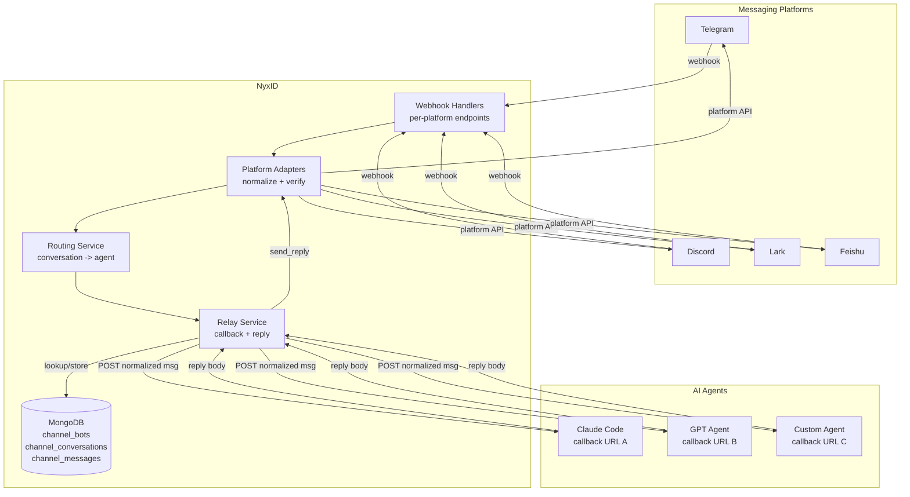

---

## Message Flow

### Inbound: Platform -> Agent

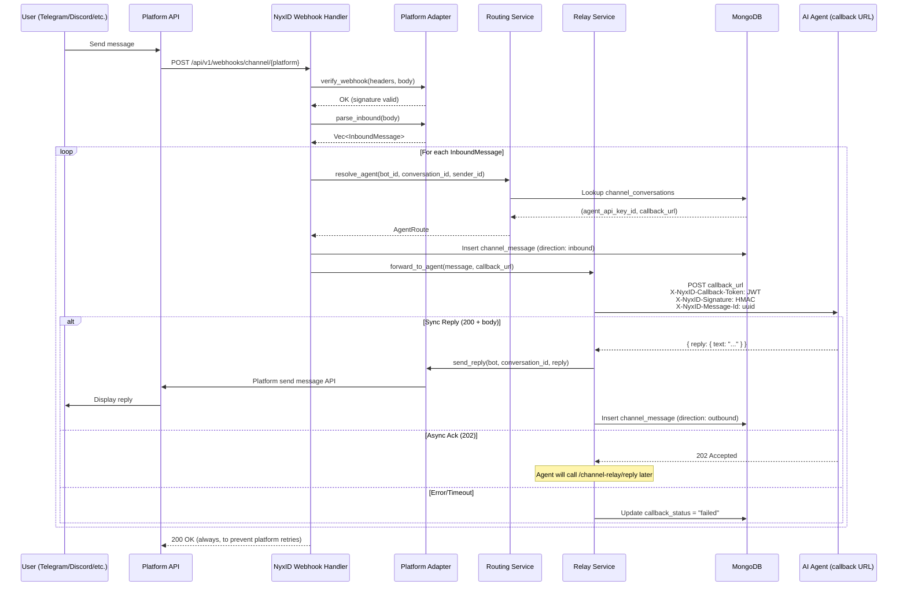

### Async Reply: Agent -> Platform

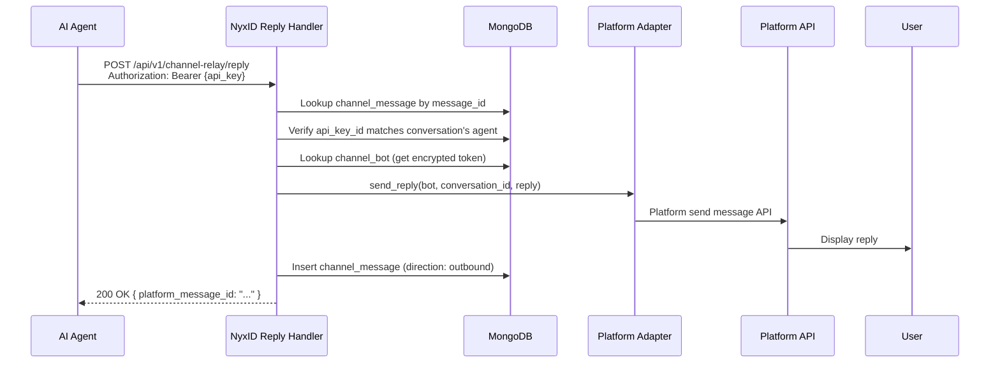

### Editing a sent reply

`POST /api/v1/channel-relay/reply/update` replaces a previously sent message using the `platform_message_id` returned by `/reply` or `/send`:

```json
{ "message_id": "<platform_message_id>", "reply": { "text": "Updated response", "metadata": null } }
```

An assigned agent API key can edit both anchored replies and agent-initiated messages. A per-callback reply token can edit only replies anchored to its bound inbound message, and only after its JTI has been consumed by `/reply`; it cannot edit initiated rows. The existing authorization and per-message rate limit apply to every edit, with rate limiting before authentication. Discovery exposes native support as `capabilities.edit`.

- **Telegram / telegram-new:** text messages use `editMessageText`; media captions use `editMessageCaption` after Telegram returns exactly `Bad Request: there is no text in the message to edit`. Both use the chat ID, numeric message ID, and `parse_mode: "Markdown"`, matching sends. Ordinary bot messages are subject to Telegram's 48-hour edit window. An identical edit (`message is not modified`) succeeds idempotently.
- **Discord:** `PATCH` edits `content` on any bot message, including media messages. NyxID always edits through `PATCH /channels/{channel_id}/messages/{message_id}` with the bot token and never through the interaction-webhook edit endpoint, so edits that Discord only permits via the interaction token (for example ephemeral interaction responses) are not supported and surface as a classified refusal.
- **Slack:** `chat.update` with `channel`, `ts`, and `text`; `reply.metadata.blocks` passes through just as it does on sends. File/image messages cannot be edited by `chat.update` and surface as classified refusals. Existing Slack rate-limit error handling is preserved.
- **Lark / Feishu:** text edits via `PUT /im/v1/messages/{id}` and card edits via `PATCH /im/v1/messages/{id}` using `reply.metadata.card`. These edits do not apply to file/image messages and surface as classified refusals.
- **WhatsApp / X / OpenClaw:** `501 edit_unsupported`; WhatsApp and X have no message edit API. Device channels return `400 device_channel_reply_not_allowed`.

The edit address comes first from the outbound row. For pre-0.21.0 rows without that address, NyxID reads the parent inbound row, then falls back to the conversation's concrete address. Wildcard (`"*"`) and empty addresses cannot reach a platform; no resolvable address returns `channel_conversation_not_addressable` before dispatch.

Known permanent Telegram, Discord, and Slack refusals (including missing messages, messages the bot cannot edit, and closed edit windows) return `channel_conversation_not_reachable`; other upstream diagnostics use the existing bounded platform-error response. Lark/Feishu retain their existing error classification. Edits update only the outbound timestamp and routing-only audit metadata; message bodies and metadata are never persisted (ADR-013). Initiated edit audits retain a null `inbound_message_id`.

### Agent-initiated messages

`POST /api/v1/channel-relay/send` sends to a configured conversation without an inbound message. Use it for an opted-in digest, alert, or job-completion notification. Existing and newly created conversations default to `allow_agent_initiated: false`. Only a human session can set this field through conversation create/update; the agent cannot grant itself permission. Organization sends require owner write access for human callers, or the exact assigned active agent key for agent callers.

```mermaid
sequenceDiagram
    participant C as Agent or human owner
    participant H as NyxID send handler
    participant L as Shared conversation limiter
    participant DB as MongoDB
    participant A as Platform adapter
    C->>H: POST /channel-relay/send (conversation_id, message, idempotency_key?)
    H->>L: Check channel_initiate bucket before authentication
    H->>H: Authenticate API key or human session
    H->>DB: Load active conversation, authorize owner/assigned live key
    H->>H: Require opt-in, reject device/wildcard/empty address
    H->>DB: Load active bot, verify owner and platform scope
    H->>H: Check adapter initiated_send capability, validate content
    opt Idempotency key supplied
        H->>DB: Insert pending claim with delivery fingerprint
        DB-->>H: Claimed, matching sent receipt, or 409 conflict
    end
    H->>A: send_reply(chat_id, reply_to=None, text, metadata)
    A-->>H: Platform acceptance receipt or classified refusal
    H->>DB: Store outbound routing metadata; mark claim sent
    H-->>C: 200 (message_id, platform_message_id?)
```

Request and response:

```http
POST /api/v1/channel-relay/send
Authorization: Bearer <assigned-agent-key-or-first-party-human-access-token>
Content-Type: application/json

{
  "conversation_id": "660e8400-e29b-41d4-a716-446655440000",
  "message": { "text": "Your report is ready.", "metadata": null },
  "idempotency_key": "report-2026-09-15"
}
```

```json
{ "message_id": "550e8400-e29b-41d4-a716-446655440000", "platform_message_id": "12345" }
```

Browser session cookies and the CLI's first-party human access JWTs are accepted. OAuth-app access tokens, relay access tokens, delegated tokens, service accounts, and per-callback reply tokens are not accepted. The new endpoint does not relax any existing router middleware. Request parsing and UUID syntax validation precede the per-conversation check; authentication and resource lookups follow it. The limiter itself uses MongoDB shared coordination, at `1` message/second with burst `5` by default. Every syntactically valid attempt, including a duplicate, consumes rate capacity.

Gate order is rate limit → authentication → active conversation → assigned-key liveness or human owner write access → opt-in → device guard → concrete address → active bot and matching owner/platform → adapter capability → content → idempotency claim → platform send → metadata persistence. Missing/inactive conversations are not-found-shaped. `"*"` and empty addresses are catch-all routes and cannot be used to initiate; create a specific chat route first. Device channels have no outbound transport. Platform-specific rich content is still adapter-validated (`metadata.card` is Lark/Feishu-only).

Threading accepts durable platform metadata such as Telegram `message_thread_id` or Slack `thread_ts`. There is no internal `message_id` reply anchor. `metadata.interaction_thread_id` is rejected here because Discord interaction follow-up credentials expire and can redirect dispatch away from the conversation. Other supported metadata passes directly to the adapter; it is never persisted.

**Discovery:** `GET /api/v1/channel-relay/conversations?page=1&per_page=50` requires an active API key and returns only its active assigned rows. The response is `{ conversations, total, page, per_page }`, capped at 100 items per page. Each item contains only `{ id, platform, platform_conversation_type, addressable, allow_agent_initiated, capabilities, last_message_at }`. Wildcard and device rows are not addressable; device capabilities are all false. Wildcards retain the adapter's capability values. Owner conversation responses expose the same capabilities plus the human-set opt-in.

**Idempotency:** optional keys contain 1–128 characters and are scoped to a conversation. A unique composite MongoDB `_id` (`conversation_id:idempotency_key`) is claimed *before* contacting the platform. `channel_send_claims` stores a SHA-256 fingerprint over recursively key-sorted JSON `{text, metadata}`, an attempt fence, `pending`/`sent` state, IDs, and a 24-hour BSON `expires_at`. It stores no message content. Reusing the key with different content returns 409. A matching `sent` claim returns the original IDs with 200; a matching `pending` claim returns 409 (send in progress or delivery outcome uncertain). Credential preparation failures delete the pending claim. WhatsApp also releases it on a confirmed, locally classified Graph refusal before any message component was accepted (for example an invalid token, unauthorized test recipient, outside-window message or rate limit). WhatsApp transport errors, 5xx responses, invalid/oversized responses, missing message IDs, and partial acceptance retain the pending claim. Other adapters retain their existing dispatch-error behavior. There is no automatic retry or queue.

A crash after claiming, a platform timeout after acceptance, partial delivery of a multi-chunk message, or a database failure after acceptance cannot provide an exactly-once guarantee. After successful platform acceptance, metadata/receipt persistence failures retain the pending claim so retries cannot silently duplicate the message. A crash can leave that claim pending until TTL cleanup. MongoDB's TTL monitor runs asynchronously: claims can live slightly longer than 24 hours; once removed, the same key may send again. WhatsApp retains the claim for ambiguous or partial sends, so the same key returns 409 without dispatching again. Sending with a new key can still duplicate accepted components. Other adapters keep their existing claim-release semantics. A platform message ID proves only that the platform accepted a send, not that any recipient received or read it.

**Refusals:** disabled opt-in returns `channel_agent_initiate_not_allowed` (403), non-addressable routes return `channel_conversation_not_addressable` (400), unsupported transports return `channel_platform_send_unsupported` (501), and known permanent target refusals return `channel_conversation_not_reachable` (400). Examples include blocked/kicked Telegram bots, missing Discord access, archived Slack chats, missing Lark membership, WhatsApp undeliverable recipients/outside-window text, and X recipient DM refusals. WhatsApp outside its 24-hour window requires an approved template message. Classification belongs to adapters and also improves ordinary replies: being kicked from a chat is equally non-retryable for both paths. Unmatched Telegram, Discord, Slack, and Lark/Feishu refusals remain 502 with the platform description limited to 200 characters so callers can correct malformed payloads; matched refusals expose only the adapter-owned marker. WhatsApp retains locally authored reasons and X retains its existing 403 handling; existing Slack rate-limit handling is unchanged.

Audit event `channel_message_initiated` contains only `conversation_id`, `platform`, `channel_bot_id`, and `agent_api_key_id`. `channel.reply_sent` telemetry uses `reply_mode: "initiated"` with the existing 10% conversation-hash sampling. Neither audit, claims, logs, nor message rows retain text, cards, or metadata bodies (ADR-013).

Human setup and test-send:

```bash
nyxid channel-bot route create --bot-id <BOT_ID> --agent-key-id <KEY_ID> \
  --conversation-id <PLATFORM_CHAT_ID> --allow-agent-initiated
nyxid channel-bot route update <ROUTE_ID> --allow-agent-initiated true
nyxid channel-bot send --conversation <ROUTE_ID> --text 'Test notification' --idempotency-key test-1
nyxid channel-bot route update <ROUTE_ID> --allow-agent-initiated false
```

The conversation detail page provides the same opt-in, explains unprompted messaging, disables unsupported/non-addressable routes, and offers an explicit test-send form.

#### Outbound capability model

This declaration-and-contract-test model follows OpenClaw's `ChannelOutboundAdapter`: outbound is target-addressed, and a reply is an optional anchor on the same native send operation.

| Adapter | initiated_send | reply_to | thread | edit | Media in | Media out | Thread metadata |
|---|---|---|---|---|---|---|---|
| telegram | true | true | true | true | image, file, audio, video | image, file, audio, video | `message_thread_id` |
| telegram-new | true | true | true | true | image, file, audio, video | image, file, audio, video | Delegates to Telegram |
| discord | true | false | false | true | image, file, audio, video | image, file, audio, video | — (interaction follow-up is a reply-only mechanism) |
| lark | true | false | false | true | image, file, audio, video | image, file, audio, video | — |
| feishu | true | false | false | true | image, file, audio, video | image, file, audio, video | — |
| slack | true | true | true | true | image, file, audio, video | image, file, audio, video | `thread_ts` |
| whatsapp | true | true | false | false | image, file, audio, video | image, file, audio, video | — |
| x | true | false | false | false | image, video | image, video | — |
| openclaw | false | false | false | false | none | none | — |

Every adapter must implement `outbound_capabilities` and `media_capabilities`; there is no trait default. Flags describe what the native transport preserves, not generic platform possibilities or permission to send to every recipient. Tests exercise the actual request builders/native edit implementation. The additive `send_reply_outcome` and `send_bound_reply_outcome` hooks carry WhatsApp component IDs and certainty. Their defaults project existing sends, including each adapter’s `send_bound_reply` override, so adapter-specific fences and behavior remain in place. OpenClaw explicitly returns `ChannelPlatformSendUnsupported` and performs no HTTP request; it cannot report a successful empty receipt for a no-op. X sends address existing DM conversation IDs; WhatsApp messaging-window and recipient restrictions still apply. API keys can edit initiated messages on adapters with native edit capability; the edit audit records a null inbound message ID. Reply tokens remain bound to an inbound message and cannot edit initiated rows.

### Bot Registration

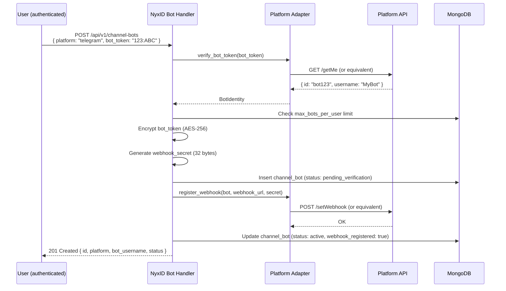

---

## Agent Routing & Isolation

### How Conversations Map to Agents

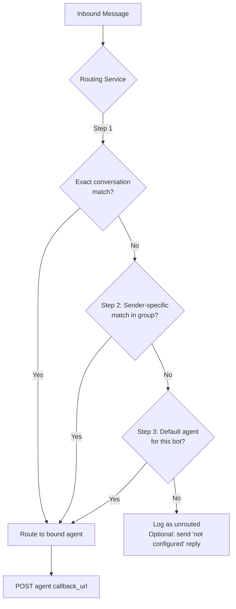

### Integration with Agent Isolation (PR #132)

The callback URL lives on the **ApiKey** (the agent), not on individual conversation routes. When a user sets up an agent on NyxID (`nyxid ai-setup agent create --platform claude-code`), they register the agent's callback URL as part of the agent configuration. Conversation routes then just say "send to this agent" -- NyxID already knows how to reach it.

This means:
- **`ApiKey.callback_url`** (new field) -- where NyxID sends channel messages for this agent
- **`ChannelConversation.agent_api_key_id`** -- which agent handles this conversation (callback URL resolved from the API key)
- No `agent_callback_url` on the conversation route -- the URL is a property of the agent, not the conversation

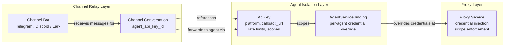

The relay and proxy are **parallel paths, not nested**:

- **Relay path**: Platform -> NyxID webhook -> agent callback URL (message forwarding)
- **Proxy path**: Agent -> NyxID proxy -> downstream API (credential injection)

An agent receiving a message via the relay can then call external APIs through NyxID's proxy using its scoped API key. The agent isolation scope enforcement applies to the proxy call, not the relay.

---

## Data Model

### Entity Relationship

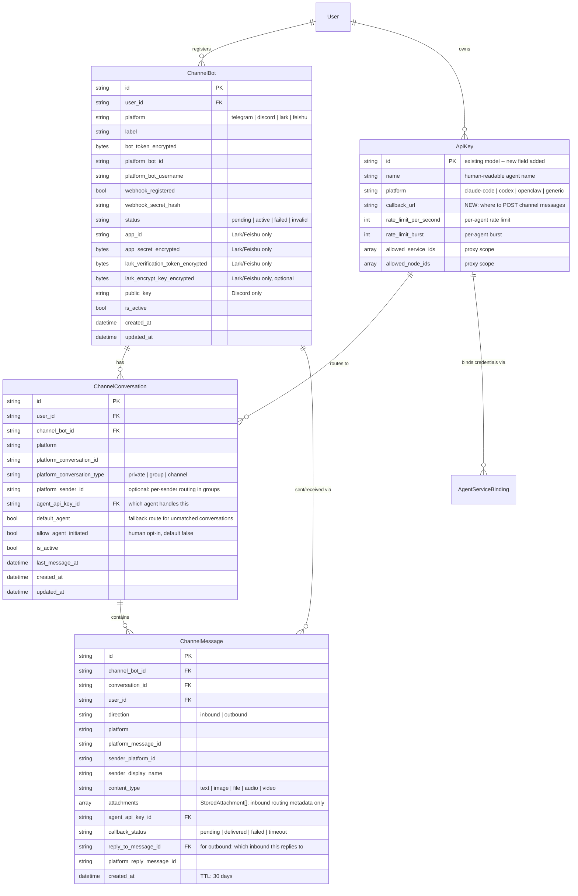

### MongoDB Indexes

| Collection | Index | Type | Purpose |
|---|---|---|---|
| `channel_bots` | `{ user_id: 1, platform: 1 }` | Unique | One bot per platform per user |
| `channel_bots` | `{ platform: 1, platform_bot_id: 1 }` | Standard | Webhook bot lookup |
| `channel_conversations` | `{ channel_bot_id: 1, platform_conversation_id: 1 }` | Unique | One mapping per conversation |
| `channel_conversations` | `{ user_id: 1, platform: 1 }` | Standard | List user's routes |
| `channel_conversations` | `{ agent_api_key_id: 1 }` | Standard | Find routes for an agent |
| `channel_send_claims` | `{ _id: 1 }` | Unique | Conversation/key delivery identity |
| `channel_send_claims` | `{ expires_at: 1 }` | TTL (expireAfterSeconds 0) | Remove claims after 24h |
| `channel_messages` | `{ conversation_id: 1, created_at: -1 }` | Standard | Conversation history |
| `channel_messages` | `{ created_at: 1 }` | TTL (30d) | Auto-cleanup |
| `channel_delivery_receipts` | `{ identity_key: 1 }` | Unique | Exact bot/owner/phone/WABA/recipient/message identity |
| `channel_delivery_receipts` | `{ expires_at: 1 }` | TTL (expireAfterSeconds 0) | Remove receipt observations after 30d |
| `event_dedup_records` | Existing `_id` and `expires_at` indexes | Unique / TTL | WhatsApp admission claim and committed marker |

---

## Platform Adapter Trait

```mermaid
classDiagram
    class PlatformAdapter {
        <<trait>>
        +platform_id() str
        +display_name() str
        +ingestion() Ingestion
        +managed_onboarding() OptionalDescriptor
        +platform_credentials() OptionalDescriptor
        +outbound_capabilities() OutboundCapabilities
        +media_capabilities() MediaCapabilities
        +fetch_attachment(http, credentials, attachment, max_bytes) FetchedMedia
        +registration() RegistrationDescriptor
        +registration_token(fields) Secret
        +updated_token(current, fields) OptionalSecret
        +build_verify_secrets(keys, bot) PlatformVerifySecrets
        +webhook_policy(body) WebhookPolicy
        +subscription_handshake(bot, query) String
        +prepare_webhook(bot, secrets, headers, body) PreparedWebhook
        +verify_webhook(bot, secrets, headers, body) Result
        +parse_inbound(body) Result~Vec~InboundMessage~~
        +reply_context(thread_id, created_at, metadata)
        +supports_reply_metadata(metadata) bool
        +send_reply(http, credentials, conversation_id, reply) Result~String~
        +edit_reply(http, credentials, conversation_id, platform_message_id, edit) Result
        +register_webhook(http, bot, url, secret) Result
        +verify_bot_token(http, credentials) Result~BotIdentity~
    }

    class TelegramAdapter {
        +platform_id() "telegram"
        -Secret header verification
        -Reuses telegram_service.rs
        -No challenge needed
    }

    class DiscordAdapter {
        +platform_id() "discord"
        -Ed25519 signature verification
        -PING/PONG challenge
        -Interaction-based model
    }

    class LarkFamilyAdapter {
        -base_url: String
        +platform_id() "lark" or "feishu"
        -Verification Token check
        -Optional Encrypt Key signature + AES-256-CBC decrypt
        -url_verification handled after bot lookup
        -App access token caching
    }

    class OutboundReply {
        +text: OptionalString
        +attachments: MaterializedAttachment[]
        +metadata: OptionalJSON
    }
    class MaterializedAttachment {
        +kind: MediaKind
        +bytes: Bytes_ephemeral
        +filename: OptionalString
        +mime_type: OptionalString
        +caption: OptionalString
    }
    class FetchedMedia {
        +bytes: Bytes_ephemeral
        +mime_type: OptionalString
        +filename: OptionalString
    }
    OutboundReply *-- MaterializedAttachment
    PlatformAdapter ..> FetchedMedia
    PlatformAdapter <|.. TelegramNewAdapter
    PlatformAdapter <|.. XAdapter
    PlatformAdapter <|.. OpenClawAdapter
    PlatformAdapter <|.. TelegramAdapter
    PlatformAdapter <|.. DiscordAdapter
    PlatformAdapter <|.. LarkFamilyAdapter
    PlatformAdapter <|.. SlackAdapter
    PlatformAdapter <|.. WhatsAppAdapter

    class WhatsAppAdapter {
        +platform_id() "whatsapp"
        -Meta App Secret HMAC-SHA256
        -GET Verify Token handshake
        -Phone Number ID event filter
        -Immediate POST acknowledgment
        -Cloud API text, template, interactive replies
    }

    note for LarkFamilyAdapter "Single implementation,\nregistered twice:\nlark = larksuite.com\nfeishu = feishu.cn"
```

### Platform-Specific Notes

| Platform | Auth Model | Webhook Verification | Challenge | Send Reply API |
|---|---|---|---|---|
| **Telegram** | Bot token (`123:ABC...`) | `X-Telegram-Bot-Api-Secret-Token` header (constant-time) | None | `POST /bot{token}/sendMessage` |
| **Discord** | Bot token + Application ID | Ed25519 signature (`X-Signature-Ed25519` + `X-Signature-Timestamp`) | `PING` -> `PONG` interaction response | `POST /channels/{id}/messages` with `Authorization: Bot {token}` |
| **Lark** | App ID + App Secret for tenant access token; Verification Token for inbound webhook auth; optional Encrypt Key for signed/encrypted delivery | Always verify Verification Token. If Encrypt Key is configured, also require `X-Lark-Signature` with `hex(SHA256(timestamp + nonce + encrypt_key + raw_body))`, then decrypt `{\"encrypt\":\"...\"}` using AES-256-CBC, PKCS7, IV = first 16 bytes, key = `SHA256(encrypt_key)` | `url_verification` -> verify token first, then echo `challenge` | `POST /im/v1/messages` with tenant access token |
| **Feishu** | Same as Lark | Same as Lark | Same as Lark | Same as Lark, different base URL (`open.feishu.cn`) |
| **Slack** | Bot user OAuth token (`xoxb-`) + Signing Secret | HMAC-SHA256 over `v0:timestamp:body`, five-minute replay window | `url_verification` | `POST /api/chat.postMessage` |
| **WhatsApp** | API Setup token for testing or System User token for ongoing operation; Phone Number ID + Meta App Secret; optional WABA ID | `X-Hub-Signature-256: sha256=<HMAC-SHA256(app_secret, raw_body)>` | GET subscription: constant-time SHA-256 Verify Token check, raw challenge as `text/plain` | `POST /{version}/{phone_number_id}/messages` with Bearer auth |

Existing Lark/Feishu bots must grant `im:resource` in the developer console before attachment downloads work; until then downloads return `channel_media_fetch_failed`.

For the Lark/Feishu platform family, `register_webhook()` remains a no-op. Configure the webhook URL and subscribe to both `im.message.receive_v1` and `card.action.trigger` only in the Lark/Feishu Developer Console. The console inputs map to NyxID fields as follows:

- **App ID** -> `ChannelBot.app_id`
- **App Secret** -> `ChannelBot.app_secret_encrypted`
- **Verification Token** -> `ChannelBot.lark_verification_token_encrypted`
- **Encrypt Key** -> `ChannelBot.lark_encrypt_key_encrypted` (optional)

### Adding New Platforms

Managed registration is optional. Adapters declare `platform_credentials()` (provider key, fields, masking, setup checklist), `managed_onboarding()` (safe bootstrap and accepted completion fields), and implement completion/setup/re-registration hooks. `platform_webhook()` opts into the shared callback; handshake and target extraction remain adapter-owned. The admin inventory comes from `registered_adapters()` in the same registry used by `resolve_adapter`. Generic handlers never branch on an IM name. Registration fields can declare `platform_fallback`; managed verification resolves missing bot secrets from encrypted platform credentials on demand. Existing adapters keep their default hooks.

Implement `PlatformAdapter` in `backend/src/services/channel_adapters/<platform>.rs`, then register its module and add it to `services/channel_adapters/mod.rs::resolve_adapter`, the single runtime registry. The handler module re-exports it for existing callers.

- `registration()` declares field names, human labels, required/secret/patchable/clearable flags, storage columns, and which secrets verify webhooks. It also declares fields that rebuild outbound tokens, automatic versus dashboard webhook setup, the one-time secret label, and setup instructions. Handler and service validation, encrypted persistence, safe configuration responses, and secret decryption follow this descriptor.
- `BotCredentials` carries the outbound token and platform bot identity separately. `registration_token` and `updated_token` own token construction; only the existing Lark/Feishu adapter retains its legacy composite format. Token rotation verifies the replacement before storing it. Label-only updates never decrypt credentials.
- `PlatformVerifySecrets` is a generic map of zeroizing secret values, with redacted Debug output. Its default builder decrypts only fields marked as webhook secrets; an adapter may override `build_verify_secrets`.
- `webhook_policy` selects inline processing, immediate acknowledgment with background processing, or the existing challenge-only response. Lark/Feishu challenges remain inside authenticated `prepare_webhook`. `subscription_handshake` defaults to denial and handles GET protocols when supported.
- `prepare_webhook` verifies and preprocesses raw payloads before normalization. WhatsApp filters app-wide events by the bot's Phone Number ID here. `reply_context` translates stored thread context into outbound metadata; `supports_reply_metadata` admits platform-native content without text.
- `dedup_inbound_by_platform_message_id` defaults to false and selects the existing metadata lookup used by X. WhatsApp also opts into `atomic_inbound_admission`, which claims the bot/owner/message identity and commits inbound metadata in one transaction before dispatch. Keep deduplication off for platforms such as Telegram where edited messages legitimately reuse an ID.
- The public `/api/v1/webhooks/channel/{platform}/{bot_id}` GET/POST handlers use these hooks. No new per-platform handler or generic pipeline branch is needed. Unknown platforms and OpenClaw return 404 on both methods; OpenClaw has its own integration path.
- Mirror the registration fields in `frontend/src/lib/channel-platforms.ts`, extend the frontend platform type/schema and CLI options, and add normalization, verification, lifecycle, and reply tests. Callback payloads stay platform-independent.

### WhatsApp Cloud API Setup

This integration supports **WhatsApp Business Platform through Meta's Cloud API**. The consumer **WhatsApp Business App has no API** and is not supported by this adapter. Twilio-hosted WhatsApp uses a different API and is out of scope.

1. For controlled tests before App Review, use the temporary access token from Meta's WhatsApp > API Setup and add and verify the intended test recipients there, following [Meta's getting-started guide](https://developers.facebook.com/documentation/business-messaging/whatsapp/get-started). For ongoing operation, create a System User in Meta Business Settings, assign the WhatsApp Business Account, and generate a token with `whatsapp_business_messaging` and `whatsapp_business_management` permissions and access to the phone number. A System User token is not required for the developer test flow. Obtain the **Phone Number ID** from WhatsApp > API Setup and the **Meta App Secret** from the app's Basic settings. The Phone Number ID is neither the display phone number nor the Meta App ID.
2. Register the bot:

   ```bash
   nyxid channel-bot register --platform whatsapp --label "WhatsApp Support" \
     --token-env WHATSAPP_ACCESS_TOKEN --phone-number-id 123456789 \
     --app-secret-env META_APP_SECRET --waba-id 987654321
   ```

   `--waba-id` is optional. API fields are `bot_token`, `phone_number_id`, `app_secret`, and optional `waba_id`. The Phone Number ID is stored in `platform_bot_id`, the encrypted access token in `bot_token_encrypted`, the encrypted App Secret in `app_secret_encrypted`, and WABA ID in the optional generalized `app_id` column. API responses expose the identifier as `waba_id`, never as an App ID.
3. Copy the returned **Callback URL** and **Verify Token** into Meta App Dashboard > WhatsApp > Configuration, then verify and save. The CLI prints both, and the web creation dialog shows them before navigation. The generated `webhook_secret` is shown once; only its SHA-256 hash is stored. Detail/list responses never return it. Keep it in a password manager; if lost, re-register the bot. The GET handshake returns the unquoted challenge with 200, or 403 for missing/invalid parameters or token.
4. Subscribe to the **messages** webhook field. Separately subscribe the app to the WABA with `POST /{version}/{WABA_ID}/subscribed_apps` and Bearer authentication, following Meta's dashboard/subscription instructions. NyxID's `register_webhook` is a no-op; supplying `waba_id` binds inbound events to that account but does not perform this API call.
5. Register the intended runtime with an agent key owned by the same person or organization as the bot, then add a conversation route to that key. The key must be active, unexpired, have a nonblank callback URL, and not be an assistant chat key. Route creation, updates, resolution, and the final key read before callback dispatch enforce these conditions. Setting a callback URL alone does not register a runtime. NyxID shows missing keys and routes in the bot owner's scope; it does not provision or widen keys. Send the business phone a message: `conversation_id` is the sender's WhatsApp ID (`wa_id`/`from`, digits without `+`), and conversation type is always `private`. Use these digits when creating a route. Outbound recipients also accept one leading `+` and spaces/dashes, which the adapter removes before sending.

Meta subscriptions are app-wide: each bot accepts only the `whatsapp_business_account` object, `messages` field, `whatsapp` product, its exact `metadata.phone_number_id`, and its configured WABA ID when present. The bot remains `pending_webhook` until a matching signed event contains a usable inbound message or a recognized status with message ID, recipient and timestamp. Empty or unrelated signed events do not activate it. Activation checks the current owner, credentials and lifecycle; a concurrent first message may continue when another event already activated the same bot under the same credentials. Managed activation also fences rotation of the shared Meta secret. A shared app callback does not relay the app's other numbers. Use separate apps or Meta's supported [webhook overrides](https://developers.facebook.com/documentation/business-messaging/whatsapp/webhooks/override) to route each number to its matching NyxID bot URL.

Rotate credentials with `nyxid channel-bot update <BOT_ID> --token-env WHATSAPP_ACCESS_TOKEN --app-secret-env META_APP_SECRET`, or PATCH `bot_token`/`app_secret`. Rotation preserves the Verify Token and phone identity. The Verify Bot action preserves WhatsApp's subscription secret; existing platforms retain their original verification lifecycle and response statuses.

**Verify Bot checks access to the configured phone through Graph.** Detail and successful verify responses include optional `last_verification` metadata: a check ID, `pending`/`verified`/`failed`/`incomplete` status, start/completion timestamps, and a locally authored error message. Failed checks are persisted before returning the API error. They remain separate from historical `status` and `webhook_registered`; a prior webhook observation does not prove that current credentials or routing work. Credential replacement invalidates the result, and a superseded attempt cannot overwrite a newer one. A pending check older than its 30-second deadline is displayed as incomplete without mutating credentials or the stored attempt. Managed checks use the exact loaded shared-secret snapshot; rotation invalidates the observation. Managed activation and verification use MongoDB transactions to fence shared-secret changes, requiring a replica set.

WhatsApp Graph calls have a 20-second request/body deadline and a 256 KiB JSON response limit, including streamed bodies. Credential checks additionally bound credential resolution and the adapter call to the check's 30-second deadline; database availability remains a separate dependency. Errors report safe local guidance and numeric Graph codes, excluding upstream prose, URLs, tokens and app-secret proofs. An opaque gateway error means no usable verification result was received; it does not establish whether the cause was the token, Graph, or server connectivity. Meta's developer test number and approved test recipients can support real conversations under Standard Access before App Review. Configure those external account inputs and the same-owner runtime separately, then validate an incoming message, callback acceptance, asynchronous reply and handset receipt.

Inbound text, button replies, and interactive button/list selections normalize to text (title preferred, ID fallback). Image and sticker attachments use the `image` category; audio, video, and documents use `audio`, `video`, and `file`. Captions become text. Each attachment carries its media ID as `file_key` and a versioned Graph lookup URL. Agents fetch the NyxID `download_url` with their assigned API key or callback reply token. NyxID performs the two Graph requests with the bot bearer; bot credentials never leave the relay. Location and contact cards normalize to readable text; full details remain in the individual message's `raw_platform_data`. Orders use `unknown`; reaction, system, unsupported, unknown, and unrecognized types are skipped. Status-only and error-only deliveries are acknowledged without dispatch. Every message in a batch is processed independently.

Replies support plain text, `metadata.template` objects, or `metadata.interactive` objects. Template and interactive content cannot be combined. Metadata cannot override the recipient, `recipient_type`, or `messaging_product`. `context.message_id` carries the original inbound message ID. Text splits into sequential messages of at most 4096 Unicode characters and returns the last `wamid`. A later chunk failure can leave earlier chunks delivered; there is no automatic outbound retry. Editing is unsupported. Outside the 24-hour customer service window, send an approved template; Graph code 131047 identifies that condition. Rate-limit and delivery errors use locally authored messages and numeric codes, never upstream text that could echo credentials.

Message history shows callback status on the **inbound** row: `delivered` means **Callback accepted** by the runtime. For outbound WhatsApp rows, `platform_message_id` preserves the final accepted component ID for existing callers. New rows also record every accepted component ID, the expected component count, whether the send completed, whether acceptance is uncertain, and a safe numeric NyxID failure code. Components include split text, attached media and separate audio captions; sends are capped at 64 components before dispatch. A failure after partial acceptance persists the known IDs before returning an error and does not complete an initiated-send claim. Neither acceptance nor the final ID alone proves recipient delivery.

Authenticated `messages` status events are filtered by object, product, Phone Number ID and configured WABA before observation. Only `sent`, `delivered`, `read`, `played` and `failed` are recognized. The metadata-only receipt collection stores UUID v4 IDs, a unique deterministic identity key, per-status provider times and up to eight nonnegative 32-bit provider error codes. No raw webhook, message content, pricing, opaque callback data or freeform error prose is stored. Message IDs are limited to 512 ASCII graphic bytes and phone/recipient IDs to 32 digits. Group and participant-scoped receipts are rejected because this adapter sends to individuals.

Receipt persistence errors are logged without document/error contents and do not prevent valid messages in a mixed webhook from reaching admission. Receipt processing remains best-effort after immediate provider acknowledgement. Receipts can arrive before the outbound row. Duplicate and reordered events converge by taking the latest provider timestamp for each status and a bounded, sorted set of codes; read or played implies delivery when a delivered timestamp is absent. Positive delivery evidence takes precedence over a failure when both are present, while both times remain visible. At most 128 valid receipts are processed per webhook. Receipt storage and admission markers expire after 30 days; receipts older than 30 days or more than one day in the future are ignored. Logical receipt expiry applies before asynchronous TTL cleanup.

Both authorized message-list endpoints enrich at most 100 rows with one bounded receipt lookup. Joins require exact bot, owner, sending phone, configured WABA, recipient and provider message ID matches. There is no unmatched receipt endpoint. The optional `delivery` DTO contains `status`, `complete` (all components accepted and recorded), `expected_components`, `recipient_only`, `failure_code`, and `components` with safe status/time/code metadata. Whole-reply sent/delivered/read/played status requires a complete component set and corresponding evidence for every component. Partial or unknown sends remain partial/unknown even when known parts were read. Older final-ID-only rows display `legacy_final_only`; group routes display recipient-only observations and never imply delivery to every participant.

WhatsApp POST webhooks return 200 immediately and process in the background; verification/parse failures are suppressed while logging diagnostic errors with bot/platform identifiers, never bodies or tokens. This remains best-effort delivery: an acknowledged event can be lost on process failure. Meta can retry for seven days. WhatsApp opts into atomic inbound admission through the existing `event_dedup_records` coordination store, scoped to bot, owner and `wamid`. A 30-second claim is conditionally committed together with the metadata insert in one MongoDB transaction; the transaction also rechecks older metadata rows. An expired or replaced holder cannot admit a row or callback. Committed markers persist for 30 days. Requires the existing replica-set/transaction-capable MongoDB deployment.

Concurrent copies produce one metadata row and one callback attempt. After admission there is no automatic callback redelivery, including on callback rejection, timeout, or a process crash before dispatch. Only a still-uncommitted claim can be released following pre-admission failure; an uncertain transaction commit cannot release committed metadata. This closes concurrent admission without promising exactly-once callback execution. X retains its existing lookup path and Telegram edited messages continue through their existing path. No durable message-content queue or automatic callback retry is introduced.

The adapter pins its Graph API version in the single `GRAPH_API_VERSION` constant. The `whatsapp-business` provider and `api-whatsapp-business` catalog counterpart inject a bearer token at the Graph root for separately authorized direct API calls; callers choose their versioned paths. There is no hosted WhatsApp OpenAPI overlay in the current registry.

### Managed WhatsApp onboarding (Embedded Signup)

NyxID can operate one Meta app as a Tech Provider. Users choose **Connect with Meta** in Channel Bots, enter a label and personal/organization scope, and complete Meta's popup. The popup offers an ordinary Cloud API number or an existing WhatsApp Business App number through coexistence. No user-entered access token, phone ID, or app secret is needed. **Advanced: use your own credentials** preserves the manual flow above. With no platform credentials configured, only the existing manual form is offered.

#### Administrator setup

1. Open **Admin > Platform Credentials** (`/admin/platform-credentials`). Create or choose a Meta Business app; the existing NyxID `facebook` provider app can be reused by adding the WhatsApp product. Enroll as a Tech Provider.
2. Add WhatsApp and Facebook Login for Business. Create a new Embedded Signup configuration, select the Cloud API product (this selects stable v4), use a business integration system-user token, and allow the NyxID frontend domain and JavaScript SDK login. Enter App ID, App Secret, and the new Embedded Signup Configuration ID in NyxID. An old v2 configuration must be replaced.
3. Complete Business Verification and App Review; request advanced access for `whatsapp_business_management` and `whatsapp_business_messaging`.
4. Copy the platform Callback URL and generated Verify Token from NyxID into Meta's app-level Webhooks settings. Subscribe to `messages`. For coexistence also enable Meta's Business App onboarding flow and subscribe to `smb_app_state_sync`, `smb_message_echoes`, and `history`.
5. Customers supply their own payment method and pay Meta directly for WhatsApp messaging. Sharing a credit line requires Solution Partner status. Meta's current pricing is message-based; consult its pricing page for applicable categories and rates.

The admin API lists adapter-declared providers even before configuration. Plain fields and encrypted secret fields live in `platform_credentials`, one UUID document per unique provider, with `updated_by` and BSON `updated_at`. PATCH/PUT `{ "fields": { "app_secret": "...", "app_id": "..." } }` sets or rotates fields; `null` clears one. DELETE removes the provider. App secrets are never returned. The generated encrypted platform Verify Token is intentionally readable by admins and can be regenerated with `{ "regenerate_verify_token": true }`; update Meta's dashboard after regeneration. Ordinary app-secret rotation preserves the Verify Token. Removing/clearing the app secret disables managed onboarding and stops managed signature verification/replies until restored. There is no decrypted credential cache in `AppState`, so changes apply on the next request across replicas. Audit events contain field names and provider identifiers only.

#### Protocol and recovery

`GET /api/v1/channel-bots/managed-onboarding/whatsapp` returns availability, public app/config IDs, the pinned Graph version, `signup_version`, supported feature types, and adapter-owned `signup_extras` keyed by feature type. Completion is `POST /api/v1/channel-bots/managed-onboarding/whatsapp/complete` with `{code, phone_number_id?, waba_id, business_id?, label, target_org_id?}`. Onboarding, re-registration, and repair use the same human-only router middleware as connect-link completion, rejecting API-key, delegated, service-account, and relay credentials. Completion, re-registration, and repair share five attempts per user per minute using the database limiter. JSON completion returns 201; `Accept: text/event-stream` returns progress (`exchanging`, `subscribing`, `registering`) followed by a result or the normal client-safe `ErrorResponse` (`error`, `message`, `error_code`). The browser uses the runtime API origin and the shared authenticated transport.

The server exchanges the one-use code without `redirect_uri`, debugs the token with the app token, and requires both granular permission target sets to include the WABA. It also verifies phone membership in that WABA and the exact phone identity. A WABA-only finish succeeds only when there is one unambiguous number. IDs are validated; phone-list pagination uses a bounded cursor walk on the pinned Graph host. App-secret proof (HMAC-SHA256 of the bearer token keyed by the app secret) is attached to managed Graph calls, including later verification and replies.

The ordinary registration persistence path performs duplicate checks, token encryption, and webhook-secret generation. The bot is saved as `credential_source: "platform"`, `pending_webhook` before webhook subscription so Meta's immediate verification callback can find it. Legacy rows default to `"user"`. Subscription, per-WABA webhook override, number registration, optional business ID, and coexistence sync outcomes are retained in `managed_setup`. A generated six-digit PIN is envelope-encrypted on the bot and never returned. The detail page's **Re-register number** calls `POST /api/v1/channel-bots/{id}/reregister`, reusing that PIN. A failed register request is accepted as already registered only after a separate Graph identity/status query confirms `CONNECTED`; upstream error prose is never interpreted or exposed.

Subscription/register failures remain visible on the saved bot. **Repair setup** on the detail page, or `nyxid channel-bot repair <id>`, calls owner-authorized `POST /api/v1/channel-bots/{id}/managed-setup/repair`. It repeats subscription, override, and registration/coexistence checks, retries failed sync requests, persists and returns the new setup state. Successful one-shot sync requests are preserved. Repair reuses the encrypted PIN and per-bot Verify Token (`webhook_secret_encrypted`); earlier managed rows with only a verify hash receive one atomically installed encrypted token and matching hash before the callback handshake. BYO rows keep their existing hash-only storage. A lost browser connection can leave a saved bot, so inspect its setup state before retrying signup. No Graph/database distributed transaction or durable setup job is claimed.

Deleting a managed bot best-effort removes the WABA callback override only when no other active managed bot shares that WABA. As specified by Meta, this is a bodyless `POST /{version}/{waba_id}/subscribed_apps`, which restores delivery to the platform callback. The number stays subscribed to the app in Meta. If another managed bot shares the WABA, the override is retained; a soft-deleted managed callback URL still forwards verified deliveries to active siblings. Cleanup outcomes (`removed`, `retained_shared`, `failed`, or `not_applicable`) are recorded in `channel_bot_deleted` audit metadata. Cleanup failure does not prevent local deletion.

The platform callback is `GET/POST /api/v1/webhooks/channel/whatsapp/platform`. GET rejects malformed subscription queries before accessing credentials, then compares the generated platform Verify Token in constant time. POST acknowledges immediately, then verifies the raw `X-Hub-Signature-256` with the platform app secret and resolves each `entry[].changes[].value.metadata.phone_number_id` to an active or pending active bot with `credential_source: "platform"`. Each target uses the existing per-bot verification, phone filtering, dedup, routing, and dispatch path; unknown and BYO-only numbers are dropped. Per-WABA `override_callback_uri` and `verify_token` are attempted after app subscription, but override failure is non-fatal because the platform callback is sufficient. Overrides apply to every phone in a WABA, so a managed per-bot POST URL dispatches sibling numbers too. BYO per-bot routes remain unchanged. Background acknowledgment and concurrent-dedup limitations are the same as the existing WhatsApp receiver.

Coexistence is verified server-side using `is_on_biz_app` and `platform_type = CLOUD_API`. Meta explicitly requires skipping `/register` for these numbers; re-registration checks that state without submitting a PIN. NyxID initiates Meta's one-shot contact/history sync requests immediately after subscription, within the documented 24-hour window, and records requested/failed states. These events do not import historical conversations or app-sent messages into agent conversations. A failed one-shot sync may require repeating Embedded Signup; follow Meta's recovery guidance.

Business integration system-user tokens default to **never expire** for offline server-to-server use, but the Facebook Login for Business configuration can choose an expiry and access can be revoked. NyxID rejects already-expired tokens at onboarding and stores the returned token encrypted; it does not exchange it for a short-lived user token or claim an automatic refresh flow. Reconnect through Embedded Signup after revocation/expiry. Managed token/app-secret rotation fields are hidden and rejected by the ordinary update API.

#### Browser hosting and Meta documentation

The SDK loads from `https://connect.facebook.net/en_US/sdk.js` only while the managed panel is open. Messages are accepted only from the exact origin `https://www.facebook.com`, with validated `WA_EMBEDDED_SIGNUP` finish/cancel/error shapes. SDK failures, cancellation, blocked popups, and timeouts have explicit UI states. The repository's `frontend/nginx.conf.template` does not set a CSP; the backend security-header CSP applies to API responses. Deployments that add a frontend CSP must permit the SDK in `script-src`, Facebook login frames in `frame-src`, and required Facebook/Graph requests in `connect-src`. Keep those allowances scoped to Meta origins and test against the deployed policy; do not weaken the API CSP.

Documentation checked September 8, 2026: [implementation](https://developers.facebook.com/documentation/business-messaging/whatsapp/embedded-signup/implementation), [Tech Provider onboarding](https://developers.facebook.com/documentation/business-messaging/whatsapp/embedded-signup/onboarding-customers-as-a-tech-provider), [coexistence](https://developers.facebook.com/documentation/business-messaging/whatsapp/embedded-signup/onboarding-business-app-users), [webhook overrides](https://developers.facebook.com/documentation/business-messaging/whatsapp/webhooks/override), [number registration](https://developers.facebook.com/documentation/business-messaging/whatsapp/reference/whatsapp-business-phone-number/register-api), [business token lifetime](https://developers.facebook.com/documentation/facebook-login/facebook-login-for-business), [secure requests](https://developers.facebook.com/docs/graph-api/guides/secure-requests/), and [debug token](https://developers.facebook.com/docs/graph-api/reference/debug_token/).

NyxID uses stable **Embedded Signup v4**, as recommended by [Meta's versions page](https://developers.facebook.com/documentation/business-messaging/whatsapp/embedded-signup/versions) and [v4 implementation](https://developers.facebook.com/documentation/business-messaging/whatsapp/embedded-signup/version-4). Meta's implementation page explicitly supports Graph `v25.0`, the existing `GRAPH_API_VERSION`. Stable v4 is selected by the product-enabled Facebook Login configuration, not an `extras.version` override. The default launch sends `extras: {}`; coexistence adds only `featureType: "whatsapp_business_app_onboarding"`, which Meta's Business App customization instructions retain for v4. No legacy `sessionInfoVersion` is sent. The adapter descriptor supplies the signup version and launch extras; the browser has no hardcoded version contract. Events support Cloud API, WABA-only, and Business App finishes (including a missing phone ID), optional v4 asset arrays, and cancel/error payloads. Multiple selected WABAs and unsupported migration/grant-only flows produce a local selection error. Validate the product-enabled configuration and both flows on a real Meta tenant before production.

Meta documents granular targets as strings/numeric IDs and permits absent targets for all-assets grants; NyxID intentionally requires explicit WABA targets in both scopes. No stable numeric "already registered" error was documented, hence the independent connected-state check.

Meta references checked for this implementation: [webhook overview](https://developers.facebook.com/documentation/business-messaging/whatsapp/webhooks/overview/), [endpoint verification](https://developers.facebook.com/documentation/business-messaging/whatsapp/webhooks/create-webhook-endpoint), [phone numbers](https://developers.facebook.com/documentation/business-messaging/whatsapp/business-phone-numbers/phone-numbers), [text messages](https://developers.facebook.com/documentation/business-messaging/whatsapp/messages/text-messages), [media](https://developers.facebook.com/documentation/business-messaging/whatsapp/business-phone-numbers/media), and [error codes](https://developers.facebook.com/documentation/business-messaging/whatsapp/support/error-codes).

### Why no generic/passthrough adapter

A generic adapter that skips normalization and forwards raw webhooks was considered and rejected:

- **Verification**: Each platform has a unique webhook signature scheme (HMAC, Ed25519, secret header). A generic adapter can't verify unknown platforms, so webhooks would either be unauthenticated (security risk) or require the user to implement verification logic somewhere.
- **Normalization**: With `content.text: null` and everything in `raw_platform_data`, the agent must parse every platform's JSON format itself -- defeating the purpose of the relay.
- **Replies**: NyxID needs to know how to call each platform's send API (different URLs, auth schemes, body formats). A generic adapter can't send replies, so the agent would need direct platform API access anyway.
- **User experience**: Setting up a "generic" bot would require the user to understand webhook verification, raw payload formats, and reply mechanics for their platform. At that point they're better off receiving webhooks directly without NyxID in the middle.

The `raw_platform_data` field on the callback payload serves the advanced use case: agents that need platform-specific features (Telegram inline keyboards, Discord embeds, Lark cards) can read it alongside the normalized fields. But the adapter still handles verification, parsing, and reply delivery.

**Bottom line**: Each supported platform gets a dedicated adapter (~300 lines). The cost is low, the user experience is complete (register bot, configure route, done), and agents get both normalized and raw data.

---

## Media

`PlatformAdapter::media_capabilities()` is required on every adapter. Conversation discovery and owner conversation detail expose `capabilities.media.inbound` and `.outbound` as arrays of `image`, `file`, `audio`, and `video`. Device conversations and OpenClaw have empty arrays. Capability declarations describe implemented transports; platform permissions, account limits, and WhatsApp's messaging window still apply.

### Inbound downloads

Callbacks preserve existing provider fields and add `content.attachments[i].download_url`. Agent history (`GET /channel-relay/messages/{conversation_id}`) returns the same attachment metadata and absolute download URLs. A document may carry `content.type = "file"` with no text: runtimes should process its attachments instead of dropping it as an unsupported text message.

`GET /api/v1/channel-relay/messages/{message_id}/attachments/{index}` accepts either the conversation's assigned, live API key or a valid reply token bound to that exact inbound message, conversation, platform and agent. Reading validates the signature and live bindings **without consuming the JTI**; the token may download repeatedly and still send its single reply. Relay, delegated, service-account, and ordinary user credentials are forbidden. Device conversations are refused because they have no bot. Inactive bots cannot fetch. API-key downloads also consume the key's configured per-agent rate-limit bucket before context resolution; exceeding it returns 429. Unknown indexes return `channel_attachment_not_found` (404).

NyxID resolves the live bot credential and calls the adapter's `fetch_attachment`. The response includes `Content-Type`, `Content-Length`, sanitized `Content-Disposition: attachment; filename="..."`, and `Cache-Control: private, no-store`. Downloads have a 30-second request timeout. `CHANNEL_MEDIA_MAX_BYTES` defaults to 20 MiB (Telegram's bot download limit). Content-Length is checked first; streamed chunks are counted before copying into the bounded buffer. The adapter returns ephemeral `FetchedMedia` bytes, then the handler writes them to the response. Nothing is written to disk or persisted as content. Provider URLs may expire; a retained metadata row is not an archival copy of a file.

| Adapter | Fetch path | Allowed media hosts |
|---|---|---|
| Telegram / telegram-new | `getFile(file_id)` → `/file/bot{token}/{file_path}` | `api.telegram.org` (adapter-owned base) |
| Lark / Feishu | `/open-apis/im/v1/messages/{message_id}/resources/{key}?type=image\|file`, tenant bearer | Adapter base host (`open.larksuite.com` / `open.feishu.cn`) |
| Slack | `url_private`, bot bearer | `files.slack.com`, `*.slack.com` |
| Discord | Attachment CDN URL | `cdn.discordapp.com`, `media.discordapp.net` |
| WhatsApp | Graph media-ID lookup → temporary URL, bearer on both | `graph.facebook.com`, `lookaside.fbsbx.com` |
| X | Media URL with user bearer | `pbs.twimg.com`, `video.twimg.com`, `ton.twitter.com` |

Webhook URLs are untrusted input even after parsing. Adapter allowlists, HTTPS/443, public DNS/IP checks, address pinning, and disabled redirects prevent SSRF. Credentials are never sent to a rejected host. Fetch errors use locally authored messages and never echo a URL. A debug record includes only message ID, index and byte count; downloads are not audited.

### Outbound attachments

Both `/channel-relay/reply` (`reply.attachments`) and `/channel-relay/send` (`message.attachments`) accept up to ten entries:

```json
{
  "kind": "file",
  "source": { "type": "base64", "data": "aGVsbG8=" },
  "filename": "report.txt",
  "mime_type": "text/plain",
  "caption": "Your report"
}
```

Alternatively use `"source": { "type": "url", "url": "https://public.example/report.pdf" }`. URL sources require public HTTPS hosts and use the same DNS pinning, redirect prohibition, timeout and byte cap. Base64 is decoded with a length check before allocation. Filename, MIME type and caption are optional. Attachment-only sends are accepted for declared kinds; undeclared kinds produce a validation error listing supported kinds. `/reply/update` remains text/platform-card only and rejects nonempty attachments.

The service materializes every source before dispatch. At the adapter boundary, `OutboundReply.attachments` is `Vec<MaterializedAttachment>` (kind, bytes, filename, MIME type, caption), not the public source shape. Secret/content-bearing Debug implementations redact these values.

| Adapter | Native upload/send path |
|---|---|
| Telegram / telegram-new | Multipart `sendPhoto`, `sendDocument`, `sendAudio`, `sendVideo`; captions, reply anchor and topic ID preserved. Text goes first. |
| Discord | One multipart message with `files[n]` and `payload_json`; text/captions joined into message content. Deferred interaction follow-ups retain their existing routing. |
| Slack | `files.getUploadURLExternal` → PUT bytes → `files.completeUploadExternal` with channel/thread and initial comment; `files.info` resolves the share timestamp. Text goes first. |
| Lark / Feishu | `im/v1/images` or `im/v1/files`, then an image/file message. Audio/video use file upload (`file_type=stream`). Text/captions are preceding text messages. |
| WhatsApp | Multipart `/{phone_number_id}/media`, then image/document/audio/video message with media ID. Audio captions are separate text messages. |
| X | OAuth2 multipart `/2/media/upload` with `dm_image`, `dm_video`, or `dm_gif`, processing-status wait when needed, then DM `attachments: [{media_id}]`. |

Editing a media send targets the returned media message ID. Telegram uses `editMessageText` for text messages and falls back to `editMessageCaption` for media captions; Discord `PATCH` edits `content` on any bot message. Slack `chat.update` and Lark/Feishu message edits do not apply to file/image messages and surface as classified refusals. WhatsApp and X have no edit API. `/reply/update` does not replace attachment bytes.

The result is the last platform message ID; Slack may omit it if no share timestamp is available. Lark/Feishu need `im:resource`; Slack needs file read/write scopes; existing X OAuth connections need fresh consent to `media.write`. Platform size/type restrictions can be stricter than NyxID's cap.

Send idempotency fingerprints include attachment kind, source URL or SHA-256 of decoded bytes, filename, MIME type and caption. Changing any of them with the same key returns 409. The source URL identifies URL-based content; changing bytes behind the same URL cannot be detected on an already-completed replay. A multi-message send can partially succeed before a later upload fails; NyxID cannot roll back a platform send. Existing claim/retry semantics apply.

### ADR-013 metadata boundary

Inbound `ChannelMessage.attachments` stores only `StoredAttachment { content_type, provider_ref, platform_message_id, file_key, image_key, filename, mime_type, size_bytes }`. Provider references are routing metadata needed to fetch an attachment; they are not its bytes. Old rows without the field deserialize as an empty list. The legacy cleanup retains new provider-reference metadata while removing historical content fields. Outbound rows store only the first attachment's `content_type` and an empty attachment list, never sources, bytes, captions or filenames. Audits contain only attachment kinds/count plus existing routing identifiers; idempotency rows store a fingerprint, never source content. No media is put in token claims and no new telemetry events are introduced.

## Platform catalog

`GET /api/v1/channel-platforms` is the authoritative inventory, derived from `registered_adapters()`, registration/managed/platform-credential descriptors, ingestion, display names and capability declarations. It includes disabled adapters (`enabled: false`). `platform_credentials.configured` is a non-secret boolean indicating stored or linked admin credentials, not a live provider health check. The metadata-only route is in `api_v1_delegated`, admits JWT sessions, API keys, service accounts and delegated `account:read`, and does not belong in the delegated deny list. The media GET does belong in that deny list.

Response shape (field lists and flow values vary by descriptor):

```jsonc
{
  "platforms": [{
    "platform": "telegram", "display_name": "Telegram bot token", "enabled": true,
    "managed_only": false, "managed_only_message": "This platform requires managed onboarding",
    "ingestion": { "mode": "webhook" }, // or { "mode": "poll", "min_interval_secs": 60 }
    "registration": {
      "documentation_url": "https://core.telegram.org/bots/api#setwebhook",
      "fields": [{ "name": "bot_token", "label": "Bot token", "secret": true,
        "hint": "Connect an existing Telegram bot using its BotFather token.",
        "required": true, "patchable": false, "clearable": false,
        "storage": "bot_token_encrypted", "webhook_secret": false, "platform_fallback": null }],
      "token_fields": ["bot_token"], "extra_fields": [], // extra_fields uses the same field shape
      "required_suffix": "", "automatic_webhook": true, "webhook_ingestion": true,
      "webhook_secret_label": null, "create_response_status": "active", "setup_instructions": []
    },
    "managed_onboarding": null, // or { "flow", "provider", "bootstrap_fields": [], "completion_fields": [] }
    "platform_credentials": null, // or { "provider": "meta", "configured": true }
    "capabilities": { "initiated_send": true, "reply_to": true, "thread": true, "edit": true,
      "media": { "inbound": ["image", "file", "audio", "video"], "outbound": ["image", "file", "audio", "video"] } },
    "webhook_path": "/api/v1/webhooks/channel/telegram/{bot_id}"
  }]
}
```

The frontend queries this inventory for labels, enabled choices, required/secret fields, and managed-flow dispatch. Only React flow components and presentation-specific mappings stay local. Telegram's native browser creation remains its dedicated component and route (`telegram-new` is managed-only, with no generic managed-onboarding descriptor). `nyxid channel-bot platforms [--output json]` exposes the same inventory to CLI integrations; `register --help` points to it.

## Callback Contract

### NyxID -> Agent (Webhook POST)

NyxID sends a normalized message to the agent's callback URL.

```json
{
  "message_id": "550e8400-e29b-41d4-a716-446655440000",
  "correlation_id": "77a1b4f1-f7a4-421e-9f89-7d0b1de9e0c6",
  "platform": "telegram",
  "agent": {
    "api_key_id": "880e8400-e29b-41d4-a716-446655440000",
    "name": "claude-support-bot"
  },
  "conversation": {
    "id": "660e8400-e29b-41d4-a716-446655440000",
    "platform_id": "12345678",
    "type": "private"
  },
  "sender": {
    "platform_id": "87654321",
    "display_name": "John Doe"
  },
  "content": {
    "type": "text",
    "text": "What is the weather in Tokyo?",
    "attachments": []
  },
  "reply_to_message_id": null,
  "thread_id": null,
  "timestamp": "2026-03-31T12:00:00Z",
  "reply_token": "eyJhbGciOiJSUzI1NiIsImtpZCI6...",
  "raw_platform_data": { "update_id": 123, "message": { "...": "full Telegram/Discord/Lark JSON" } }
}
```

**Design rationale:**

The payload normalizes messages into a common format so agents can handle all platforms with one code path. For agents that need platform-specific features (Telegram inline keyboards, Discord embeds/components, Lark interactive cards), the full original webhook JSON is included in `raw_platform_data`. Most agents ignore it; advanced integrations read it directly.

- **`agent.api_key_id`** is the primary agent identifier. Same `ApiKey._id` from agent isolation (PR #132). A shared callback endpoint dispatches based on this value. Use for routing/authorization.
- **`agent.name`** is the human-readable label from key creation (e.g., `"claude-support-bot"`). For logging and display only -- never use for authorization.
- **`sender.platform_id`** is the platform-native user ID. The agent is responsible for mapping this to its own users. If the agent uses NyxID OAuth, it already has `nyxid_user_id` in its user table from login time -- it can match `sender.platform_id` against platform identities it collected during onboarding. NyxID doesn't need to do this lookup because the agent already has the data.
- **No NyxID user IDs for senders** -- the agent knows the bot owner (from its API key), and knows the sender (from its own user table or the optional resolve-sender API). NyxID's job is message transport, not identity resolution.
- **No PII** -- no emails, no NyxID-stored names. `sender.display_name` is platform-provided (Telegram `first_name`, Discord `username`).

**Field Reference:**

| Field | Type | Nullable | Description |
|---|---|---|---|
| `message_id` | UUID | No | NyxID's internal ID for this message record (stored in `channel_messages`). The agent uses this to send async replies via `POST /channel-relay/reply`. |
| `correlation_id` | UUID | No | Per-delivery correlation ID. This equals the callback JWT `jti`; retries mint a new value. |
| `platform` | string | No | Which messaging platform the message came from: `telegram`, `discord`, `lark`, or `feishu`. |
| `agent.api_key_id` | UUID | No | The `ApiKey._id` assigned to this conversation route. This is the agent's identity from agent isolation. A shared callback endpoint dispatches based on this. |
| `agent.name` | string | No | Human-readable name of the API key (e.g., `"claude-support-bot"`). For logging and display only. |
| `conversation.id` | UUID | No | NyxID's internal ID for the conversation route (from `channel_conversations`). Stable across all messages in the same chat. |
| `conversation.platform_id` | string | No | The platform's native conversation identifier (Telegram `chat_id`, Discord `channel_id`, Lark `chat_id`). |
| `conversation.type` | string | No | Conversation kind: `private` (1:1 DM), `group` (multi-user chat), or `channel` (broadcast). |
| `sender.platform_id` | string | No | The message author's ID on the platform. The agent maps this to its own users. |
| `sender.display_name` | string | Yes | Display name from the platform (Telegram `first_name`, Discord `username`). `null` if not provided. |
| `content.type` | string | No | Content kind: `text`, `image`, `file`, `audio`, `video`, `location`, `sticker`, or `unknown`. |
| `content.text` | string | Yes | Text body. Present for `text`; may contain caption for media. `null` for non-text without caption. |
| `content.attachments` | array | No | Non-text attachment metadata: `{ content_type, url, download_url, platform_message_id, file_key, image_key, filename, mime_type, size_bytes }`. Omitted when empty. Raw provider fields remain compatible; use `download_url` for authenticated, bounded downloads through NyxID. |
| `content.attachments[].download_url` | string | No | Absolute `{BASE_URL}/api/v1/channel-relay/messages/{message_id}/attachments/{index}`. Assigned agent API key or this callback's reply token required. No token is embedded in the URL. |
| `reply_to_message_id` | UUID | Yes | NyxID `message_id` of the message being replied to. `null` for standalone messages. |
| `thread_id` | string | Yes | Platform-native thread ID (Discord threads, Lark threads). `null` if not in a thread. |
| `timestamp` | ISO 8601 | No | When the message was sent on the platform (not when NyxID received it). |
| `reply_token` | string | Yes | Per-callback RS256 JWT the agent can send back as `Authorization: Bearer <reply_token>` on `POST /api/v1/channel-relay/reply` instead of its full API key. See [Reply Token](#reply-token). `null` only if token generation failed on NyxID — agents that receive `null` must fall back to API-key auth on the reply call. |
| `raw_platform_data` | object | Yes | The full original webhook payload from the platform (Telegram Update, Discord Interaction, Lark Event, etc.). Use this for platform-specific features like inline keyboards, embeds, interactive cards, or any data not captured by the normalized fields. `null` only if the raw data could not be preserved. |

**Headers:**

| Header | Description |
|---|---|
| `Content-Type` | `application/json` |
| `X-NyxID-Callback-Token` | RS256 JWT proving the callback came from NyxID. Verify with the JWKS at `/.well-known/jwks.json`. |
| `X-NyxID-Signature` | Transitional HMAC-SHA256 of request body, signed with the API key's hash. Dual-emitted during migration and will be removed later. |
| `X-NyxID-Message-Id` | UUID of the `channel_message` record |
| `X-NyxID-Timestamp` | ISO 8601 timestamp (for replay protection) |
| `X-NyxID-Platform` | Platform identifier (`telegram`, `discord`, `lark`, `feishu`) |
| `X-NyxID-User-Token` | Short-lived access token for the bot owner (`JWT_RELAY_ACCESS_TTL_SECS`, default `300`s). The agent uses it as `Authorization: Bearer <token>` to call NyxID's **proxy / LLM gateway / MCP** (and approval *status* polling) on behalf of the user. It is a relay token: it is **rejected** on account, admin, key-management, session, channel-reply, and other non-proxy endpoints; it inherits the originating agent key's service/node allowlist; on MCP it is stateless (no session is minted, so it re-authenticates every call); and it stops working the moment that agent key is revoked/deactivated. To *reply* to a conversation, use the agent API key or the per-callback `reply_token`, not this token. Absent if token generation fails. |

#### Callback Authentication (JWT)

NyxID signs every callback delivery with a dedicated RS256 JWT in `X-NyxID-Callback-Token`. The JWT header carries `kid`; fetch NyxID's public keys from `/.well-known/jwks.json` and select the matching key.

Claims:

| Claim | Value |
|---|---|
| `iss` | NyxID issuer (`JWT_ISSUER`) |
| `aud` | `channel-relay/callback` |
| `exp` | Expiration timestamp |
| `iat` | Issued-at timestamp |
| `jti` | Per-delivery callback token ID |
| `token_type` | `relay_callback` |
| `api_key_id` | Agent API key ID bound to the callback |
| `message_id` | Callback payload `message_id` |
| `platform` | Callback payload `platform` |
| `body_sha256` | Lowercase hex SHA-256 of the exact request body bytes |

Callback tokens have a 5-minute TTL (`JWT_RELAY_CALLBACK_TTL_SECS`, default `300`) and validation allows 60 seconds of clock skew. Compute `body_sha256` over the exact wire bytes received from the HTTP request; reformatting JSON, normalizing field order, changing whitespace, or adding a trailing newline changes the hash and must fail verification.

`payload.correlation_id` always equals the token `jti`. Each retry mints a fresh `jti` and `correlation_id`; idempotency is by `message_id`, not by `jti`.

During the transition, NyxID also dual-emits the legacy `X-NyxID-Signature` HMAC header over the same body bytes. That header remains for compatibility in this release and will be removed later.

### Identity Resolution (optional convenience API)

For agents that don't maintain their own user-to-platform mapping, NyxID provides a lookup endpoint. This is a convenience -- most agents integrated with NyxID OAuth already have this data from user onboarding.

```
GET /api/v1/channel-relay/resolve-sender?platform=telegram&platform_id=87654321
Authorization: Bearer nyxid_ag_xxxxx
```

**Response (linked):**
```json
{
  "platform": "telegram",
  "platform_id": "87654321",
  "nyxid_user_id": "770e8400-e29b-41d4-a716-446655440000",
  "linked": true
}
```

**Response (not linked):**
```json
{
  "platform": "telegram",
  "platform_id": "87654321",
  "nyxid_user_id": null,
  "linked": false
}
```

**Resolution checks** (in order):
1. `notification_channels` -- Telegram `telegram_chat_id` matched against `platform_id`
2. `user_provider_tokens` -- Telegram identity tokens with `telegram_user_id` metadata
3. Future: dedicated `channel_identity_links` collection for explicit cross-platform mapping

Scoped to the bot owner's account -- only resolves identities linked to the user who registered the bot.

### Callback acknowledgment

Return `202 Accepted` with an empty body, then POST the reply asynchronously. Inline HTTP 200 response bodies are not sent to the platform (ADR-013). `reply.text` is optional when declared media attachments or supported platform metadata carry the content.

### Agent -> NyxID (Async, HTTP 202 then POST later)

If the agent needs more time (LLM inference, tool calls, etc.), it returns `202 Accepted` with an empty body, then calls back when ready. The reply endpoint accepts either the agent's API key or the per-callback reply token minted with the inbound payload:

```
POST /api/v1/channel-relay/reply
Authorization: Bearer <nyxid_ag_xxxxx OR reply_token from callback>
Content-Type: application/json

{
  "message_id": "550e8400-e29b-41d4-a716-446655440000",
  "reply": {
    "text": "After checking multiple sources, the weather in Tokyo is 22C and sunny with 60% humidity.",
    "metadata": null
  }
}
```

**Async Reply Field Reference:**

| Field | Type | Nullable | Description |
|---|---|---|---|
| `message_id` | UUID | No | The `message_id` from the original inbound callback payload. Identifies which message this reply is for, so NyxID can resolve the correct conversation and platform to send the reply to. |
| `reply.text` | string | Yes | Text to send; optional for supported attachment-only replies. |
| `reply.attachments` | array | No | Up to ten outbound attachment sources; defaults to empty. See [Media](#media). |
| `reply.metadata` | object | Yes | Platform-specific extras supported by the adapter. |

<a id="reply-token"></a>
#### Reply Token

Each inbound callback carries a short-lived `reply_token` (RS256 JWT) that lets the agent post its async reply without holding the full agent API key. Intended for downstream runtimes (e.g. Aevatar) that would otherwise need to persist agent credentials and take on the associated secret-management burden.

| Property | Value |
|---|---|
| `aud` | `channel-relay/reply` (accepted only for reply, reply/update, and bound inbound media reads) |
| `token_type` | `relay_reply` |
| TTL | `JWT_RELAY_REPLY_TTL_SECS` (default 1800 = 30 min) |
| Max sends | `1` (duplicate `jti` → `401 "Reply token already used"`); attachment reads never consume it, and edits require prior consumption |
| Claim bindings | `api_key_id`, `conversation_id`, `inbound_message_id`, `platform` — all four must match the reply request; body's `message_id` must equal `inbound_message_id` |
| Revocation coupling | At reply time NyxID re-checks that the bound `api_key_id` is still active; a revoked key invalidates all outstanding tokens immediately |
| Replay store | MongoDB `reply_token_uses` collection, TTL-indexed on `exp_at` |
| Clock skew | 60s tolerance on both `iat` and `exp` |

The reply-token path skips the API-key branch's "caller must be the assigned agent for this conversation" check: the token was minted for a specific inbound message, so allowing the original callback recipient to complete its reply even after the conversation is reassigned is intentional. Narrowness is enforced by the four claim bindings above.

A leaked reply token authorizes one reply, later edits of that reply, and reads of the bound inbound message's attachments until expiry (default 30 minutes). Contrast with a leaked `full_key`, which grants unbounded access to everything the agent key can do until manually revoked.

### Callback Flow Decision

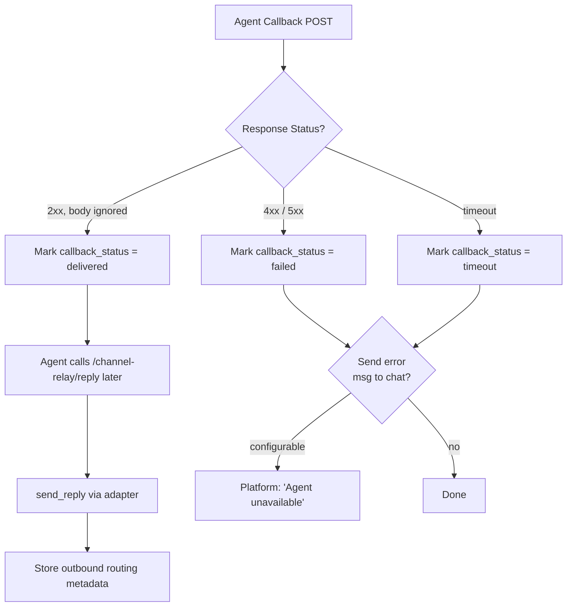

---

## API Endpoints

### Platform Discovery (authenticated)

| Method | Path | Auth | Description |
|---|---|---|---|
| `GET` | `/api/v1/channel-platforms` | JWT/session, API key, service account, or delegated `account:read` token | All registered adapters, display names, registration/onboarding descriptors, configured booleans, ingestion and capabilities. |

### Bot Management (authenticated, human-only)

| Method | Path | Description |
|---|---|---|
| `POST` | `/api/v1/channel-bots` | Register a new bot |
| `GET` | `/api/v1/channel-bots` | List user's bots |
| `GET` | `/api/v1/channel-bots/{id}` | Get bot details |
| `PATCH` | `/api/v1/channel-bots/{id}` | Update bot label or platform verification material |
| `DELETE` | `/api/v1/channel-bots/{id}` | Delete bot (deregisters webhook) |
| `POST` | `/api/v1/channel-bots/{id}/verify` | Re-verify bot token and webhook |

### Conversation Routes (authenticated, human-only)

| Method | Path | Description |
|---|---|---|
| `POST` | `/api/v1/channel-conversations` | Create conversation -> agent route (callback URL resolved from `ApiKey.callback_url`) |
| `GET` | `/api/v1/channel-conversations` | List user's routes (filterable by bot, platform, agent) |
| `GET` | `/api/v1/channel-conversations/{id}` | Get route details |
| `PUT` | `/api/v1/channel-conversations/{id}` | Update route (change agent) |
| `DELETE` | `/api/v1/channel-conversations/{id}` | Delete route |

### Relay (agent-authenticated)

| Method | Path | Auth | Description |
|---|---|---|---|
| `POST` | `/api/v1/channel-relay/reply` | API key **or** reply token | Agent sends async reply to a message. See [Reply Token](#reply-token). |
| `POST` | `/api/v1/channel-relay/send` | Assigned API key or human owner | Initiate an opted-in target-addressed message; optional idempotency key. |
| `GET` | `/api/v1/channel-relay/conversations` | API key | Paginated active assignments, addressability, opt-in, and outbound capabilities. |
| `POST` | `/api/v1/channel-relay/reply/update` | API key **or** consumed reply token | Edit an anchored reply or API-key-authorized initiated message on Telegram, Discord, Slack, Lark, or Feishu. |
| `GET` | `/api/v1/channel-relay/messages/{message_id}/attachments/{index}` | Assigned API key **or** reply token | Download inbound media without consuming the reply token. |
| `GET` | `/api/v1/channel-relay/messages/{conversation_id}` | API key | Get conversation message history |
| `GET` | `/api/v1/channel-relay/resolve-sender` | API key | Resolve a platform sender to a NyxID user (query params: `platform`, `platform_id`) |

### Platform Webhooks (unauthenticated, signature-verified)

| Method | Path | Description |
|---|---|---|
| `POST` | `/api/v1/webhooks/channel/telegram/{bot_id}` | Telegram bot webhook |
| `POST` | `/api/v1/webhooks/channel/discord/{bot_id}` | Discord interaction webhook |
| `POST` | `/api/v1/webhooks/channel/lark/{bot_id}` | Lark event webhook |
| `POST` | `/api/v1/webhooks/channel/feishu/{bot_id}` | Feishu event webhook |
| `POST` | `/api/v1/webhooks/channel/slack/{bot_id}` | Slack Events API webhook |
| `GET`, `POST` | `/api/v1/webhooks/channel/whatsapp/{bot_id}` | Meta subscription verification and message webhook |

These share the generic adapter-driven route outside JWT authentication, with the same global rate limiting and body-limit posture as the existing channel webhooks. `delegated_read_denied_path` already denies the entire `webhooks` route class; the public subscription handler never extracts `AuthUser` or relies on delegated authorization.

---

## Security

### Threat Model

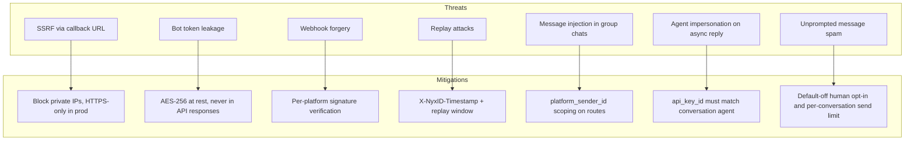

| Concern | Mitigation |
|---|---|
| **SSRF** | Callback URLs validated: HTTPS-only in production, block RFC 1918/loopback ranges, optional domain allowlist |
| **Forged webhook attachment URLs** | Adapter-owned host allowlists, public-IP validation and DNS pinning, and no redirects. Credentials are never sent to a rejected host. |
| **Agent-supplied media URL sources** | HTTPS only, with the same public-host validation, IP pinning and redirect prohibition. |
| **Oversized media** | Content-Length pre-check plus streamed byte cap; base64 length checked before allocation. The raised JSON body cap applies only to `/reply` and `/send`. |
| **Download abuse** | Assigned-key or exact-reply-token binding and live authorization; API-key downloads use the per-agent limiter when configured. Reply-token reads do not consume the send JTI and remain subject to the group's global per-IP limiter. |
| **Large `/send` JSON before admission** | `/send` still parses the now-larger JSON body before its per-conversation limiter. The group's global per-IP limiter mitigates this work, and the route body cap remains bounded. |
| **Bot token storage** | AES-256 encrypted at rest (same pattern as `UserApiKey.credential_encrypted`). Never returned in API responses. Only `platform_bot_username` is exposed. |
| **Webhook forgery** | Per-platform verification: Telegram secret header, Discord Ed25519, Lark / Feishu Verification Token checks plus optional Encrypt Key signature verification and AES decryption. All comparisons use constant-time equality where applicable. |
| **WhatsApp verification** | POST HMAC verifies the exact raw body with the Meta App Secret before phone-number filtering. GET subscription checks SHA-256 of the one-time Verify Token in constant time. Bodies, secrets, and upstream free-form errors are never logged. |
| **Replay attacks** | Callbacks include `X-NyxID-Timestamp`; agents should reject messages older than 5 minutes. Callback JWTs also expire after 5 minutes with 60s skew tolerance. |
| **Callback authentication** | `X-NyxID-Callback-Token` is an RS256 JWT verifiable through `/.well-known/jwks.json`; its `body_sha256` claim binds the exact request bytes. `X-NyxID-Signature` HMAC is dual-emitted during transition and will be removed later. |
| **Agent impersonation** | Async reply endpoint accepts two auth paths: (a) the agent API key, which must match the conversation's `agent_api_key_id`; or (b) a per-callback reply token bound to a specific `inbound_message_id`, `conversation_id`, `api_key_id`, and `platform`, single-use, 30-min TTL, and revalidated against live `api_key.is_active` on every call. See [Reply Token](#reply-token). |
| **Proactive spam** | Default-off, human-only conversation opt-in; live assignment/key checks; concrete chat address and bot scope; shared per-conversation 1/s burst-5 admission before auth. A caller knowing a conversation UUID can consume its bucket, an intentional consequence of pre-auth limiting. |
| **Rate limiting** | Per-bot rate limiting on inbound webhooks. Per-agent rate limiting on callback dispatch (reuses `PerAgentRateLimiter` from agent isolation). |

### Migrating a stuck Lark / Feishu bot

Bots created before issue #455 may have the right App ID / App Secret but still remain in `pending_webhook` because the inbound Verification Token and optional Encrypt Key were never stored separately.

To self-heal an existing bot:

1. Read the bot's Event Subscriptions settings in the Lark / Feishu console.
2. Update the bot with its Verification Token and, if enabled in the console, its Encrypt Key.
3. Wait for the next verified inbound webhook or `url_verification` challenge. NyxID will auto-promote the bot from `pending_webhook` to `active` after successful verification.

You can update the bot either via the API or the CLI:

- `PATCH /api/v1/channel-bots/{id}` with `{ "verification_token": "...", "encrypt_key": "..." }`
- `nyxid channel-bot update <BOT_ID> --verification-token ... [--encrypt-key ...]`

---

## Tool Approval API (Aevatar Integration)

Aevatar agents use a **tool approval middleware** that pauses destructive tool calls and asks the user for permission before executing. The approval can be handled locally (in the chat UI) or remotely via NyxID. NyxID's `NyxIdToolApprovalHandler` creates an approval request on NyxID, then polls until the user decides (via Telegram push, mobile app, or web UI).

This is a **prerequisite** for the channel relay: when an agent receives a forwarded message and invokes tools on behalf of the user, destructive tools must go through the approval flow.

### Flow

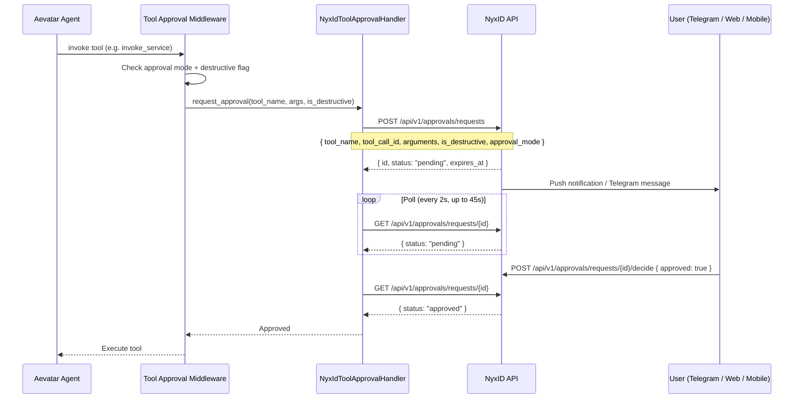

### New Endpoint: Create Tool Approval Request

```
POST /api/v1/approvals/requests
Authorization: Bearer <user_access_token or api_key>
Content-Type: application/json

{
  "tool_name": "invoke_service",
  "tool_call_id": "call_abc123",
  "arguments": "{\"service_id\":\"...\",\"endpoint_id\":\"...\"}",
  "is_destructive": true,
  "approval_mode": "alwaysrequire"
}
```

**Response (201 Created):**
```json
{
  "id": "550e8400-e29b-41d4-a716-446655440000",
  "status": "pending",
  "expires_at": "2026-04-01T12:05:00Z"
}
```

**Field Reference:**

| Field | Type | Required | Description |
|---|---|---|---|
| `tool_name` | string | Yes | Name of the tool requesting approval (max 256 chars) |
| `tool_call_id` | string | No | LLM-generated tool call ID for correlation |
| `arguments` | string | No | Serialized JSON of tool arguments (max 65536 chars) |
| `is_destructive` | bool | No | Whether the tool performs irreversible operations (default: false) |
| `approval_mode` | string | No | Aevatar's approval mode: `"alwaysrequire"`, `"auto"`, `"neverrequire"` (informational, stored but not enforced -- NyxID always creates the request) |

### Polling

Aevatar polls the existing `GET /api/v1/approvals/requests/{id}` endpoint. No dedicated tool-specific polling endpoint is needed — the existing endpoint returns the full `ApprovalRequestItem` which includes `status` and all tool fields.

NyxID uses `"rejected"` as the status value (not `"denied"`). Aevatar should check for `"rejected"` when determining if a request was denied.

### Rollback Compatibility

This design is fully rollback-safe:

| Concern | Design Decision | On Rollback |
|---|---|---|
| **New model fields** (`tool_name`, etc.) | Optional with `#[serde(default)]` | Old code ignores extra fields in MongoDB documents (no `deny_unknown_fields`) |
| **New endpoint** (`POST /requests`) | Additive only, no existing endpoint behavior changes | Old code returns 404; Aevatar times out (expected for new feature) |
| **Status values** | `"rejected"` used consistently everywhere -- no normalization layer | No change needed |
| **Sentinel `service_id: "tool_approval"`** | Tool approval documents appear in `list_requests` with `service_name` = tool name | Old frontend renders them as normal approval entries (odd `service_name` but functional) |
| **Frontend** | Additive: new tool approval rendering in approval list/detail pages. Guards on `tool_name != null` to distinguish tool vs proxy approvals | Old frontend ignores `tool_name` field (not in its type), renders tool approvals as normal entries with tool name as service name -- functional, just not pretty |

**Key rule**: existing endpoints (`GET /requests/{id}`, `GET /requests/{id}/status`, `POST /{id}/decide`) return the same response shapes and status values as before. All new behavior is on new paths.

### Model Changes

Four optional fields added to `ApprovalRequest` (existing collection, no migration needed):

```rust
// On ApprovalRequest model
pub tool_name: Option<String>,        // e.g. "invoke_service"
pub tool_call_id: Option<String>,     // LLM correlation ID
pub tool_arguments: Option<String>,   // serialized JSON
pub is_destructive: Option<bool>,     // destructive flag
```

Tool approval requests use sentinel values for proxy-oriented fields:
- `service_id: "tool_approval"`, `service_name: <tool_name>`, `service_slug: "tool"`
- `requester_type: "api_key"` or `"access_token"` (from auth context)
- `approval_mode: PerRequest` (tool approvals have no grant semantics)

### Relationship to Existing Approval System

The tool approval flow reuses the existing approval infrastructure:
- Same `approval_requests` MongoDB collection
- Same `process_decision` flow (web UI, Telegram, mobile push)
- Same notification pipeline (Telegram bot, FCM, APNs)
- Same `POST /{id}/decide` endpoint for user decisions

The only new surface is `POST /requests` for external creation and the response format alignment.

---

## Implementation Phases

### Phase 0: Tool Approval Endpoint

Prerequisite for agent tool execution. Backend + frontend changes to properly render tool approvals.

**Backend (modified):**
- `backend/src/models/approval_request.rs` -- add optional tool fields (`tool_name`, `tool_call_id`, `tool_arguments`, `is_destructive`), all `Option` with `#[serde(default)]`
- `backend/src/services/approval_service.rs` -- add `create_tool_approval_request()` function
- `backend/src/handlers/approvals.rs` -- add `create_request` handler (`POST /requests`), new request/response types (`CreateToolApprovalRequest`, `CreateApprovalResponse`). Existing `get_request_by_id` adds optional `tool_name`, `tool_call_id`, `tool_arguments`, `is_destructive` fields to `ApprovalRequestItem` (additive, no behavior change -- `null` for existing proxy approvals). Aevatar polls the existing `GET /requests/{id}` endpoint and checks for `"rejected"` status.
- `backend/src/routes.rs` -- add `POST /requests` to approval routes

**Frontend (modified):**
- `frontend/src/types/approvals.ts` -- add optional `tool_name`, `tool_call_id`, `tool_arguments`, `is_destructive` fields to approval request type
- `frontend/src/pages/approvals.tsx` -- distinguish tool vs proxy approvals in list: show "Tool: {tool_name}" badge when `tool_name` is present, skip service link for `service_id === "tool_approval"`
- `frontend/src/pages/approval-detail.tsx` (or equivalent decide page) -- show tool context: tool name, truncated arguments preview, destructive badge. Fall back to existing proxy display when `tool_name` is null

**Rollback**: old frontend ignores new fields, renders tool approvals as normal entries with tool name as service name.

### Phase 1: Foundation

Models, platform adapter trait, error codes, config. Frontend types and schemas (no UI yet).

```mermaid
gantt
    title Phase 1 - Foundation
    dateFormat  X
    axisFormat %s

    section Models
    channel_bot.rs           :a1, 0, 1
    channel_conversation.rs  :a2, 0, 1
    channel_message.rs       :a3, 0, 1
    Register in mod.rs       :a4, after a1, 1

    section Infrastructure
    Error variants (10000-10005)  :b1, 0, 1
    Config env vars               :b2, 0, 1
    DB indexes                    :b3, after a1, 1

    section Trait
    PlatformAdapter trait     :c1, 0, 1
    Normalized types          :c2, 0, 1
```

**Backend (new):**
- `backend/src/models/channel_bot.rs`
- `backend/src/models/channel_conversation.rs`
- `backend/src/models/channel_message.rs`
- `backend/src/services/channel_platform.rs` (trait + types)

**Backend (modified):**
- `backend/src/models/mod.rs` -- register modules
- `backend/src/services/mod.rs` -- register module
- `backend/src/errors/mod.rs` -- new error variants (10000-10005)
- `backend/src/config.rs` -- new env vars
- `backend/src/db.rs` -- new indexes

**Frontend (new):**
- `frontend/src/types/channels.ts` -- TypeScript types for `ChannelBot`, `ChannelConversation`, `ChannelMessage`, platform enum
- `frontend/src/schemas/channels.ts` -- Zod schemas for bot creation/update, conversation route creation/update

**Rollback**: no UI references these types yet; unused exports are harmless.

### Phase 2: Telegram Adapter

First platform adapter, reuses existing `telegram_service.rs`. No frontend changes (adapter internals).

**Backend (new):**
- `backend/src/services/channel_adapters/mod.rs`
- `backend/src/services/channel_adapters/telegram.rs`

### Phase 3: Core Services

Bot CRUD, conversation routing, relay orchestration. No frontend changes (service internals).

**Backend (new):**
- `backend/src/services/channel_bot_service.rs`
- `backend/src/services/channel_routing_service.rs`
- `backend/src/services/channel_relay_service.rs`

### Phase 4: Handlers, Routes & Bot Management UI

Wire up all backend endpoints. Ship the core frontend: bot management page, conversation route editor.

**Backend (new):**
- `backend/src/handlers/channel_bots.rs`
- `backend/src/handlers/channel_webhooks.rs`
- `backend/src/handlers/channel_relay.rs`

**Backend (modified):**
- `backend/src/handlers/mod.rs`
- `backend/src/routes.rs`
- `backend/src/main.rs` (webhook health check background task)

**Frontend (new):**
- `frontend/src/hooks/use-channel-bots.ts` -- TanStack Query hooks for bot CRUD
- `frontend/src/hooks/use-channel-conversations.ts` -- TanStack Query hooks for conversation routes
- `frontend/src/pages/channel-bots.tsx` -- bot list page: table with platform icon, bot username, status, active conversations count
- `frontend/src/pages/channel-bot-detail.tsx` -- bot detail: status, webhook health, conversation routes list, delete action
- `frontend/src/components/dashboard/add-channel-bot-dialog.tsx` -- create bot dialog: platform selector (Telegram only in Phase 4), bot token input, validation feedback
- `frontend/src/components/dashboard/channel-route-editor.tsx` -- conversation route CRUD: agent selector (from user's API keys), default agent toggle

**Frontend (modified):**
- `frontend/src/router.tsx` -- add `/channel-bots` and `/channel-bots/:id` routes
- `frontend/src/components/dashboard/sidebar.tsx` -- add "Channel Bots" nav item

**Rollback**: pages return 404 in router (removed routes), sidebar item disappears. No data loss -- bot records stay in MongoDB, webhook stays registered on Telegram (can be cleaned up manually or on re-deploy).

### Phase 5: Multi-Platform Adapters & Frontend

Discord, Lark, Feishu adapters. Frontend platform selector updated to support all platforms.

**Backend (new):**
- `backend/src/services/channel_adapters/discord.rs`
- `backend/src/services/channel_adapters/lark.rs`

**Backend (new dependency):**
- `ed25519-dalek` (Discord signature verification)

**Frontend (modified):**
- `frontend/src/components/dashboard/add-channel-bot-dialog.tsx` -- platform selector expands from Telegram-only to include Discord, Lark, Feishu. Each platform shows platform-specific setup instructions (e.g., Discord: Application ID + Bot Token; Lark: App ID + App Secret)
- `frontend/src/pages/channel-bot-detail.tsx` -- platform-specific status indicators and webhook health display
- `frontend/src/types/channels.ts` -- add Discord/Lark/Feishu-specific fields to `ChannelBot` type

**Rollback**: old frontend only shows Telegram in platform selector. Discord/Lark/Feishu bots created before rollback still appear in list (platform field renders as raw string) but can't be managed via the old create dialog.

### Phase 6: OpenClaw Bridge Migration

Migrate existing `openclaw_channel_mappings` to the generic relay. Backward-compatible dual-path lookup.

**Backend (new):**
- `backend/src/services/channel_adapters/openclaw.rs`

**Backend (modified):**
- `backend/src/handlers/openclaw_channel.rs` (dual-path lookup: check new `channel_conversations` first, fall back to legacy `openclaw_channel_mappings`)

**Frontend (modified):**
- `frontend/src/pages/channel-bots.tsx` -- show migrated OpenClaw bots alongside user-registered bots (read-only badge for auto-migrated entries)
- `frontend/src/hooks/use-channel-bots.ts` -- filter/display logic for `platform: "openclaw"` entries

**Rollback**: dual-path lookup means old code still reads from `openclaw_channel_mappings` directly. New entries written to `channel_conversations` won't be visible to old code, but old entries continue to work. No data loss.

### Phase 7: Message Log & Polish

Conversation message history viewer, delivery status dashboard, and UX polish.

**Frontend (new):**
- `frontend/src/pages/channel-conversation-detail.tsx` -- message log: inbound/outbound messages with timestamps, delivery status, sender info, content preview
- `frontend/src/hooks/use-channel-messages.ts` -- TanStack Query hooks for message history (paginated)
- `frontend/src/components/dashboard/channel-message-list.tsx` -- chat-style message list component with direction indicators

**Frontend (modified):**
- `frontend/src/pages/channel-bot-detail.tsx` -- add "View Messages" link per conversation route, delivery stats summary (delivered/failed/timeout counts)
- `frontend/src/router.tsx` -- add `/channel-conversations/:id/messages` route

**Rollback**: message log pages return 404. Bot management from Phase 4 continues to work.

---

## Phase Dependency Graph

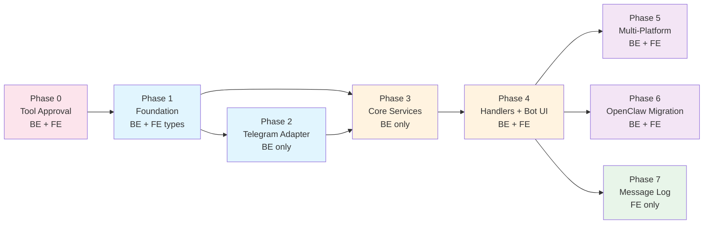

---

## Environment Variables

| Variable | Default | Description |
|---|---|---|
| `JWT_RELAY_CALLBACK_TTL_SECS` | `300` | Lifetime for `X-NyxID-Callback-Token` JWTs |
| `CHANNEL_RELAY_INITIATE_RATE_LIMIT_PER_SECOND` | `1` | Shared per-conversation proactive send rate |
| `CHANNEL_RELAY_INITIATE_RATE_LIMIT_BURST` | `5` | Proactive send burst capacity |
| `CHANNEL_MEDIA_MAX_BYTES` | `20971520` | Per-attachment download/materialization cap (20 MiB); only reply/send body limits are raised to `ceil(cap / 3) * 4 + 65536`. |
| `CHANNEL_RELAY_CALLBACK_TIMEOUT_SECS` | `30` | HTTP timeout for agent callback requests |
| `CHANNEL_RELAY_MAX_BOTS_PER_USER` | `5` | Maximum bots a user can register |
| `CHANNEL_RELAY_MESSAGE_TTL_DAYS` | `30` | TTL for `channel_messages` auto-cleanup |
| `CHANNEL_POLL_INTERVAL_SECS` | `30` | Generic polling sweep interval; `0` disables. Each adapter's minimum interval, backoff and lease also apply. |

---

## Relationship to Existing Systems

| Existing System | Relationship | Migration Path |
|---|---|---|
| **Telegram approval bot** (system-level) | Completely separate. The admin's global bot for approval notifications is untouched. | None needed |
| **Telegram Login Widget** (identity provider) | Separate. Uses Telegram for authentication, not messaging. | None needed |
| **OpenClaw channel bridge** | Superseded. The new relay is a generalized version. | Phase 6: dual-path lookup, gradual migration |
| **Agent isolation** (PR #132) | Complementary. `ApiKey.id` is the `agent_api_key_id` reference. Proxy scope enforcement applies when agents make proxy calls. | Already integrated via shared `ApiKey` model |
| **Proxy gateway** | Parallel path. Relay forwards messages; proxy forwards API calls. Agents may use both. | None needed |
| **Approval system** | Extended. Tool approval creation endpoint (`POST /requests`) added for Aevatar agent tool execution. Reuses existing approval infrastructure. | Phase 0: add creation endpoint + response format alignment |

---

## Example: End-to-End Scenario

### Setup (one-time)

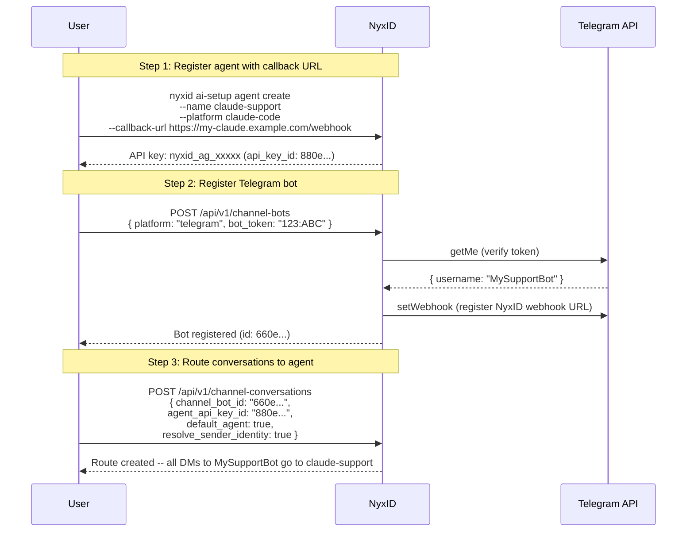

The callback URL is on the **agent** (API key), not the conversation route. If the user later creates a second agent ("gpt-research") with a different callback URL and routes a Discord bot to it, the same pattern applies.

### Runtime

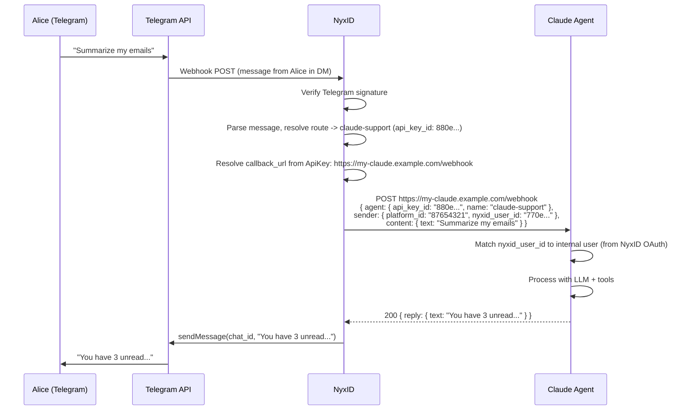

**Meanwhile, on Discord (same user, different agent):**

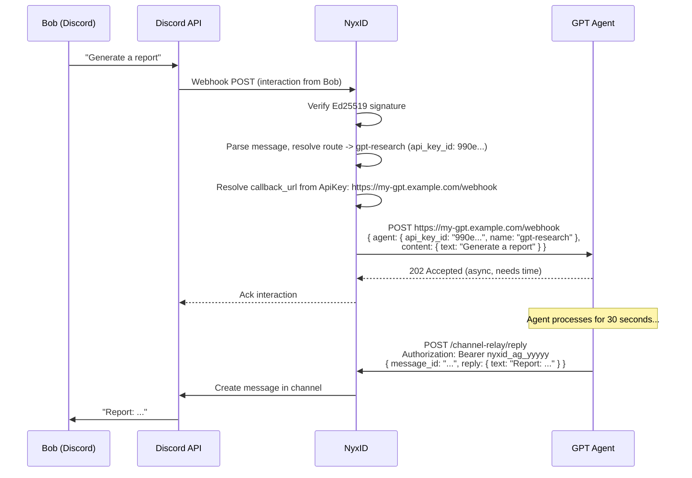

## Aurinko email channel

Aurinko is an account-token email adapter with a separate application signing secret. Signed subscription challenges work during pending setup; account/subscription-bound notifications fetch mail and deliver it inline under producer-owned retries. Durable metadata claims distinguish active work from completion, preserve callback UUIDs across retries, and fence uncertain message-bound replies. This adapter returns retryable HTTP failures rather than the legacy always-ACK behavior. See [Aurinko integration](./AURINKO_INTEGRATION.md) for setup, CLI/API contracts, filtering, routing, credential lifecycle, and deletion outcomes.
