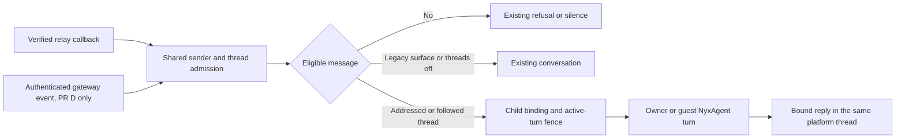

# Channel thread follow

Status: approved; implementation authorized in reviewable PR-sized units, without commits.
Design baseline: `origin/main` at `52aa5265` (NyxID 0.47.0).
Implementation baseline: merged `08dc6f28` (NyxID 0.49.0), retaining approved A.
Brief: T1, “mention an agent in a thread and it picks up the work right there”.

## 1. Scope and decisions

An eligible human explicitly addressing the chat's agent starts following that
platform thread. Later eligible messages in that thread can start turns without
another mention. Every reply, including errors and deferred results, stays on
that thread's verified reply target. Each followed thread has a separate
NyxAgent conversation, key and session; neither sibling threads nor the old
chat conversation supply its transcript.

Approved product decisions (see §12):

- Add per-chat `threads: "follow" | "off"`. Missing means `follow` **after the
  deployment gate enables this feature**, for existing and new eligible chats.
  `reply_mode` remains `mention` by default. Following starts only on positive
  adapter evidence of a mention/direct address or reply to this bot. The current
  `addressed == None => owner` fallback may answer as before but cannot subscribe.
- No migration subscribes anything. An existing platform thread can acquire a
  new follow on its first explicit address after activation; its creation date
  need not be after the upgrade. Existing NyxID conversations remain intact.
- `threads=off` selects the exact legacy partition/admission behavior and stops
  all active follows under that chat. Missing fields preserve legacy behavior
  while the deployment gate is off or the adapter/transport is not ready.
- `reply_mode=all` does not silently follow every thread. Before an explicit
  address it keeps legacy behavior; after one, messages for that followed thread
  go only to its child conversation. Other traffic keeps its existing route.
- A follow expires after **24 hours without an admitted eligible human message**.
  Bots, duplicates, rejected messages, outgoing replies and background work do
  not refresh it. Busy messages rejected before admission do not refresh it.
- Stop following halts automatic admission; it does not delete history or cancel
  a turn already accepted. The UI explains this and retains the separate Stop
  turn action. A later explicit address reactivates the same child conversation
  if its agent and binding are unchanged. Unmentioned messages cannot reactivate.
- After stop/expiry, `mention` chats stay quiet until addressed; `all` chats still
  answer because the owner chose that setting. A previously followed thread in
  an `all` chat retains its child destination (without reactivating follow), so
  stopping never mixes its new messages into the parent's transcript.
- Only the verified owner may stop follow through chat commands; use exact
  `stop following` in an active followed thread, or explicitly addressed to the
  bot elsewhere, not an LLM interpretation of conversation text. Owner-only UI
  and NyxBot tools provide the same operation. Guest stops
  cannot change another person's bot configuration or decide an action card.
- Ordinary private chats, including the owner's cross-channel home thread,
  retain today's behavior. Email is a capability-declared thread surface even
  though its existing adapter labels it `private`; its sender gates remain
  private-chat gates. Unsupported surfaces keep their current behavior.

T1 ships direct-relay NyxBot-linked channels, including organization-owned bots.
Agent Event Gateway transports retain legacy behavior and report follow
unavailable until its owning team ships the negotiated contract (§12).
General third-party callback agents and
device events receive additive metadata/capabilities only; NyxID does not start
following or store a conversation for them. No new environment variables.

“Eligible” retains NyxID's existing policy, rather than adding a second static
sender allowlist: verified owner, or a human guest allowed by `members` or
`private_chats`, with current guest service restrictions on every message.

## 2. Current implementation and constraints

The design is based on these repository contracts (paths are relative to `docs/`):

| Source | Current behavior and design consequence |
| --- | --- |
| [NyxBot design](chat/09-nyxbot-orchestrator.md), §§12–12b; [CLAUDE.md](../CLAUDE.md), “NyxAgent assistant engine” and “Channel Bot Notes” | Per-message owner/guest authority, owner private home threads, organization admin rechecks, safe card decisions, live updates and the 15-second sweep are existing contracts. |
| [NyxbotThread](../backend/src/models/nyxbot_channel.rs) | One UUID row per `(channel_id, partition)`; optional chat settings, conversation pointer and encrypted gateway event reference. Gateway registry placeholders have no `kind`. |
| [nyxbot_chats.rs](../backend/src/handlers/nyxbot_chats.rs), `direct_partition`, `group_partition`, `admission` | Private keys are sender-scoped; group keys are `chat_` plus the first 32 hex characters of SHA-256 over chat/topic. Groups currently share one conversation per such key. |
| [nyxbot.rs](../backend/src/handlers/nyxbot.rs), `relay_callback`, `responses`, `gateway_inbound` | Direct callbacks verify a body-bound relay token; gateway calls verify their channel key, binding, `conv_*` registration and idempotency key. Both eventually call `start_chat_turn`. |
| Same file, `start_chat_turn` | Owner busy messages may enter existing assistant `pending_events`; guests never enter that owner queue. A new conversation can return Busy. Repeated questions may share delivery only within the resolved conversation. |
| Same file, `delivery_target`, `deliver_to` | Late replies require a matching conversation binding; gateway references are encrypted and expire after 29 minutes. Direct replies use an inbound message anchor. These must become child-specific. |
| [Routing](../backend/src/services/channel_routing_service.rs), `resolve_agent` | Sender-specific route wins, then exact chat, then bot default. Follow must run after this routing and never override an unrelated agent's route. |
| [PlatformAdapter](../backend/src/services/channel_platform.rs), [registry](../backend/src/services/channel_adapters/mod.rs) | Outbound/media capabilities and native hooks are authoritative. `thread_id` is overloaded: it can be a real thread, a topic, or a Discord interaction credential. Never hash it blindly into a follow key. |
| [Relay contract](CHANNEL_BOT_RELAY.md), [HTTP Event Gateway](CHANNEL_EVENT_GATEWAY.md), [ChannelMessage](../backend/src/models/channel_message.rs) | ADR-013 keeps relay/device records metadata-only. There is no relay body history or durable ingress queue. `channel_messages` currently has a 30-day TTL. |
| [Aurinko](AURINKO_INTEGRATION.md), [adapter](../backend/src/services/channel_adapters/aurinko.rs) | Native mail already has mailbox-scoped thread routing but is classified private and sender-partitioned by NyxBot. Its send barrier and single-recipient reply policy must survive. |
| [Team handlers](../backend/src/handlers/assistant_team.rs), [engine](../backend/src/services/assistant_nyxagent.rs) | `start_server_turn` uses an owner pool; the persisted active-turn claim prevents two turns in one conversation. These are the final execution fences, including browser/event turns. |
| [Live service](../backend/src/services/assistant_live.rs), [status sweep](../backend/src/handlers/nyxbot_status.rs) | MongoDB change streams project identifiers/status; existing sweeps handle health and gateway group policy convergence. Extend these, not a new scheduler. |
| [Chat UI](../frontend/src/components/assistant/nyxbot-channel-chats.tsx), [hooks](../frontend/src/hooks/use-nyxbot-agents.ts), [schemas](../frontend/src/schemas/assistant-nyxagent.ts) | Existing parent chat settings and conversation links must keep their response shape; children need independent paging and live invalidation. |

Two gateways must not be conflated: `POST /channel-events/{conversation_id}` is
the metadata-only **device HTTP Event Gateway**, while `/nyxbot/responses` is
NyxID's provider endpoint for the external **Agent Event Gateway**. Device
events are not human thread activity and must never create or refresh follows.

Important observed gaps:

- Slack already retains `thread_ts` in both `thread_id` and reply metadata, but
  a root without `thread_ts` needs its own message timestamp as the new root.
- Discord parses embedded `thread.id`, but real messages inside a thread may
  identify the thread only by `channel_id`. Its current normal send ignores
  reply references; interactions overload `thread_id` with a credential.
- Lark/Feishu parse `parent_id` and `thread_id` but currently send to the chat,
  not the native reply endpoint. `root_id` needs additive normalization.
- Gateway `wanted_groups` selects `all` only for `reply_mode=all`. Moreover,
  `gateway_inbound` assumes any event forwarded under its recorded mention
  policy is addressed. That shortcut is unsafe during policy changes and must
  not be used to establish a follow.
- The current private-chat gateway adoption logic and registry IDs are not
  stable platform-thread identities. They remain transport aliases.

Although these subsystems currently contain business logic in handlers, new
follow policy, persistence and coordination belong in a service module;
handlers keep authentication, HTTP/SSE adaptation and dedicated response DTOs.

## 3. Platform thread and adapter contract

Extend `ChannelCapabilities` with serde-defaulted `thread_reply`, `thread_follow`
and `thread_history` booleans, initially false. Keep `reply_to`, `thread`, media
and edit flags with their existing meanings. Advertise through the adapter
registry/catalog, and return effective capabilities for a bot/chat: platform
support intersected with transport support and known configuration. Missing
permissions can still fail at runtime; never advertise history as guaranteed.

The following table describes the target implementation, not current support.
All history requests share §6's bounds and fall back to metadata on failure.

| Platform/surface | Canonical thread and activation | Native reply target | First-turn history | Limits/readiness |
| --- | --- | --- | --- | --- |
| Slack channel/group | `(channel_id, thread_ts)`; a root mention uses its own `ts` when `thread_ts` is absent. Mention/reply evidence must identify this bot. | `chat.postMessage` with root `thread_ts`, including errors and split replies. Never broadcast to the parent channel. | `conversations.replies(channel, ts)` with bounded cursor pagination. | Follow needs ordinary message events and channel visibility, not only `app_mention`. History depends on token type/scopes and Slack's installation-specific limits; some bot tokens cannot read public/private channel replies. 429 => metadata fallback, no retry loop. |
| Discord native thread/forum post | Resolve actual thread-channel ID (channel types 10/11/12), parent channel and starter message. `thread.id` alone is insufficient; validate `channel_id` through trusted channel metadata. | POST to the thread channel's `/channels/{id}/messages`; optionally reference the triggering message. | `/channels/{thread_id}/messages`, bounded and ordered. | Requires thread membership, view/history/send permissions and message event/content delivery. Archived/locked/inaccessible threads fail safely. An `interaction:{app}:{token}` marker is never a thread identity. |
| Discord ordinary reply chain | Root from a validated `message_reference` and bounded stored ancestry. An addressed standalone message can seed its own reply chain. | Normal channel send with `message_reference.message_id`; map each accepted bot reply to the same root. | Bounded ancestor message reads plus stored matching metadata; no full-channel scrape to guess descendants. | Ordinary replies are not native Discord threads. Only explicit descendants count, not nearby messages. Do not create a Discord thread as an implicit side effect. |
| Lark / Feishu | Resolve `root_id`/`parent_id` to the root message and retain `thread_id` as an alias. An addressed root uses its message ID. Reconcile the returned native thread ID without creating a second child. | `POST /open-apis/im/v1/messages/{message_id}/reply` with `reply_in_thread=true`, using a root/anchor belonging to that thread. | Native message-list API with thread container where supported; otherwise bounded known-message/ancestor reads or metadata. | Both base URLs share the implementation. Need all-group-message subscription/permissions to see later unmentioned replies. Verify native thread history permissions/schema in adapter contract tests before advertising `thread_history`. |
| Telegram / telegram-new forum topic | `(chat_id, message_thread_id)` is the follow unit; an explicit address follows that topic. | `sendMessage` with exact `message_thread_id` and an in-topic reply anchor. | No Bot API thread-history fetch: stored inbound metadata and current reply metadata only. | Privacy mode off or group-admin visibility is needed for unmentioned messages; topic-wide follow is visible in UI. Managed alias delegates to the same adapter. |
| Telegram / telegram-new non-topic group | Root message ID resolved through `reply_to_message` plus stored edges; addressed standalone message seeds a chain. | `sendMessage` replying to the triggering message; index returned bot message IDs under the root. | Metadata-only fallback; Bot API reply payloads do not recursively contain the whole chain. | Only known descendants follow. Unknown ancestry is never guessed from timing/sender; explicit address may seed a new root with a partial-context notice. Anonymous/channel senders cannot become eligible humans. |
| Aurinko email | Account-scoped `threadId`; existing `accountId:sha256(threadId)` route remains. Directly addressing the connected mailbox in To, or a verified reply to its message, is explicit address. No subject-word matching. | Existing bound `/v1/email/messages/{id}/reply`, anchored to the particular admitted message. | `/v1/email/threads/{threadId}` through the same account token, bounded; see email privacy below. | Preserve automated-mail filters, verified mailbox binding, one-recipient Reply-To/from policy, empty CC/BCC, text-only sends and irreversible send barrier. Follow does not enable reply-all. |
| WhatsApp | No durable subscribable thread; quoted `context.id` is reply context only. | Existing quoted reply behavior. | None for follow. | All three follow capabilities false; existing behavior unchanged. |
| X DMs / encrypted X Chat | No documented durable DM reply thread; shared-post references are not reply targets. | Existing DM/notification policies. | None for follow. | All three follow capabilities false; existing behavior unchanged. |
| X public mentions/replies | Current main also supports `post:{conversation_id}` and bound post replies. It has a root, but ingress currently accepts only posts addressing this account. | Existing original-post-bound send; never proactive public posting. | No new paid search/polling in this task. | Explicitly excluded from T1 (§12). All new thread capabilities remain false; legacy bound post replies keep working. |
| OpenClaw adapter / device events | No supported NyxID channel thread surface. | Existing integration behavior. | None. | OpenClaw channel registration is disabled; device events are not human chat. All follow capabilities false. |

Add adapter-owned hooks for normalized thread facts, resolving a stable root,
constructing a bound reply target and fetching a bounded history page. Default
hooks return unsupported. Proposed transient `ThreadFacts` contains a version,
surface kind, parent chat/topic scope, root/alias IDs, immediate reply ID,
sender kind, positive address evidence and transport readiness. A separate
`ThreadReplyTarget` contains validated routing identifiers, never user-provided
URLs or credentials. Resolve using persisted bot/message authority; reuse
`send_bound_reply_outcome` so Aurinko fences and component receipts remain active.

Adapters alone interpret native fields, permissions, API paths and thread
types. Shared follow code branches on capabilities/normalized surface kind,
never platform names. Add a capability for private-classified thread surfaces
(email) so shared code does not special-case `aurinko`. Migrate address/human
classification needed for follow into these hooks; retain legacy raw-address
fallbacks only on the unchanged path.

Email's first activation may start a new conversation instead of the owner's
home. Preserve original `private_chats` admission for every sender, even when
several senders share a mail thread. History visible to a guest is restricted to
messages whose provider recipient metadata proves that sender participated;
if this cannot be proved, use metadata only. Never disclose the mailbox's other
messages. The first email-specific PR must test this explicitly.

## 4. Persistence, partitions and conversation lifecycle

Use the existing `nyxbot_threads` collection for durable conversation bindings;
add optional/defaulted fields rather than changing any current partition or
`kind` value. A child has `record_scope="platform_thread"`; absent scope means
legacy chat/registry behavior. New service code explicitly distinguishes child,
parent and gateway registry rows. Do not overload `platform_thread_id` again.

| Additive field | Purpose |
| --- | --- |
| `threads: Option<String>` on parent | Owner setting; omission on PATCH keeps it. Missing persisted value resolves as §1. |
| `record_scope`, `parent_chat_id`, `settings_chat_id` | Child marker, display parent, and existing policy row when it differs from display parent. Existing rows are not rewritten into children. |
| `thread_identity_version`, `thread_kind`, `thread_root_id`, `thread_scope_id` | Token-free, adapter-normalized identity. `platform_chat_id` retains the actual reply chat; native topic/thread aliases stay distinct from the root. |
| `follow_state`, `follow_revision` | String state `opening`, `active`, `stopped`, `expired` or `unavailable`; revision fences concurrent stop/restart. Unknown states fail closed on new readers. |
| `follow_started_at`, `follow_last_admitted_at`, `follow_expires_at`, `follow_stopped_at` | BSON datetimes using required/optional project helpers. `opening` has a separate 60-second reservation deadline. |
| `follow_started_by`, `follow_stop_reason`, `follow_error_code` | Sender ID and bounded local codes only, no names, excerpts or provider prose. |
| `binding_generation`, `bound_agent_id` | Effective agent/connection generation; late work cannot deliver into a reassigned child. |
| `context_status`, `context_message_count` | `pending`, `provided`, `metadata_only`, `partial` or `unavailable`; no fetched bodies. |

Canonical child partition:

`thread_v1_` + full SHA-256 of a length-prefixed encoding of
`(canonical adapter identity, bot ID, settings/display chat scope, thread kind,
canonical root ID, binding generation)`.

The collection's existing unique `(channel_id, partition)` index remains the
binding fence. New child `_id`s are UUID v4 strings; assistant conversations keep
the engine's existing ID format and normal encrypted per-conversation key.
Neither sender IDs nor gateway `conv_*` IDs belong in the shared child key.
Do not normalize opaque IDs by lowercasing or interpret interaction tokens as
roots. Validate length/shape in adapters; hash encoding must be unambiguous.

The display parent is the existing group/channel chat, retaining Telegram's
existing topic-level settings boundary. For Slack/Lark/Discord native roots
already represented by legacy `chat_` rows, preserve that row, its settings and
transcript; project it beneath the enclosing chat in the UI without changing its
ID. A child's `settings_chat_id` selects an exact pre-existing legacy row first,
otherwise the enclosing chat/topic row. New roots inherit that enclosing row's
live settings; do not copy `members`, `owner_seen`, agent or `allow_posts` into
children. Existing exact overrides win. Settings never come from another bot.

For email, create a thread-level display/policy row without changing existing
sender partitions. Retain private sender gates. If existing sender-specific
agent/settings overrides disagree, do not combine them automatically: report
`thread_policy_conflict`, preserve legacy routing, and let the owner reconcile
the settings before activation. No old transcript is imported or relabeled.

Add token-free optional `thread_context` metadata to `InboundMessage`, callback
payloads and `ChannelMessage`: canonical root/kind, enclosing scope, immediate
parent, sender kind and address evidence. Legacy `thread_id` and reply fields
remain byte-compatible. Record the same root on every accepted outbound message
component, so replies to bot output find the same child. Index exact
`(channel_bot_id, platform_conversation_id, platform_message_id)` lookups and
root/time history; retain the existing message TTL and content purge contract.
Bound ancestry to 16 links and reject cycles, cross-chat edges and ambiguity.

Lifecycle rules:

- Atomic child upsert/CAS chooses one conversation ID before any turn starts;
  losing creators reload that binding and never mint a second assistant key.
- Stop/expiry retain the child and transcript. Reactivation uses the same
  conversation unless deleted or its effective agent changed. Expiry never
  authorizes an unmentioned message to start a new conversation.
- Agent override, bot relink to another agent, or specialist destruction closes
  the old binding generation. The next explicit address starts a new child
  generation; old transcripts remain under the previous agent. No late output
  crosses the generation boundary, including directly awaited final replies.
- A transport move for the same bot/agent preserves child IDs, settings and
  conversations. Reconnect updates connection references transactionally and
  carries child partitions alongside the existing `carry_over` flow.
- Disconnect/org access loss suspends follows immediately. Conversation deletion
  stops its follow and clears the pointer; account/bot cleanup includes child
  records and any new coordination metadata. No TTL deletes transcripts.

Additional indexes: parent child-list pagination; active expiry; exact root
lookup scoped to bot/chat; owner/channel/status discovery. Add a defaulted
capacity revision to the channel for transactional admission serialization (§6).
No model field uses `skip_serializing`, and API DTOs never expose model secrets.

## 5. Admission, sender authority and delivery paths

Both authenticated paths call one proposed
`services/channel_thread_follow_service.rs` admission function. Pass `&Database`
and string IDs into business logic, with explicit adapter/credential/turn
dependencies; keep models plain and HTTP behavior in handlers.

Ordered admission:

1. Verify existing transport authentication, live bot/link/route/key ownership
   and source-message binding. Keep sender-specific/exact/default route priority.
   For org bots recheck the linked person's current admin authority; org route
   credentials never become personal assistant execution credentials.
2. Resolve adapter facts and reject bot/self/system/unknown-human events for
   follow. Gateway `actor.kind=human` alone is insufficient if persisted inbound
   facts contradict it. An empty/synthetic broadcast sender cannot subscribe.
3. Deduplicate by stable bot/link + inbound event identity using existing
   `NyxbotEvent` admission, with a unique source-event fence shared by both paths
   during transport moves. Different gateway retry keys cannot bypass it. Keep
   the gateway's idempotency key as a transport alias, not thread identity.
4. Run existing owner-link verification/greetings. Resolve live parent settings
   and owner presence with the same rules as today. Classify owner versus guest
   on **this message**, including `members`, `private_chats`, agent grants and
   `guest_access`; a subscription carries no authority from its initiator.
5. Resolve canonical thread and current binding. Positive address evidence may
   create/reactivate follow if enabled and within limits. Otherwise admit only
   if that exact thread is active and unexpired, or existing `all`/private rules
   independently allow a turn. Ineligible senders cannot create/renew a follow,
   retarget a reply anchor or consume child-creation capacity.
6. Process exact owner `stop following` before any LLM call or card parser;
   fence it against start/renew. It changes only that child. Card decisions are
   scoped to the selected conversation, owner-only, retaining the 4-digit code
   rule and existing sole-new-card plain yes/no exception. Never search all
   sibling/parent conversations for a matching card.
7. Reserve the child binding/capacity and claim a serial turn (§6), or use the
   existing permitted owner queue. Check expiry and revision at first admission;
   recheck live sender authority, settings and binding generation at execution.
   Already admitted owner work survives subscription-only stop/expiry (§9).
   Persist only ordinary admitted assistant messages and existing queue content.
8. Renew an active follow on admitted human activity, attach exact event/root/generation
   delivery metadata, then run the selected agent. Tools remain governed by
   `guest_turn`; guests never gain owner tools, approvals, memories or cards.

**Direct relay.** Preserve callback JWT body binding, stable message IDs, 202
acknowledgement and platform-owned retry policies. Supply normalized facts from
the adapter through the signed callback and cross-check retained metadata when
resolving roots. No synchronous relay body response, provider retry worker or
durable ingress buffer is added. On Busy without an accepted owner queue, use
a truthful local retry notice; do not promise work has been queued.

**Agent Event Gateway (deferred PR D).** This is the eventual negotiated path.
During T1, gateway transports retain legacy admission and replies with
`follow_readiness=unavailable`; they do not enter the child-follow branch above.
Keep the existing `conversation_and_sender` partition
contract and `conv_*` PUT/DELETE registry. One gateway sender conversation can
produce events for many roots; resolve the child per event, never overwrite a
single alias-to-child pointer. `NyxbotEvent.partition` stays the gateway alias
for `readEventContext`; add an optional resolved child/conversation reference.
Deleting a registry alias does not delete shared children or transcripts.

The gateway must preserve normalized thread/address facts in `event_context`,
or NyxID must recover them from its exact signed relay message ID scoped to bot,
chat and sender. No guessing from the latest inbound. Require an advertised
provider contract/version and fixture tests before enabling follow for a gateway
transport. Immediate streamed results and `replyToEvent` must use the same bound
thread target; if the gateway cannot honor it, effective follow stays disabled.

For ready bots use gateway group admission `all` while follow is enabled for
potential chats, as well as when any chat uses `reply_mode=all`. Reconcile this
**before activation**, including unseen chats with the default setting. This
avoids a blind interval between the first mention and a subscription-specific
policy update. It increases forwarded metadata traffic, but NyxID still ignores
unfollowed chatter and immediately clears refused event context. If all possible
follow is disabled, converge to existing mention policy unless `all` is needed.
Do not infer address from recorded `gateway_groups`: policy changes race events.

Keep versioned gateway policy updates and the existing retry backstop. A policy
failure reports `follow_unavailable` without claiming to follow; the original
explicit request may still use its legacy supported reply path. Personal bots
already on the gateway are not silently reconnected. Org bots remain direct and
recheck admin rights on admission, sweep, queued work and every outbound send.

## 6. Serialization, bounds and first-turn context

The guarantee is one active NyxAgent turn per child, across replicas, senders,
gateway aliases, browser turns and deferred events. Reuse the engine's persisted
`begin_turn` claim (`AssistantTurnActive`); a process-local mutex is insufficient.
All first-turn creators must resolve the unique child conversation before that
claim. Keep the owner's channel pool and existing per-owner limits, so more
followed threads cannot multiply the owner's execution budget.

Do not add a relay body queue to obtain FIFO delivery. Accepted owner messages
may use the existing bounded assistant pending-event queue (20 events), carrying
the child ID, sender ID, binding generation and original reply anchor as
metadata. Revalidate owner identity/settings at drain; an owner who is no longer
eligible is not executed as owner. Preserve question dedup within that child;
never coalesce identical text from sibling threads. Guest messages must not
enter an owner event turn: while busy, return the existing retry response when
addressed, or remain silent for an unaddressed followed message. This is serial
execution, **not** a promise of a durable FIFO or guaranteed answers to every
message during overload. Surface busy/drop counters and test this limitation.

For gateway Busy before admission, keep `409 conversation_in_progress` and
`Retry-After: 5`, release only the uncommitted event claim and let the producer
retry. Never retry automatically in NyxID. Direct relay has already acknowledged
most platforms; it cannot guarantee recovery of an unqueued message. Aurinko's
producer retry policy stays adapter-owned; do not treat its successful callback
acknowledgement as proof of a completed agent turn.

Proposed fixed service constants, reviewed in code rather than new env vars:

| Bound | Proposal |
| --- | --- |
| Idle follow | 24 hours from last admitted eligible message, checked on every admission |
| Active/opening follows | 32 per parent chat/topic, 256 per bot/link across all senders |
| Follow creation/reactivation rate | 10 per chat per hour, 100 per bot per hour through existing shared coordination buckets; renewals are not new creations |
| Opening reservation | 60 seconds; failed first start releases it; expiry sweep repairs crashes |
| Ancestry/alias resolution | At most 16 ancestors and 32 root aliases per child; cycles/ambiguity fail closed |
| First-turn history | At most 20 messages, 3 provider requests, 32 KiB decoded text total, 4 KiB per message, 8 seconds total; no attachment downloads |
| History lookback | At most the prior 24 hours, before the triggering message; include root when available within bounds and mark omissions |
| History HTTP | Bounded streaming response reads, at most 2 MiB per request; fixed adapter origins and no redirects carrying credentials |
| Sweep work | At most 100 due records per 15-second pass, indexed oldest-due first, finite work budget; no history fetches or model turns in this sweep |
| Child discovery | Cursor pages of at most 50, with parent ID and deterministic timestamp/ID ordering |

Capacity cannot be implemented as `count` then `insert` outside a transaction.
Serialize allocation/deactivation using a write to the bot channel's capacity
revision in the same MongoDB transaction as the indexed active/opening count
and child-state write. Enforce both caps there; no silent eviction. A renewal
CAS requires the expected follow revision and an unexpired active row. An
expired row must reacquire capacity; stop and allocation touch the same fence.
No locks/transactions stay open across provider or model I/O. Opening rows count
toward capacity and reserve only metadata; activation follows successful turn
or permitted owner-queue admission. Handle stop-before-start by checking the
reservation revision within turn admission. Releasing a losing reservation
must never release another caller's capacity.

Reuse `assistant_team::spawn_sweeps` for opening cleanup and idle expiry, then
reuse gateway policy reconciliation and identifier-only live invalidation.
Compare revision/expiry before marking expired so a concurrent admitted message
wins correctly. Expiry is enforced on reads even if the sweep lags. Durable
child/history rows are retained like current chats, not TTL-deleted; bounded
active count and creation rate constrain new work, while ordinary owner deletion
controls history retention. Existing channel-message TTL bounds reply edges.

First-turn context is fetched only after sender/route checks and serial claim,
once per new child conversation (including a new agent generation). Use a
request-lifetime prelude passed directly to the upstream turn runner. **Do not
put fetched history into `TurnStart.text`, `TurnStart.note`, `pending_events`,
`NyxbotEvent.event_context_ciphertext`, logs or a new collection**: `note` is
persisted today. Existing live gateway event-context retention is unchanged;
it must never acquire this fetched-history payload.

Filter history to the verified root/scope and sender rules, remove bots/system
events except this bot's known replies, order deterministically, deduplicate
the trigger and label senders without trusting display-name owner marks. Mark
the prelude as untrusted historical conversation, not instructions or a card
decision. For guests preserve origin filtering and owner-to-guest context reset;
exclude owner app/home messages, memory, roster, events and unrelated channels.
Email additionally requires participant visibility evidence (§3).

Without fetch capability/permission, query at most 20 matching inbound metadata
rows, ordered within the same root and time window. Supply IDs, sender identity,
times and content kinds, clearly stating bodies are unavailable. Never fabricate
a recap or reread legacy purged content. On restart before prelude delivery,
refetch under the same bounds; on a lost/failed turn use normal engine recovery.
Do not rerun a completed turn merely because `context_status` was not updated.

## 7. Settings, API, native tools and live UI

Keep `GET /assistant/nyxagent/channels/{id}/chats` as the existing parent-chat
array and its current fields. Filter child records out explicitly. Add resolved
`threads`, nullable `threads_setting`, `thread_capabilities`,
`followed_thread_count` and local `follow_readiness` to each parent DTO. Compute
counts in one bounded batch for the returned parents, not one query per row.
Thread-related fields in frontend Zod schemas are optional/defaulted for older
servers; never require a new enum value in old fields.

Extend the existing parent PATCH body with optional `threads` accepting only
`follow` or `off`. Omission leaves the stored value unchanged; invalid/null
values are rejected consistently with existing settings. Turning off follow
stops children and advances the relevant admission fences; other settings remain
unchanged. Changing `members` takes effect at the next message/start, including
queued work. Changing the effective agent creates a new binding generation.
`allow_posts` stays independent: follow permits replies to admitted messages,
not agent-initiated posts. Existing `post_to_chat` still targets the parent.

Proposed additive endpoints under the existing first-party human router:

| Request | Response/semantics |
| --- | --- |
| `GET /channels/{id}/chats/{chat_id}/threads?state=active&cursor=...&limit=...` | `{threads: [...], next_cursor}`; allow `state=all` for stopped/expired history. Scope every component to the acting person, channel and parent. |
| `POST /channels/{id}/chats/{chat_id}/threads/{thread_id}/stop` | Idempotent `{thread: ...}`; only stops following, never deletes the conversation. |

All paths above are prefixed by `/api/v1/assistant/nyxagent`. A child DTO contains
its opaque ID, parent ID, conversation ID, effective agent ID, generic display
label, state, followed/last-admitted/expiry timestamps, context availability,
and capability/readiness codes. Do not return platform tokens, encrypted refs,
raw mail addresses or a text-derived title. Prefer “Thread · <date/time>” under
the known chat label; the existing authorized assistant transcript supplies
message content when opened. Unsupported parents return empty children and
disabled effective capabilities, not a synthetic thread.

HTTP handlers must use dedicated response structs, existing engine/person
ownership checks, uniform not-found behavior and live org-admin checks. Do not
broaden delegated `account:read` access to assistant routes. No new public
history/content endpoint is needed. `GET /channel-platforms` stays metadata-only
and gains static adapter declarations through its existing capability projection.

Add NyxBot-native tools through `assistant_team_tools` schemas/manifests and
`assistant_team::dispatch_channels`, both invoking the same service as HTTP:

- `nyxid__list_channel_threads`: optional channel/chat/state filters and cursor;
  returns the same bounded metadata, current agent and follow status.
- `nyxid__stop_following_thread`: required child `thread_id`; validates owner,
  channel and bot access from chat-key identity, never from supplied owner IDs.
- Extend `nyxid__update_channel_chat` with `threads`. Follow creation stays tied
  to a real addressed inbound; no native tool can invent sender/thread authority.

List is read-only; stop and setting changes follow the existing non-destructive
channel-setting tool pattern. These management tools are owner-turn NyxBot-only,
with normal metadata audits; specialist and guest keys cannot invoke them.
The deterministic owner stop command works even when the linked agent is a
specialist or its model turn is busy. It does not route through a guest tool.

In Assistant → channel chats, show each bot's existing chats and settings,
then an expandable “Followed threads” child list. Display active/expired/stopped
state, last activity and idle deadline; link each row to its own transcript.
Add “Stop following” with pending/error feedback and distinguish it from Stop
turn. Keep the parent's legacy conversation accessible as “Chat history”.
Native topics remain labeled topics, so the owner can see that Telegram follows
the whole topic. In `all` mode explain that stopping follow still allows replies
under “Every message”. Provide platform permission/readiness guidance from
adapter descriptors rather than frontend platform-name branching.

Extend conversation-list channel detail DTOs with optional parent/child IDs so
the sidebar groups children under their chat and opens the selected branch.
Use existing Radix/shadcn components, domain Zod schemas and TanStack hooks in
`use-nyxbot-agents.ts`; any form uses `useAppForm`. Load children on expansion,
cursor-page them independently from the parent's current list limit, and retain
stopped/history rows without filling the active list.

Extend `assistant_live`'s Mongo projection for relevant `nyxbot_threads` changes
only: owner, channel, parent, child/conversation IDs and status/revision. Emit
`channel_thread` invalidations for activation, stop, expiry and reassignment.
Never include titles, addresses, history, sender text or sealed refs. Extend
`nyxagent-live` parsing and `use-nyxagent-live` invalidation with existing list
coalescing; reconnect/refetch and bounded polling while expanded are backstops.
No browser websocket or new background scheduler is needed.

## 8. Migration and rollout

This is an additive schema rollout, not a repartitioning migration. There is no
backfill of follow state, transcript movement, re-encryption of old keys, or
subscription inferred from an old mention. Old parent rows, partitions, settings,
API fields and assistant transcript URLs remain valid. Only newly activated
follow bindings get `thread_v1_*` children. Existing native platform threads can
be activated after rollout without changing their old NyxID history.

Use a new **default-off existing-system feature flag**, proposed
`nyxbot:thread-follow`, evaluated for the acting owner. This is not an environment
variable. Also require adapter/transport readiness; `threads=follow` cannot
override unsupported capabilities. This deployment gate is distinct from the
eventual per-chat missing-value default of `follow`.

1. Ship additive readers, DTOs, indexes, bounded service functions and adapter
   facts with all follow admission off. Leave legacy reply paths selected unless
   a bound new thread target is explicitly supplied by the new service.
2. Upgrade **all NyxID ingress handlers, assistant workers and sweep processes**
   before enabling a direct cohort. Gateway follow remains unavailable in T1.
   For deferred PR D, also upgrade gateway integration readers, verify the
   external gateway's advertised facts/registry/bound-reply contract and converge
   its `all` admission policy before marking that transport ready.
3. Enable internal owners/bots with complete adapter support; retain per-chat
   `off`. Check metadata-only operational signals and owner-visible stop/expiry.
   Expand platform/transport cohorts only after the corresponding contract tests
   and real-platform fixture verification pass.
4. Make the supported direct cohort default-on only after its required adapter,
   lifecycle and owner-control work is reviewed. Gateway readiness does not block
   direct rollout. Announce the excluded gateway/X public surfaces, that an
   explicit mention follows a supported thread for 24 hours, and that the owner
   can choose `off`.

Old serde readers ignore new fields; no existing enum or required field changes.
That ensures data readability, **not behavioral safety during active mixed
versions**. Old ingress would answer using parent partitions and old workers
would not enforce child revocation. Never enable follow while those writers can
process the cohort. `ChatSettings` currently denies unknown fields, so the UI
must not send `threads` until the server advertises the feature; old UI PATCHes
omit it and preserve it. Pin unknown-field preservation in settings/reconnect
tests, including writers that update whole records.

Rollback has two levels:

- Feature rollback on the new binary: disable new subscriptions and unmentioned
  admission, keep known-child address resolution and generation fences, drain
  already admitted turns/owner queue, then mark active follows stopped. Existing
  child transcripts remain readable; no conversation merge occurs.
- Binary rollback to pre-feature code: first complete the drain/stop, restore
  gateway mention/all policy as required by legacy settings, and ensure no new
  child work can be claimed. Then old code can deserialize the additive data;
  it resumes its legacy parent behavior. Export/read child history through the
  normal conversation API; do not promise old UI grouping. Re-enabling requires
  upgrading the full cohort again. Never delete new rows as a rollback step.

Transport migration preserves normalized roots and binding generations for the
same bot/agent. Pending gateway activation, source dedup and late reply handling
must span the swap; do not fork a child because a new sender gets a new `conv_*`
alias. On a generation change, retain old assistant history and stop its follow
before allowing a new child to start. A first promotion also waits/refuses while
legacy work for that platform thread is still running; do not overlap an old
parent turn and new child turn during the cutover.

Startup builds new indexes idempotently without dropping old definitions.
No full message scan or history fetch runs on startup or a message hot path.
Use existing account/bot deletion paths and specialist release hooks to clean
up new bindings, lifecycle metadata and indexes' covered rows. Validate MongoDB
replica-set transactions as a prerequisite already used elsewhere in NyxID.

## 9. Failure modes and privacy

| Failure/race | Required behavior |
| --- | --- |
| Unsupported surface or feature not enabled | Exact legacy admission/partition behavior; no inferred follow. |
| Missing or ambiguous canonical root | Never attach to the newest active thread or guess by sender. No automatic follow. An explicit address can seed a chain only when adapter rules prove the reply target. |
| Alias/cross-chat spoofing; malformed interaction marker | Reject follow facts, retain existing authenticated legacy semantics where applicable, and never expose/hash a credential as a public thread key. |
| Bot/system/anonymous event or newly ineligible guest | Silent; no turn, follow refresh, capacity allocation or latest-reply-target update. Follow is not sender authorization. |
| Bot removed, route revoked, org owner demoted | Reject admission and outgoing delivery with local codes; stop/suspend bindings and release capacity. Shared membership is checked again on every message/send. |
| Follow cap/rate limit | Keep existing active threads; send one safe in-thread limit notice for an eligible explicit request. Do not evict another thread, start a parent turn, or claim that follow succeeded. |
| Two simultaneous first mentions | Unique partition + allocation transaction + engine active-turn claim produce one conversation/key; loser follows Busy/owner-queue policy. |
| Busy thread or owner pool | Existing bounded owner queue where allowed, guest retry/silence, gateway retryable Busy. No unbounded waits or fabricated promise of queued work. |
| Stop/expiry races activation | Revision/CAS decides order. Work already admitted may finish, including already accepted owner queue entries; not-yet-admitted work must observe stop. Neither can renew follow after stop without a new explicit address. |
| Pending owner work after access/agent change | Recheck authority and binding generation at drain; drop/restrict refused work, never turn it into an owner-authorized guest request. Stop/idle expiry alone does not cancel admitted work. |
| Worker dies or lease expires | Reuse engine lost-turn recovery; opening reservation expires. No replay of model/provider effects based only on an unset completion marker. |
| Gateway lacks normalized thread target or drops unmentioned messages | Follow readiness remains unavailable. Preserve current connection and reply behavior; show setup/upgrade guidance and retry policy reconciliation through existing sweep. |
| Platform privacy mode/intents/scopes block delivery | Mark readiness unknown/degraded and explain the required platform setting. NyxID cannot answer a message the platform never delivered. Do not assert confirmed follow delivery from a successful policy update alone. |
| Provider history denied, rate limited, too large, slow or deleted | Continue with bounded available metadata/partial context; no credential escalation, new user token, or blocking retry loop. |
| Reply target deleted, thread archived/locked | Fail safely with local status in owner's UI; never fall back to the parent channel, another thread or a private home chat for followed work. |
| Gateway event reference/interaction credential expired | Preserve result in assistant history and report delivery unavailable. Use only an already-authorized durable bound reply path if supported; no invented proactive send or `allow_posts` bypass. |
| Aurinko send uncertain / already attempted | Preserve its irreversible send barrier; no automatic resend or second “error email”. Context/reply targets remain tied to the original message and its recipient. |
| Transport moves or agent changes during turn | Same-agent moves preserve child identity and exact source anchor; different-agent generation prevents outgoing delivery of the old turn. No duplicate send through both transports. |
| Sweep delayed; Mongo unavailable | Admission checks expiry itself. Database failure fails closed for new follows/turn claims; never replace cluster coordination with local memory. |

An accepted turn captures its exact inbound/event reply reference and generation
in existing encrypted reply storage or additive metadata, with credentials
redacted. A newer message cannot change the recipient of its response (critical
for email) or move it to a sibling thread. Deferred events inherit their original
anchor, not the chat's latest unverified message. Before actual send, recheck
bot, route, agent binding and org authority. Stop/expiry are subscription fences;
access revocation/generation changes are execution and delivery fences.

Errors visible on the platform use short local text, for example “I couldn't
finish that. Please try again.” Never interpolate an `AppError`, provider body,
URL, raw event or token. Deduplicate safe notices per source event and limit
repeated notices per bot/root/code (one per five minutes). Preserve existing
single-use reply-token and per-adapter send semantics; notices must not consume
the only reply slot when a real turn has already been accepted. If safe in-thread
delivery is unavailable, show only the owner's app status.

Append metadata-only audit events through the existing tamper-evident audit
service for follow start/reactivation, owner stop, expiry and binding change:
owner/link/parent/child IDs, guest boolean, reason code and counts. Do not audit
every ignored message. Logs/metrics contain bounded result codes, latency and
counts; no message text, email subject/address, history excerpts, platform
tokens, event references or ciphertext. Avoid raw platform root IDs in metrics
labels to bound cardinality. Debug implementations redact credentials.

ADR-013 remains unchanged: relay/device metadata rows and dedup/coordination
records acquire no message bodies; no durable ingress queue or new retry worker
exists. Only messages that today's assistant would persist after admission
enter its transcript or permitted owner queue. Provider-fetched history is
ephemeral and may inform an answer, but is not bulk-imported into the transcript.
No content-derived automatic thread titles or stored summaries are added.

## 10. Test and validation plan

Completed Phase 1 used document/source review only. Implementation PRs extend the existing
adapter contract tests, `handlers/nyxbot_tests.rs`, engine/service Mongo tests,
and frontend schema/component/live tests rather than create a parallel harness.

**Compatibility and identity:**

- BSON round trips with every new field absent, present, null where optional,
  and unknown future fields; old reader fixture deserializes new documents.
  Missing `threads`, explicit `off`, and feature-off preserve existing outputs.
- Golden legacy private/group/topic partition strings remain byte-identical;
  new roots differ across bots, chats and thread kinds but not across senders
  or delivery paths. Delimiter collisions and interaction credentials cannot
  produce a usable follow identity.
- Existing root/topic settings and agent overrides retain precedence; legacy
  transcripts remain readable. Email conflicts cannot merge sender policies.
- Gateway PUT/DELETE/`readEventContext` keep `conv_*` semantics; many aliases for
  one root converge, and one alias speaking in multiple roots stays isolated.
- Direct-to-gateway moves, reconnect, bot relink, agent destruction, account
  cleanup and conversation deletion handle both parent and child generations.

**Platform fixtures and native requests:**

- Slack root mention, root with `thread_ts==ts`, replies, thread broadcasts,
  mention of another bot, bot echoes, dual `message`/`app_mention` delivery and
  history-token denial/429. Assert root `thread_ts` on every outbound component.
- Discord raw gateway envelopes and messages without embedded `thread`; native
  threads/forum posts, ordinary reply ancestry, bot/webhook authors, missing
  message-content access, archived/locked channels and interaction-token expiry.
  Assert correct destination channel and `message_reference` where appropriate.
- Lark and Feishu root/parent/native-thread alias convergence, bot-ID lookup
  failure, another-user/@all mentions, native `reply_in_thread`, text/card/media
  components and both API base URLs. No send may escape to the parent chat.
- Telegram and telegram-new topics, non-topic chains, replies to bot output,
  reused message IDs across chats, missing ancestors, edits, anonymous posts and
  privacy-mode limitations. Never fetch nonexistent Bot API history.
- Aurinko mailbox/thread/recipient validation, To versus CC-only addressing,
  automated-mail exclusion, multi-sender eligibility/history filtering, missing
  thread, deleted originals and uncertain send barriers. Assert no reply-all.
- WhatsApp quoted replies, X DMs/encrypted notifications, OpenClaw and device
  events remain unchanged. X public posts expose unavailable follow honestly.
- All adapter capability declarations have request-level tests proving their
  implementation; static and effective capability responses agree. Shared code
  contains no newly added platform-name dispatch for follow behavior.

**Authority and concurrency (real MongoDB replica set):**

- Owner verification, `members=owner/default/everyone`, `owner_seen`, private
  gates, specialist read/use/all, guest no-tools NyxBot, no guest approvals,
  machine/SSH/native-tool exclusions and owner-to-guest context reset still hold.
- Card code and sole-card exceptions operate only inside the chosen child;
  identical card codes/safe-looking sender names in siblings cannot cross it.
- Two replicas start the same root at once: one child/conversation/key and one
  live turn. Different roots can run concurrently within the unchanged pool.
  Include browser/event/queued turns and same-text requests from two roots.
- Race the 32nd/33rd chat and 256th/257th bot allocations, renew versus expiry,
  stop versus opening/start, pool-full rollback and a crash after each admission
  step. Assert no capacity leak, over-allocation, stale release or guest queue.
- Check idle boundaries with injected time, including duplicate/rejected/bot
  traffic that must not extend expiry; sweep lag cannot admit an expired follow.
- Revoke members/org admin/agent/route while work is queued, history is fetching
  or output is settling. Prevent stale execution/delivery and preserve accepted
  owner work across subscription-only stop/expiry.
- Gateway `all` reconciliation races, unsupported contract versions, policy
  refusal/retry, alias deletion and one source event with different retry keys
  do not create duplicate work or accidentally address unrelated chatter.

**Privacy, live UI and failure behavior:**

- History byte/page/message/time caps, partial results, order, trigger dedup and
  fallback are observable without storing the input. Use sentinel text/tokens
  and inspect BSON, decrypted retained gateway context, audits, logs, live SSE
  and generated DTOs; fetched history appears only in upstream transient input.
- Safe error notices never include sentinel provider prose, credentials or raw
  IDs; double-send/partial-send failures respect existing adapter barriers.
- Child-list pagination/grouping, old-server Zod defaults, disabled capabilities,
  Stop following feedback, `all` explanation, preserved parent history, live
  invalidation and cross-owner denial have frontend tests. Unauthorized GETs
  reveal neither thread existence nor platform/message identifiers.
- Run focused backend NyxBot/adapter/engine suites and frontend tests for touched
  schemas/hooks/components/live handling, then required formatting/lint/build
  checks. Verify actual outgoing request fixtures; compilation alone is not a
  delivery test. No new global env var or message-body retention is introduced.

Before implementation builds, check `df -h /`, keep each `target/` below 35 GB,
and stop if free disk is below 15 GB. Document real-platform smoke results and
gateway version separately from mocked coverage; this draft claims neither.

## 11. Shippable PR phases

The design is approved. Every implementation unit stops for review without a
commit. Each PR ships a usable outcome or dormant infrastructure behind the
default-off deployment flag; capabilities describe implemented adapter support,
while effective readiness additionally gates transport and admission support.

| PR | Scope | Ship/acceptance boundary |
| --- | --- | --- |
| A+B — Contracts and native thread support | Adapter capability hooks, normalized facts, additive metadata, default-off flag, native Slack/Telegram/Discord/Lark/Feishu replies, bounded history and adapter tests. | Follow admission stays dormant; legacy call paths and partitions are unchanged. Unsupported or unverified capabilities remain false. |
| C — Direct follow with owner controls | Shared admission/child lifecycle/capacity, serial engine fences, transient prelude, direct/org path, sweep, setting/list/stop APIs, native tools and live UI. | Direct cohorts have an end-to-end feature with controls and bounds. Gateway transports keep legacy behavior and unavailable readiness. |
| E — Email | Private-classified thread capability, recipient/reply evidence, policy conflicts, participant-safe history and immutable per-message recipients. | Direct email isolation and existing Aurinko send barriers pass. No gateway prerequisite or implicit reply-all. |
| F — Rollout and coverage | User/operator docs, direct-platform validation, measurements and staged defaults. | Enable only upgraded direct cohorts. Explicitly exclude X public threads and pending gateway transports in release notes. |
| D — Deferred gateway parity | Negotiate normalized facts and bound replies, per-event alias resolution and migration/dedup tests against the external service. | Wait for the owning team's advertised gateway version and reviewed contract. No gateway-side code in this repository's T1 work. |

A+B can be split if keeping the unit small improves review; their shared
acceptance boundary remains dormant infrastructure. C precedes enabled direct
follow, including all owner UI controls. E follows C; F follows C/E. D is an
external dependency, not a blocker for the approved direct-relay release.

The original broad matrix remains useful for the eventual parity work. T1's
approved completion scope is direct relay, including organization bots, with
bounded context, unchanged sender authority and owner controls. Gateway and X
public-feed exclusions stay visible rather than being advertised as supported.

## 12. Review outcome

Approved by the user for implementation on 2026-10-03. The following decisions
supersede the proposed dependencies and unresolved questions above:

1. **Gateway:** the CMA Agent Event Gateway is external and owned by another
   team, which merges its own PRs. Ship direct relay first. Gateway transports
   keep legacy behavior and `follow_readiness=unavailable` until the service
   advertises canonical thread facts and bound in-thread replies. PR D waits.
   [The gateway contract-change spec](CHANNEL_THREAD_FOLLOW_GATEWAY_CONTRACT.md)
   is the handoff artifact; this work does not implement gateway-side changes.
2. **X public threads:** out of scope for T1. Keep `thread_follow=false` and state
   the exclusion in platform documentation and release notes. X DMs likewise
   retain their existing behavior.
3. **Defaults:** after rollout, missing `threads` means `follow`; idle expiry is
   24 hours. Stop is owner-only through UI, NyxBot tool or the exact deterministic
   `stop following` command. Guests cannot stop a follow. Reactivation uses the
   same child; `all` continues answering in that child.
4. **Telegram:** follow the entire forum topic, or correlated reply chains
   outside topics. No separate chain-within-topic scope in T1.
5. **Email:** approved as proposed, including private sender gates, participant
   privacy, conflicting legacy policy handling and no implicit reply-all.
6. **History:** metadata fallback is supported. Never silently obtain broader
   scopes or credentials. Provider fetches remain bounded and ephemeral.
7. **Overload:** serial turns plus the existing bounded owner queue; guests keep
   busy behavior. No new message-body queue.
8. **Bounds:** 32 active follows/chat, 256/bot, 10/100 activations per hour, and
   20 messages / 32 KiB / 8 seconds of first-turn context are approved.

Approved implementation order: A+B may be one first unit; then C (direct follow,
owner controls and UI), E (email), F (rollout/coverage). D waits for the external
team. Stop after each PR-sized unit for review, without committing. Run backend
checks at default stack and `RUST_MIN_STACK=1572864`, clippy with warnings denied,
fmt, frontend lint/test/build, and the wizard build if affected. Keep `target/`
below 35 GB and stop below 15 GB free disk. Save work incrementally.

## 13. Implementation progress and release notes

### PR A — dormant contracts and normalized metadata

A and B are separate review units. A adds the default-off `nyxbot:thread-follow`
flag, conservative adapter facts, optional `channel_messages.thread_context`,
the matching optional signed callback field and additive metadata indexes.
Facts are collected only for an enabled linked person's active direct route,
including organization-owned bots. They contain identifiers and enum evidence,
never message bodies or interaction credentials. Legacy rows and callbacks stay
readable; absent/unknown facts do not authorize a follow.
Slack's stored `B...` bot ID is not its mention user ID. Ordinary messages keep
unknown address evidence until the user ID is known; verified `app_mention`
events remain positive. Lark/Feishu also leave bot identity unresolved in A.

The capability catalog adds `thread_reply`, `thread_follow`, `thread_history`.
Only Slack and the two Telegram adapters declare their existing native reply
support. All follow/history declarations remain false. Every channel-agent
response reports `follow_readiness=unavailable`, including enabled direct links:
A cannot start a follow or change partitions/reply behavior. Native bound reply
operations, root resolution and bounded history are B; admission and controls
are C; private email support is E.

T1 explicitly excludes X public-thread follow. X DMs, WhatsApp and pending
gateway transports retain their existing behavior. The external gateway team
receives the separate contract specification; no gateway implementation is
included. Enabling A's flag collects metadata only and is not a feature rollout.

Validation results (2026-10-04):

- Final-source `cargo clippy -p nyxid --all-targets -- -D warnings` and
  `cargo fmt --all -- --check` passed, including the Slack identity correction.
- Frontend: all 4,171 tests in 417 files passed on Node 22.23.3. Lint passed
  with 0 errors and 29 existing warnings; production and credential-accept
  builds and the mock-footprint assertion passed. One test now waits for the
  registration panel's delayed autofocus before typing; auth product code is
  unchanged. The wizard source closure and freshness hash are unchanged.
- The nine changed-path checks cover seven thread-facts cases, callback source
  binding/omission and the exact capability response. All nine pass on the
  final rebuilt sources at both the default stack and `RUST_MIN_STACK=1572864`,
  including the Slack bot-ID/user-ID regression assertions.
- Nextest's 713-test channel/NyxBot/feature-flag scope passed on the default
  stack. At `RUST_MIN_STACK=1572864`, 712 passed and one overflowed:
  `aurinko_individual_delete_busy_ingress_keeps_bot_visible_until_retry`.
  These runs use the saved binary before the final Slack correction. No tests
  within this scope were excluded or retried; the repository CI timeout applies.
- The Aurinko overflow and the broad suite's
  `delegated_discovery_create_redeem_uses_live_catalog_evidence` overflow both
  reproduce in isolation on untouched HEAD `36e3ef04` at 1.5 MiB. The broad
  default run was stopped after three database-readiness failures and a query
  count failure; all four pass in a serial rerun. Full backend validation is
  therefore **not a clean pass**; scoped and isolated results do not replace it.
- Tests used an isolated MongoDB replica set. Its initial 8,192-descriptor
  exhaustion is confirmed by the WiredTiger crash log; subsequent runs use a
  higher process limit. Debug information and incremental compilation are off,
  with one compiler job. The disk guard enforces the 15 GiB free / 35 GiB target
  bounds. Partial runs and infrastructure failures remain recorded as such.

## 14. Combined A+B implementation

PR A was approved. The combined working tree now includes native thread reply
and history infrastructure on main `08dc6f28` (v0.49.0). The merge fast-forwarded;
reapplying approved A required retaining both the voice and thread feature flags.
No merge commit or implementation commit was created.

The new service resolves an opaque, non-deserializable `ThreadReplyTarget` from
an exact retained inbound row. It rechecks the live direct route/key, linked
person's flag, bot ownership and organization admin access. Ancestry reads are
bot/owner/platform/chat scoped, bounded to 16 edges, and reject cycles. Adapter
resolution preserves root and native alias separately; resolved inbound facts
and each accepted outbound component retain metadata only.

`send_bound_reply_outcome` takes an explicit optional target. Existing relay
callers pass `None`, preserving old sends, interaction credentials, Aurinko's
send barrier and WhatsApp component outcomes. Only the dormant thread service
passes a target. Split text, media and caption components keep that target and
record every accepted ID immediately, including earlier successes before a later
failure. No retry or fallback to a parent chat is performed. Provider notices
must use the same service and locally authored text in C.

- Slack sends root `thread_ts` on text and file completion. History uses bounded
  `conversations.replies` pages; token/scope errors and rate limits degrade to
  metadata without requesting scopes or retrying.
- Telegram and telegram-new preserve exact forum topics and correlated reply
  anchors. The Bot API has no thread-history fetch; metadata is supported.
- Discord resolves the actual channel type through its channel API. Native
  threads use the thread channel; ordinary chains use explicit references with
  `fail_if_not_exists=true`. No thread is created implicitly, and interaction
  credentials cannot become thread identities. History uses native thread
  messages or exact ancestor reads, never a parent-channel scrape.
- Lark and Feishu use the native message reply endpoint with
  `reply_in_thread=true`, including cards/media. History uses a verified trigger
  and a known root/ancestor read, explicitly partial. A cold tenant-token exchange
  is included in the three-request budget. No thread-container listing
  permission or new scope is assumed.

Context is request-lifetime data without serde support. Across provider content
and fallback metadata it is bounded to 20 messages / 32 KiB, with 4 KiB excerpts,
three provider requests, a 24-hour window and an eight-second deadline. Responses
are streamed with a 2 MiB cap; the thread client does not follow redirects.
History filters source scope, trigger, sender eligibility, system/bot events,
duplicates and time. A slow provider retains already loaded fallback metadata.
Nothing injects fetched history into persisted text, notes or pending events.
C will supply the admitted sender policy and transient runner prelude.

All `thread_follow` capabilities and effective follow readiness remain false /
unavailable, and `nyxbot:thread-follow` remains default off. Enabling it in this
unit only enables A's metadata collection. C supplies admission and controls;
email waits for E. Gateway follow and X public-thread follow remain excluded.

Main already contains the requested `Box::pin` fixes in the delegation and
Aurinko regression tests. They are retained unchanged; stack sizes are not
modified. All 23 focused A+B tests pass at both the default stack and
`RUST_MIN_STACK=1572864`, including both exact regression tests:

- `handlers::delegation::tests::delegated_discovery_create_redeem_uses_live_catalog_evidence`
- `services::channel_adapters::aurinko::tests::aurinko_individual_delete_busy_ingress_keeps_bot_visible_until_retry`

The final Slack history regression also passes: a `bot_message` carrying only
a `user` ID retains bot classification and cannot become eligible human history.

Completed validation: frontend 4,172 tests / 417 files, lint (zero errors,
29 existing warnings), production and credential-accept builds, and mock-footprint
check all passed on Node 22.23.3. The wizard source closure is unchanged and its
freshness hash matches main.

Fresh backend runtime results: the broad 860-test NyxBot/channel/adapter/
delegation/Aurinko/feature-flag scope passes on both the default stack and
`RUST_MIN_STACK=1572864`. Each stack also passes the 23-test focused scope above.
No retries or exclusions within these scopes; unrelated backend tests are not
claimed as run. Tests use an isolated MongoDB replica set and the repository's
CI nextest timeout policy, with one focused/two broad test processes. The broad
filter is `test(channel_) | test(nyxbot) | test(feature_flag_service) |
test(adapter) | test(delegat) | test(aurinko)`.

Final-source `cargo clippy -p nyxid --all-targets -- -D warnings` and
`cargo fmt --all -- --check` both pass, including the Slack bot-history
correction. The tested Rust snapshot is unchanged. The isolated database has
been shut down; the disk guard never reached its stop threshold. At completion,
`target/` is approximately 3 GiB and free disk exceeds 50 GiB.

A+B is ready for review with no new commits. Provider delivery is covered by
request fixtures; no real-platform smoke test or deployed gateway compatibility
is claimed in A+B. Direct follow admission, owner controls and UI remain PR C.

## 15. PR C: direct follow and owner controls

PR C is stacked on `691ac03b` (v0.51.0, A+B PR #1750) in
`feat/channel-thread-follow-c`. It does not change the A+B branch or enable
`nyxbot:thread-follow` by default. The working tree also contains an
uncommitted merge of `origin/main` at `655ae214` (v0.54.0); the voice beta and
live-turn gate are retained. No commit was made.

Direct Slack, Discord, Lark/Feishu and Telegram/telegram-new adapters now declare
follow support. A supported direct link with the owner's flag enabled can
create a child after positive address evidence. Unmentioned human messages
enter only an active child or an existing child allowed by Every message.
Private chats, unsupported surfaces and `threads=off` retain legacy routing.
Gateway transports remain unavailable pending the external gateway contract;
email is deferred to E, and X public threads remain unsupported for T1.

Children inherit live policy from the enclosing chat/topic, unless an exact
pre-existing legacy thread row supplies an override. Canonical root and native
alias lookups preserve those overrides even when the triggering root message
has no legacy `thread_id`. Ambiguous old aliases retain legacy routing.
Existing override IDs and transcripts remain intact and can be displayed under
the enclosing chat. Telegram forum topics retain their topic-wide boundary.

Reservation, activation, stop, settings changes and expiry use the channel's
transactional coordination revision. The unique child partition binds the
canonical scope and effective agent generation. Activation is part of the
engine's persisted turn claim, or of admission to its existing owner queue.
Reservations expire after 60 seconds; no new body queue is introduced. Limits
remain 32/chat, 256/bot, 10/chat/hour and 100/bot/hour, without eviction.

Each admitted event retains its original source, sender classification and
binding generation. Queue drain and every outbound component recheck live
sender/link/route/agent authority. Stop and idle expiry preserve already admitted
work; reassignment and revoked authority prevent stale delivery. Known addressed
children remain usable during flag rollback, without creating or renewing a
follow. Deferred replies use their admitted event targets rather than the most
recent inbound message. Busy/drop counters retain numbers only, and an unqueued
message gets a retry notice rather than a promise of queued work.

Repeated owner questions coalesce inside their child under the same admission
fence, without adding a new reply destination to the queued or running answer.
That answer already targets the native thread. Queued owner requests use their
own authority when the preceding guest loses access; fully revoked queues are
pruned before spending an event-turn budget. Native discovery rechecks live
org-admin access even before the org-loss sweep updates the link.

The first claimed child turn receives bounded context directly in the upstream
request. Neither provider history nor fallback metadata is appended to stored
turn text, notes or queue events. Context remains limited to 20 messages,
32 KiB, three provider requests and eight seconds; unavailable history never
causes an automatic scope request. Metadata-only context is supported.
Target resolution and history share one deadline so a slow provider leaves
time to return the metadata fallback. Context and overload metadata changes
also trigger the existing coalesced UI refresh.

Owner controls comprise the parent `threads` PATCH setting, paginated child
list and idempotent stop endpoints, NyxBot-native list/stop tools, and the exact
owner command `stop following`. Guests cannot stop a follow. Agent overrides,
relinks, destruction, disconnect and conversation deletion close the appropriate
binding; stop/expiry retain the transcript. After a stop, Every message still
permits replies in the existing child.

The UI adds Followed threads, active/history pages, native topic labels, idle
expiry, context availability and Stop following feedback. Chat history remains
accessible. A reservation has no transcript link until a real conversation is
present. Optional parent/child metadata groups branches in the sidebar.
Identifier-only `channel_thread` live events use the existing coalesced query
invalidation. Older-server schemas remain accepted.

Release notes for this unit: direct thread follow is available behind the
existing default-off flag. Gateway and email follow are not enabled by this
unit. X public-thread follow is not supported. Stopping follow keeps history and
does not cancel work already admitted; Every message remains an independent
reply policy. Provider history can fall back to metadata without extra scopes.

The execution path rechecks every bound channel/event origin immediately before
each upstream request, including continuations. A revoked sender, route or
agent therefore cannot reach the model after transient history preparation;
ordinary browser turns remain independent. The Telegram-new adapter now
advertises the approved follow capability through its existing Telegram
transport.

Validation results (2026-10-04, merged 0.54.0 tree):

- Focused backend scope: 35/35 passed at the default stack and
  `RUST_MIN_STACK=1572864`.
- Broad NyxBot/channel/adapter/delegation/Aurinko/feature-flag/assistant scope:
  930/930 passed at both stacks. This includes the delegation and Aurinko
  regressions requested for the 1.5 MiB stack. The isolated Mongo replica set
  was used; no retries or exclusions were applied.
- `cargo +1.98.1 clippy -p nyxid --all-targets -- -D warnings` passed. The
  repository format check passed. Cargo emitted only its existing
  future-incompatibility notice for `proc-macro-error2`.
- Frontend: 4,203 tests in 423 files passed serially, lint passed with zero
  errors and 29 existing warnings, and production/credential-accept builds
  passed with the mock-footprint assertion. The test run used one worker and
  the local 15-second timeout to accommodate cold router imports on the loaded
  host; no repository timeout configuration changed.
- The wizard build and bundle installation passed; its committed freshness
  hash was regenerated by the existing script. The CSS optimizer emitted its
  existing pseudo-class warning only.

The canonical-command guard's subscription-stop exception is restricted to
that exact new endpoint. The disk guard remained above its 18 GiB safety buffer
through validation; this worktree's target peaked below 9 GiB. No real-platform
smoke test or deployed gateway compatibility is claimed. Gateway transports
remain `follow_readiness=unavailable`, while X public-thread follow remains
unsupported for T1.

## 16. PR E: Aurinko email thread follow

PR E is stacked on PR C in `feat/channel-thread-follow-email`. Aurinko now
advertises the private thread capability behind the same default-off
`nyxbot:thread-follow` flag. A message addressed to the connected mailbox in
`To`, or a provider-verified reply to a retained NyxID message, is the email
equivalent of a mention. The child partition is shared by the mailbox
`threadId`, so participants use one followed conversation; activation never
merges the owner's private home thread.

The existing private sender gate remains authoritative for every message.
Guests can participate only when the bot's `private_chats` policy allows it.
Legacy sender-specific policy or agent overrides that disagree produce the
stable `thread_policy_conflict` outcome and leave the message on legacy
routing. Replies still use Aurinko's single-recipient Reply-To/from policy,
empty CC/BCC, text-only payload and irreversible send barrier. Follow does not
enable reply-all.

Email history is participant-safe. Provider history and metadata fallback carry
only bounded participant fingerprints: keyed, domain-separated HMAC-SHA256
under `email-participant`; a guest sees a message only when provider metadata
proves that sender participated. If that proof is unavailable, the message is
represented as metadata or omitted. No additional mailbox scopes are
requested.

The server initializes the audit-chain HMAC key in `main` before mounting
webhooks or spawning channel work. Aurinko ingestion runs inline through the
retryable webhook handler in that process; it has no independent polling or
ingestion worker. The additive email block is omitted when the key is absent,
and history without keyed participant proof is partial. RFC reply parents are
carried in email facts only; the legacy reply field remains `None`.

Private channels without `private_thread` support exit before any flag,
membership or thread lookup. The optional global dormant-flag ingress guard
is deferred: existing email children must still receive addressed replies
after the flag is disabled, and an org-owned bot's flag belongs to the linked
person, not the bot owner. A guard needs to preserve both cases.

Validation for this PR completed on the final C merge: `cargo +1.98.1 check
-p nyxid --all-targets` passed at the default stack and with
`RUST_MIN_STACK=1572864`; the affected follow, Aurinko, adapter, delegation
and channel-relay suites passed at both stacks (including 10 follow tests, 22
Aurinko tests, 234 adapter tests, 37 delegation tests and 62 relay tests per
stack). `cargo +1.98.1 clippy -p nyxid --all-targets -- -D warnings`, Rust
formatting and the diff check passed. Frontend lint passed with the existing
29 warnings, all 4,216 tests passed, and production plus credential-accept
builds passed. No frontend files changed in E, so the wizard bundle was not
rebuilt here; C's wizard validation remains unchanged.

### Review corrections (2026-10-05)

The v0.57.0 main merge remains resolved and uncommitted. Private direct
messages on adapters without `private_thread` return before database access;
a command-observing MongoDB test covers Telegram and the other legacy private
adapters, including the test adapter override. Missing fingerprint keys leave
Aurinko's legacy inbound message intact and omit email follow facts; history
without fingerprints is partial and contains no unproven items. Inbound and
callback shape assertions cover the unchanged legacy reply field and the
additive email metadata. Turn validation uses fact-aware sender eligibility
only when facts exist, falling back to the previous eligibility check otherwise.

Validation uses `CARGO_INCREMENTAL=0`. All 263 selected Aurinko, follow,
adapter and thread-history tests pass at both the default stack and
`RUST_MIN_STACK=1572864`, with no failures or ignored tests. The capability
matrix now includes Aurinko email follow, history and private threads while
retaining the default-off flag and unsupported-surface assertions. Formatting
and staged/unstaged diff checks pass, and the final
`cargo +1.98.1 clippy -p nyxid --all-targets -- -D warnings` run passes.

The backend test executable was built with Rust 1.98.1 using
`cargo +1.98.1 rustc -p nyxid --bin nyxid-server --profile test -- -C debuginfo=0`
to limit local build resource use; stack configuration is unchanged. Its
libtest filters were `aurinko thread_follow channel_adapters
channel_thread_service --test-threads=2`. MongoDB used the local replica set
on port 27022. The macOS linker reported a large compact-unwind table, and
Cargo reported the existing `proc-macro-error2` future-compatibility warning;
neither prevented compilation or either test run.

The review corrections are ready for review with no commits. The v0.57.0 merge
remains resolved and uncommitted on `feat/channel-thread-follow-email`.
At completion, target is 20 GiB, incremental cache is empty, and free disk
is 47 GiB. The feature flag remains default-off.
