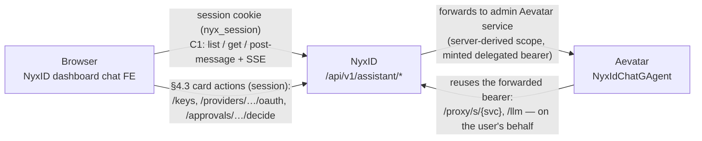

# CHAT_SPEC — How the NyxID Assistant Chat is set up

**Status:** authoritative setup + architecture reference (2026-07-18).
**Scope:** how the dashboard chat page connects to Aevatar through NyxID, which
NyxID subsystems it reuses, the exact request/token flow, the required service
configuration, and the verified evidence. The cut-by-cut change history lives in
`CHAT_ASSISTANT_SPECS.md`; this file is the stable "how it works" picture.

Audience: a NyxID engineer who needs to understand, operate, or extend the
assistant without re-deriving it from the diffs.

---

## 1. The three planes (what talks to what)



- **Assistant plane** — the chat UI. The browser only ever talks to NyxID's own
  `/api/v1/assistant/*` mount with its `nyx_session` cookie. It never names an
  Aevatar scope and never reaches Aevatar directly.
- **Connection plane** — existing NyxID core (credential broker, proxy, LLM
  gateway, catalog, approvals, nodes). The assistant reuses it unchanged; it is
  not a special case in the data plane.
- **Aevatar** — owns the chat backend: conversation storage, the agent loop,
  model choice, tool orchestration, and the AG-UI event stream. NyxID does not
  store chat content.

The load-bearing rule (the intended contract): **chat content flows
Browser↔Aevatar (through NyxID); credential/management actions flow
Browser↔NyxID (session).** Aevatar *should* reach only NyxID's delegated-safe
data plane (`/proxy`, `/llm`, `/proxy/services`) with the forwarded token, and
management/card actions are the browser's job. Production conformance of
Aevatar's agent tools to this contract is **not yet verified** — see §8 (the
`nyxid_*` tool-route matrix is a release gate). §5 describes the token boundary
NyxID actually enforces.

---

## 2. The `/api/v1/assistant/*` mount (NyxID side)

Files: `backend/src/handlers/assistant.rs`, `backend/src/services/assistant_service.rs`,
routes in `backend/src/routes.rs` (mounted in the **human-only** router:
`reject_api_key_tokens` + `reject_delegated_tokens` + `reject_relay_tokens` +
`reject_service_account_tokens` — only a real human session or a first-party
access token reaches it).

Every route is an **explicit allowlisted mapping** onto one Aevatar path (a
blanket `/{*path}` would expose all ~248 Aevatar routes through a session-authed
mount). Two routes fan out server-side: create also runs bounded
materialization polls, and delete issues two upstream calls (actor + history).
The scope segment in the upstream path is always derived server-side from the
verified `AuthUser.user_id` — the browser cannot address another user's scope.

| Browser call | Upstream Aevatar path | Notes |
|---|---|---|
| `POST /assistant/conversations` | `api/scopes/{uid}/nyxid-chat/conversations` | create actor (202 + `actorId`), then polls the actor index until it materializes |
| `GET /assistant/conversations` | `api/scopes/{uid}/chat-history` | Chat History index (server titles/timestamps/counts) |
| `GET /assistant/conversations/{id}` | `api/scopes/{uid}/chat-history/conversations/{id}` | transcript passed through as-is, body opaque to NyxID. Two accepted shapes: the legacy flat array and Aevatar PR #2923's `{messages, stateVersion}` wrapper. An empty transcript (`[]` or `{"messages":[]}`) is Aevatar's representation of empty/deleted; the route does not itself coerce errors to either shape |
| `DELETE /assistant/conversations/{id}` | actor delete **+** history-row delete | composite, 404-tolerant on each side |
| `POST /assistant/conversations/{id}/stream` | `…/nyxid-chat/conversations/{id}:stream` | AG-UI SSE turn, streamed unbuffered |
| `POST /assistant/conversations/{id}/approve` | `…:approve` | approval decision (SSE response) |
| `POST /assistant/completions` | `v1/chat/completions` | OpenAI-compatible (retained, unused by the UI) |
| `POST /assistant/workflow-chat` | `api/chat` | ad-hoc workflow chat (retained, unused by the UI). Body forwarded verbatim, so Aevatar PR #2923's continuation contract falls on the **caller**: continuing a conversation now requires `conversation:{conversationId, minimumStateVersion>0}` (omit it and Aevatar answers `503 CHAT_HISTORY_RESERVATION_UNAVAILABLE`; unknown id answers `404 CONVERSATION_NOT_FOUND`), and the caller must stop splicing transcript into `prompt` — the backend injects server history itself |
| `GET /assistant/workflow-chat/ws` | `api/ws/chat` | WS twin (retained, unused by the UI) |

All routes funnel through one function — `assistant::forward` — which resolves
the admin Aevatar service and calls `proxy::execute_proxy`. Because forwarding
goes through `execute_proxy`, the assistant inherits **credential injection,
identity propagation, per-agent rate limiting, approval gating, and audit**
with no bespoke data-plane code.

### Admin-managed resolution (why it works for everyone)

`assistant_service::resolve_admin_service` reads the admin catalog
(`downstream_services`) for the `aevatar` slug directly, and addresses it **by
id** in `execute_proxy`. It never routes by slug, because the slug resolver
would prefer a *caller-owned* `UserService` — the assistant would then work only
for people who had personally connected Aevatar. The row must have
`requires_user_credential = false` so it can back a platform surface with its
master credential.

**Caveat (TD-1, not yet closed):** addressing by catalog id avoids slug-based
`UserService` selection, but `execute_proxy` still evaluates **per-user node
routing** and **legacy connection state** — an inactive `UserServiceConnection`
returns 403 (`proxy_service.rs`) and a personal node pin can divert the call
(`proxy.rs`). So one user's historical disconnected row can produce "chat works
for everyone but me". The fix is a strict admin-target execution mode; until
then this admin-managed invariant is not absolute.

---

## 3. Why the browser can't just forward a token (the core problem)

NyxID dashboard sessions authenticate with an **opaque HttpOnly `nyx_session`
cookie**. The browser JS never holds a JWT (by design — no token in
`localStorage`, no XSS token-theft surface). So when the assistant mount forwards
a request to Aevatar, there is **no caller bearer** to forward.

Aevatar's currently deployed validator authenticates every call by a
**`Authorization: Bearer <NyxID JWT>`** and, for its own callbacks into NyxID,
**reuses that same inbound bearer**. So a cookie session with no bearer means:
Aevatar answers 401 at the chat entry, or (once entry is fixed) Aevatar's
callback to NyxID's LLM gateway answers 401. Both were observed in prod.

The end-state design (TD-3) is for Aevatar to validate a proxy-injected
`X-NyxID-Identity-Token` and use a proxy-injected `X-NyxID-Delegation-Token` —
but that Aevatar-side change has not shipped. Until it does, NyxID must speak the
validator's current dialect: put a usable NyxID bearer in `Authorization`.

---

## 4. The token NyxID mints for cookie sessions (the bridge)

`assistant::forward`, when `AuthUser.auth_method == Session` **and** the aevatar
row has `forward_access_token == true`, mints a **standard delegated access
token** and overwrites `Authorization` before `execute_proxy`:

```
generate_delegated_access_token(
    user_id = session user,
    scope   = resolve_forward_scope(aevatar_row),   // see §6
    actor   = aevatar_row.slug,                      // act.sub = "aevatar"
    ttl     = MCP_DELEGATION_TOKEN_TTL_SECS (300s),
    restrictions = TokenRestrictionClaims::from_auth_user(session),
)
```

**The minted JWT is a standard delegated access token** — the exact same
factory, `delegated:true`, `act.sub`, TTL, and restriction shape the standard
`inject_delegation_token` proxy path uses (`handlers/proxy.rs`). What differs is
**issuance and delivery — a temporary assistant-specific adapter**, in four
ways: (1) it rides in `Authorization` (which Aevatar reuses) instead of
`X-NyxID-Delegation-Token`; (2) it substitutes `proxy` when the row scope is
insufficient, where standard injection uses the raw row scope (§6); (3) a mint
failure fails the assistant call, where standard injection logs and continues;
(4) it is gated by `Session && forward_access_token` and overwrites
`Authorization`, where standard injection is gated by `inject_delegation_token`
and adds a separate header. All four are retired by the TD-3 row flip (§6).

Bearer callers (CLI login JWTs, service integrations) never enter this branch —
their own token is forwarded byte-for-byte.

### Where this sits in the platform token-standard family

NyxID already has a family of short-lived, purpose-scoped tokens delivered to
downstreams (`docs/API.md`, `docs/DEVELOPER_GUIDE.md`):

| Token | Header | Audience | NyxID re-entry | Boundary mechanism |
|---|---|---|---|---|
| Identity assertion | `X-NyxID-Identity-Token` | `identity_jwt_audience` if set, else service `base_url` | rejected | distinct claims struct + audience |
| Delegation token | `X-NyxID-Delegation-Token` | NyxID | delegated `/api/v1` group only (see §5 for the `/oauth/userinfo` caveat) | `delegated:true` + `reject_delegated_tokens` |
| Relay token | `X-NyxID-User-Token` | NyxID | proxy/LLM `/api/v1` group only (same caveat) | `relay:true` + `reject_relay_tokens` |
| **Assistant bridge** | `Authorization` (transitional) | NyxID | **delegated `/api/v1` group only** (same caveat) | `delegated:true` + `reject_delegated_tokens` |

The assistant bridge **is** the delegation-token standard, just delivered in a
different header for one deployment window.

---

## 5. The security boundary (delegated = data plane only)

Because the minted token carries `delegated: true`, NyxID's `/api/v1` routers
enforce:

- **Accepted** on the `api_v1_delegated` **delegated-safe route group**: `/llm`,
  `/proxy/s/{slug}` (+ `{*path}`), `/proxy/{id}`, `/proxy/services`,
  `/delegation/refresh`, approval-**status** polling, proxy service docs,
  `/demo`, channel relay/events. This is the subset Aevatar needs to act on the
  user's behalf (it is a *delegated-safe group*, not literally "the data plane
  and nothing else").
- **Rejected (403)** on the human-only and shared `/api/v1` routers via
  `reject_delegated_tokens`: `/users/*`, `/api-keys`, `/keys`, `/user-services`,
  `/catalog`, `/providers`, `/connections`, `/nodes`, admin, org — every
  account-management, credential, and admin surface.

**Exception — `/oauth/userinfo`.** This endpoint lives *outside* the `/api/v1`
routers and accepts any `AuthUser`, including a delegated token; it returns the
user's email, display name, verification state, and avatar. So the boundary is
precisely "delegated tokens are rejected on the `/api/v1` human-only + shared
routers"; it is NOT "a delegated token can read nothing about the account." A
leaked token could read that profile info from `/oauth/userinfo`. (The same
caveat applies to relay tokens.) If this matters, `/oauth/userinfo` should also
reject delegated tokens — tracked separately.

So a copy of the forwarded token leaked from Aevatar can call the proxy/LLM data
plane and read `/oauth/userinfo` as the user, but **cannot touch account
management, keys, providers, connections, nodes, or admin**. The token expires
in 300s; note `/delegation/refresh` is itself delegated-accessible, though it
currently requires an active OAuth client + consent for `act.sub` (so refresh
likely fails for `act.sub="aevatar"` — see §8 G4). This is still materially
safer than the plain full-access token CLI/Bearer callers already forward and
prod trusts, which reaches every management surface.

**This boundary is the same one the PRD draws:** Aevatar uses the data plane;
management/card actions are the browser's job (session-authed, §4.3 of
`CHAT_ASSISTANT_SPECS.md`). An Aevatar agent tool that needs to *read* management
data must therefore either use a delegated-safe endpoint (e.g. `/proxy/services`
for service discovery, which is delegated-accepted) or have the browser supply
it. See §8 (open item) for the one place this needs confirmation.

---

## 6. Required service configuration (the `aevatar` catalog row)

The assistant is driven entirely by the admin `downstream_services` row for
`aevatar`. Operative fields:

| Field | Value | Why |
|---|---|---|
| `slug` | `aevatar` | resolved by `resolve_admin_service` |
| `is_active` | `true` | else `resolve_admin_service` → Internal |
| `service_type` | `http` | enforced during proxy resolution |
| `service_category` | `internal` | intended platform surface — **note:** `resolve_admin_service` does NOT currently enforce this (or `service_type` / `auth_method` / identity mode); TD-8 |
| `requires_user_credential` | `false` | master credential backs all callers (this one IS enforced) |
| `base_url` | prod Aevatar | upstream |
| `auth_method` | `none` (no auth credential) | a WS service-auth credential could overwrite the forwarded bearer, so the row must not set one |
| `forward_access_token` | `true` | **the bridge gate** — while true, cookie sessions get a minted delegated bearer in `Authorization`. Flipping to `false` retires the bridge with no code change. |
| `inject_delegation_token` | `false` today → `true` at TD-3 | today Aevatar reuses `Authorization`; post-cutover it reads the standard `X-NyxID-Delegation-Token` |
| `identity_propagation_mode` | `jwt` | NyxID also sends `X-NyxID-Identity-Token` (harmless today; Aevatar ignores it until TD-3) |
| `identity_jwt_audience` | (unset today) → `urn:aevatar:api` at TD-3 | the audience Aevatar will validate post-cutover |
| `delegation_token_scope` | `proxy` **recommended** | scope of the minted token. See below. |

**Monitoring to watch:** the `resolve_forward_scope` fallback warning (fires
while the row is still `llm:proxy`), the `assistant_delegation_token_minted`
debug trace (bridge dependence → 0 after TD-3), downstream proxy status, and the
LLM-callback route/status. A **`nyxid_*` tool → (method, NyxID route, delegated
status)** matrix is a required operational artifact / release gate — see §8.

### Scope sourcing — SSOT with a resilience floor

`resolve_forward_scope(row)`:

1. If `row.delegation_token_scope` grants REST-proxy (`proxy` / `proxy:*`), use
   it verbatim — single source of truth with the standard delegation path.
2. Otherwise (the historical `llm:proxy` default, which cannot reach
   `/proxy/s/{slug}`), **fall back to `proxy` and log a warning**. The minimum
   capability is dictated by the integration (Aevatar's LLM callback is a REST
   proxy passthrough enforcing `ensure_rest_proxy_access`), not a free per-row
   choice, so this is a resilience floor — the assistant works on deploy without
   a coupled DB change instead of 500-ing the whole surface over one field.

**Operational recommendation:** set `delegation_token_scope: "proxy"` on the
prod row to silence the warning and keep the `Authorization` token
capability-aligned with the future `X-NyxID-Delegation-Token`.

### TD-3 cutover (retiring the bridge)

When Aevatar ships identity-token validation, make it ONE atomic row update:
`forward_access_token: false`, `inject_delegation_token: true`,
`delegation_token_scope: "proxy"`. After `forward_access_token: false` the bridge
stops minting and NyxID's standard injection delivers `X-NyxID-Delegation-Token`
+ `X-NyxID-Identity-Token`. The runbook must read the row back and smoke-test one
LLM callback before declaring cutover complete (an unchanged `llm:proxy` would
then 403 the callback, because the standard path passes the raw row scope through).

---

## 7. Verified behavior (evidence, 2026-07-18)

**Real prod Aevatar, real answer, real service invocation (Bearer path).**
Through prod NyxID (`nyx-api.chrono-ai.fun`) with a first-party access token:
list → create → stream returned `RUN_STARTED`, a real multi-paragraph answer
enumerating the account's actual services (OpenRouter, OpenAI, Anthropic, Chrono
LLM, Lark, Discord, Tavily, Twitter, PostHog…), **two `TOOL_CALL_START` frames**
(`use_skill`, `nyxid_services` — Aevatar actually invoked tools), `USAGE`, and
`RUN_FINISHED` with **zero `RUN_ERROR`**. This proves the Aevatar integration,
the NyxID proxy path, and the LLM-callback leg all deliver quality end-to-end
when a usable NyxID bearer is forwarded.

**Cookie/bridge path (delegated token), local full-flow E2E** against a mock
Aevatar that replays the forwarded bearer into a seeded `chrono-llm-public` (→
mock LLM), with the aevatar row at the prod-default `llm:proxy` (so the fallback
is exercised): list `200` → create → stream `RUN_FINISHED` + LLM-callback `200`
→ history `200` → composite delete `200`. Security proven: the same token is
`403` at `/users/me`, `/api-keys`, `/connections`; `forward_access_token:false`
suppresses the mint; a `proxy:*` row reaches `claims.scope` verbatim.

**Root-cause confirmation from the earlier failed prod conversation:** the turns
failed with `LLM request failed` — the LLM-callback leg — exactly what the
delegated-token fix addresses. A prior "bridge chat ok" turn succeeded.

**Empirical proof that the service-invocation plane is entirely delegated-safe
(prod admin audit, 2026-07-18).** Tracing which NyxID endpoints prod Aevatar
actually calls (with the forwarded bearer) during real runs, every service
invocation is a `/proxy/s/{slug}` proxy request — all in `api_v1_delegated`,
which a delegated token reaches:

| Aevatar action | NyxID `proxy_request` path | route group |
|---|---|---|
| LLM inference | `/proxy/s/{llm}/…/chat/completions` | delegated ✓ |
| Ornn skill search | `/proxy/s/ornn-api/api/v1/skill-search` | delegated ✓ |
| Skill loading (`use_skill`) | `/proxy/s/ornn-api/api/v1/skills/nyxid/json` | delegated ✓ |
| Downstream service calls | `/proxy/s/{slug}/…` | delegated ✓ |

No call to `/user-services` or `/catalog` appeared. Codex round 10 verdict:
**SHIP-CONFIRMED** — the delegated (browser) path is capability-equivalent to
the proven Bearer path for the entire observed invocation plane. Note: the
assistant-entry call to Aevatar shows `user_service_id: null` — the admin/catalog
path (correct); Aevatar's LLM/Ornn callbacks resolving the *user's* personal
connections is intended (the agent acting through the user's configured
services), not the TD-1 defect.

### Post-deploy confirmation checklist (the one remaining empirical unknown)

After #1202 deploys, run ONE real **cookie-session** prompt that forces the
`nyxid_services` discovery tool, and confirm (the `proxy_request` audit alone
cannot disambiguate a direct management GET, so capture the tool result / ingress
log):

- `RUN_FINISHED` with a **substantive** answer (not merely "no transport error").
- LLM + Ornn `proxy_request` events attributed to the same user.
- **No delegated 403 hidden inside any tool result** — inspect `nyxid_services`'s
  actual output; if it 403'd on `/user-services`/`/catalog`, the model degrades
  the inventory silently. If so, apply the §8 remedy (route it via
  `/proxy/services`, or add an `assistant:read` delegated facade).
- The assistant-entry audit uses the admin catalog path (`user_service_id: null`).
- A user with **no** personal Aevatar connection succeeds through the platform row.
- The `resolve_forward_scope` fallback warning appears while the row is
  `llm:proxy`, and disappears once it is set to `proxy`.

---

## 8. Known gaps (recorded, none blocks basic Q&A chat)

Enumerated in full in `CHAT_ASSISTANT_SPECS.md` cut 5 (G1–G7). The load-bearing
ones for chat quality:

- **Service-discovery tool on the delegated path (the ONE remaining empirical
  unknown — NOT a ship blocker).** Aevatar invokes an agent tool `nyxid_services`.
  Prod audit proves all *service invocations* go through `/proxy/s/*`
  (delegated-safe), but `nyxid_services` produced no proxy request, so it is
  either Aevatar-internal or a direct NyxID management GET. If it hits
  `/user-services` or `/catalog`, the delegated token 403s there and the
  *inventory/suggestion* view degrades — while LLM, Ornn, search, skill loading,
  and direct service invocation all keep working. **Resolution:** the §7
  post-deploy checklist confirms it on a real cookie session; remedy if needed =
  route it via `/proxy/services` (already delegated-safe) or add an
  `assistant:read` delegated facade (dedicated scope + `act.sub=="aevatar"`; do
  NOT widen the delegated router wholesale).
- **In-chat approval rendering (frontend, TD-7).** The AG-UI normalizer renders
  text/`RUN_ERROR`/`RUN_FINISHED` only; approval/authorization/tool frames are
  dropped, and `decideApproval` JSON-parses an SSE response. Basic Q&A renders;
  approval *cards* do not yet. Only bites on a NyxID-gated write.
- **Caller-state isolation (TD-1)**, **node-routed WS bearer (G3)**,
  **long-run refresh > 5 min (G4)**, **workflow resume (TD-10)**, **SSE 60s idle
  (G6)** — see cut 5.

---

## 9. Key files

```
backend/src/handlers/assistant.rs      # the mount, forward(), resolve_forward_scope, build_forward_authorization
backend/src/services/assistant_service.rs  # admin-service resolution, upstream path builders
backend/src/crypto/jwt.rs              # generate_delegated_access_token, verify_token
backend/src/mw/auth.rs                 # AuthMethod, PROXY_SCOPE, scope_allows_rest_proxy, reject_delegated_tokens
backend/src/routes.rs                  # api_v1_delegated vs human-only routers (the security boundary)
frontend/src/lib/assistant/aevatar-transport.ts  # AG-UI → TurnEvent, SSE, the FE transport
docs/CHAT_ASSISTANT_SPECS.md           # cut-by-cut change history + full gap list
docs/API.md, docs/DEVELOPER_GUIDE.md   # the platform token-standard family
```
