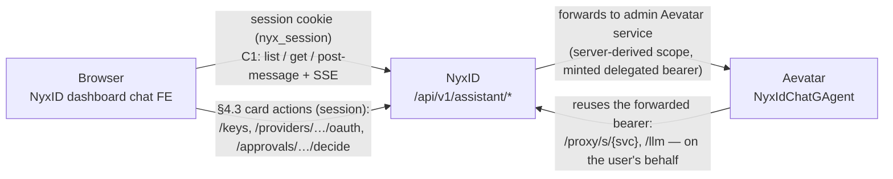

# CHAT_SPEC — How the NyxID Assistant Chat is set up

**Status:** authoritative setup + architecture reference (2026-07-18).
**Scope:** how the dashboard chat page connects to Aevatar through NyxID, which
NyxID subsystems it reuses, the exact request/token flow, the required service
configuration, and the verified evidence. The cut-by-cut change history lives in
`CHAT_ASSISTANT_SPECS.md`; this file is the stable "how it works" picture.

Audience: a NyxID engineer who needs to understand, operate, or extend the
assistant without re-deriving it from the diffs.

---

## 1. The three planes (what talks to what)



- **Assistant plane** — the chat UI. The browser only ever talks to NyxID's own
  `/api/v1/assistant/*` mount with its `nyx_session` cookie. It never names an
  Aevatar scope and never reaches Aevatar directly.
- **Connection plane** — existing NyxID core (credential broker, proxy, LLM
  gateway, catalog, approvals, nodes). The assistant reuses it unchanged; it is
  not a special case in the data plane.
- **Aevatar** — owns the chat backend: conversation storage, the agent loop,
  model choice, tool orchestration, and the AG-UI event stream. NyxID does not
  store chat content.

The load-bearing rule: **chat content flows Browser↔Aevatar (through NyxID);
credential/management actions flow Browser↔NyxID (session).** Aevatar talks only
to NyxID's data plane (`/proxy`, `/llm`), never to NyxID's human-only management
APIs. See §5 for why that boundary is exactly the delegated-token boundary.

---

## 2. The `/api/v1/assistant/*` mount (NyxID side)

Files: `backend/src/handlers/assistant.rs`, `backend/src/services/assistant_service.rs`,
routes in `backend/src/routes.rs` (mounted in the **human-only** router:
`reject_api_key_tokens` + `reject_delegated_tokens` + `reject_relay_tokens` +
`reject_service_account_tokens` — only a real human session or a first-party
access token reaches it).

Every route is an **explicit 1:1 mapping** onto one Aevatar path (a blanket
`/{*path}` would expose all ~248 Aevatar routes through a session-authed mount).
The scope segment in the upstream path is always derived server-side from the
verified `AuthUser.user_id` — the browser cannot address another user's scope.

| Browser call | Upstream Aevatar path | Notes |
|---|---|---|
| `POST /assistant/conversations` | `api/scopes/{uid}/nyxid-chat/conversations` | create actor (202 + `actorId`), then polls the actor index until it materializes |
| `GET /assistant/conversations` | `api/scopes/{uid}/chat-history` | Chat History index (server titles/timestamps/counts) |
| `GET /assistant/conversations/{id}` | `api/scopes/{uid}/chat-history/conversations/{id}` | transcript; `[]` means empty/deleted, never an error |
| `DELETE /assistant/conversations/{id}` | actor delete **+** history-row delete | composite, 404-tolerant on each side |
| `POST /assistant/conversations/{id}/stream` | `…/nyxid-chat/conversations/{id}:stream` | AG-UI SSE turn, streamed unbuffered |
| `POST /assistant/conversations/{id}/approve` | `…:approve` | approval decision (SSE response) |
| `POST /assistant/completions` | `v1/chat/completions` | OpenAI-compatible (retained, unused by the UI) |
| `POST /assistant/workflow-chat` | `api/chat` | ad-hoc workflow chat (retained, unused by the UI) |
| `GET /assistant/workflow-chat/ws` | `api/ws/chat` | WS twin (retained, unused by the UI) |

All routes funnel through one function — `assistant::forward` — which resolves
the admin Aevatar service and calls `proxy::execute_proxy`. Because forwarding
goes through `execute_proxy`, the assistant inherits **credential injection,
identity propagation, per-agent rate limiting, approval gating, and audit**
with no bespoke data-plane code.

### Admin-managed resolution (why it works for everyone)

`assistant_service::resolve_admin_service` reads the admin catalog
(`downstream_services`) for the `aevatar` slug directly, and addresses it **by
id** in `execute_proxy`. It never routes by slug, because the slug resolver
would prefer a *caller-owned* `UserService` — the assistant would then work only
for people who had personally connected Aevatar. The row must have
`requires_user_credential = false` so it can back a platform surface with its
master credential.

---

## 3. Why the browser can't just forward a token (the core problem)

NyxID dashboard sessions authenticate with an **opaque HttpOnly `nyx_session`
cookie**. The browser JS never holds a JWT (by design — no token in
`localStorage`, no XSS token-theft surface). So when the assistant mount forwards
a request to Aevatar, there is **no caller bearer** to forward.

Aevatar's currently deployed validator authenticates every call by a
**`Authorization: Bearer <NyxID JWT>`** and, for its own callbacks into NyxID,
**reuses that same inbound bearer**. So a cookie session with no bearer means:
Aevatar answers 401 at the chat entry, or (once entry is fixed) Aevatar's
callback to NyxID's LLM gateway answers 401. Both were observed in prod.

The end-state design (TD-3) is for Aevatar to validate a proxy-injected
`X-NyxID-Identity-Token` and use a proxy-injected `X-NyxID-Delegation-Token` —
but that Aevatar-side change has not shipped. Until it does, NyxID must speak the
validator's current dialect: put a usable NyxID bearer in `Authorization`.

---

## 4. The token NyxID mints for cookie sessions (the bridge)

`assistant::forward`, when `AuthUser.auth_method == Session` **and** the aevatar
row has `forward_access_token == true`, mints a **standard delegated access
token** and overwrites `Authorization` before `execute_proxy`:

```
generate_delegated_access_token(
    user_id = session user,
    scope   = resolve_forward_scope(aevatar_row),   // see §6
    actor   = aevatar_row.slug,                      // act.sub = "aevatar"
    ttl     = MCP_DELEGATION_TOKEN_TTL_SECS (300s),
    restrictions = TokenRestrictionClaims::from_auth_user(session),
)
```

This is **not a new token type** — it is the exact same factory, TTL, actor
convention, and restriction shape the standard `inject_delegation_token` proxy
path uses (`handlers/proxy.rs`). The only deviation from the platform standard is
the **delivery header**: it rides in `Authorization` (which Aevatar reuses)
instead of `X-NyxID-Delegation-Token`. That deviation is the irreducible
compatibility requirement and is retired by the TD-3 row flip (§6).

Bearer callers (CLI login JWTs, service integrations) never enter this branch —
their own token is forwarded byte-for-byte.

### Where this sits in the platform token-standard family

NyxID already has a family of short-lived, purpose-scoped tokens delivered to
downstreams (`docs/API.md`, `docs/DEVELOPER_GUIDE.md`):

| Token | Header | Audience | NyxID re-entry | Boundary mechanism |
|---|---|---|---|---|
| Identity assertion | `X-NyxID-Identity-Token` | per-service URN | rejected | distinct claims struct + audience |
| Delegation token | `X-NyxID-Delegation-Token` | NyxID | delegated surfaces only | `delegated:true` + `reject_delegated_tokens` |
| Relay token | `X-NyxID-User-Token` | NyxID | proxy/LLM only | `relay:true` + `reject_relay_tokens` |
| **Assistant bridge** | `Authorization` (transitional) | NyxID | **delegated surfaces only** | `delegated:true` + `reject_delegated_tokens` |

The assistant bridge **is** the delegation-token standard, just delivered in a
different header for one deployment window.

---

## 5. The security boundary (delegated = data plane only)

Because the minted token carries `delegated: true`, NyxID's routers enforce:

- **Accepted** on `api_v1_delegated`: `/llm`, `/proxy/s/{slug}` (+ `{*path}`),
  `/proxy/{id}`, `/proxy/services`, `/delegation/refresh`, approval-status
  polling, channel relay/events. This is exactly the **data plane** Aevatar
  needs to act on the user's behalf.
- **Rejected (403)** on the human-only and shared routers via
  `reject_delegated_tokens`: `/users/*`, `/api-keys`, `/keys`, `/user-services`,
  `/catalog`, `/providers`, `/connections`, `/nodes`, admin, org — every
  account-management, credential, and admin surface.

So a copy of the forwarded token leaked from Aevatar can call the proxy/LLM data
plane as the user for ≤5 minutes, but **cannot touch account management, keys, or
admin**. That is strictly safer than the plain full-access token that CLI/Bearer
callers already forward and prod already trusts.

**This boundary is the same one the PRD draws:** Aevatar uses the data plane;
management/card actions are the browser's job (session-authed, §4.3 of
`CHAT_ASSISTANT_SPECS.md`). An Aevatar agent tool that needs to *read* management
data must therefore either use a delegated-safe endpoint (e.g. `/proxy/services`
for service discovery, which is delegated-accepted) or have the browser supply
it. See §8 (open item) for the one place this needs confirmation.

---

## 6. Required service configuration (the `aevatar` catalog row)

The assistant is driven entirely by the admin `downstream_services` row for
`aevatar`. Operative fields:

| Field | Value | Why |
|---|---|---|
| `slug` | `aevatar` | resolved by `resolve_admin_service` |
| `is_active` | `true` | else `resolve_admin_service` → Internal |
| `service_category` | `internal` | platform surface |
| `requires_user_credential` | `false` | master credential backs all callers |
| `base_url` | prod Aevatar | upstream |
| `forward_access_token` | `true` | **the bridge gate** — while true, cookie sessions get a minted delegated bearer in `Authorization`. Flipping to `false` retires the bridge with no code change. |
| `identity_propagation_mode` | `jwt` | NyxID also sends `X-NyxID-Identity-Token` (harmless today; Aevatar ignores it until TD-3) |
| `delegation_token_scope` | `proxy` **recommended** | scope of the minted token. See below. |

### Scope sourcing — SSOT with a resilience floor

`resolve_forward_scope(row)`:

1. If `row.delegation_token_scope` grants REST-proxy (`proxy` / `proxy:*`), use
   it verbatim — single source of truth with the standard delegation path.
2. Otherwise (the historical `llm:proxy` default, which cannot reach
   `/proxy/s/{slug}`), **fall back to `proxy` and log a warning**. The minimum
   capability is dictated by the integration (Aevatar's LLM callback is a REST
   proxy passthrough enforcing `ensure_rest_proxy_access`), not a free per-row
   choice, so this is a resilience floor — the assistant works on deploy without
   a coupled DB change instead of 500-ing the whole surface over one field.

**Operational recommendation:** set `delegation_token_scope: "proxy"` on the
prod row to silence the warning and keep the `Authorization` token
capability-aligned with the future `X-NyxID-Delegation-Token`.

### TD-3 cutover (retiring the bridge)

When Aevatar ships identity-token validation, make it ONE atomic row update:
`forward_access_token: false`, `inject_delegation_token: true`,
`delegation_token_scope: "proxy"`. After `forward_access_token: false` the bridge
stops minting and NyxID's standard injection delivers `X-NyxID-Delegation-Token`
+ `X-NyxID-Identity-Token`. The runbook must read the row back and smoke-test one
LLM callback before declaring cutover complete (an unchanged `llm:proxy` would
then 403 the callback, because the standard path passes the raw row scope through).

---

## 7. Verified behavior (evidence, 2026-07-18)

**Real prod Aevatar, real answer, real service invocation (Bearer path).**
Through prod NyxID (`nyx-api.chrono-ai.fun`) with a first-party access token:
list → create → stream returned `RUN_STARTED`, a real multi-paragraph answer
enumerating the account's actual services (OpenRouter, OpenAI, Anthropic, Chrono
LLM, Lark, Discord, Tavily, Twitter, PostHog…), **two `TOOL_CALL_START` frames**
(`use_skill`, `nyxid_services` — Aevatar actually invoked tools), `USAGE`, and
`RUN_FINISHED` with **zero `RUN_ERROR`**. This proves the Aevatar integration,
the NyxID proxy path, and the LLM-callback leg all deliver quality end-to-end
when a usable NyxID bearer is forwarded.

**Cookie/bridge path (delegated token), local full-flow E2E** against a mock
Aevatar that replays the forwarded bearer into a seeded `chrono-llm-public` (→
mock LLM), with the aevatar row at the prod-default `llm:proxy` (so the fallback
is exercised): list `200` → create → stream `RUN_FINISHED` + LLM-callback `200`
→ history `200` → composite delete `200`. Security proven: the same token is
`403` at `/users/me`, `/api-keys`, `/connections`; `forward_access_token:false`
suppresses the mint; a `proxy:*` row reaches `claims.scope` verbatim.

**Root-cause confirmation from the earlier failed prod conversation:** the turns
failed with `LLM request failed` — the LLM-callback leg — exactly what the
delegated-token fix addresses. A prior "bridge chat ok" turn succeeded.

---

## 8. Known gaps (recorded, none blocks basic Q&A chat)

Enumerated in full in `CHAT_ASSISTANT_SPECS.md` cut 5 (G1–G7). The load-bearing
ones for chat quality:

- **Service-discovery tool on the delegated path (needs confirmation).** Aevatar
  invokes an agent tool `nyxid_services`. If it backs onto a **delegated-safe**
  NyxID endpoint (`GET /proxy/services`, which the delegated token reaches), the
  browser path matches the Bearer path exactly. If it backs onto a **human-only**
  endpoint (`/user-services`, `/catalog`), the delegated token 403s there and the
  suggestion list degrades on the browser path even though direct service
  invocation (`/proxy/s/*`) and the LLM still work. **Resolution:** either
  confirm with the Aevatar team which endpoint each `nyxid_*` tool calls, or test
  the cookie path live after deploy. Direct service *invocation* is unaffected —
  it is all data-plane.
- **In-chat approval rendering (frontend, TD-7).** The AG-UI normalizer renders
  text/`RUN_ERROR`/`RUN_FINISHED` only; approval/authorization/tool frames are
  dropped, and `decideApproval` JSON-parses an SSE response. Basic Q&A renders;
  approval *cards* do not yet. Only bites on a NyxID-gated write.
- **Caller-state isolation (TD-1)**, **node-routed WS bearer (G3)**,
  **long-run refresh > 5 min (G4)**, **workflow resume (TD-10)**, **SSE 60s idle
  (G6)** — see cut 5.

---

## 9. Key files

```
backend/src/handlers/assistant.rs      # the mount, forward(), resolve_forward_scope, build_forward_authorization
backend/src/services/assistant_service.rs  # admin-service resolution, upstream path builders
backend/src/crypto/jwt.rs              # generate_delegated_access_token, verify_token
backend/src/mw/auth.rs                 # AuthMethod, PROXY_SCOPE, scope_allows_rest_proxy, reject_delegated_tokens
backend/src/routes.rs                  # api_v1_delegated vs human-only routers (the security boundary)
frontend/src/lib/assistant/aevatar-transport.ts  # AG-UI → TurnEvent, SSE, the FE transport
docs/CHAT_ASSISTANT_SPECS.md           # cut-by-cut change history + full gap list
docs/API.md, docs/DEVELOPER_GUIDE.md   # the platform token-standard family
```
