# NyxID Encryption Architecture

This document describes NyxID's encryption architecture from its current implementation through the planned evolution to KMS integration, and Bring Your Own Key (BYOK) support.

---

## Table of Contents

- [Current Architecture (Phase 4)](#current-architecture-phase-4)
- [Encryption Roadmap](#encryption-roadmap)
- [Phase 2: Envelope Encryption](#phase-2-envelope-encryption-completed)
- [Phase 3: KeyProvider Abstraction](#phase-3-keyprovider-abstraction-completed)
- [Phase 4: Cloud KMS Integration](#phase-4-cloud-kms-integration-completed)
- [Phase 5: Per-Tenant Key Isolation](#phase-5-per-tenant-key-isolation)
- [Phase 6: Bring Your Own Key (BYOK)](#phase-6-bring-your-own-key-byok)
- [BYOK Deep Dive](#byok-deep-dive)
- [Crypto-Shredding: What Happens When a Key Is Deleted](#crypto-shredding-what-happens-when-a-key-is-deleted)
- [Comparison: Key Management Approaches](#comparison-key-management-approaches)
- [References](#references)

---

## Current Architecture (Phase 4)

Phase 4 provides **Cloud KMS integration** on top of Phase 3's pluggable `KeyProvider` abstraction. The `KeyProvider` trait is now async (via `async-trait`) to support KMS network I/O, and two new providers -- `AwsKmsProvider` and `GcpKmsProvider` -- are available behind feature flags. A **fallback provider** mechanism enables zero-downtime migration from the local provider to a KMS backend.

### Key Hierarchy (Phase 4)

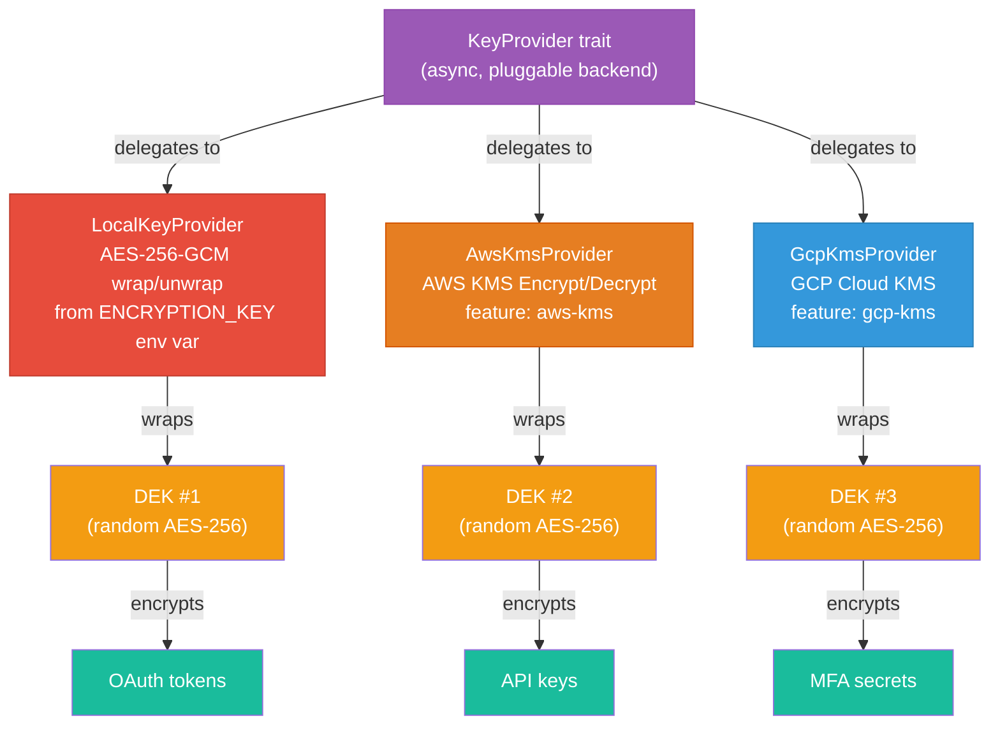

### Ciphertext Formats

```
v0 (legacy):   [nonce: 12B] [ciphertext] [tag: 16B]

v1 (Phase 1):  [0x01] [key_id: 1B] [nonce: 12B] [ciphertext] [tag: 16B]
                 ^        ^
                 |        +-- SHA-256(key)[0] -- stable identifier
                 +-- version byte

v2 (CURRENT):  [0x02] [kek_id: 1B] [wrapped_dek_len: 2B BE] [wrapped_dek: NB] [data_nonce: 12B] [data_ciphertext] [data_tag: 16B]
                 ^        ^               ^                        ^
                 |        |               |                        +-- provider-defined wrapped DEK blob
                 |        |               +-- big-endian u16; max 1024 (MAX_WRAPPED_DEK_SIZE)
                 |        +-- provider-defined stable key id (SHA-256 of key material or identifier)
                 +-- version byte (envelope encryption)
```

Total overhead: v0 = 28 bytes, v1 = 30 bytes, v2 = 32 + wrapped_dek_len bytes.

| Provider | Wrapped DEK Size | v2 Overhead per Record |
|----------|-----------------|----------------------|
| `LocalKeyProvider` | 60 bytes | 92 bytes |
| `AwsKmsProvider` | ~170-200 bytes | ~202-232 bytes |
| `GcpKmsProvider` | Variable | Variable |

Maximum wrapped DEK size: 1024 bytes (enforced in both encrypt and decrypt paths).

### Decrypt Fallback Chain

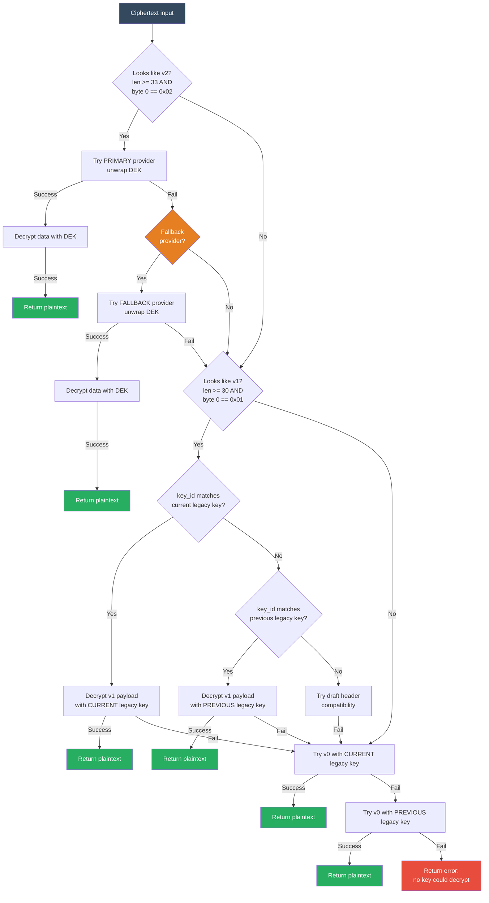

### What Gets Encrypted

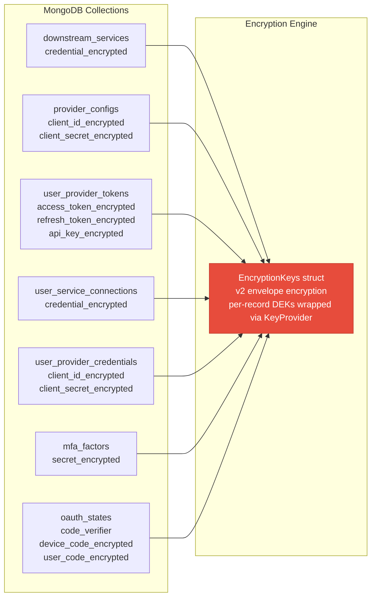

### Remaining Limitations (Phase 4)

- Single platform-wide KEK -- all tenants share one KEK
- Only one previous KEK supported at a time per provider
- No DEK caching (each encrypt/decrypt calls the provider)
- SDK-internal plaintext DEK copies are not zeroized (accepted limitation of external SDKs)

Phase 4 resolved these former Phase 3 limitations:
- ~~Only `LocalKeyProvider` implemented~~ -- AWS KMS and GCP Cloud KMS providers now available
- ~~No cloud KMS integration~~ -- `AwsKmsProvider` and `GcpKmsProvider` behind feature flags
- ~~KEK lives in app process memory~~ -- KMS providers never expose KEK material to the application

Phase 3 resolved these former Phase 2 limitations:
- ~~KEK wrap/unwrap hardcoded in `aes.rs`~~ -- now delegated to a `KeyProvider` trait, backend is pluggable
- ~~No abstraction for KMS migration~~ -- adding a new KMS backend is a single trait implementation + config change

Phase 2 resolved these former Phase 1 limitations:
- ~~No envelope encryption~~ -- per-record DEKs now isolate each encrypted field
- ~~Master key directly touches all data~~ -- KEK only wraps DEKs, never touches plaintext
- ~~Full re-encryption on key rotation~~ -- `rewrap()` re-wraps only the 60-byte DEK blob per record

---

## Encryption Roadmap

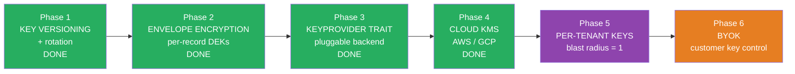

---

## Phase 2: Envelope Encryption (COMPLETED)

Envelope encryption introduces a two-tier key hierarchy: a Key Encryption Key (KEK) wraps per-record Data Encryption Keys (DEKs). This phase is fully implemented in `backend/src/crypto/aes.rs`.

### Architecture

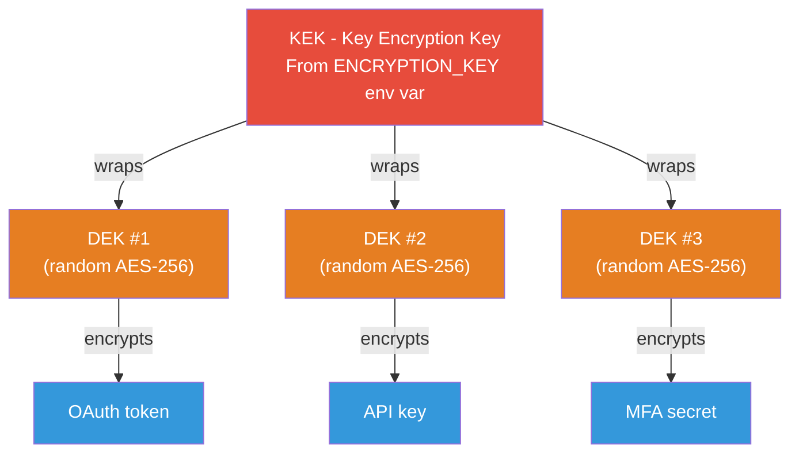

### v2 Encrypt Flow

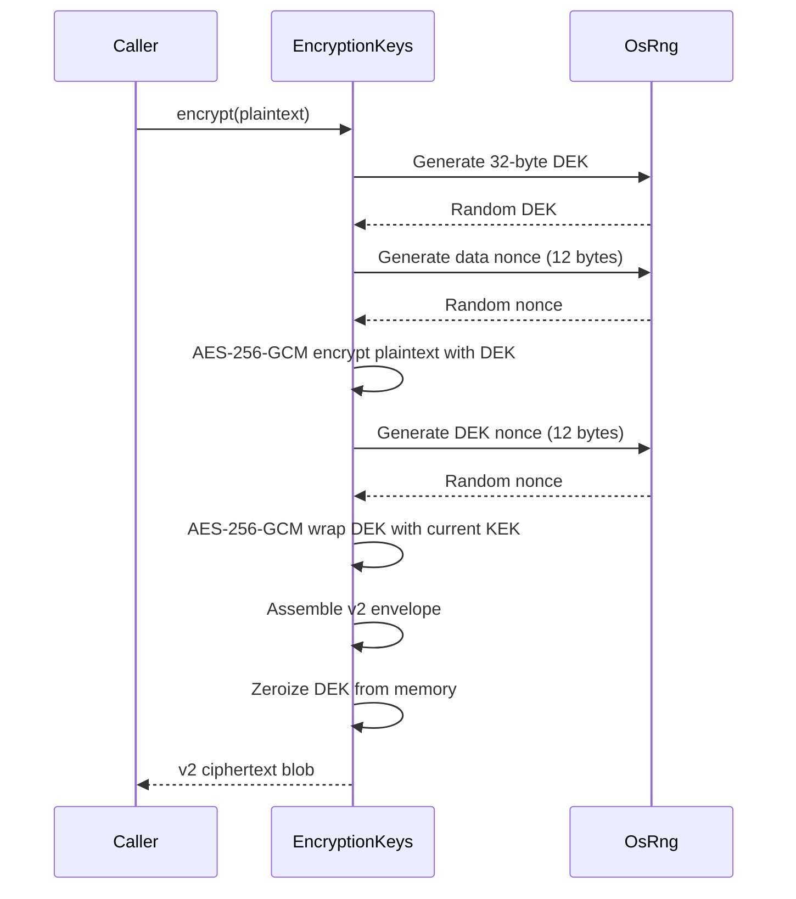

### v2 Decrypt Flow

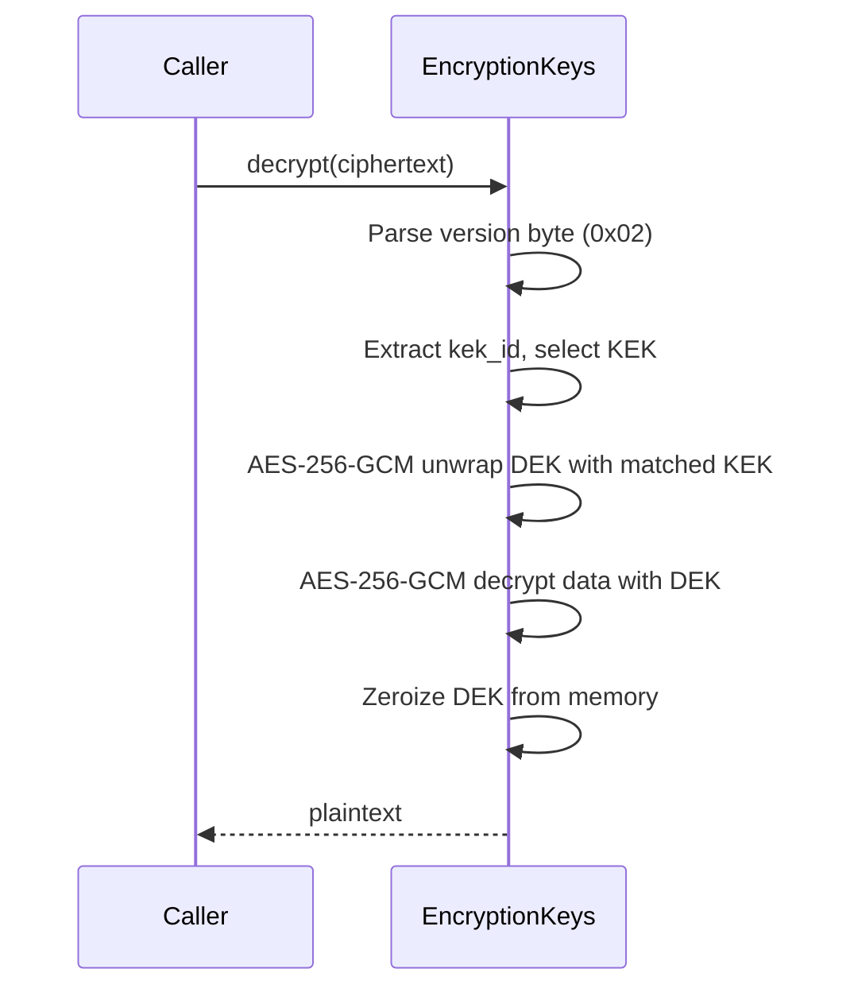

### Rewrap Flow (KEK Rotation Optimization)

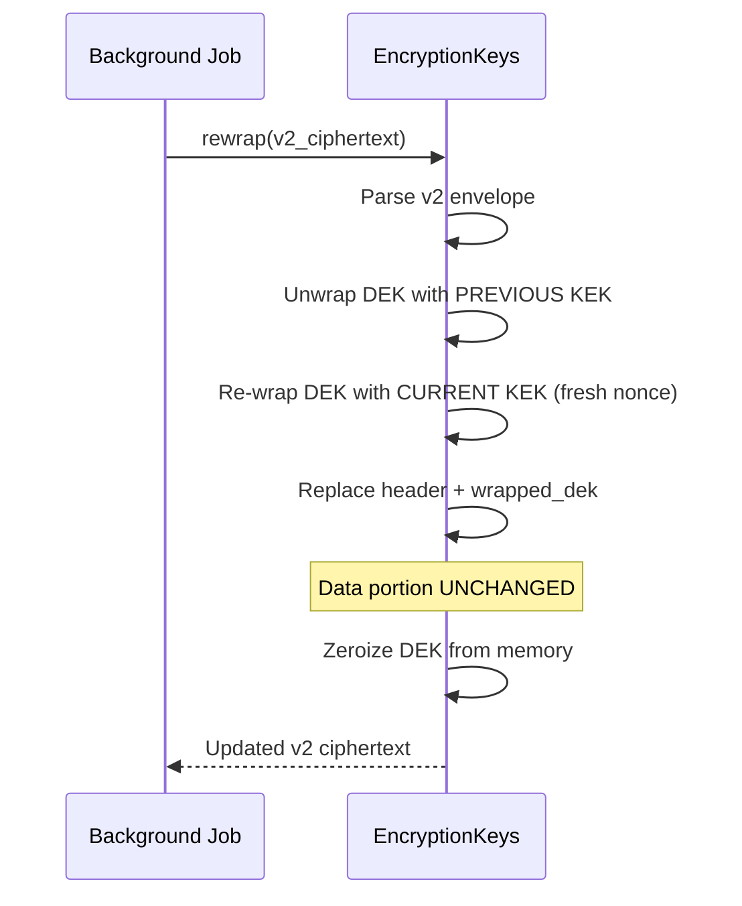

The `rewrap()` method re-wraps only the 60-byte DEK blob per record. For 1M records, this takes ~1 second (vs minutes/hours for full re-encryption).

### Storage Format per Record

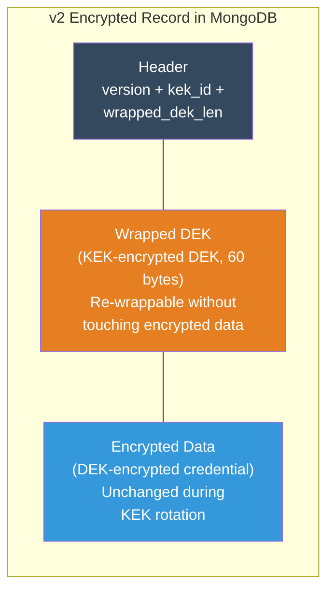

### Why This Matters for Key Rotation

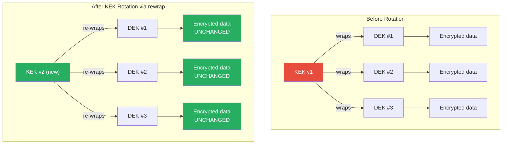

Only the small DEK blobs need re-wrapping, not the actual data. With 1M records, you re-wrap 1M x 60-byte wrapped DEKs (~1 second), not 1M x (variable) credentials.

### Implementation Details

- **Change scope**: Entirely contained in `backend/src/crypto/aes.rs` -- zero changes to models, services, handlers, or config
- **Public API**: `encrypt()`, `decrypt()`, `from_config()`, `has_previous()`, `decrypt_stats()` signatures unchanged; `rewrap()` added as new public method
- **Backward compatibility**: v0 (legacy) and v1 (Phase 1) ciphertexts remain fully decryptable via the fallback chain
- **DEK security**: Each DEK is held in `Zeroizing<[u8; 32]>`, which overwrites memory on drop
- **Nonce separation**: DEK-wrapping nonce and data-encryption nonce are independently random, serving different AES-256-GCM instances with different keys
- **No new dependencies**: Uses existing `aes-gcm`, `rand`, `zeroize`, `sha2` crates

---

## Phase 3: KeyProvider Abstraction (COMPLETED)

A `KeyProvider` trait abstracts the KEK operations, making the encryption backend pluggable. This phase is fully implemented across `backend/src/crypto/key_provider.rs`, `backend/src/crypto/local_key_provider.rs`, and updated wiring in `backend/src/crypto/aes.rs` and `backend/src/main.rs`.

```rust
pub struct WrappedKey {
    pub key_id: u8,
    pub ciphertext: Zeroizing<Vec<u8>>,  // defense-in-depth zeroization
}

#[async_trait]
pub trait KeyProvider: Send + Sync + std::fmt::Debug {
    /// Wrap (encrypt) a plaintext DEK with the current KEK.
    async fn wrap_dek(&self, plaintext_dek: &[u8]) -> Result<WrappedKey, AppError>;

    /// Unwrap (decrypt) a previously wrapped DEK.
    async fn unwrap_dek(&self, wrapped: &WrappedKey) -> Result<Zeroizing<Vec<u8>>, AppError>;

    /// Stable identifier stored in the ciphertext header for the active KEK.
    fn current_key_id(&self) -> u8;

    /// Whether this provider recognizes the given header key id.
    fn has_key_id(&self, key_id: u8) -> bool;

    /// Whether a previous key is available for unwrapping.
    fn has_previous_key(&self) -> bool;
}
```

### Implementations

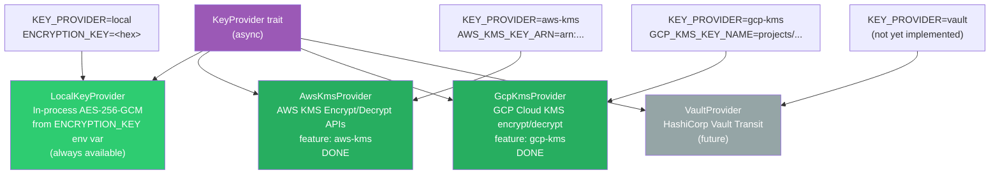

### Switching Between Providers

Switching the encryption engine requires only config changes -- no modifications to `EncryptionKeys`, service code, or handlers. The provider is constructed at startup and the rest of the encryption pipeline continues to call `encrypt()` / `decrypt()` / `rewrap()` unchanged.

```bash
# Before (local)
ENCRYPTION_KEY=abcdef...
KEY_PROVIDER=local

# After (AWS KMS -- migration mode with local fallback)
KEY_PROVIDER=aws-kms
AWS_KMS_KEY_ARN=arn:aws:kms:us-east-1:123456:key/abc-def-123
ENCRYPTION_KEY=abcdef...   # kept for fallback until rewrap completes
```

The app reads the config, instantiates the right `KeyProvider` (with optional fallback), and all existing code that calls `encryption_keys.encrypt()`/`decrypt()` works identically. See [KMS Migration Guide](KMS_MIGRATION_GUIDE.md) for detailed procedures.

### Provider Initialization Flow

```mermaid
sequenceDiagram
    participant M as main.rs
    participant C as AppConfig
    participant KP as KeyProvider
    participant EK as EncryptionKeys

    M->>C: from_env()
    C-->>M: config (with key_provider field)

    M->>C: validate_key_provider()
    Note over C: Panics if unsupported provider<br/>or missing required config

    alt KEY_PROVIDER=local
        M->>KP: LocalKeyProvider::from_config(&config)
        Note over KP: Parses ENCRYPTION_KEY hex<br/>Wraps in Zeroizing<[u8; 32]>
    else KEY_PROVIDER=aws-kms
        M->>KP: AwsKmsProvider::from_config(&config).await
        Note over KP: Loads AWS SDK config<br/>Creates KMS client
    else KEY_PROVIDER=gcp-kms
        M->>KP: GcpKmsProvider::from_config(&config).await
        Note over KP: Loads GCP ADC<br/>Creates Cloud KMS client
    end

    opt ENCRYPTION_KEY set AND provider != local
        M->>M: Create LocalKeyProvider as fallback
        M->>M: Cross-provider key_id collision check
        Note over M: Panics on 1-in-256 collision
    end

    M->>EK: EncryptionKeys::with_provider_and_fallback(provider, fallback)
    Note over EK: Stores Arc&lt;dyn KeyProvider&gt;<br/>+ optional fallback provider

    opt ENCRYPTION_KEY set
        M->>EK: set_legacy(LegacyKeys::from_config(&config))
        Note over EK: Enables v0/v1 decrypt fallback
    end
```

### Implementation Details

- **Change scope**: Three new/modified files: `crypto/key_provider.rs` (trait + `WrappedKey` struct), `crypto/local_key_provider.rs` (env-var-based impl), `crypto/aes.rs` (delegates to provider via `EncryptionKeys::with_provider()`), `main.rs` (provider construction + dispatch), `config.rs` (`key_provider` field + `validate_key_provider()`)
- **Public API**: `encrypt()`, `decrypt()`, `rewrap()`, `has_previous()`, `decrypt_stats()` are now async. `EncryptionKeys::with_provider_and_fallback()` is the provider-agnostic constructor with optional fallback; `from_config()` remains as the local env-var convenience path with legacy v0/v1 fallback
- **Backward compatibility**: `EncryptionKeys::from_config()` keeps v0, v1, and v2 ciphertexts fully decryptable for local env-var deployments. KMS providers + fallback handle the migration path
- **Config**: `KEY_PROVIDER` env var (default: `"local"`). `ENCRYPTION_KEY` / `ENCRYPTION_KEY_PREVIOUS` are required only for `KEY_PROVIDER=local`. KMS providers require their respective key identifier env vars.
- **Security**: `LocalKeyProvider` stores key material in `Zeroizing<[u8; 32]>`. KMS providers redact key ARNs/names in `Debug` output. `WrappedKey.ciphertext` is `Zeroizing<Vec<u8>>` for defense-in-depth. The trait is `Send + Sync + Debug` to support `Arc<dyn KeyProvider>` in `AppState`
- **Dependencies**: `async-trait` (always-on for the trait). `aws-config` + `aws-sdk-kms` behind `aws-kms` feature. `google-cloud-kms` behind `gcp-kms` feature
- **Testing**: `local_key_provider.rs` includes unit tests for roundtrip wrap/unwrap, nonce uniqueness, previous-key unwrap, key ID flags, debug redaction, config construction, same-key no-op rotation handling, and wrapped DEK size assertions. `aes.rs` includes 50+ tests covering v0/v1/v2/fallback/rewrap paths. Both KMS providers have 9 tests each covering key ID derivation, has_key_id logic, and debug redaction

---

## Phase 4: Cloud KMS Integration (COMPLETED)

### Encrypt / Decrypt Flow with KMS

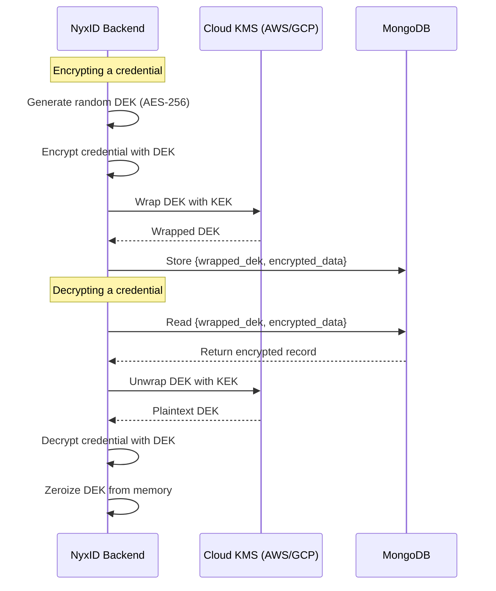

### Key Properties by Provider

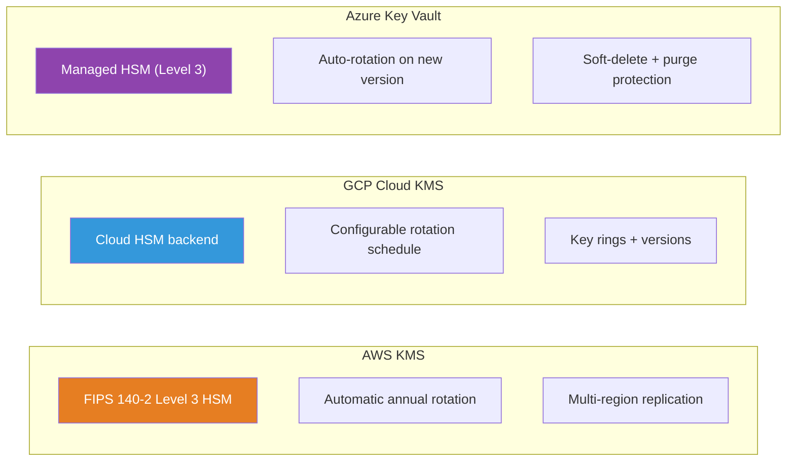

### Fallback Provider for Migration

During migration from local to KMS, `EncryptionKeys` supports a fallback provider:

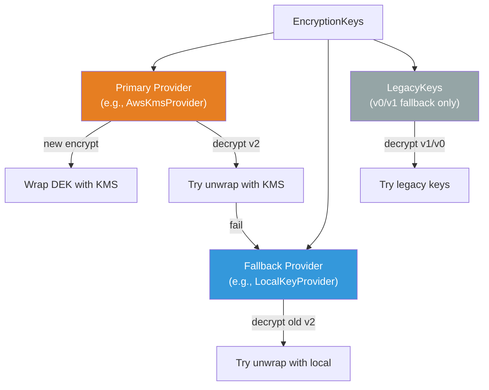

### Key Rotation with KMS (Timeline)

```mermaid
gantt
    title KEK Rotation Timeline (No Data Re-encryption)
    dateFormat X
    axisFormat %s

    section KEK Lifecycle
    KEK v1 active           :done, kek1, 0, 3
    Rotate: KEK v2 created  :milestone, rot, after kek1, 0
    KEK v2 active (new encryptions) :active, kek2, 3, 7
    v1 still valid for decrypt :done, kek1d, 3, 6

    section Background Job
    Re-wrap DEKs from v1 to v2 :crit, rewrap, 4, 6
    Disable v1 (optional)      :milestone, dis, after rewrap, 0
```

### Implementation Details

- **Change scope**: `crypto/key_provider.rs` (async trait via `async-trait`, shared `derive_key_id_from_str`), `crypto/aws_kms_provider.rs` (new), `crypto/gcp_kms_provider.rs` (new), `crypto/aes.rs` (async encrypt/decrypt/rewrap, fallback provider, `LegacyKeys`, `MAX_WRAPPED_DEK_SIZE`), `crypto/mod.rs` (feature-gated module exports), `config.rs` (4 new KMS config fields, updated validation), `main.rs` (provider dispatch, collision check, fallback construction), `Cargo.toml` (feature flags, optional KMS deps)
- **Public API**: `encrypt()`, `decrypt()`, `rewrap()` are now `async fn`. ~42 call sites across services/handlers updated with `.await`. `EncryptionKeys::with_provider_and_fallback()` is the new primary constructor
- **Backward compatibility**: All existing v0/v1/v2 ciphertexts remain fully decryptable. The fallback provider chain: primary -> fallback -> v1 legacy -> v0 legacy
- **Config**: `KEY_PROVIDER` supports `"local"`, `"aws-kms"`, `"gcp-kms"`. New env vars: `AWS_KMS_KEY_ARN`, `AWS_KMS_KEY_ARN_PREVIOUS`, `GCP_KMS_KEY_NAME`, `GCP_KMS_KEY_NAME_PREVIOUS`
- **Feature flags**: `aws-kms` = `aws-config` + `aws-sdk-kms`; `gcp-kms` = `google-cloud-kms`. Default build includes neither (local-only)
- **Security**: All Debug impls redact key identifiers. KMS error messages are sanitized (logged for diagnostics, generic message in error chain). `WrappedKey.ciphertext` zeroized on drop. Cross-provider key ID collision check at startup. `MAX_WRAPPED_DEK_SIZE = 1024` prevents oversized wrapped DEKs
- **Retry**: AWS SDK has built-in retry (3 attempts). GCP KMS uses manual retry (3 attempts, exponential backoff from 100ms)
- **Testing**: 50+ tests in `aes.rs` (v0/v1/v2/fallback/rewrap), 9 tests each for AWS and GCP providers (key ID derivation, has_key_id, debug redaction), 14 config tests. 515 tests total pass with `--all-features`

---

## Phase 5: Per-Tenant Key Isolation

Each tenant (organization) gets their own KEK, limiting the blast radius of a key compromise to a single tenant.

### Architecture

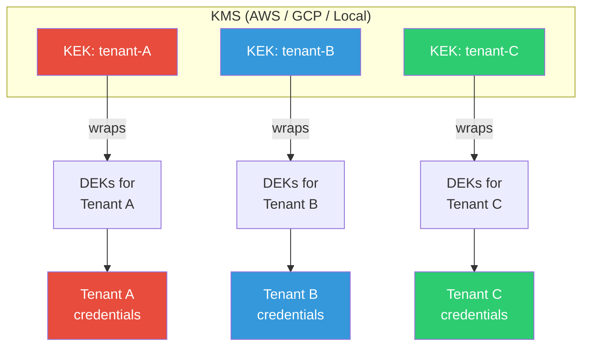

### Tenant Context Flow

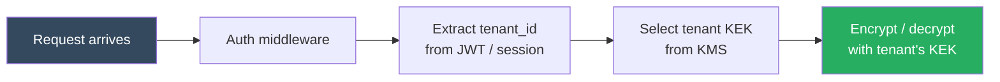

### Blast Radius Comparison

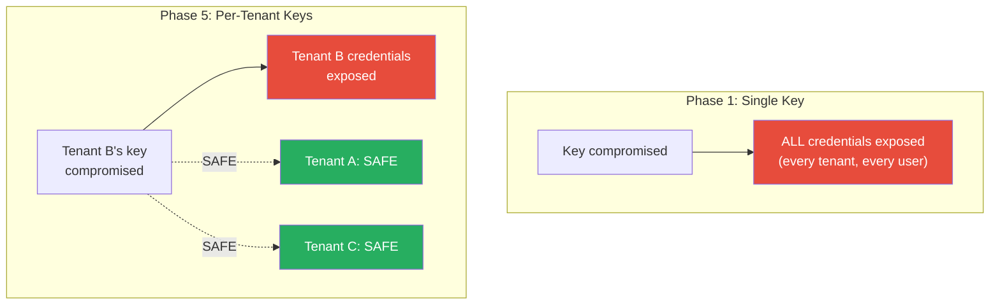

---

## Phase 6: Bring Your Own Key (BYOK)

BYOK allows enterprise customers to supply their own root encryption key, giving them cryptographic control over their data.

---

## BYOK Deep Dive

### What Is BYOK?

BYOK lets customers provide their own Key Encryption Key (KEK) instead of using NyxID's platform-managed KEK. The customer's KEK sits at the top of the encryption hierarchy and wraps all Data Encryption Keys for that customer's data.

### Key Hierarchy with BYOK

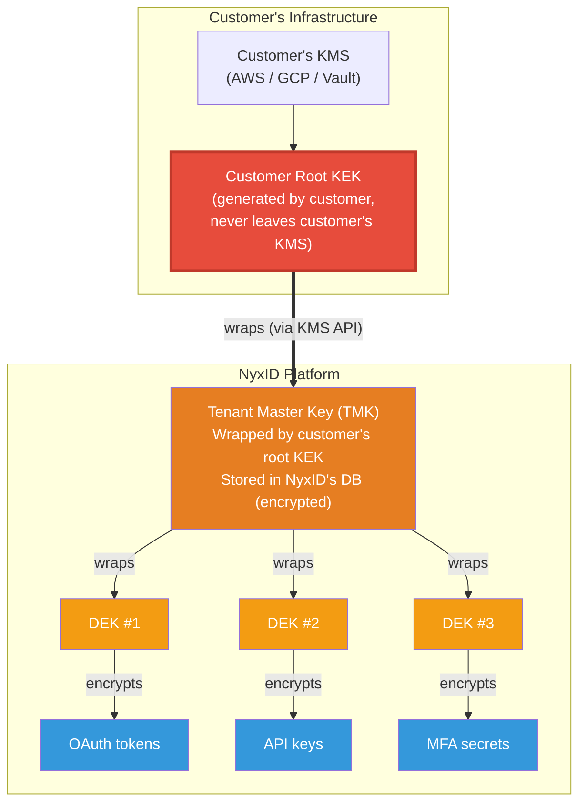

### BYOK Setup Flow

```mermaid
sequenceDiagram
    participant C as Customer
    participant N as NyxID Platform
    participant HSM as NyxID HSM

    C->>N: 1. Request BYOK setup for tenant
    N->>N: Generate RSA-3072 wrapping key pair
    N-->>C: 2. Return public wrapping key + key ID (kid)

    C->>C: 3. Generate AES-256 key in own KMS
    C->>C: 4. Wrap key with NyxID's public key<br/>(RSA-AES key wrap)

    C->>N: 5. Import wrapped key material
    N->>HSM: Store wrapped key in HSM
    HSM-->>N: Confirm stored

    N-->>C: 6. BYOK active for tenant

    Note over C,HSM: All new encryptions for this tenant<br/>now use the customer's KEK.<br/>Background job re-encrypts existing data.
```

### BYOK Runtime Encryption Flow

```mermaid
sequenceDiagram
    participant U as User
    participant N as NyxID Backend
    participant CKMS as Customer's KMS
    participant DB as MongoDB

    U->>N: Store OAuth token

    N->>N: Generate random DEK (AES-256)
    N->>N: Encrypt OAuth token with DEK

    N->>CKMS: Unwrap Tenant Master Key<br/>using customer's root KEK
    CKMS-->>N: Plaintext TMK

    N->>N: Wrap DEK with TMK
    N->>N: Zeroize TMK from memory

    N->>DB: Store wrapped_dek +<br/>encrypted_data +<br/>key_version_id

    N-->>U: Success
```

### BYOK Key Rotation

When a BYOK customer rotates their root KEK:

```mermaid
graph TD
    subgraph "Before Rotation"
        CK1["Customer Root KEK v1"]
        CK1 -->|wraps| TMK1["Tenant Master Key<br/>(wrapped by v1)"]
        TMK1 -->|wraps| DEKS1["DEK #1, #2, #3"]
        DEKS1 --> DATA1["Encrypted data"]
    end

    subgraph "After Rotation"
        CK2["Customer Root KEK v2 (new)"]
        CK2 -->|wraps| TMK2["Tenant Master Key<br/>(re-wrapped by v2)"]
        TMK2 -->|wraps| DEKS2["DEK #1, #2, #3<br/>UNCHANGED"]
        DEKS2 --> DATA2["Encrypted data<br/>UNCHANGED"]
    end

    style CK1 fill:#e74c3c,color:#fff
    style CK2 fill:#27ae60,color:#fff
    style DATA2 fill:#27ae60,color:#fff
    style DEKS2 fill:#27ae60,color:#fff
```

**Rotation steps:**

1. Customer creates new root KEK version in their KMS
2. Customer calls NyxID rekey endpoint
3. NyxID unwraps TMK with old KEK version (via KMS)
4. NyxID re-wraps TMK with new KEK version (via KMS)
5. Done. No data re-encryption needed.

### Standard vs BYOK Comparison

```mermaid
graph TD
    subgraph "Standard (NyxID-managed)"
        NK["NyxID Platform KEK<br/>(in NyxID's KMS/HSM)"]
        NK --> NTMK["Tenant Master Key"]
        NTMK --> NDEK["DEKs"]
        NDEK --> ND["Encrypted data"]
        NOTE1["NyxID controls root key<br/>NyxID CAN decrypt"]
    end

    subgraph "BYOK (Customer-managed)"
        CK["Customer's Root KEK<br/>(in customer's KMS/HSM)"]
        CK --> CTMK["Tenant Master Key"]
        CTMK --> CDEK["DEKs"]
        CDEK --> CD["Encrypted data"]
        NOTE2["Customer controls root key<br/>NyxID CANNOT decrypt<br/>without customer's KMS access"]
    end

    style NK fill:#3498db,color:#fff
    style CK fill:#e74c3c,color:#fff,stroke:#c0392b,stroke-width:3px
    style NOTE1 fill:#f0f0f0,color:#333,stroke:none
    style NOTE2 fill:#f0f0f0,color:#333,stroke:none
```

---

## Crypto-Shredding: What Happens When a Key Is Deleted

Crypto-shredding is the practice of destroying encryption keys instead of (or in addition to) deleting data. When the key is gone, the encrypted data becomes permanently inaccessible.

### How It Works

```mermaid
graph TD
    subgraph "Normal State"
        KEK_OK["Customer Root KEK<br/>(active)"]
        KEK_OK -->|unwraps| TMK_OK["TMK"]
        TMK_OK -->|unwraps| DEK_OK["DEKs"]
        DEK_OK -->|decrypts| DATA_OK["Data<br/>ACCESSIBLE"]
        style DATA_OK fill:#27ae60,color:#fff
    end

    subgraph "After Key Deletion"
        KEK_DEL["Customer Root KEK<br/>DELETED / REVOKED"]
        TMK_STUCK["TMK still exists<br/>but CANNOT be unwrapped"]
        DEK_STUCK["DEKs still exist<br/>but CANNOT be unwrapped"]
        DATA_DEAD["Encrypted data still in MongoDB<br/>PERMANENTLY INACCESSIBLE"]

        KEK_DEL -.->|X| TMK_STUCK
        TMK_STUCK -.->|X| DEK_STUCK
        DEK_STUCK -.->|X| DATA_DEAD

        style KEK_DEL fill:#e74c3c,color:#fff,stroke-width:3px
        style DATA_DEAD fill:#7f8c8d,color:#fff
        style TMK_STUCK fill:#95a5a6,color:#fff
        style DEK_STUCK fill:#95a5a6,color:#fff
    end
```

The data is cryptographically destroyed without deleting a single byte from the database.

### Deletion Timeline and Grace Periods

```mermaid
gantt
    title Key Deletion Grace Periods by Provider
    dateFormat X
    axisFormat %d days

    section AWS KMS
    Grace period (7-30 days)    :crit, aws_grace, 0, 30
    Permanent destruction       :milestone, aws_del, after aws_grace, 0

    section GCP Cloud KMS
    Grace period (7-90 days)    :crit, gcp_grace, 0, 90
    Permanent destruction       :milestone, gcp_del, after gcp_grace, 0

    section Azure Key Vault
    Soft-delete (7-90 days)     :crit, az_grace, 0, 90
    Purge required              :milestone, az_del, after az_grace, 0
```

During the grace period:
- Key CANNOT be used for encrypt/decrypt
- Customer CAN cancel deletion and restore the key
- NyxID returns errors for all operations on that tenant's data

After the grace period:
- Key is permanently destroyed
- No recovery possible
- Data is cryptographically shredded

### What NyxID Does When a BYOK Key Becomes Unavailable

```mermaid
flowchart TD
    A[User request arrives<br/>for BYOK tenant] --> B[NyxID attempts to unwrap TMK<br/>via customer's KMS]
    B --> C{KMS response?}

    C -->|ACCESS_DENIED<br/>or KEY_NOT_FOUND| D[Return 503<br/>Encryption key unavailable.<br/>Contact your organization admin.]
    C -->|Success| E[Proceed with<br/>encrypt / decrypt]

    D --> F[Log: tenant_id, error type,<br/>timestamp]
    F --> G[NO data deleted from MongoDB.<br/>Encrypted blobs remain intact.<br/>If customer restores key during<br/>grace period, everything works again.]

    style D fill:#e74c3c,color:#fff
    style E fill:#27ae60,color:#fff
    style G fill:#f39c12,color:#fff
```

### Crypto-Shredding vs Data Deletion

| Aspect | Traditional Deletion | Crypto-Shredding (BYOK) |
|--------|---------------------|------------------------|
| **Scope** | Must find ALL copies: primary DB, replicas, backups, logs, caches | Delete ONE key. All copies become useless simultaneously. |
| **Speed** | Hours to weeks (depending on volume and complexity) | Instant (key deletion triggers immediate inaccessibility) |
| **Risk** | Missed copies remain accessible | Accidental key deletion (mitigated by grace periods) |
| **Compliance** | Hard to prove all copies deleted | Provable: key destruction = data destruction (GDPR, HIPAA) |
| **Storage** | Data removed, storage freed | Encrypted blobs remain (occupy space until cleaned up) |
| **Reversibility** | Generally irreversible | Reversible during grace period (7-90 days) |

### BYOK Responsibilities

```mermaid
graph LR
    subgraph "Customer Manages"
        C1["Key generation<br/>(in their own KMS/HSM)"]
        C2["Key backup<br/>(KMS handles this)"]
        C3["Key rotation<br/>(initiate when needed)"]
        C4["Access control<br/>(who can manage the key)"]
        C5["Key deletion<br/>(irreversible after grace)"]
        C6["KMS availability<br/>(if KMS down, NyxID<br/>cannot decrypt)"]
    end

    subgraph "NyxID Manages"
        N1["Tenant Master Key lifecycle<br/>(wrapped by customer's KEK)"]
        N2["DEK generation<br/>(per-record)"]
        N3["Encrypt / decrypt<br/>(actual data operations)"]
        N4["TMK re-wrapping<br/>(during key rotation)"]
        N5["Graceful error handling<br/>(when key unavailable)"]
        N6["Audit logging<br/>(all key operations)"]
    end

    style C1 fill:#e74c3c,color:#fff
    style C5 fill:#e74c3c,color:#fff
    style N1 fill:#3498db,color:#fff
    style N3 fill:#3498db,color:#fff
```

---

## Comparison: Key Management Approaches

| Aspect | Phase 1-2 (Env var) | Phase 3 (KeyProvider trait) | Phase 4 (Current -- Cloud KMS) | Phase 5-6 (Per-tenant + BYOK) |
|--------|-------------------|------------------------------|---------------------|-------------------------------|
| **Key storage** | Env var (wraps DEKs) | Pluggable backend (`LocalKeyProvider` from env var) | HSM-backed via AWS KMS or GCP Cloud KMS (FIPS 140-2 Level 3) | Customer KMS/HSM |
| **Key rotation** | KEK rotation re-wraps DEKs via `rewrap()` | Same + pluggable providers | KMS auto-rotation (annual + on-demand) + cross-key rotation | Customer controlled |
| **Blast radius** | Per-record DEK isolation | Per-record DEK isolation | Per-record DEK + HSM protection | Per-tenant (isolated) |
| **Re-encrypt on rotate** | Only DEKs (60 bytes each) | Only DEKs (60 bytes for local) | Only DEKs (60-200 bytes per provider) | Only DEKs (small) |
| **Customer key control** | None | None | None | Full root key control + BYOK |
| **Crypto-shredding** | No | No | No (NyxID key) | Yes (customer deletes their key) |
| **KMS migration path** | Manual code changes | Config change only | Fallback provider for zero-downtime migration | Customer-managed KMS |
| **Async** | No | No | Yes (`async-trait`) | Yes |
| **Feature flags** | N/A | N/A | `aws-kms`, `gcp-kms` (optional deps) | N/A |
| **Complexity** | Medium | Medium | Medium | High |

---

## How Auth0 Does It (Reference Architecture)

Auth0's four-level key hierarchy serves as a reference for NyxID's target architecture:

```mermaid
graph TD
    L1["Level 1: Environment Root Key<br/>Default: Auth0-managed in HSM<br/>BYOK: customer-provided<br/>FIPS 140-2 Level 3 HSM<br/>Multi-region failover"]

    L2["Level 2: Tenant Master Key<br/>Unique per tenant<br/>Encrypted by Environment Root Key<br/>Rotatable via Rekey endpoint<br/>AES-256-GCM"]

    L3["Level 3: Namespace Keys<br/>Separate keys per data type<br/>Encrypted by Tenant Master Key<br/>Managed internally by Auth0<br/>AES-256-GCM"]

    L4["Level 4: Data Encryption Keys<br/>Fresh per encryption operation<br/>Encrypted by Namespace Key<br/>Stored alongside encrypted data<br/>AES-256-GCM"]

    L1 --> L2 --> L3 --> L4

    style L1 fill:#e74c3c,color:#fff,stroke:#c0392b,stroke-width:2px
    style L2 fill:#e67e22,color:#fff
    style L3 fill:#f39c12,color:#fff
    style L4 fill:#3498db,color:#fff
```

NyxID's target state (Phase 6) would implement a similar hierarchy, simplified to three levels (Root KEK -> Tenant Master Key -> DEKs) since namespace-level separation adds complexity without proportional security benefit for NyxID's use case.

---

## Zero-Trust Considerations

### HashiCorp Vault as Transit Engine

```mermaid
sequenceDiagram
    participant App as NyxID Backend
    participant Vault as HashiCorp Vault

    Note over Vault: Transit secrets engine<br/>Key NEVER leaves Vault

    App->>Vault: Authenticate (AppRole,<br/>short-lived credentials)
    Vault-->>App: Vault token (TTL: minutes)

    App->>Vault: POST /transit/encrypt/nyxid-kek<br/>{plaintext: base64(DEK)}
    Vault-->>App: {ciphertext: "vault:v1:..."}

    App->>Vault: POST /transit/decrypt/nyxid-kek<br/>{ciphertext: "vault:v1:..."}
    Vault-->>App: {plaintext: base64(DEK)}

    Note over App: NyxID never sees the KEK.<br/>Only wrapped DEKs flow through the app.
```

### Per-Request Authorization (Zero-Trust)

```mermaid
flowchart LR
    REQ[Request] --> AUTH{Valid auth?<br/>JWT / session / API key}
    AUTH -->|No| R1[Reject: 401]
    AUTH -->|Yes| TENANT{Tenant context<br/>matches data?}
    TENANT -->|No| R2[Reject: 403]
    TENANT -->|Yes| KMS{KMS authz<br/>allows operation?}
    KMS -->|No| R3[Reject: 403]
    KMS -->|Yes| RATE{Rate limit<br/>OK?}
    RATE -->|No| R4[Reject: 429]
    RATE -->|Yes| OP[Decrypt / Encrypt]

    style R1 fill:#e74c3c,color:#fff
    style R2 fill:#e74c3c,color:#fff
    style R3 fill:#e74c3c,color:#fff
    style R4 fill:#e74c3c,color:#fff
    style OP fill:#27ae60,color:#fff
```

Every decrypt request must pass through all four checks. Compromise of any single layer does not grant access.

---

## References

- [AWS KMS Envelope Encryption](https://docs.aws.amazon.com/kms/latest/developerguide/concepts.html#enveloping)
- [GCP Cloud KMS Envelope Encryption](https://cloud.google.com/kms/docs/envelope-encryption)
- [Auth0 Customer Managed Keys](https://auth0.com/docs/secure/highly-regulated-identity/customer-managed-keys)
- [IronCore Labs: Five Things SaaS Mess Up with BYOK](https://ironcorelabs.com/blog/2024/five-things-saas-mess-up-with-byok/)
- [Crypto-Shredding Explained](https://www.seald.io/blog/data-destruction-using-crypto-shredding)
- [AWS Multi-Tenant KMS Strategy](https://aws.amazon.com/blogs/architecture/simplify-multi-tenant-encryption-with-a-cost-conscious-aws-kms-key-strategy/)
- [Azure Managed HSM Technical Details](https://learn.microsoft.com/en-us/azure/key-vault/managed-hsm/managed-hsm-technical-details)
- [HashiCorp Vault Transit Engine](https://developer.hashicorp.com/vault/docs/secrets/transit)
