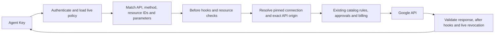

# Google API permission keys

NyxID's permission engine can constrain Google REST calls using owner-authored
operation rules. Drive folder containment remains a separate, stronger resource
adapter. Both use the same native key lifecycle, REST/MCP ingress, hooks,
approvals, billing, pause, and revocation checks.

This is a backend pilot, with deterministic tests and examples. It has not been
validated against live Google accounts. There is no permission editor UI or
dedicated CLI command yet.

## What the Agent Key looks like

The secret is an ordinary opaque Agent Key:

```text
nyxid_ag_<64 random hexadecimal characters>
```

The 32 random bytes are generated by the existing key service. Only the hash is
stored in the API key collection; the raw secret is returned once on creation.
The key has `purpose: permission_bound`, scope `proxy`, an expiry of at most
90 days, and one allowed personal connection. A server-side policy row keyed by
the API key ID binds its immutable permission rules and resolved credential
identity. Permission data and Google credentials are never encoded in the key.

An agent uses the secret with `Authorization: Bearer ...` or `X-API-Key` against
`/api/v1/permission-execution/rest/...` or
`POST /api/v1/permission-execution/mcp`. Ordinary proxy, MCP, management,
token-delivery, LLM and SSH routes reject these keys.



Effective access is the intersection of the upstream Google grant, NyxID's
catalog rules, the permission key's rules, and every configured hook. An allow
from a hook cannot override a denial from another layer.

## Service coverage

| Service | Example permission | Credential connection |
| --- | --- | --- |
| Drive | Read one file with an exact metadata field selection | Drive or Workspace OAuth |
| Gmail | List message IDs with a mandatory label filter and result cap | Gmail or Workspace OAuth |
| Calendar | List events from one calendar with a result cap | Calendar or Workspace OAuth |
| Docs | Read one document | Docs, Drive or Workspace OAuth |
| Sheets | Read one range; update bounded rows/columns with `RAW` input | Sheets, Drive or Workspace OAuth |
| Slides | Read one presentation | Slides, Drive or Workspace OAuth |
| Cloud Resource Manager | Read one project | Registered catalog connection with suitable Google OAuth scopes |
| YouTube | Read one video's metadata | Registered catalog connection with an appropriate API key or OAuth grant |
| Gemini | One model, text-only input, bounded input length and output tokens | Personal Google AI API key |

The evaluator is data-driven: additional Google REST APIs use the same operation
format and do not require a new generic adapter. It does **not** auto-register
Google services, add catalog operations, expand OAuth consent, or grant every
operation on a connected service. Workspace's existing OAuth scope limits and
catalog operation allowlists still apply. Other services need an appropriately
configured catalog connection and credential. APIs requiring additional auth
protocols or custom headers are outside this pilot.

One Workspace-bound key can cover all six Workspace products through its
configured destinations. A key still binds **one connection**; it cannot also
select an independent Cloud, YouTube, Gemini, or second-account connection.
Issue separate keys for those connections. This change does not add a
multi-connection key bundle.

## Policy format

Use the existing `POST /api/v1/permission-keys` API with a first-party human
session. Here is a complete policy granting read access to one calendar:

```json
{
  "name": "Team calendar reader",
  "user_service_id": "YOUR-PERSONAL-GOOGLE-CONNECTION-UUID",
  "expires_at": "2026-10-06T12:00:00Z",
  "policy": {
    "version": 1,
    "name": "Team calendar reader",
    "provider": "google",
    "resource": {
      "type": "google_api",
      "operations": [{
        "id": "calendar.events.list",
        "origin": "https://www.googleapis.com",
        "method": "GET",
        "path": "/calendar/v3/calendars/{calendar_id}/events",
        "path_parameters": {
          "calendar_id": {"type": "exact", "value": "team@example.com"}
        },
        "query_parameters": {
          "maxResults": {
            "required": true,
            "rule": {"type": "max_integer", "value": 50}
          }
        },
        "body": null
      }]
    },
    "allowed_operations": ["calendar.events.list"],
    "constraints": {},
    "hooks": []
  }
}
```

Choose a future expiry when trying the example. The returned key can call:

```sh
curl -H "Authorization: Bearer $NYXID_PERMISSION_KEY" \
  "$NYXID_URL/api/v1/permission-execution/rest/calendar/v3/calendars/team@example.com/events?maxResults=50"
```

The Google MCP tool is `google_request`. `tools/list` describes the policy's
allowed operations and their input rules. The tool accepts `method`, `path`,
optional string-valued `query`, and optional JSON `body`. It invokes the same
engine as REST. Drive folder policies retain their `drive_request` tool.

Complete fixtures are provided for
[Workspace](../permissions/examples/google-workspace-policy.json),
[Cloud](../permissions/examples/google-cloud-policy.json),
[YouTube](../permissions/examples/google-youtube-policy.json), and
[Gemini](../permissions/examples/google-gemini-policy.json). Replace fixture
resource IDs before issuance. Workspace fixtures include all six products and
a Sheets write with closed nested array rules.

### Operation and parameter rules

- `origin` is an exact HTTPS origin under `googleapis.com`, with no wildcard,
  port, userinfo, path, query or fragment. It must exist in the connection's
  pinned base URL or configured destination map. The final catalog-selected
  origin must match the operation's origin; the caller cannot select a host.
- `path` is relative to the pinned connection base URL. For example the Google
  AI base includes `/v1beta`, so its policy path starts with `/models/...`.
  Supported templates contain literal segments and single-segment variables,
  optionally followed by a literal custom method such as `:generateContent`.
- Every path variable needs an `exact` or `one_of` string rule. Wildcards,
  encoded paths, empty segments, traversal and ambiguous operation matches are
  denied. Query values support ordinary URL encoding; path literals currently
  require ASCII without percent escapes.
- Every accepted query parameter must be declared. Rules are `exact`,
  `one_of`, `max_integer`, and `max_length`; exact query values are strings.
  `required` prevents removing a filter to broaden a request. Authentication,
  method overrides, callback and NyxID routing parameters cannot be declared.
  `alt`, if declared, can only select JSON.
- `body: null` forbids a request body. A body schema requires a JSON body.
  Schema types are `object`, `array`, `string`, `integer`, `boolean`, `exact`,
  and `one_of`. Objects reject every undeclared property at every level.
  Arrays check each element and have a maximum length. Strings and integers
  require explicit bounds. Unknown schema keywords are rejected.
- The existing `constraints` field can further narrow declared query fields or
  body JSON Pointers. Native `response_markers` hooks, mandatory live-binding
  hooks, and pause/revocation apply equally to generic Google policies.

Supported authentication is server-held OAuth bearer, `x-goog-api-key` header,
or `key` query injection. Agent-supplied auth headers/query credentials are
never forwarded. The resolved credential ID, replacement epoch, base URL,
destination map, catalog operation policy, and injection configuration are
bound at issuance. OAuth refresh does not invalidate a key, while credential
replacement or execution configuration changes do. Nodes, platform/master
keys, pools, org connections, token exchange, identity forwarding, and custom
default headers remain unsupported.

## Resource semantics and limits

`google_api` restricts request inputs. A Gmail `labelIds` filter restricts that
list operation; it does not implement an automatic label-membership check for
arbitrary message reads. An exact Cloud project path does not validate project
references embedded in arbitrary bodies. Authors must describe every allowed
input and choose APIs whose behavior matches the intended boundary.

For "only files inside this Drive folder", keep `provider: google_drive` and
`resource.type: google_drive_folder`. That adapter performs fresh ancestry
checks and sanitizes file metadata. Adding a separate generic Drive operation
would be a different grant; generic operations do not inherit folder ancestry.
The two boundary types are mutually exclusive within one policy.

Generic responses must be JSON (or empty for HEAD/204); valid JSON is
re-serialized before hooks. The adapter does not project or filter arbitrary
Google response data. Streaming, gRPC, multipart uploads, binary responses,
repeated query keys, and arbitrary caller headers are unsupported. A schema
can authorize JSON batch operations, but must bound each nested request; it
does not authorize multipart batch endpoints.

Limits include 64 operations, 16 path parameters and 32 query parameters per
operation, a 128 KiB serialized policy, 12 body-schema nesting levels and 512
schema nodes per operation. Existing 64 KiB request, 8 MiB response,
20-second execution and 32 concurrent native evaluations limits remain.
Response hooks can withhold a completed write's result, but cannot undo it;
uncertain or accepted-but-withheld writes are never automatically replayed.

## Validation

```sh
cargo test -p nyxid-permissions --locked
# Requires a transaction-capable MongoDB 8 replica set:
cargo test -p nyxid permission_keys --locked
python3 scripts/test-drive-permissions-poc.py
```

Tests cover positive operations across the fixture services, wrong resources
and methods, query removal and overrides, closed nested bodies, type/size
limits, canonical paths, origin spoofing and mismatches, ambiguous routes,
credential/configuration drift, REST/MCP parity, hook denial and live pause.
These are deterministic local tests, not live Google API compatibility tests.
Upgrade all backend replicas before issuing generic Google policies; older
replicas cannot deserialize the new resource boundary.

See [native key management](NATIVE_DRIVE_PERMISSIONS.md) for creation, pause,
revision fencing, revocation and issuance lifecycle details.
