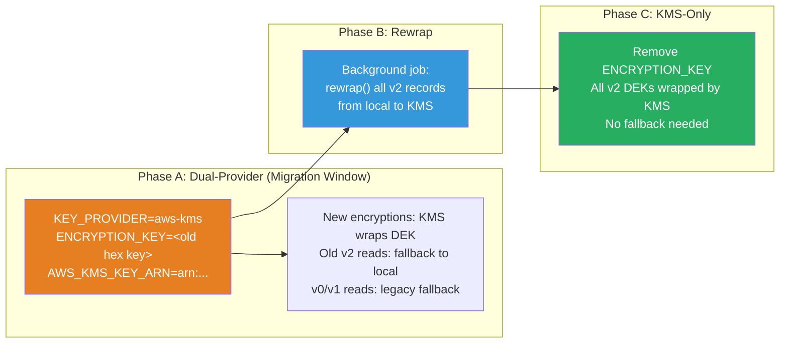

# Cloud KMS Migration Guide

Step-by-step guide for migrating NyxID's encryption backend from the local `KeyProvider` to AWS KMS or GCP Cloud KMS, including rollback procedures.

---

## Table of Contents

- [Prerequisites](#prerequisites)
- [Migration Overview](#migration-overview)
- [Migrate to AWS KMS](#migrate-to-aws-kms)
- [Migrate to GCP Cloud KMS](#migrate-to-gcp-cloud-kms)
- [Verify Migration](#verify-migration)
- [Rollback Procedures](#rollback-procedures)
- [Cross-Provider KEK Rotation](#cross-provider-kek-rotation)
- [FAQ](#faq)

---

## Prerequisites

### AWS KMS

1. An AWS KMS symmetric key (AES-256) created in the target region
2. IAM credentials with `kms:Encrypt` and `kms:Decrypt` permissions on the key
3. Standard AWS credential chain configured (env vars, `~/.aws/credentials`, EC2 instance role, or ECS task role)
4. Build NyxID with the `aws-kms` feature flag:
   ```bash
   cargo build --release --features aws-kms
   ```

### GCP Cloud KMS

1. A GCP Cloud KMS key ring and symmetric encrypt/decrypt key
2. Service account or ADC credentials with `roles/cloudkms.cryptoKeyEncrypterDecrypter`
3. Application Default Credentials (ADC) configured
4. Build NyxID with the `gcp-kms` feature flag:
   ```bash
   cargo build --release --features gcp-kms
   ```

---

## Migration Overview



The migration uses a **fallback provider** to ensure zero downtime:

1. **Phase A**: Deploy with `KEY_PROVIDER=aws-kms` (or `gcp-kms`) while keeping `ENCRYPTION_KEY` set. New encryptions use KMS. Old v2 ciphertexts decrypt via the fallback local provider. Legacy v0/v1 decrypt via `LegacyKeys`.
2. **Phase B**: Run a background rewrap job to re-wrap all existing v2 DEKs from the local provider to the KMS provider. This only touches the ~60-byte wrapped DEK per record, not the data.
3. **Phase C**: Once all records are rewrapped and `decrypt_stats()` shows zero `v2_fallback` hits, remove `ENCRYPTION_KEY` to eliminate the fallback provider.

---

## Migrate to AWS KMS

### Step 1: Create the KMS Key

```bash
aws kms create-key \
  --key-spec SYMMETRIC_DEFAULT \
  --key-usage ENCRYPT_DECRYPT \
  --description "NyxID DEK wrapping key" \
  --region us-east-1

# Note the KeyId from the output, e.g.:
# arn:aws:kms:us-east-1:123456789012:key/mrk-abc123def456
```

### Step 2: Set IAM Permissions

The NyxID service needs `kms:Encrypt` and `kms:Decrypt` on the key. Example IAM policy:

```json
{
  "Version": "2012-10-17",
  "Statement": [
    {
      "Effect": "Allow",
      "Action": [
        "kms:Encrypt",
        "kms:Decrypt"
      ],
      "Resource": "arn:aws:kms:us-east-1:123456789012:key/mrk-abc123def456"
    }
  ]
}
```

### Step 3: Build with Feature Flag

```bash
cargo build --release --features aws-kms
```

### Step 4: Deploy with Dual-Provider Config

```bash
# Keep existing local key for fallback during migration
ENCRYPTION_KEY=<your existing 64 hex chars>

# Switch to AWS KMS for new encryptions
KEY_PROVIDER=aws-kms
AWS_KMS_KEY_ARN=arn:aws:kms:us-east-1:123456789012:key/mrk-abc123def456
```

At startup, NyxID will:
1. Initialize `AwsKmsProvider` as the primary provider
2. Initialize `LocalKeyProvider` as the fallback provider (because `ENCRYPTION_KEY` is set)
3. Check for key ID collisions between primary and fallback (panics if collision detected)
4. New `encrypt()` calls wrap DEKs with AWS KMS
5. `decrypt()` tries AWS KMS first, falls back to local for old v2 records

### Step 5: Run Rewrap Job

Execute a background job that reads all encrypted records and calls `rewrap()` on each. The `rewrap()` method:
- Unwraps the DEK from the fallback (local) provider
- Re-wraps it with the primary (KMS) provider
- Replaces only the header + wrapped DEK portion (data is unchanged)

Monitor `decrypt_stats()` to track progress -- the `v2_fallback` counter should decrease to zero.

### Step 6: Remove Local Key (KMS-Only)

Once `v2_fallback == 0` and all records are rewrapped:

```bash
# Remove local key -- KMS is now the sole provider
KEY_PROVIDER=aws-kms
AWS_KMS_KEY_ARN=arn:aws:kms:us-east-1:123456789012:key/mrk-abc123def456
# ENCRYPTION_KEY is no longer set
```

**Warning**: Only remove `ENCRYPTION_KEY` after confirming all v2 records have been rewrapped AND no v0/v1 records remain in the database. If v0/v1 records exist, keep `ENCRYPTION_KEY` set for legacy fallback.

---

## Migrate to GCP Cloud KMS

### Step 1: Create the Key Ring and Key

```bash
gcloud kms keyrings create nyxid-ring \
  --location us-east1

gcloud kms keys create nyxid-kek \
  --keyring nyxid-ring \
  --location us-east1 \
  --purpose encryption
```

The key resource name format:
```
projects/PROJECT_ID/locations/LOCATION/keyRings/KEYRING/cryptoKeys/KEY
```

### Step 2: Set IAM Permissions

```bash
gcloud kms keys add-iam-policy-binding nyxid-kek \
  --keyring nyxid-ring \
  --location us-east1 \
  --member serviceAccount:nyxid@PROJECT_ID.iam.gserviceaccount.com \
  --role roles/cloudkms.cryptoKeyEncrypterDecrypter
```

### Step 3: Build with Feature Flag

```bash
cargo build --release --features gcp-kms
```

### Step 4: Deploy with Dual-Provider Config

```bash
ENCRYPTION_KEY=<your existing 64 hex chars>
KEY_PROVIDER=gcp-kms
GCP_KMS_KEY_NAME=projects/my-project/locations/us-east1/keyRings/nyxid-ring/cryptoKeys/nyxid-kek
```

### Step 5: Run Rewrap Job

Same as AWS -- run `rewrap()` on all records. Monitor `v2_fallback` until zero.

### Step 6: Remove Local Key

```bash
KEY_PROVIDER=gcp-kms
GCP_KMS_KEY_NAME=projects/my-project/locations/us-east1/keyRings/nyxid-ring/cryptoKeys/nyxid-kek
# ENCRYPTION_KEY removed
```

---

## Verify Migration

### Check Decrypt Stats

The `EncryptionDecryptStats` struct (accessible via `decrypt_stats()`) provides counters for each decrypt path:

| Counter | Description | Target After Migration |
|---------|-------------|----------------------|
| `v2_current` | Decrypted with current KMS key | Increasing (normal traffic) |
| `v2_previous` | Decrypted with previous KMS key | 0 (after KMS rotation) |
| `v2_fallback` | Decrypted via fallback local provider | **0** (migration complete) |
| `v1_current` | Legacy v1 with current local key | 0 (after re-encryption) |
| `v1_previous` | Legacy v1 with previous local key | 0 |
| `v0_current` | Legacy v0 with current local key | 0 (after re-encryption) |
| `v0_previous` | Legacy v0 with previous local key | 0 |

Migration is complete when `v2_fallback == 0` and all v0/v1 counters are zero.

### Startup Log Indicators

On startup with KMS provider:
```
INFO  AWS KMS provider initialized key_id=0xab has_previous=false
```
or:
```
INFO  GCP Cloud KMS provider initialized key_id=0xcd has_previous=false
```

During decrypt of fallback records:
```
WARN  Decrypted v2 envelope via fallback provider; migration from previous provider is still in progress
```

---

## Rollback Procedures

### Rollback: KMS Back to Local

If issues arise after switching to KMS, you can roll back to the local provider. This requires that `ENCRYPTION_KEY` was preserved.

**Scenario A: During migration window (dual-provider config)**

Simply revert the config:

```bash
# Roll back to local-only
KEY_PROVIDER=local
ENCRYPTION_KEY=<your 64 hex chars>
# Remove AWS/GCP vars
```

Records encrypted with KMS during the migration window will need re-encryption. The fallback chain will not decrypt them because the local provider does not know the KMS key ID. To handle this:

1. Keep the KMS config temporarily as the fallback
2. Or accept that records encrypted during the KMS window need manual intervention

**Scenario B: After full migration (no local key)**

If `ENCRYPTION_KEY` was removed, you cannot directly roll back. Recovery requires:

1. Re-export the original local encryption key from your secrets manager
2. Deploy with dual config (KMS primary + local fallback) in reverse
3. Run rewrap from KMS to local

**Best practice**: Always preserve `ENCRYPTION_KEY` in your secrets manager even after removing it from runtime config.

### Rollback: KMS Key Rotation

If a newly rotated KMS key causes issues:

```bash
# AWS: Set previous key ARN
AWS_KMS_KEY_ARN=arn:aws:kms:...:key/new-key
AWS_KMS_KEY_ARN_PREVIOUS=arn:aws:kms:...:key/old-key

# GCP: Set previous key name
GCP_KMS_KEY_NAME=projects/.../cryptoKeys/new-key
GCP_KMS_KEY_NAME_PREVIOUS=projects/.../cryptoKeys/old-key
```

The provider will try the current key first, then fall back to the previous key for unwrap operations.

### Rollback Decision Matrix

| Scenario | Action | Data Impact |
|----------|--------|-------------|
| KMS latency too high | Roll back to `KEY_PROVIDER=local` | Records encrypted with KMS need rewrap back |
| KMS auth failure | Fix IAM/credentials; keep KMS config | No data impact |
| Cross-provider key ID collision at startup | Use a different KMS key | No data impact (caught at startup) |
| KMS key accidentally disabled | Re-enable key in cloud console | Temporary 503 errors until re-enabled |
| KMS key deleted (in grace period) | Cancel deletion in cloud console | Temporary 503 errors until restored |
| KMS key permanently destroyed | **Unrecoverable** for KMS-wrapped records | Pre-migration local records still accessible if `ENCRYPTION_KEY` preserved |

---

## Cross-Provider KEK Rotation

### Rotating the KMS Key

KMS providers manage key rotation natively:

**AWS KMS:**
```bash
# Rotate the KMS key -- AWS automatically retains old key versions
AWS_KMS_KEY_ARN=arn:aws:kms:...:key/same-key-id
# AWS handles transparent decrypt with old versions
```

AWS KMS automatic rotation creates a new backing key but retains the same key ARN. Old ciphertexts are transparently decrypted using the old backing key.

**GCP Cloud KMS:**
```bash
# Create a new key version
gcloud kms keys versions create \
  --key nyxid-kek \
  --keyring nyxid-ring \
  --location us-east1

# Set new version as primary
gcloud kms keys update nyxid-kek \
  --keyring nyxid-ring \
  --location us-east1 \
  --primary-version <new-version-number>
```

GCP uses the primary version for encrypt and automatically selects the correct version for decrypt.

### Rotating Between Two KMS Keys (Same Provider)

To rotate from one KMS key to a completely different key:

```bash
# AWS
AWS_KMS_KEY_ARN=arn:aws:kms:...:key/new-key
AWS_KMS_KEY_ARN_PREVIOUS=arn:aws:kms:...:key/old-key

# GCP
GCP_KMS_KEY_NAME=projects/.../cryptoKeys/new-key
GCP_KMS_KEY_NAME_PREVIOUS=projects/.../cryptoKeys/old-key
```

Then run `rewrap()` on all records, and once `v2_previous == 0`, remove the `_PREVIOUS` config.

---

## FAQ

**Q: Can I use both AWS KMS and GCP KMS at the same time?**
A: No. Only one primary provider is active at a time. You can migrate between them using the fallback mechanism (e.g., AWS KMS primary with local fallback containing the local-encrypted records, then re-encrypt to GCP KMS).

**Q: What happens if the KMS is temporarily unavailable?**
A: Encrypt and decrypt operations return `AppError::Internal`. GCP KMS calls are retried (3 attempts, exponential backoff from 100ms). AWS SDK has built-in retry. If all retries fail, the request fails with an internal error.

**Q: How large are KMS-wrapped DEKs?**
A: LocalKeyProvider produces 60-byte wrapped DEKs. AWS KMS produces ~170-200 bytes. GCP Cloud KMS produces variable-size ciphertext. A `MAX_WRAPPED_DEK_SIZE` of 1024 bytes is enforced.

**Q: Does the v2 ciphertext format change with KMS?**
A: The v2 header format is unchanged. The `wrapped_dek_len` field (2-byte big-endian u16) accommodates variable wrapped DEK sizes. KMS-wrapped records are larger due to the bigger wrapped DEK blob.

**Q: Can I run the rewrap job while the application is serving traffic?**
A: Yes. `rewrap()` is safe to run concurrently with encrypt/decrypt. The fallback provider remains available throughout.

**Q: What if I get a key ID collision at startup?**
A: NyxID checks for collisions between the primary and fallback provider key IDs at startup and panics if one is detected (1-in-256 chance). Use a different KMS key or generate a new local key.
