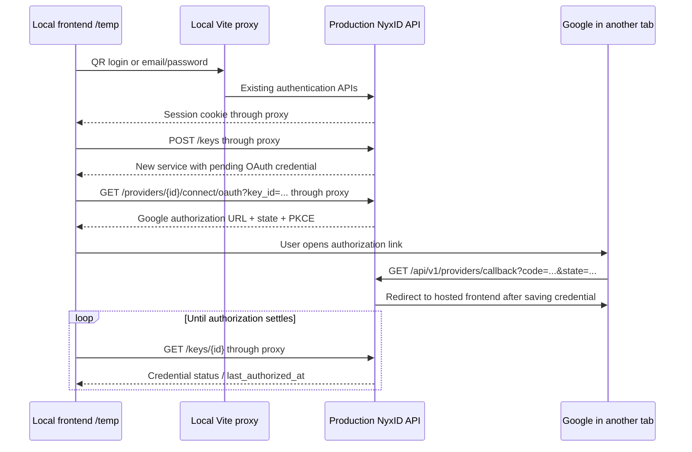

# Local Google Workspace OAuth POC

The development frontend exposes `http://127.0.0.1:3003/temp`. It signs into the real NyxID backend, reads the Google catalog configuration, opens the existing connection dialog with **NyxID managed** selected, and checks the newly created connection while Google authorization happens in another tab.

This page is available only in Vite development mode. The route and page module are excluded from production builds. It uses real production data unless a test explicitly intercepts requests. No local backend, MongoDB, Google client secret, or new frontend environment variable is needed.

## Start and operate

Use Node 22.12+ and npm. From this checkout:

```sh
cd frontend
npm ci --no-audit --no-fund
BACKEND_URL=https://nyx-api.chrono-ai.fun \
FRONTEND_URL=https://nyx.chrono-ai.fun \
npm run dev -- --host 127.0.0.1 --port 3003 --strictPort
```

Skip `npm ci` when the dependencies match the lockfile. The session started during implementation runs in the background, with logs at `/tmp/nyxid-arctic-stone-frontend.log`. The previous listener on port 3003 belonged to an archived frontend checkout and was replaced with this one. Find the current listener with `lsof -nP -iTCP:3003 -sTCP:LISTEN`; verify its working directory with `lsof -a -p PID -d cwd` before stopping it with `kill PID`. It does not restart after reboot.

Keep both production origins above. `BACKEND_URL` is the API origin without `/api/v1`. Here `FRONTEND_URL` tells the Vite proxy which Origin/Referer the production CSRF middleware expects; it does not set the browser URL or Google's callback. The existing proxy also adjusts production cookies for loopback HTTP. Keep the server bound to `127.0.0.1` and consistently use that hostname for the browser session.

Connectivity: `curl -fsS http://127.0.0.1:3003/health`.

## Try the flow

1. Open `/temp` in a normal browser. Select **Continue with the NyxID app** and approve the QR request on the mobile app signed into production. Alternatively, follow the login-page link and use email/password, including MFA if enabled. Both return to `/temp`.
2. Read **Check availability**. The page fetches the authenticated `/api/v1/catalog/api-google` response. Missing platform credentials or an incompatible credential mode disables the managed-connect button and shows the needed admin action. The allowlist is read from the connected backend; displaying stored credentials as configured is not proof that Google accepts the app.
3. Select **Connect Google through NyxID**, keep **Direct** and **NyxID managed** selected, then choose **Next: Connect**. Review the scopes and choose **Connect with Google API** (the name follows the live catalog).
4. Click **Open Google API**. This explicit link opens Google in a separate tab and keeps `/temp` alive without depending on popup permissions. Use a normal browser for Google consent; embedded browsers may be rejected by Google.
5. Authorize the Google account. The callback completes at the production API, saves the credential, and redirects the Google tab to the production frontend's key page. That tab may request a separate production browser login. Return to the original local tab; the saved credential is the source of truth.
6. Wait for **Google authorization confirmed by NyxID**. Close the dialog to see the result and the saved connection. An earlier active Google connection cannot satisfy this new attempt. The page lists service Enabled/Disabled separately from credential status. Closing a pending dialog stops its watch; use **Refresh configuration & connections** to check a later callback. Reloading the page also restores the connection list, though the in-memory attempt banner is gone.

The shared wizard's optional **Continue** step proceeds to its normal onboarding, including creating a NyxID Agent Key. That extra step is unnecessary to prove Google binding; close the dialog once the authorization is confirmed.

## Callback and session flow



There are three distinct URLs:

| Purpose | URL in this setup | Where it is configured |
| --- | --- | --- |
| Local POC | `http://127.0.0.1:3003/temp` | Local Vite route |
| Google **connector binding** callback | `https://nyx-api.chrono-ai.fun/api/v1/providers/callback` | Generated from backend `BASE_URL`; register this exact URI on Google's connector OAuth client |
| Google **sign-in to NyxID** callback | `https://nyx-api.chrono-ai.fun/api/v1/auth/social/google/callback` | Separate social-login app configured through `GOOGLE_CLIENT_ID` / `GOOGLE_CLIENT_SECRET` |

The connector callback trusts the unexpired, one-use OAuth state and can finish without a production browser session cookie. When a production session is present, NyxID also checks that its user matches the initiating user. A production tab logged in as a different NyxID user can therefore cause a session mismatch; align the users or use a browser profile without that conflicting production session.

Social login has a different cookie-based state check. Starting it through localhost places the state cookie on localhost, but Google returns to production, which cannot read that cookie. Even a production login does not establish the localhost cookie. Adding a localhost URL to Google alone does not repair this. Use the POC's QR or email/password login for this configuration.

The POC deliberately uses the shared wizard's external link and API polling. Production and localhost cannot share a `BroadcastChannel` or local-storage completion notification. `redirect_path` is a frontend-relative path, joined to the backend's configured production `FRONTEND_URL`; setting it to `/temp` would land on the production site, not localhost. An absolute loopback `redirect_path` is rejected.

## NyxID settings needed

For basic binding, a production admin should inspect the **google provider**, not the Google social-login settings. Its stored platform OAuth client must be usable, `provider_type` must be `oauth2`, it must be active, and `credential_mode` must allow the platform app (`both` preserves the custom-app option; `admin` makes it managed-only). Provision client ID and secret through the existing provider admin UI/API; the backend encrypts them. Do not put the secret in the frontend or change the social-login env vars to configure this connector. Use the returned catalog `provider_config_id`; it is not necessarily the string `google`.

Preserve backend `BASE_URL=https://nyx-api.chrono-ai.fun` and `FRONTEND_URL=https://nyx.chrono-ai.fun`. No CORS, cookie-domain, or callback-routing change is needed for this local polling POC. The Google authorization request and server token exchange already use the same production callback URI.

Current `main` already provides managed Google Workspace scopes in `backend/src/services/google_workspace.rs::MANAGED_SCOPES`. The list includes identity scopes, Drive access including `drive.file`, Calendar access, and Gmail read/send access. Google still decides whether the configured client and user can grant them. The original research snapshot predates this upstream change.

To verify Workspace on the **managed** route:

1. Use a bounded Drive read for the first POC. Select `https://www.googleapis.com/auth/drive.file` in the original `/temp` connection dialog for files created or explicitly opened with the app. An empty listing is valid before any files are authorized for that app.
2. Enable the Drive API in the Google project and configure its consent-screen data access, audience, test users, and any Workspace admin restrictions.
3. Refresh `/temp` and check the actual backend's advertised allowlist. If the deployment predates the Workspace release, update it to current `main`. No additional scope-allowlist change is part of this return-routing feature.
4. Authorize a new connection or reauthorize the intended existing connection with that permission. Adding a scope to the configured allowlist does not upgrade a token already issued by Google.
5. Verify the returned granted scopes and issue `GET /api/v1/proxy/s/{slug}/drive/v3/files?pageSize=1&fields=files(id,name)` using the created service's actual slug. This read returns only files the app can access under `drive.file`.

The named-return card uses the canonical `api-google` catalog entry and its configured defaults. Current `main` also has `api-google-workspace`, `api-google-drive`, `api-google-calendar`, and `api-google-gmail` presets. A caller can use one of those catalog slugs with its own return-map entry. Review the preset's actual default scopes before consent; Workspace and Gmail presets require Gmail send permission.

No production provider settings, backend allowlist, or Google Console configuration were changed during this POC.

## Google project setup

Use an OAuth **Web application** client for the NyxID connector. Prefer a separate client from NyxID social login so connector scopes and lifecycle are independent.

| Google setting | Required value or action |
| --- | --- |
| Authorized redirect URIs | Add exactly `https://nyx-api.chrono-ai.fun/api/v1/providers/callback` to the client whose ID NyxID actually uses. Scheme, hostname, path and trailing slash must match. |
| Authorized JavaScript origins | This server authorization-code flow does not use Google's JavaScript SDK. Adding the localhost origin is not needed for this POC and does not fix a redirect URI mismatch. |
| Audience | Use Internal only when all testers belong to the eligible Workspace organization. Otherwise use External; when in Testing, add the actual Google account as a test user. |
| Data access | Configure the scopes actually requested, matching the NyxID allowlist and selected operation. |
| Enabled APIs | Enable the relevant API in the same Google Cloud project: Drive, Gmail, Calendar, Docs or Sheets as needed. OAuth consent does not enable an API automatically. |
| Branding and verification | Configure the consent-screen brand, support/contact information and any required verified domains/privacy policy. Sensitive or restricted scopes may require additional verification for public production use; restricted data handling can add security assessment requirements. Testing/internal exceptions are not equivalent to approval for public rollout. |
| Workspace admin controls | If the organization restricts third-party applications, its admin must allow this exact OAuth client and the requested scopes in API controls. A Google test-user entry does not override organization policy. |
| Refresh-token lifetime | External apps in Testing generally receive refresh tokens that expire after seven days when requesting Workspace scopes; identity-only scope sets are an exception. Account/admin policy can impose other limits. |

If Google shows `redirect_uri_mismatch`, inspect the authorization request's actual `client_id` and `redirect_uri` and compare them with that exact client's Console configuration. Do not change NyxID's production global base URL to localhost. If Google shows an app/test-user/admin-policy block, repair that Google-side configuration; the local proxy cannot remove it.

## Smart return to dashboard, onboarding, or localhost

NyxID already supports an application return destination through `POST /api/v1/connect-links` with a stored absolute `callback_url`. On completed, cancelled, or expired status, its hosted connect page returns to that URL with `status` and `connect_link_id`. A localhost destination is accepted for a human-created link; registered apps follow their NyxID redirect-URI policy. This is separate from Google's fixed production callback.

The original `/temp` dialog uses its existing key authorization flow. A separate **Try a configured return** section now creates connect links using a named page, shows the backend's saved destination before navigation, and verifies the expected link ID after returning. Its **Local POC**, **Onboarding**, **Dashboard**, and **Safe default** choices send `local-poc`, `onboarding`, `dashboard`, and `default`, respectively. Configure `OAUTH_RETURN_ROUTES` on the backend using [the example mapping](examples/oauth-return-routes.json). The section is disabled until the connected backend advertises that capability. It saves attempts per account and browser tab, with separate records for each initiating page; each backend link retains its own destination. It never accepts a return URL's status as proof of authorization. For the localhost round trip, choose **Local POC**. Start dashboard and onboarding verification on the hosted origin. Browser session storage belongs to the initiating origin; selecting a page on another origin does not transfer that saved attempt.

Opening the returned hosted `connect_url` keeps the hosted token and continuation on one origin, but may require a hosted NyxID login in addition to the local session. Research also reproduced and locally fixed a frontend guard bug that lost the connection destination on signed-out entry; those frontend fixes must be deployed to affect the hosted page. Strict local-only login and automatic return require an additive backend direct-return mode after durable link completion, with explicit denial/retry handling.

See [Contextual OAuth return research](OAUTH_CONTEXTUAL_RETURN_RESEARCH.md) for the complete trace, verified browser cases, callback policy, and concrete implementation plan. No Google Console change is needed merely to select a different final application page.

## If Google's callback itself must be localhost

It is unnecessary for this POC. A separate local backend can use a dedicated Google development client with `http://127.0.0.1:3003/api/v1/providers/callback` as the registered callback when that path is proxied to the local backend and the local backend is configured to generate the same URI. That requires local backend/database/secrets and is a different setup.

Keeping the production backend while returning the Google callback itself to localhost would need explicit per-attempt callback support: an exact allowed set of loopback callback URLs, storage of the selected URI with OAuth state, and reuse of that URI during token exchange. The generic `redirect_path` field does not provide this. Do not rewrite only the outgoing Google `redirect_uri`, because the backend would still send the production URI during code exchange. For an application return, reuse the existing connect-link callback described above while retaining the production Google callback. Any social-login session handoff also needs a dedicated secure exchange; provider-binding polling does not transport a browser login session.

## Validation and remaining manual checks

Verified on 2026-09-10:

- The loopback server serves this checkout at `/temp`, and its `/health` proxy reaches production (reported version `0.17.1`, commit `142827f4d708`).
- A real browser renders `/temp`, creates a production QR request, renders the QR, and polls `/auth/device/poll-web` with pending error `11202`. Its verification URL uses `https://nyx.chrono-ai.fun`.
- `npm run build` passes, including the isolated credential-accept build and mock-footprint assertion. A browser check against the production preview confirms `/temp` renders **Page not found**, and the POC module is absent from the production assets. The build emitted existing CSS/deprecation warnings.
- ESLint passes for the changed frontend files; 66 existing tests pass across public-route policy, key hooks, the QR component and connection dialog.
- A separate browser test with intercepted API fixtures verifies managed selection, scope submission, external-tab handoff, correlation to the new key, no false success from an existing active key, and confirmation when the pending key becomes active. Desktop and 390px mobile layouts render without page errors or horizontal overflow. These simulated results do not prove production Google credentials or callback acceptance.
- Initial configured-return verification passed 61 focused backend checks, including real local MongoDB round trips. Delivery verification includes 2,980 frontend unit checks, 29 focused checks after URL validation alignment, 10 SDK service checks, 14 configured-return Chromium tests, and 9 existing login Chromium tests. These cover destination fallback/persistence, app registration, reload/account correlation, mixed backend versions and rejection of mismatched results. Both POC modules remain excluded from the production build. See [the blast-radius verification record](OAUTH_RETURN_CONFIG_BLAST_RADIUS.md#verification-record) for commands, boundaries and resolved review findings.

Still requires human interaction: approve the real NyxID login, inspect the authenticated live Google configuration, complete Google consent, verify real callback settlement and cookie persistence after a reload, then test an actual Workspace API after its scope is enabled. No end-to-end Google binding is claimed by the automated checks above.

## Implementation references

- `frontend/src/pages/temp-google-workspace.tsx`: POC UI; existing QR, catalog, wizard and key-watch consumers.
- `frontend/src/pages/temp-configured-oauth-return.tsx`: POC page selectors using the shared configured OAuth connection component.
- `backend/src/config/oauth_return_routes.rs`, `backend/src/handlers/connect_links.rs`: named destination configuration and create-time acknowledgement.
- `frontend/src/router.tsx`, `frontend/src/lib/public-paths.ts`: development-only route and login entry.
- `frontend/vite.config.ts`: existing production proxy and cookie/Origin rewriting.
- `frontend/src/components/dashboard/add-key-dialog.tsx`, `frontend/src/hooks/use-keys.ts`: existing authorization handoff and correlated polling.
- `backend/src/services/user_token_service.rs`, `backend/src/handlers/user_tokens.rs`: authorization URL, callback exchange, state/session checks and return-path handling.
- `backend/src/services/scope_catalog.rs`, `backend/src/services/google_workspace.rs`: managed Google scope gate and product presets.
- `backend/src/services/social_auth_service.rs`, `backend/src/handlers/social_auth.rs`: separate Google login flow.

Google references checked for this run:

- [Web-server OAuth flow and redirect URI requirements](https://developers.google.com/identity/protocols/oauth2/web-server)
- [Refresh-token expiration and testing-mode limits](https://developers.google.com/identity/protocols/oauth2)
- [Sensitive-scope verification](https://developers.google.com/identity/protocols/oauth2/production-readiness/sensitive-scope-verification)
- [Google Drive scopes and classifications](https://developers.google.com/workspace/drive/api/guides/api-specific-auth)
