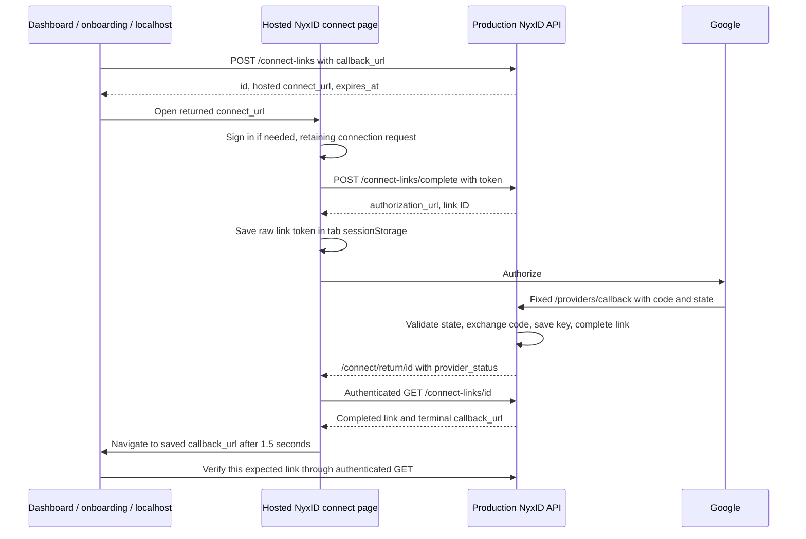

# Contextual return after Google connector OAuth

Initial research date: 2026-09-10. Initial checkout: `9bb33bcf02ff`, plus the local POC and frontend fixes described below. Production API health reported version `0.17.1`, commit `142827f4d708`.

## Decision

Keep Google's connector callback at `https://nyx-api.chrono-ai.fun/api/v1/providers/callback`. Select the dashboard, onboarding page, or localhost destination before authorization and persist it with the connection request. After NyxID exchanges the code and records the result, return the browser to that saved destination.

NyxID already has this request-level destination: **`ConnectLink.callback_url`**. The original `/temp` dialog uses the older add-key wizard, which supplies `redirect_path=/keys/{id}` instead. The subsequent configured-return section uses connect links. A blanket claim that all returns to localhost require a new backend API is incorrect: the existing hosted connect-link flow can return to localhost on a terminal outcome.

Two requirements have different implementation costs:

| Requirement | Recommended mechanism | Required work |
| --- | --- | --- |
| Hosted dashboard/onboarding returns to its originating page | Existing connect link with a saved `callback_url` | Integrate the caller; release the frontend login-continuation fix below |
| Local caller may use a hosted NyxID login before coming back | Same mechanism; open the returned production `connect_url`, then return to localhost | Local create/resume UI; hosted frontend login fix if its deployed bundle has the same bug |
| Sign in only on localhost, start Google locally, and return straight to local onboarding | Opt-in direct return from the production API using the stored connect-link destination | Local create/complete/resume UI and an additive backend change |
| Registered external web app resumes onboarding | Existing connect link with an app-registered fixed completion URI | Register the URI in NyxID; correlate the link ID to the app's onboarding state |

The direct-return backend change is a proposal in this report. It has not been implemented or deployed. The local login-continuation fixes have been implemented and checked. A subsequent implementation adds named destination configuration at link creation, preserving the hosted continuation described here. `/temp` now exposes that configured-return POC as well as its original dialog-and-polling flow. See [the configuration contract and blast-radius review](OAUTH_RETURN_CONFIG_BLAST_RADIUS.md) for this additive change.

## Three URLs with different owners

| URL | Who selects it | Role |
| --- | --- | --- |
| `https://nyx-api.chrono-ai.fun/api/v1/providers/callback` | NyxID backend `BASE_URL`, registered on Google's connector client | Google sends the authorization code and OAuth state here; NyxID performs the token exchange |
| `https://nyx.chrono-ai.fun/connect/return/{link_id}` | Connect-link handler plus backend `FRONTEND_URL` | Current hosted continuation page; authenticates the browser and reads the saved link result |
| `callback_url`, e.g. `http://127.0.0.1:3003/temp` | Validated and stored when a connect link is created | Final application destination, receiving link ID and outcome metadata |

Google requires the requested `redirect_uri` to match a URI registered for the actual OAuth client. The URI in the token exchange must match the authorization request. Google also explicitly documents OAuth `state` as a way to preserve application context and return to the correct resource. NyxID already binds an opaque OAuth state to its `connect_link_id`; use that relationship to recover the saved destination. See [Google's web-server flow](https://developers.google.com/identity/protocols/oauth2/web-server) and [RFC 6749 section 4.1.3](https://www.rfc-editor.org/rfc/rfc6749.html#section-4.1.3).

Changing Vite's `FRONTEND_URL`, rewriting only the Google authorization URL, or adding dashboard/onboarding paths to Google's Console does not implement this return contract. The Vite proxy rewrites Origin/Referer to production, so those headers cannot identify the original local destination. A Referer on the provider return also cannot reliably identify the initiating page.

## Existing flow, traced end to end



Creation accepts `service_slug`, `label`, `requested_by`, `callback_url`, and `expires_in`. The API derives app identity from the verified caller credential, not the body. The generated `connect_url` always uses the configured production frontend origin. See [the documented integration contract](API.md#third-party-connector-integration), [create handler](../backend/src/handlers/connect_links.rs), and [link model](../backend/src/models/connect_link.rs).

For OAuth completion, `handlers/connect_links.rs` sets `redirect_path=/connect/return/{id}` and passes the connection ID and link ID into `user_token_service::initiate_oauth_connect`. That service stores the context in `OAuthState` and builds the production Google callback. The callback handler exchanges the code, updates the exact credential, and calls `connect_link_service::complete_oauth_callback`. That service verifies the owner, active credential and active service associated with this connection before completing the link. See [OAuth state](../backend/src/models/oauth_state.rs), [provider service](../backend/src/services/user_token_service.rs), and [callback handler](../backend/src/handlers/user_tokens.rs).

The callback handler currently redirects to the hosted return page even when link completion already succeeded. The return page performs an authenticated status read; only terminal status supplies an external `callback_url`. See [return page](../frontend/src/pages/connect-link.tsx) and [status hooks](../frontend/src/hooks/use-connect-links.ts).

### Destination selection examples

For a first-party human browser session, an existing create request can be:

```http
POST /api/v1/connect-links
Content-Type: application/json
```

```json
{
  "service_slug": "api-google",
  "label": "Google Workspace onboarding",
  "callback_url": "http://127.0.0.1:3003/temp?step=workspace",
  "expires_in": 900
}
```

The browser sends this through its authenticated local proxy. The request creates a real production link; it is an example, not a request executed during this research. Open the returned `connect_url` without rewriting its origin for the existing hosted flow.

| Starting context | Example saved destination |
| --- | --- |
| NyxID dashboard | `https://nyx.chrono-ai.fun/dashboard` |
| NyxID onboarding | `https://nyx.chrono-ai.fun/onboarding?step=workspace` — illustrative; implement the actual product route |
| Current local POC | `http://127.0.0.1:3003/temp?step=workspace` |
| External registered web app | `https://app.example.com/integrations/nyxid/return` — register this fixed URI in NyxID |

On completion, the local example becomes:

```text
http://127.0.0.1:3003/temp?step=workspace&status=completed&connect_link_id=<id>
```

`terminal_callback_url` preserves other query pairs, removes caller-supplied `status` and `connect_link_id`, and appends authoritative values. No Google authorization code, OAuth state, access token, refresh token, or raw connect token is appended. The caller must still treat browser query parameters as an untrusted notification: match the expected link ID and read its status using the user's authenticated API session before advancing onboarding.

Store the pending link ID and onboarding context before navigating. For several simultaneous flows, maintain one record per link ID rather than one global `returnTo`. Clear only that attempt when it settles. A reload or closed Google tab can then resume through status polling.

## Findings that change the implementation

### Login loses the connection context: fixed locally

The two connect pages have their own login navigation with a `return_to` value. However, `main.tsx` also runs a global unauthenticated-route guard. `isPublicPath` omitted both connect route shapes, so the global guard could send a fresh signed-out visit to plain `/login` before the pages could preserve the request. A real Chromium run with intercepted API responses reproduced plain `/login` and the missing context.

Local changes:

- [public-paths.ts](../frontend/src/lib/public-paths.ts) now lets `/connect/{token}` and `/connect/return/{id}` render through their own authentication handling. This does not grant API access or skip the pages' login requirement.
- [connect-link.tsx](../frontend/src/pages/connect-link.tsx) includes the current query string in both login return URLs, preserving `provider_status=error` and its safe display message.
- [public-paths.test.ts](../frontend/src/lib/public-paths.test.ts) covers the route exception and rejects unrelated/nested path shapes.

The fixture now reaches login with the complete request destination; a simulated successful login resumes the same denial page without trying to complete the failed OAuth attempt. These changes need a production frontend release to affect the hosted page.

### Localhost and production have separate browser sessions

The local Vite proxy adapts the production session cookie to the localhost browser. That establishes a local browser session; it does not establish a cookie or sessionStorage entry on `https://nyx.chrono-ai.fun`.

Starting on the hosted connect page keeps its raw link token in the same origin and tab as the hosted return page. Starting on local `/connect/{token}` stores that token only locally, while the Google callback sends the browser to production. A durably completed link can still be read after hosted login, but retry and pending-completion recovery cannot obtain the locally stored token. The current UI then has no retry button or remains at “Finishing the connection...”.

The provider callback itself permits an absent production browser session and uses the OAuth transaction to identify the user. If a production session is present for a different NyxID user, the callback rejects the mismatch. A direct-return implementation must preserve that account check; it must not transfer or weaken authentication to make navigation work.

### Denial is pending, not terminal

Google denial is recorded as `last_error=provider_access_denied`, and the link remains `pending` for retry. The existing terminal callback therefore does not run on denial. With the original tab token, the hosted page offers “Try again”; without it, the error is shown without a retry action.

Several callback branches also lose contextual navigation: missing code and session mismatch use the generic hosted callback; missing or invalid state necessarily lacks a trusted destination. Token-exchange or key-sync failures usually retain `redirect_path`. Centralize result routing for valid transactions when adding smart error returns, so these branches do not drift further.

There is another distinction between provider success and completed onboarding: if token exchange succeeds but `complete_oauth_callback` fails, the current handler logs a warning and still sends `provider_status=success` to the hosted page. A new direct success return must require the link's durable completed state, not just successful Google token exchange.

### Callback validation is different for human and app callers

| Caller | Current validation |
| --- | --- |
| Human/session or API key with no OAuth client identity | Absolute HTTP(S), host required, bounded length, no userinfo or fragment; **no destination allowlist** |
| Registered web client | App callback syntax validation and exact match against a registered full redirect URI |
| Registered public client | Exact match first, plus currently accepted dynamic HTTP loopback URLs with explicit port or private-use URI schemes |

See `resolve_requesting_app`, `validate_callback_url`, and `terminal_callback_url` in [connect_link_service.rs](../backend/src/services/connect_link_service.rs), and `validate_client` in [oauth_service.rs](../backend/src/services/oauth_service.rs). App status reads currently enforce owner/authorized-owner access; they are not additionally fenced to the link's `requesting_app_id`.

Exact matching includes the query string. For an external web application, register one fixed completion URI and map the returned link ID to the app's private onboarding record. Arbitrary step/nonce query variations on that registered URI will not match. Do not work around app validation by pretending to be an unscoped human caller.

Before enabling a direct browser return, define an explicit destination policy for that mode: known first-party HTTPS destinations, exact configured development loopback destinations, or the authenticated app's approved callback policy. Public-client native behavior needs separate compatibility tests. Returning status without credentials reduces exposure, but does not by itself eliminate redirect abuse. [RFC 9700 section 4.11](https://www.rfc-editor.org/rfc/rfc9700.html#section-4.11) describes the relevant redirector constraints.

## Concrete change plan for local-only login

This is the recommended additive extension when local onboarding must own the entire browser interaction outside Google:

1. **Persist the destination on the existing link.** Add an opt-in `return_mode: "direct"` to link creation, defaulting old and unspecified rows to hosted behavior. Use a serde-defaulted model field; do not add a second return-URL field to `OAuthState`. The state already references the link. Validate destination policy when creating this mode.
2. **Initiate from the local page through the proxy.** Create the link, store its ID and local onboarding context, and call the existing human-only `/connect-links/complete` with its raw token. Keep the token only in local tab storage for retry; never put it into Google state or the final application callback. The subsequent named-return implementation provides a create hook/schema; direct completion and local retry still need their own integration. Keep an explicit user action before following `authorization_url`.
3. **Settle on the production API.** Retain state consumption, expiry, PKCE, owner checks, credential persistence and link finalization. For a validated direct-mode link that is durably completed, redirect directly to the saved terminal callback. Reuse `terminal_callback_url`; remove the hosted-authenticated-page dependency for this mode.
4. **Return failures without declaring completion.** Persist normalized provider or settlement errors. For an opt-in direct-mode nonterminal result, define a new notification such as `connect_link_id=<id>&connect_event=provider_error`. Its sole purpose is to wake the caller, which must read canonical status. Reserve/remove any caller-supplied `connect_event` when building this URL. The link remains pending for retry. Do not reuse `status=completed`, expose raw provider descriptions, or add a `failed` terminal state casually.
5. **Resume locally using server state.** Check the expected ID and read `/connect-links/{id}` through the existing local session. Complete onboarding only for `completed` with the expected connected service; display pending errors with retry/cancel; preserve cancellation and expiry as existing terminal states. Treat a notification with no matching saved attempt as unverified.

The direct mode's nonterminal notification above is a proposed contract, not an existing accepted parameter. A fixed result helper should own the merged query keys and prevent stale caller-supplied outcome values from surviving.

State validation needs care: `peek_oauth_state` currently only looks up by ID; it does not itself check expiry or consumption. The successful exchange path separately claims state atomically and checks expiry. Do not use a successful peek alone as permission for a new direct error return. Define and test which valid transaction failures may resume the caller, and keep a safe hosted fallback when state is absent, invalid, expired, or replayed. Do not accept a return URL from the callback request.

| Result | Required direct-mode behavior |
| --- | --- |
| Valid code; key and link durably completed | Return to stored destination; caller verifies completed status |
| Google access denied with a valid transaction | Record stable error; return a nonterminal notification; allow retry |
| Successful exchange but link finalization failed | Record/resume as unresolved; never announce completed |
| Missing code with a valid transaction | Record normalized error and resume through the same trusted routing policy |
| Different production session user | Preserve rejection; do not bind to that user; route only if transaction validation permits a safe error return |
| Missing, invalid, expired, or replayed state | Safe hosted error fallback; no guessed destination |
| Cancelled/expired link | Preserve the existing status contract; no later success may override it |
| Browser closes before returning | Local saved link ID plus polling recovers status; closing a tab is not proof of cancellation |

Implementation locations are `models/connect_link.rs`, `handlers/connect_links.rs`, `services/connect_link_service.rs`, and the result-routing branches in `handlers/user_tokens.rs`; frontend creation/resume belongs in domain schemas/hooks and the actual onboarding page. This design reuses existing authenticated POSTs and status GET and needs no new unauthenticated status endpoint.

## Google and deployment settings

For smart UI returns, **no additional Google redirect URI is needed**. Keep this exact value registered on the managed connector's actual Google Web application client:

```text
https://nyx-api.chrono-ai.fun/api/v1/providers/callback
```

The dashboard/onboarding/local completion destinations belong to NyxID's connection-return policy, or the external app's NyxID developer registration. They are not additional Google callback endpoints. Adding a JavaScript origin is not needed for this server-side code-exchange flow.

Keep production backend `BASE_URL` and `FRONTEND_URL` unchanged. Keep the local dev proxy's production Origin/Referer settings and loopback binding. The local-only login design needs a backend release; changing local source cannot change the callback code executing on production. The login-continuation patch needs a frontend release for the hosted flow.

If Google rejects authorization with `redirect_uri_mismatch`, compare the actual authorization request's `client_id` and `redirect_uri` to that exact client's registration. That is independent of a successful OAuth exchange landing on the wrong application page. No live consent failure URL was provided or captured, so this research does not claim which Google Console setting is currently incorrect.

Workspace data access is independent. The initial research snapshot allowed only identity scopes. Current `main` now includes managed Drive, Calendar and Gmail read/send scopes plus dedicated catalog presets, defined in `backend/src/services/google_workspace.rs`. Named connect links use the catalog/provider defaults. Per-connection scope selection remains available in the existing key dialog. Verify the configured Google client, granted scopes and a bounded API operation using [the updated POC guide](LOCAL_GOOGLE_WORKSPACE_POC.md#nyxid-settings-needed).

## Evidence and verification limits

- Read the connect-link model, creation/completion/status handlers, service, mounted authentication policy, OAuth initiation/callback/state, UI login guards, popup/direct wizard, and relevant API documentation. Two bounded Pstack explorers independently traced frontend and backend; a synthesis pass reconciled them with the browser findings.
- Production `/health` returned `0.17.1` / `142827f4d708`. That commit exists locally. Comparing it with HEAD showed the connect-link handler/model/page unchanged and only test-fixture differences in the provider callback and connect-link service. This proves the relevant backend logic exists in the reported production revision; it does not identify the deployed frontend bundle or verify a real Google consent result.
- Before the local fix, a Chromium fixture run reproduced `/connect/return/{id}` being sent to plain `/login` with no continuation.
- After the fix, eight Chromium fixture scenarios cover completed/cancelled/expired cross-origin returns; initial signed-out connect entry; denial context through a simulated login; denial with and without the original tab token; and pending return without its token. Every API request was intercepted; external requests were blocked or fulfilled locally. These runs did not create production links or grant Google permissions.
- The initial research and login-continuation fix passed eighteen focused frontend tests across route policy, connect-link page helpers, hooks and schemas, plus ESLint and TypeScript compilation. That initial phase changed no backend code. The subsequent named-return implementation and its database-backed checks are recorded in [the configuration blast-radius review](OAUTH_RETURN_CONFIG_BLAST_RADIUS.md#verification-record).

The local diagnostic script is `/tmp/nyxid-smart-return-browser.mjs`, with results at `/tmp/nyxid-smart-return-browser-results.json`. To reproduce while the local frontend is running, execute `node /tmp/nyxid-smart-return-browser.mjs` from `frontend/` in this checkout.

Before deploying direct mode, test state expiry/replay, wrong user, terminal races, database finalization failure, error-result persistence, URL tampering/duplicate keys, app full-URI matching, concurrent links/tabs, lost storage, re-login, and native-client compatibility. Finally perform one real user-approved Google consent from localhost and verify both durable binding and return navigation. Google Workspace permission must be verified with a bounded API operation, not just an active credential.

Primary standards consulted: [Google web-server OAuth](https://developers.google.com/identity/protocols/oauth2/web-server), [RFC 6749 code exchange](https://www.rfc-editor.org/rfc/rfc6749.html#section-4.1.3), and [RFC 9700 redirect matching and redirectors](https://www.rfc-editor.org/rfc/rfc9700.html#section-4.11). The research concentrates on these primary sources and local runtime/source evidence rather than broad secondary OAuth tutorials.
