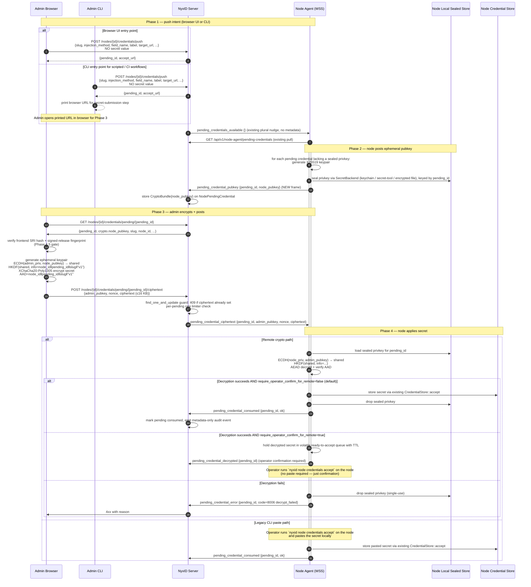

# Remote Credential Injection

Design document for issue [#773](https://github.com/ChronoAIProject/NyxID/issues/773). Status: **proposed** — eng-reviewed (9 issues raised + resolved). Ready for implementation.

## Context

Today, supplying a secret to a node-managed service is a strictly two-party flow:

1. Org admin runs `nyxid node-credential push <node> --slug <s> ...` from anywhere. NyxID creates a pending credential record with display metadata but **no secret value**. The CLI explicitly says "do not send the secret value; it is entered on the VM."
2. **Operator on the node host** runs `nyxid node credentials accept <slug>` *on the machine where the node agent is installed*, pastes the secret at the prompt, and the node-side agent stores it in the local secret backend.

This separation enforces a critical invariant: **the secret value never traverses or persists on the NyxID server.** It also separates duties — the admin who decides *which credentials a service should have* is not necessarily the operator who *handles the secret material*.

Per [#773](https://github.com/ChronoAIProject/NyxID/issues/773), the step-2 friction has become a real blocker: org admins managing remote shared nodes (different sites, different timezones, no pre-existing SSH access) cannot supply the secret without either physical presence at the node or pre-existing SSH access. The issue's stated goal:

> The Nyx network is exactly the substrate that should make remote management possible **without growing an SSH dependency tree**.

This document proposes a protocol that lets an org admin supply the secret from any device on the public internet while strictly preserving the "secret never on NyxID server" invariant.

## Goals

- **G1.** Org admin can supply the secret to a node-managed pending credential from any device with a browser. No SSH to the node host required.
- **G2.** NyxID server only ever sees opaque ciphertext. The plaintext secret never traverses NyxID memory, never enters NyxID storage, never appears in NyxID audit logs.
- **G3.** Existing CLI two-party flow continues to work unchanged. The new flow is additive, not a replacement.
- **G4.** Forward secrecy: compromise of NyxID server data at rest does not reveal past secrets even if a node's long-lived state is later compromised.
- **G5.** For the remote browser crypto path, the operator-on-node "accept" gate is opt-in, not the default. With `enable_remote_credential_injection: true` and `require_operator_confirm_for_remote: false` (the default for the remote path), no one needs to SSH into or be physically present at the node. Legacy CLI paste acceptance remains manual.
- **G6.** Detection of malicious code-substitution by a fully-compromised NyxID server, assuming the admin independently verifies the SRI fingerprint out-of-band against the signed release manifest at a separate origin (Phase 4.5 below). This is a detection control, not a prevention guarantee — see T1 for the operational caveat.

## Non-goals

- Protection against a malicious node agent (the node holds credentials by design).
- Protection against an admin who is themselves malicious or compromised.
- Replacing the existing CLI push flow. CLI push remains available for scripted / CI workflows, but the same pending credential can also be created from the web dashboard.
- Per-credential audit of secret content. Audit remains metadata-only.
- HSM-backed node X25519 keypairs (uses existing local secret backend).
- Mobile native client support (mobile browser works against the browser flow).

## Threat model

Adversaries we defend against:

| # | Adversary | Defense |
|---|-----------|---------|
| T1 | Fully-compromised NyxID server (malicious operator, RCE, hostile fork) | E2E encryption + **Code-integrity controls (Phase 4.5)** — with an explicit operational caveat: NyxID serves the standalone HTML, the SRI hashes inside it, the displayed fingerprint, and the "verify" button. A fully-compromised server can substitute all of them in lockstep. Phase 4.5's defense is **detection assuming the admin independently verifies the displayed fingerprint out-of-band** (e.g., opens `releases.nyxid.dev` from a separate browser/device and compares). Without active admin verification, T1 degrades in practice to "T2 only" (passive-read protection). The signed manifest at a separate origin is what makes verification possible at all — see Phase 4.5 § "Admin verification UX" for the operational expectations the defense relies on. |
| T2 | Passive read access to NyxID storage or memory (DB dump, backup leak, future operator with archive) | E2E encryption alone: server only stores ciphertext bound to a single pending credential |
| T3 | Active MITM past TLS termination at NyxID (rogue middlebox, compromised CA proxy chain) | AEAD authenticity + freshness binding catch substitution |
| T4 | Replay of a captured ciphertext blob against the same pending credential | Atomicity guard: first-push-wins, returns 409 on second push (per §"Race protection") |
| T5 | Replay of a captured ciphertext blob against a *different* pending credential or node | AEAD associated data binds ciphertext to `(node_id, pending_credential_id, slug)` |
| T6 | Adversary later steals the node's persistent state and decrypts past pushes | Ephemeral X25519 keypair per pending credential, sealed at rest by the node's long-lived auth key, dropped on consume — gives forward secrecy |
| T7 | Race-to-brick: attacker submits garbage ciphertext faster than the legitimate admin | Per-pending-credential rate limit (1 successful POST, 3 failed in 60s, then 5-min lockout); pending IDs have ~256 bits of entropy |
| T8 | Node restart between pubkey post and ciphertext receipt | Ephemeral privkey persisted to node's local secret backend, sealed by long-lived auth key (survives restart, dropped on consume/decline/expire) |

Out of scope:

- Phishing of the admin (attacker tricks admin into supplying secret to attacker-controlled UI). Same risk surface as the current CLI prompt today.
- Malicious or compromised admin pushing a legitimately-encrypted credential pointing at an attacker URL. The remote crypto path intentionally trusts an authenticated admin session authorized for the node to initiate and submit the encrypted secret; AEAD/AAD binding ensures the node accepts only ciphertext generated for that pending credential, but it does not make a malicious admin benign. The existing cloud-metadata target_url block (#770) remains the baseline defense, and strict separation-of-duties orgs can set `require_operator_confirm_for_remote: true` to add the operator-on-node review gate for the remote path.

## Options considered

### Option A — Browser-driven e2e encrypted relay (CHOSEN)

NyxID brokers an opaque ciphertext blob from the admin's browser to the node over the existing WSS connection. The browser does the encryption; the node does the decryption; NyxID never touches plaintext. Detailed below.

### Option B — Time-windowed one-time link + admin-supplied passphrase

Rejected. Introduces a new distributed secret (the passphrase) that the admin must convey to themselves through some other channel, with its own replay / phishing surface. For no real security benefit over Option A.

### Option C — Push secret over the admin's existing SSH tunnel to the node

Rejected as primary. Reuses the existing `nyxid ssh` infrastructure but directly contradicts the issue's stated goal of removing SSH as a hard prerequisite. Retained as a *fallback* documented in `nyxid node-credential push` help text for admins who already have SSH set up.

## Proposed protocol (Option A)

### Browser-based push (web UI entry point)

The web dashboard is a first-class entry point for creating the pending credential. The CLI remains an alternative for automation, but an admin no longer needs a terminal for step 1.

Browser-only path:

1. Admin opens either the service detail page or the node detail page in the NyxID web UI.
2. Admin clicks **Push credential** and fills in the same metadata accepted by `nyxid node-credential push`: `slug`, `injection_method`, `field_name`, `label`, `target_url`, and related display / routing fields. No secret value is accepted in this form.
3. Frontend calls the same backend endpoint as the CLI: `POST /nodes/{id}/credentials/push`.
4. Node agent receives the pending-credential nudge, pulls the pending record, generates the per-pending X25519 keypair, seals the private key locally, and posts `node_pubkey` exactly as in the protocol below.
5. Browser navigates to `/credentials/pending/{pending_id}/accept` (or transitions the same dashboard panel to the accept step once the pubkey is ready).
6. Admin enters the secret in the browser; browser verifies the crypto bundle fingerprint, encrypts to the node pubkey, and posts ciphertext. NyxID only sees opaque ciphertext.
7. Node decrypts and, by default for the remote crypto path, stores the secret without operator confirmation. Nodes that set `require_operator_confirm_for_remote: true` hold the decrypted secret for operator confirmation instead.

CLI path (full e2e — no browser required):

The CLI is a first-class entry point for the entire remote credential injection flow, not just a "push intent then switch to browser" helper. The admin's locally-installed binary IS the trust anchor — unlike the browser path, there is no NyxID-served JS to substitute, so the CLI path is **immune to T1 code-substitution by design** without needing Phase 4.5's SRI/fingerprint machinery.

**Interactive mode** (admin types the secret):

```bash
nyxid node-credential inject <node-id> --slug home-assistant \
    --injection-method header --field-name Authorization \
    [--org <org>]
```

One command does the full flow:
1. Creates the pending credential via `POST /nodes/{id}/credentials/push` (same endpoint as the browser).
2. Polls `GET /credentials/pending/{id}` for the node's ephemeral pubkey (exponential backoff, up to 30s).
3. Prompts the admin: `Enter secret value:` (masked input, like `nyxid node credentials accept` today).
4. Encrypts locally: X25519 ECDH + HKDF + XChaCha20-Poly1305 (same `x25519-dalek` + `chacha20poly1305` crates as Phase 2 node-side, shared via a `nyxid-crypto` workspace crate).
5. Posts the ciphertext via `POST /credentials/pending/{id}/ciphertext`.
6. Waits for the response (200 consumed / 202 pending confirmation / 4xx / 504 timeout).
7. Prints result: "Credential accepted and stored on node" or the relevant error.

**Non-interactive mode** (for CI / automation):

```bash
nyxid node-credential inject <node-id> --slug home-assistant \
    --injection-method header --field-name Authorization \
    --secret-env HA_TOKEN [--org <org>]
```

Same flow but reads the secret from the named environment variable instead of prompting. Exits with 0 on success, non-zero on failure. Suitable for cron jobs, CI pipelines, and rotation scripts.

**Browser wizard mode** (secret never touches the terminal — safe for AI-agent-assisted sessions):

```bash
nyxid node-credential inject <node-id> --slug home-assistant \
    --injection-method header --field-name Authorization \
    --browser [--org <org>]
```

For admins working alongside AI coding agents (Claude Code, Codex, OpenClaw, etc.) where the agent has full terminal visibility. A masked `Enter secret value:` prompt in mode 1 would still expose the secret through the terminal session the agent can read. The `--browser` flag avoids this:

1. CLI creates the pending credential via the API (same as mode 1).
2. CLI opens the default browser to the standalone credential-accept page (same page as the full-browser flow from Phase 3).
3. Admin enters the secret in the browser (the AI agent cannot see browser input).
4. Browser encrypts + submits ciphertext (Phase 3 e2e crypto).
5. CLI polls `GET /credentials/pending/{id}` for state changes (exponential backoff).
6. CLI prints the result: "Credential accepted and stored on node" or the relevant error.

The AI agent sees only: `nyxid node-credential inject ... --browser` followed by `Opening browser... Waiting for browser submission... Credential accepted.` The secret value never appears in the terminal transcript.

This follows the existing CLI wizard pattern (see `docs/CLI_WIZARD_V3.md`) used for OAuth device-code flows where browser-based interaction is already the established UX.

**Fallback** (push only, continue later via any path):

```bash
nyxid node-credential push <node-id> --slug home-assistant ...
```

Unchanged from today's command. After creating the pending credential, prints all three continuation paths:
- The browser URL: `https://nyx.example.com/credentials/pending/{id}/accept`
- The CLI interactive command: `nyxid node-credential inject --pending {id}`
- The CLI browser-wizard command: `nyxid node-credential inject --pending {id} --browser`

so the admin can choose their preferred path for the secret-submission step.

The `--org` flag follows existing conventions (accepts UUID, slug, or display name — see CLAUDE.md §9). Org-owned nodes are resolved the same way as `nyxid service add --org`.

### Cryptographic primitives

| Purpose | Primitive | Rationale |
|---------|-----------|-----------|
| Key exchange | X25519 ECDH | Compact, widely supported, suitable for ephemeral use |
| Key derivation | HKDF-SHA256 | Standard, takes ECDH shared secret + binding context as `info` |
| Authenticated encryption | XChaCha20-Poly1305 | Random-nonce-safe AEAD, good cross-stack support |
| Privkey sealing at rest | Stored via the existing `cli/src/node/secret_backend.rs::SecretBackend` trait (same mechanism that backs `store_auth_token` / `store_signing_secret` / `store_credential_value`) — keychain on macOS, `secret-tool` on Linux, encrypted file otherwise | No new sealing primitive; reuse the backend that already protects the node's long-lived auth token and per-service credentials |
| Encoding | Base64url for keys, nonces, and ciphertext in JSON HTTP bodies + JSON WSS frames; BSON binary for ciphertext in MongoDB | Consistent base64url on all JSON transports (see `CryptoBundle` struct comment for the serde adapter) |

### Data model

A new optional sub-document on `NodePendingCredential`:

```rust
#[derive(Clone, Debug, Serialize, Deserialize)]
pub struct CryptoBundle {
    /// Protocol version. "v1" for the protocol described in this document.
    pub version: String,
    /// Node's per-pending X25519 ephemeral public key (32 bytes, base64url).
    pub node_pubkey: String,
    /// Admin's per-push X25519 ephemeral public key. None until ciphertext is posted.
    pub admin_pubkey: Option<String>,
    /// AEAD nonce (24 bytes for XChaCha20-Poly1305, base64url).
    pub nonce: Option<String>,
    /// AEAD ciphertext + auth tag, opaque to NyxID. Capped at 16 KB.
    ///
    /// On the wire: base64url-encoded string when traversing JSON WSS
    /// frames (`pending_credential_ciphertext`) and JSON HTTP request
    /// bodies (`POST /ciphertext`). Stored as BSON binary in MongoDB.
    /// The `Vec<u8>` here represents the raw bytes after base64url
    /// decode; serde with a `#[serde(with = "base64url_bytes")]`
    /// adapter handles both transports.
    pub ciphertext: Option<Vec<u8>>,
}

/// Tracks the lifecycle of the remote crypto flow on a single pending
/// credential (or, for fan-out, on each target node independently).
#[derive(Clone, Debug, Serialize, Deserialize, PartialEq)]
pub enum RemoteCryptoState {
    /// Node generated keypair and posted pubkey; awaiting admin ciphertext.
    PubkeyPosted,
    /// Admin submitted ciphertext; NyxID forwarded to node (or queued for
    /// offline node — see §"Offline queuing").
    CiphertextReceived,
    /// Ciphertext forwarded to offline node; stored server-side with a
    /// shortened TTL (see Best Practice §3). Will be forwarded when the
    /// node reconnects within the queue TTL.
    CiphertextQueued,
    /// Node decrypted successfully; secret stored (auto-accept) or held
    /// in volatile queue (require_operator_confirm_for_remote).
    Consumed,
    /// Node decrypted successfully but operator confirmation is pending.
    DecryptedPendingConfirmation,
    /// AEAD decryption or AAD verification failed. Terminal.
    DecryptFailed,
    /// Pending credential expired before the flow completed.
    Expired,
}

// On NodePendingCredential:
pub crypto: Option<CryptoBundle>,
/// State of the remote crypto flow. None for legacy CLI-only pending
/// credentials (crypto: None).
pub remote_state: Option<RemoteCryptoState>,

// For multi-node fan-out: per-node state subdocument
#[derive(Clone, Debug, Serialize, Deserialize)]
pub struct FanOutNodeState {
    pub node_id: String,
    pub crypto: CryptoBundle,
    pub remote_state: RemoteCryptoState,
    pub error_code: Option<u32>,
    pub updated_at: DateTime<Utc>,
}

// On NodePendingCredential (only present for fan-out pushes):
pub fan_out_nodes: Option<Vec<FanOutNodeState>>,
```

State transitions:

```
created                           crypto = None
  ↓ node receives pending event
  ↓ node generates X25519, seals privkey to local store
  ↓ node posts pubkey
pubkey_posted                     crypto.node_pubkey = <set>, rest = None
  ↓ admin submits ciphertext (POST /ciphertext)
  ↓ atomicity guard: find_one_and_update { crypto.ciphertext: null }
ciphertext_received               crypto fully populated
  ↓ NyxID forwards over WSS to node
  ↓ node decrypts, validates AAD
  ├── success + remote auto-accept default → consumed (existing accept path) → privkey dropped from sealed store
  ├── success + require operator confirm → decrypted_pending_confirmation → operator confirms → consumed
  └── failure → decrypt_failed state, admin can cancel + re-create (NOT retry on same pending)
```

### Flow



### Multi-node fan-out (Phase 3.5)

For services with `fallback_node_ids`, the admin can fan out one logical push to N nodes:

1. Frontend issues N independent `pending_credential_pubkey` requests; each node posts its own ephemeral pubkey.
2. Browser encrypts the same plaintext secret N times — once per node's pubkey, with N distinct ciphertexts.
3. All N ciphertexts posted in a single POST `/credentials/push/fan-out` request, atomically.
4. Each node decrypts independently; per-node state tracked on the pending credential.
5. **All-N semantics with retry:** the logical pending credential is marked `consumed` only when all N nodes successfully decrypt + accept. Partial success is held in `partial_decrypted` state with a per-node breakdown; admin sees which nodes succeeded and which failed.
6. **Retry-only-failed nodes:** the frontend exposes a "retry failed nodes" action that re-runs Phase 3 against the subset of nodes still in `decrypt_failed` state — fresh ephemeral keypairs on those nodes, fresh ciphertext from the admin's browser. Successful nodes are untouched (their credentials are idempotent — see Design Review Feedback §2). Logical credential transitions `partial_decrypted → consumed` only when all N nodes have accepted.
7. **Expiry while in `partial_decrypted`:** when `NodePendingCredential.expires_at` fires and the logical credential is still in `partial_decrypted`, the logical state moves to `expired`. Previously-accepted node-level credentials are **not** rolled back — by the idempotency principle from §2 they are safe to leave in place, and the operator can rotate them via a fresh push if needed. The admin is shown which nodes succeeded so they can decide whether to start over or live with the partial state.

### Race protection

POST `/ciphertext` is atomic: backend uses the Rust `mongodb` driver's `find_one_and_update` (MongoDB `findAndModify` semantics) with the guard `{ "crypto.ciphertext": null }` to claim the slot. The first successful push wins; subsequent POSTs return `409 Conflict` until the pending expires or admin cancels. The handler also checks `crypto: { $exists: true, $ne: null }` so legacy pending credentials (no `CryptoBundle` at all) cannot accidentally satisfy the guard.

Per-pending-credential rate limit: 1 successful POST, max 3 failed POSTs in a 60-second window. After 3 failed attempts, the pending is locked for 5 minutes. **Mechanism:** an in-memory `DashMap<PendingId, RateLimitState>` keyed by `pending_credential_id` (TTL-ephemeral, never persisted to MongoDB) — distinct from the global per-actor `RATE_LIMIT_PER_SECOND` middleware, which still applies on top. Decrypt failures from the node are NOT counted against this limit (they happen after NyxID has already forwarded the ciphertext); they trigger an immediate `decrypt_failed` state which is terminal for that pending credential.

### Sync vs async response semantics

`POST /ciphertext` must reflect the node's decryption outcome in its HTTP response — implementers cannot fire-and-forget. The pattern already exists at `backend/src/services/node_ws_manager.rs:1558` (`send_credential_update_and_wait`):

1. Handler allocates a `request_id`, registers a `oneshot::channel` waiter on the node connection's `credential_acks` map.
2. Sends the `pending_credential_ciphertext` WSS frame with the `request_id`.
3. Awaits the node's reply (`pending_credential_consumed {request_id, ok}`, `pending_credential_decrypted {request_id, pending_id}` when `require_operator_confirm_for_remote: true`, or `pending_credential_error {request_id, code, reason}`) with a configurable timeout (suggest 15s, matching the existing pattern).
4. HTTP response shape (first 202 in this codebase — intentionally chosen per RFC 7231 §6.3.3; frontend MUST handle explicitly rather than treating as error):
   - **200** on `consumed` — default remote auto-accept path; secret stored
   - **202** on `pending_credential_decrypted` — strict confirmation policy (`require_operator_confirm_for_remote: true`); browser shows "waiting for operator confirmation" with polling
   - **202** on `ciphertext_queued` — node offline at POST time; ciphertext stored server-side with shortened TTL (Best Practice §3: 15 min); will be forwarded when the node reconnects. `remote_state` transitions to `CiphertextQueued`. Browser shows "waiting for node to come online" with polling. Distinguished from the sync-wait timeout (below) because the server knows the node is offline before even attempting the WSS send.
   - **4xx** with error code 8006-8011 on `pending_credential_error`
   - **504** Gateway Timeout on sync-wait timeout — node WAS online, WSS send succeeded, but no ack within 15s. The ciphertext was forwarded but the node didn't respond. `remote_state` stays `CiphertextReceived`. Admin can poll for eventual state change or cancel + re-push.

Reuse the `oneshot` + timeout machinery — do not invent a new mechanism. The handler MUST block on the ack before returning; committing the ciphertext to MongoDB and returning 200 without confirmation would leave admin and node out of sync (same failure class as the historical issue captured in the `send_credential_update_and_wait` comments at lines 1599-1632).

### Backward compatibility & version detection

Two separate signals — do not conflate them:

**1. Feature + policy detection (synchronous, cached).** Node agents advertise `supported_features` (a new field added in Phase 1; current node agents do not advertise it). The new flow contributes `crypto_v1` to that set. Additionally, the per-node policy flags (`enable_remote_credential_injection`, `require_operator_confirm_for_remote`) are persisted on the `Node` model and returned in the `GET /nodes/{id}` response so the frontend can make the correct UI decision without guessing:

- `crypto_v1 ∈ supported_features` AND `enable_remote_credential_injection == true` → show browser push + accept UI
- `crypto_v1 ∈ supported_features` AND `enable_remote_credential_injection == false` → show "this node supports remote injection but the feature is not yet enabled; an admin must enable it via the node settings page or `nyxid node config set enable_remote_credential_injection true`"
- `crypto_v1 ∉ supported_features` (older agent or unupgraded node) → show legacy "SSH to node and run `nyxid node credentials accept`" instructions

NyxID persists `Node.supported_features` (new model field; populated from the existing in-memory `record_capabilities` path in `node_ws_manager.rs:1705` if the codebase already has it, or added in Phase 1 if not). Feature + policy detection is fast and cached. No polling for this step.

**2. Per-pending pubkey readiness (asynchronous).** Once the admin pushes a pending credential, the node — if it supports `crypto_v1` — must generate its X25519 keypair and post the pubkey. This is async (the node may be currently busy, briefly disconnected from WSS, etc.). The frontend polls `GET /credentials/pending/{id}` with exponential backoff up to ~30s:

- Pubkey arrives → proceed with the encrypt+POST flow
- Times out → surface a clear "node not responding for crypto exchange" error (distinct from "legacy node" — this is a supported but unresponsive node)
- Error code `8009 PendingCredentialPubkeyAwaiting` covers the in-flight 404 state

Polling is bounded to a `crypto_v1`-supporting node. There is no polling against legacy nodes — feature detection already steered the UI to the SSH instructions.

The existing two-party CLI flow keeps working regardless. A pending credential with `crypto: None` continues to accept secrets via the legacy CLI path.

### WSS frame classification

The new `pending_credential_pubkey` and `pending_credential_ciphertext` frames are **internal node-control protocol traffic** — same class as `node_metrics`, `proxy_request`, `proxy_response_*`, `pending_credentials_available` (plural, existing nudge), and `pending_credential_consumed`. They bypass the `ws_frame_injections` rules on `DownstreamService` / `UserService` (which apply only to downstream-service WS passthrough). Implementation note for Phase 1: register the new frame types in `node_ws.rs` alongside the existing node-control variants, not via the injection plumbing in `cli/src/node/ws_frame_injector.rs`.

### Accept gate

Per-node config flags:

- `enable_remote_credential_injection: bool` (default **false**) gates the browser crypto path.
- `require_operator_confirm_for_remote: bool` (default **false**) restores the operator-on-node review gate for orgs that require strict separation of duties.

Behavior by path:

- **Legacy CLI paste (`crypto: None`):** unchanged manual flow. Operator on the node runs `nyxid node credentials accept <slug>` and pastes the secret locally. Because the operator is already on the node, there is no separate remote auto-accept decision.
- **Remote browser crypto path with `enable_remote_credential_injection: true` and `require_operator_confirm_for_remote: false` (default):** node decrypts the browser ciphertext and immediately stores the secret via the existing `CredentialStore::accept` path. This is the intended unattended remote-management behavior: no one needs to SSH into or be physically present at the node.
- **Remote browser crypto path with `require_operator_confirm_for_remote: true`:** node decrypts and holds the secret in a volatile ready-to-accept queue with TTL. Operator on the node runs `nyxid node credentials accept` to confirm — no paste required, just a `y/N` prompt.

Default behavior of any node remains "legacy two-party CLI flow" until an admin explicitly enables remote credential injection. Once enabled, auto-accept is the remote crypto default; the operator-confirm gate is an explicit per-node policy choice.

**Migration UX:** When `enable_remote_credential_injection` is first set to `true` on a node, the admin UI should display a one-time banner explaining that by default, secrets pushed via the browser crypto path will be stored without operator confirmation. Orgs that require the confirmation gate should set `require_operator_confirm_for_remote: true` before pushing any credentials through the new path.

**Security tradeoff note:** Auto-accept trades T1 resistance for operational convenience. When the admin auto-accepts without pausing to verify the SRI fingerprint, Phase 4.5's code-integrity defense becomes ineffective in practice (the admin never checks the separate-origin manifest). Orgs that need T1 defense-in-depth should set `require_operator_confirm_for_remote: true`, which forces a pause in the flow where fingerprint verification is feasible before the secret lands in the credential store.

## Code-integrity infrastructure (Phase 4.5)

Supports detection for T1 ("fully-compromised NyxID server"). The protocol's e2e encryption is only as strong as the JS that performs it; if NyxID can substitute the JS, it can capture plaintext before encryption. This phase makes that substitution **detectable by an admin who independently verifies the SRI fingerprint out-of-band** — it does not prevent substitution. See T1 for the full operational caveat.

### Standalone credential-accept page

The credential-accept page is served as a **minimal standalone HTML document**, not as a route inside the main SPA bundle. Goal: minimize the "what else could be subverted" surface on this high-value page.

- Strict CSP: `default-src 'none'; script-src 'self' 'sha384-...' 'sha384-...'; connect-src 'self'; style-src 'self' 'unsafe-inline'` — no third-party origins, no inline scripts, no remote fetches except back to NyxID.
- No main SPA bundle, no shared dependencies. Just: a tiny form-handling shim (~5 KB), `@noble/curves` x25519 (~6 KB minified), `@noble/ciphers` xchacha20-poly1305 (~5 KB minified), and the NyxID crypto-wrap module (~2 KB). Realistic page weight: **≤30 KB gzipped total**, not 5 KB. If the SubtleCrypto X25519 polyfill is needed (older browsers), lazy-load `@noble/curves` only on miss to keep the cold-cache bundle leaner for the majority case where SubtleCrypto works natively.
- Page bundle is itself part of the signed release manifest (see below); its top-level HTML hash is published the same way as the JS bundles.
- Route: `/credentials/pending/.../accept` is served by a dedicated handler that emits this standalone HTML, separate from the SPA's catch-all route.

### SRI hashes on crypto JS bundles

The standalone HTML page carries SHA-384 SRI hashes on every `<script>` tag for `@noble/curves`, `@noble/ciphers`, and the NyxID crypto-wrapping module. Browsers refuse to execute scripts that don't match the hash. NyxID server cannot silently substitute the JS without changing the HTML's SRI attribute, which is itself loaded over TLS.

### Signed release channel

Frontend builds publish SHA-384 hashes of every crypto-related JS bundle to a separate, signed channel:

- GitHub Releases, signed by the release pipeline's GPG key
- A `releases.json` manifest published to a domain *separate* from the NyxID server (e.g., `releases.nyxid.dev`), CDN-cached, content-hash-pinned

Admins can verify the hash of the JS they're about to run against the published manifest.

### Admin verification UX

Before the credential-accept form renders the secret input:

1. The page computes the SHA-384 of the currently-loaded `@noble/*` + crypto-wrap bundles (using SubtleCrypto on the bundle content).
2. Displays the hash as a short fingerprint (first 12 hex chars) above the form.
3. Provides a one-click "verify" button that opens `releases.nyxid.dev/manifest` in a new tab. Admin compares the fingerprint.
4. Below the form: a checkbox "I verified the fingerprint" gates the submit button. Pre-checked for orgs that explicitly opt out of verification (per-org policy flag).

Verification is per-session, not per-push. Session expiry is 30 minutes (matches `JWT_RELAY_REPLY_TTL_SECS`).

### Operational story

- Each release pipeline run publishes a signed `releases.json` to the separate domain.
- Rollback paths: if a release is found compromised, the manifest is invalidated and admins see a "manifest mismatch" error gating new submits.
- Bundle changes require a coordinated release (HTML + JS + manifest update in lockstep).

### Phase 4.5 runbook items (must be answered before this phase starts)

These are infrastructure questions that should be scheduled, not discovered late:

| Question | Owner |
|---|---|
| Who holds the GPG signing key for the release manifest? Is it a hardware-backed key (YubiKey, HSM) or a software key in CI? | Infra |
| Key rotation procedure: when, how, who has the authority, how is the rotation announced to admins (so they know to refresh their trust anchor)? | Infra + Security |
| Where does `releases.nyxid.dev` actually live? DNS records, CDN provider, TLS cert chain — and is it operationally separable from the main NyxID server (i.e., compromise of the main server should not enable manifest tampering). | Infra |
| How does the frontend build pipeline publish the manifest? Is it part of the same CI job that builds the bundle, or a separate signing step requiring human approval? | Release engineering |
| Manifest format: schema, signature scheme (GPG detached signature? signify? cosign?), versioning. | Security |
| How long is a manifest valid? Does it expire (forcing periodic re-signing) or live indefinitely until superseded? | Security |

Implementer should document the chosen answers in `docs/RELEASE_INTEGRITY.md` or equivalent before Phase 4.5 lands.

## Error codes

Reserved range **8006–8011** for remote credential injection errors. The next-available slot in the existing node-error block: `backend/src/errors/mod.rs` already assigns 8000-8005 (8000 `NodeNotFound`, 8001 `NodeOffline`, 8002 `NodeProxyTimeout`, 8003 `NodeRegistrationFailed`, 8004 `NodeCredentialMissing`, 8005 `WsProxyDownstream`).

| Code | Name | Returned by | Meaning |
|------|------|-------------|---------|
| 8006 | `PendingCredentialDecryptFailed` | Node → NyxID | AEAD decrypt or AAD verify failed. Terminal for this pending. |
| 8007 | `PendingCredentialVersionUnsupported` | Node → NyxID | `crypto.version` not recognized. Likely a protocol drift. |
| 8008 | `PendingCredentialCiphertextTooLarge` | NyxID POST handler | `len(ciphertext) > 16 * 1024`. Returns 413. |
| 8009 | `PendingCredentialPubkeyAwaiting` | NyxID GET handler | Node has not yet posted the per-pending pubkey. Returns 404. Frontend polls with backoff up to ~30s (see §"Backward compatibility & version detection") — distinct from feature-detection fallback to legacy SSH UI. |
| 8010 | `PendingCredentialNodeOffline` | NyxID POST handler | Node not connected via WSS at POST time. Ciphertext stored server-side with shortened queue TTL (Best Practice §3). Returns **202** with `remote_state: CiphertextQueued`. Frontend shows "waiting for node" with polling. |
| 8011 | `PendingCredentialQueueFull` | NyxID POST handler | Per-node ciphertext queue at the 5-pending-per-node cap (per Design Review Feedback §3). Returns 429. |

The authoritative error-code listing lives in `AGENTS.md` under the node-error bullet (currently states "Error codes 8000-8003 are reserved for node errors" — that text is itself out of date: 8004 `NodeCredentialMissing` and 8005 `WsProxyDownstream` already exist in `backend/src/errors/mod.rs`). Phase 1 must update that bullet to reflect the actual occupied range (8000-8005) plus the new RCI range (8006-8011), so the documentation source of truth stays consistent with the code.

## Test Strategy

Mandatory test coverage, locked at design time. Implementer must produce tests for every path below before merging.

### Node-side crypto (Rust, `cli/src/node/credentials/crypto.rs`)

| Test | File | Asserts |
|------|------|---------|
| `roundtrip_encrypt_decrypt_succeeds` | `crypto::tests` | Generate keypair, encrypt secret, decrypt, plaintext matches |
| `wrong_aad_fails_decryption` | `crypto::tests` | Encrypt with AAD=A, decrypt with AAD=B, returns Err |
| `wrong_nonce_fails_decryption` | `crypto::tests` | Encrypt, flip one nonce byte, decrypt returns Err |
| `wrong_admin_pubkey_fails_decryption` | `crypto::tests` | Encrypt with admin_priv_A, decrypt with admin_pub_B, returns Err |
| `persist_and_reload_privkey_across_restart` | `crypto::tests` | Seal privkey, drop in-memory state, reload from sealed store, verify decrypt still works |
| `privkey_evicted_on_consume` | `agent::tests` | After accept, sealed privkey is removed from local store |
| `privkey_evicted_on_decline` | `agent::tests` | After decline, sealed privkey removed |
| `privkey_evicted_on_cancel` | `agent::tests` | After admin cancels, sealed privkey removed |
| `privkey_evicted_on_expire` | `agent::tests` | After TTL passes, sealed privkey removed by sweep |

### Shared crypto crate (Rust, `nyxid-crypto/src/lib.rs`)

| Test | File | Asserts |
|------|------|---------|
| `encrypt_decrypt_roundtrip` | `nyxid_crypto::tests` | `decrypt(encrypt(plaintext, pubkey, aad), privkey, aad) == plaintext` for various sizes |
| `wrong_aad_rejected` | `nyxid_crypto::tests` | Encrypt with AAD=A, decrypt with AAD=B, returns Err |
| `wrong_recipient_rejected` | `nyxid_crypto::tests` | Encrypt to pubkey_A, decrypt with privkey_B, returns Err |
| `ciphertext_is_authenticated` | `nyxid_crypto::tests` | Flip one ciphertext byte, decrypt returns Err (AEAD tag fails) |
| `nonce_is_random_per_call` | `nyxid_crypto::tests` | Two encryptions of same plaintext produce different ciphertexts |

### CLI inject command (Rust, `cli/src/commands/node_credential.rs`)

| Test | File | Asserts |
|------|------|---------|
| `inject_interactive_full_flow` | `commands::node_credential::tests` | Mock server: push → poll pubkey → encrypt → post ciphertext → 200 consumed |
| `inject_secret_env_reads_from_env` | `commands::node_credential::tests` | `--secret-env FOO` reads from `FOO` env var, never prompts stdin |
| `inject_pubkey_timeout_errors_cleanly` | `commands::node_credential::tests` | If pubkey never arrives within 30s, prints clear error + suggests retry |
| `inject_org_flag_resolves_correctly` | `commands::node_credential::tests` | `--org` accepts UUID, slug, and display name (per existing convention) |
| `inject_browser_wizard_opens_url_and_polls` | `commands::node_credential::tests` | `--browser` opens the accept URL, CLI polls pending status, returns success when consumed |
| `inject_browser_wizard_secret_not_in_terminal` | `commands::node_credential::tests` | With `--browser`, no secret value or masked prompt appears in stdout/stderr transcript |
| `push_fallback_prints_all_three_paths` | `commands::node_credential::tests` | `push` (without inject) prints browser URL, `inject --pending`, and `inject --pending --browser` |

### Backend endpoints (Rust, `backend/src/handlers/node_admin.rs`)

| Test | File | Asserts |
|------|------|---------|
| `post_ciphertext_rejects_over_16kb` | `node_admin::tests` | 16385-byte ciphertext returns 413 with code 8008 |
| `post_ciphertext_first_push_wins` | `node_admin::tests` | Two concurrent POSTs: one returns 200, the other returns 409 |
| `post_ciphertext_per_pending_rate_limit` | `node_admin::tests` | 4 failed POSTs within 60s: 4th returns 429 + 5min lockout |
| `get_pubkey_404_until_node_posts` | `node_admin::tests` | Pre-pubkey-post, GET returns 404 with code 8009 (`PendingCredentialPubkeyAwaiting`) |
| `crypto_bundle_serde_roundtrip` | `models::node_pending_credential::tests` | CryptoBundle serialize → BSON → deserialize, all fields preserved |
| `remote_state_enum_serde_roundtrip` | `models::node_pending_credential::tests` | All `RemoteCryptoState` variants survive BSON round-trip |
| `post_ciphertext_node_offline_returns_202_queued` | `node_admin::tests` | When node is offline, ciphertext stored with 15-min TTL, returns 202 with `remote_state: CiphertextQueued` |
| `queued_ciphertext_forwarded_on_reconnect` | `node_admin::tests` | After node reconnects, queued ciphertext forwarded via WSS, node decrypts, `remote_state` transitions to Consumed |
| `queued_ciphertext_expires_after_ttl` | `node_admin::tests` | Ciphertext queued for offline node; after 15 min, cleanup sweep removes it and `remote_state` transitions to Expired |

### Frontend (TypeScript, `frontend/src/lib/crypto/`)

| Test | File | Asserts |
|------|------|---------|
| `push_form_posts_pending_without_secret` | `credential-push.test.ts` | Service / node detail "Push credential" form submits metadata to `POST /nodes/{id}/credentials/push` and never includes a secret field |
| `noble_curves_x25519_ecdh_roundtrip` | `crypto.test.ts` | Browser-side keygen + ECDH produces same shared secret in both directions |
| `noble_ciphers_xchacha_roundtrip` | `crypto.test.ts` | Encrypt + decrypt round-trip succeeds with various plaintext sizes |
| `sri_hash_mismatch_blocks_submit` | `credential-accept.test.ts` | Tampered bundle hash blocks the submit button |

### Interop (cross-language fixture tests)

| Test | File | Asserts |
|------|------|---------|
| `js_encrypt_rust_decrypt_fixture` | `tests/interop/js_to_rust.rs` | Fixed-input encryption in JS produces ciphertext that Rust decrypts to expected plaintext |
| `rust_encrypt_js_decrypt_fixture` | `frontend/test/interop.test.ts` | Fixed-input encryption in Rust (test binary) produces ciphertext that JS decrypts to expected plaintext |

These two fixtures catch encoding-mismatch bugs (e.g., base64 vs base64url, big-endian vs little-endian length encoding) early.

### Integration / E2E

| Test | File | Asserts |
|------|------|---------|
| `e2e_browser_only_push_auto_accept` | `tests/e2e/credential_push.spec.ts` | Admin opens service or node detail, fills the Push credential form, browser encrypts, node decrypts, default remote auto-accept stores the secret, and no operator command runs |
| `e2e_cli_inject_interactive` | `tests/e2e/credential_push.spec.ts` | `nyxid node-credential inject` does full flow: push → poll pubkey → encrypt → post ciphertext → 200 consumed; secret reaches node credential store |
| `e2e_cli_inject_secret_env` | `tests/e2e/credential_push.spec.ts` | `nyxid node-credential inject --secret-env` reads from env, same flow, suitable for CI |
| `e2e_cli_inject_org_node` | `tests/e2e/credential_push.spec.ts` | `nyxid node-credential inject --org <org> <node>` resolves org ownership, same crypto flow, credential stored on org-owned node |
| `e2e_cli_inject_browser_wizard` | `tests/e2e/credential_push.spec.ts` | `nyxid node-credential inject --browser` opens browser, admin enters secret there (not in terminal), CLI polls and reports success |
| `e2e_cli_push_prints_all_paths` | `tests/e2e/credential_push.spec.ts` | `nyxid node-credential push` creates pending and prints browser URL, `inject --pending`, and `inject --pending --browser` |
| `e2e_remote_operator_confirm_opt_in` | `tests/e2e/credential_push.spec.ts` | With `require_operator_confirm_for_remote=true`, decrypted secret waits for operator confirmation and the browser shows the waiting state |
| `e2e_node_restart_mid_flight` | `tests/e2e/credential_push.spec.ts` | Push pubkey, restart node agent, restart loads sealed privkey, then ciphertext decrypts successfully |
| `e2e_legacy_node_fallback` | `tests/e2e/credential_push.spec.ts` | Node without `crypto_v1` feature flag: frontend shows legacy SSH instructions |
| `e2e_multi_node_fan_out_all_succeed` | `tests/e2e/credential_push.spec.ts` | 3 nodes, all decrypt, all auto-accept by default, logical consumed state reached |
| `e2e_multi_node_partial_failure_then_retry` | `tests/e2e/credential_push.spec.ts` | 3 nodes, 1 decrypt failure → state `partial_decrypted` with per-node breakdown; admin retries the failed node only; succeeds → logical state `consumed`; idempotency: previously-accepted nodes unchanged |

### Audit / security regression

| Test | File | Asserts |
|------|------|---------|
| `audit_no_plaintext_in_any_event` | `audit_service::tests` | All event types emitted during the flow contain only metadata; grep for plaintext fixture string returns nothing |
| `audit_no_plaintext_in_error_log` | `audit_service::tests` | Decrypt failure path produces audit event without ciphertext or any derived value |
| `regression_legacy_cli_flow_unchanged` | `agent::tests` | `nyxid node credentials accept` on a pending with `crypto: None` works identically to today |

### Eval (LLM/protocol consistency)

| Test | File | Asserts |
|------|------|---------|
| `eval_sri_hash_format` | `tests/eval/sri.spec.ts` | Generated SRI tag matches the published manifest format |

Implementer should run `cargo test`, `npm run test`, and the e2e suite before requesting review. Coverage target: 100% of paths in the table above.

## Implementation phases

| Phase | Module touched | Effort (human/CC) | Depends on |
|-------|----------------|-------------------|------------|
| 1 — Backend protocol stubs | `backend/handlers/`, `backend/services/`, `backend/models/`, error codes | 1d / 2h | — |
| 2 — Node crypto | `cli/src/node/credentials/crypto.rs`, `cli/src/node/agent.rs`, sealed privkey persistence | 3d / 4h | Phase 1 |
| 3 — Frontend UI | `frontend/src/pages/service-detail.tsx`, `frontend/src/pages/node-detail.tsx`, `frontend/src/pages/credential-accept.tsx`, `frontend/src/lib/crypto/` | 4d / 6h | Phase 1 |
| 3.5 — Multi-node fan-out | All three layers (per-node ephemeral pubkeys, fan-out endpoint, partial-state UI) | 2d / 4h | Phases 1, 2, 3 |
| 4 — Audit + observability | `backend/services/audit_service` | 1d / 2h | Phase 1 |
| 4.5 — Code-integrity infrastructure | `.github/workflows/release-publish.yml`, `frontend/index.html` SRI tags, `releases.nyxid.dev` host setup, admin-verification UX | 1w / 1d | Phase 3 |
| 5 — CLI full e2e | `cli/src/commands/node_credential.rs` new `inject` subcommand: interactive prompt, `--secret-env` for CI, `--browser` wizard (opens browser, secret never touches terminal — safe for AI-agent sessions); `nyxid-crypto` shared workspace crate | 3d / 4h | Phase 2 (shares crypto crate) + Phase 3 (browser wizard reuses the accept page) |
| 6 — Hint rewrites | `cli/src/commands/service.rs`, `cli/src/commands/node_credential.rs` | <1d / 30m | All others |

Phase 3 must include both the push metadata form and the secret accept form.

**Shared crypto crate:** Phase 2 (node-side decrypt) and Phase 5 (CLI-side encrypt) use the same primitives (`x25519-dalek`, `chacha20poly1305`, `hkdf`, `sha2`). Extract the ECDH + HKDF + AEAD envelope into a `nyxid-crypto` workspace crate (~400 LOC) that both `nyxid-cli` (for admin-side encrypt + node-side decrypt) and `nyxid` backend (for no-op — backend never encrypts/decrypts, just validates ciphertext size) can depend on. This follows the existing precedent for small shared crates (see `nyxid-cloud-auth` workspace crate). The shared crate exposes: `encrypt(plaintext, recipient_pubkey, aad_context) -> CiphertextEnvelope` and `decrypt(envelope, sealed_privkey, aad_context) -> plaintext`. Both the browser `@noble/*` implementation and this Rust crate must produce identical ciphertext for the same inputs — the interop test fixtures (Phase 2 test strategy) verify this. The UI can be a single two-step page / panel or two pages navigated in sequence from service / node detail to the standalone accept page.

**Worktree parallelization:** Phase 1 alone first. Phases 2 + 3 + 4 in parallel lanes. Phase 3.5 after 1+2+3. Phases 4.5 + 5 + 6 in parallel after their deps. See "Parallelization" section below.

## Worktree parallelization

```
Phase 1 (backend protocol stubs)
     │
     ├──── Phase 2 (node crypto)
     │         └──── Phase 5 (CLI parity)
     │
     ├──── Phase 3 (frontend UI)
     │         └──── Phase 4.5 (code-integrity infra)
     │
     └──── Phase 4 (audit)

After Phases 1+2+3:
     └──── Phase 3.5 (multi-node fan-out)

Phase 6 (hint rewrites) last
```

Parallel lanes:

- **Lane A** (sequential): Phase 1 → Phase 4 — both backend, share services directory
- **Lane B** (sequential): Phase 2 → Phase 5 — both node/CLI
- **Lane C** (sequential): Phase 3 → Phase 4.5 — both frontend
- **Lane D** (after A+B+C): Phase 3.5 — touches all three layers, must wait
- **Lane E** (independent): Phase 6 hint rewrites, can land any time after Phase 1

Phase 1 alone gates everything; once it lands, B and C can launch as parallel worktrees with no conflicts. Phase 4.5 (code-integrity) needs Phase 3 done first but doesn't touch anything Lane A or B is working on.

## Failure modes

| Codepath | Realistic failure | Test? | Error handling? | User-visible? |
|---|---|---|---|---|
| Node generates X25519 keypair | OS entropy source temporarily unavailable | ✓ | retry once, then surface error | ✓ clear error state |
| Node posts pubkey via WSS | WSS drops between generation and post | ✓ | regenerate on reconnect | eventually consistent |
| NyxID stores pubkey | Concurrent push for same pending_id (race) | ✓ | 409 first-push-wins | ✓ clear conflict message |
| Browser fetches pubkey | Node has `crypto_v1` but hasn't posted pubkey yet (async delay, not legacy) | ✓ | 404 (code 8009 `PubkeyAwaiting`) + exponential backoff polling up to 30s; distinct from legacy-node feature-detection fallback | ✓ "node not responding for crypto exchange" error |
| Browser encrypts | `@noble/curves` keygen fails on weak entropy | ✓ | fail loud, retry | ✓ |
| Browser SRI verify | Bundle hash mismatch (tampered or stale) | ✓ | block submit, surface mismatch | ✓ clear warning |
| NyxID forwards ciphertext | Node offline at POST time | ✓ | ciphertext stored with 15-min queue TTL, `remote_state: CiphertextQueued`, forwarded on reconnect (code 8010, returns 202) | ✓ "waiting for node to come online" with polling |
| Node decrypts | Wrong AAD (cross-credential replay) | ✓ | emit error 8006 | ✓ decrypt_failed state |
| Node accepts + stores | Secret backend write fails | ✓ | preserve ciphertext, retry | ✓ recoverable state |
| Multi-node fan-out | Partial decryption (some succeed, some fail) | ✓ | partial_decrypted state with per-node breakdown | ✓ |

No silent-failure gaps. All paths have explicit error handling and user-visible state.

## NOT in scope (for this PR)

- HSM-backed node X25519 keypairs
- Mobile native client support (mobile browser works)
- Replacing the existing CLI two-party flow
- Verifying decrypted secrets against downstream services before accepting
- Per-credential audit of secret content

## What already exists (reused, not rebuilt)

- Two-party CLI push/accept flow — kept for legacy nodes
- `NodePendingCredential` model + service layer — extended with `crypto` sub-document
- WSS bidirectional protocol — adding two frame types
- Node-side `SecretBackend` / `CredentialStore` — reused for ephemeral privkey persistence
- `org_service::resolve_owner_access` + `node_access_can_read` — reused for access checks
- `RATE_LIMIT_PER_SECOND` middleware — extended with per-pending limit
- `AuditLog` + `audit_service::log_async` — reused for metadata-only events
- Node `agent_version` field — augmented with `supported_features` set

## Open questions for review

- **Browser compatibility floor — sample real analytics before Phase 3.** SubtleCrypto X25519 is Chrome 123+, Firefox 130+, Safari 17+; `@noble/curves` covers older browsers but adds ~30 KB to the standalone page bundle. Before Phase 3 starts, sample admin-population user-agent analytics (or a small canary slice) and report: *"X% of sessions get native SubtleCrypto, Y% fall back to @noble."* If `X` is overwhelmingly high (e.g. >95%), consider lazy-loading the noble polyfill only on miss to keep the standalone page leaner.
- **Releases domain.** `releases.nyxid.dev` (or chosen alternative) needs DNS, CDN, and signing-key infrastructure. Coordinate with infra ahead of Phase 4.5; see the runbook items table under §"Code-integrity infrastructure".
- **Remote confirm policy discoverability.** The per-node `require_operator_confirm_for_remote` flag needs admin UI that makes the default unattended remote path explicit; covered in Phase 3 scope but worth scoping the node settings changes explicitly during implementation.

## Design Review Feedback & Best Practices

During the architecture review of the remote credential injection proposal, the following best practices were established to address critical edge cases:

1. **Local Sweep Mechanism (Hybrid Local + Push Eviction)**
   - The node agent independently enforces a local TTL on any sealed ephemeral private keys, derived from the `NodePendingCredential.expires_at` value at the time of pubkey generation (so the local TTL stays aligned with the server-side TTL even if the server default changes).
   - A periodic background sweep task in the node daemon cleans up expired keys, and a cleanup check runs on daemon startup. This handles scenarios where the node goes offline or is abruptly shut down (SIGKILL, hardware failure) and never receives the consume/decline/cancel WSS frame that would normally evict the key.

2. **Multi-Node Fan-Out Idempotency**
   - Ensure the node-side `CredentialStore::accept` is idempotent (i.e., overwriting an existing credential for the same slug is a safe operation, and writing the same secret value is a no-op). This supports retry logic when a fan-out fails on some nodes and the admin re-pushes to all nodes.
   - The frontend will display a per-node status and support retrying only the failed nodes to avoid redundant re-encryptions.

3. **Queue Size & Resource Limits**
   - Enforce strict quotas on queued ciphertexts for offline nodes to prevent database bloating. Limit the maximum pending credentials in the "waiting for node" state to 5 per node.
   - The server will shorten the TTL of the queued ciphertext (e.g., 15 minutes) compared to the standard metadata TTL (1 hour). The ciphertext queue TTL and the metadata `expires_at` TTL are independent: the node's local sweep uses `expires_at` (1 hour) for sealed privkey eviction, while the server discards orphaned ciphertexts after 15 minutes. A sealed privkey without a matching ciphertext is harmless (can't decrypt anything).

4. **Admin Verification Security Policy**
   - Disabling or bypassing the "I verified the fingerprint" verification checkbox via the per-org policy flag requires fresh MFA confirmation at the moment the flag is flipped. NyxID already exposes the MFA verification endpoints (`/auth/mfa/verify`) and the existing MFA factor on the admin's account is the gate. Multi-admin approval is not used here because NyxID does not currently have a multi-admin approval queue subsystem; introducing one would be a separate project. The MFA gate ensures that a single compromised admin's session cannot silently lower the organization's defense-in-depth against code-substitution attacks.

## References

- Tracking issue: [#769](https://github.com/ChronoAIProject/NyxID/issues/769)
- This issue: [#773](https://github.com/ChronoAIProject/NyxID/issues/773)
- Already shipped on the tracking issue: [#775](https://github.com/ChronoAIProject/NyxID/issues/775), [#770](https://github.com/ChronoAIProject/NyxID/issues/770), [#771](https://github.com/ChronoAIProject/NyxID/issues/771), [#772](https://github.com/ChronoAIProject/NyxID/issues/772), [#774](https://github.com/ChronoAIProject/NyxID/issues/774)
- Related architecture docs: [ENCRYPTION_ARCHITECTURE.md](./ENCRYPTION_ARCHITECTURE.md), [NODE_PROXY_PROTOCOL.md](./NODE_PROXY_PROTOCOL.md), [SECURITY.md](./SECURITY.md)
