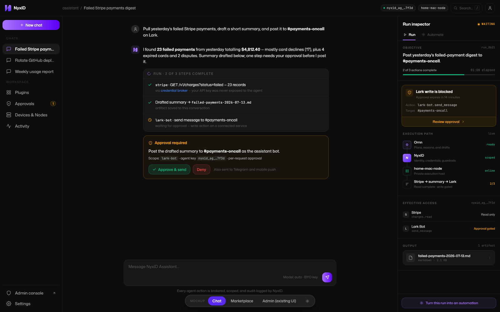
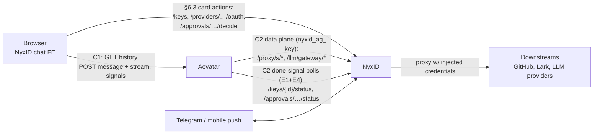
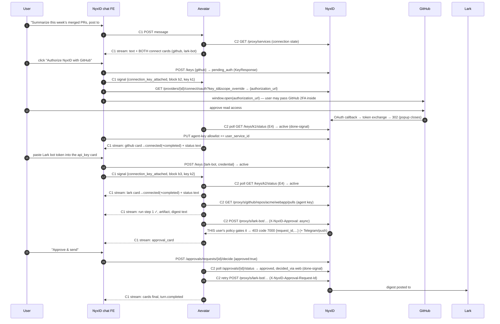

# NyxID Assistant Chat — PRD & NyxID ↔ Aevatar Contract

- **Status:** Draft v7 (planning only — no implementation). v7 rebuilds the user journey on NyxID's *actual* connect flows (OAuth popup / API-key / device-code, all seeded today) and applies journey fact fixes: the user never picks a model; multiple missing connections surface at once; connect gates split into NyxID-observable vs external; verification is a status message, not a card; approval appears only when NyxID policy gates the action.
- **Scope:** This document establishes the contract between NyxID and Aevatar for the assistant chat feature: the interfaces each side serves, the payload/event/block schemas that cross the boundary, and the user flows as boundary choreography. How Aevatar implements its side (storage, scheduling, agent loop internals) is out of scope — only interface-observable behavior is specified.
- **Date:** 2026-07-16
- Claims about existing NyxID endpoints are code-verified with file/line citations.
- `POST /api/v1/chat` is reserved by the separate support-chatbot feature; nothing here touches it.

---

## 1. User journey

Mock scenario, built entirely on providers NyxID seeds today (`services/provider_service.rs`): *"Summarize this week's merged PRs in `acme/webapp` and post the digest to #eng-updates on Lark."* The user is missing **two** connections, with **two different connect modalities**: **GitHub** (`oauth2` — browser popup, NyxID-observable) and **Lark bot** (`api_key` — the user must fetch a bot token from the Lark developer console, which NyxID cannot observe until it's pasted).

Reference visual: `mockups/shot-chat.png` / `mockups/nyxid-assistant-shell.html` (depicts an earlier draft scenario; the card mechanics are identical):



| # | Stage | What the user sees | What happens underneath |
|---|---|---|---|
| 1 | **Ask** | Types the task and sends. No model controls anywhere — **the user never dictates the model; that is Aevatar's concern**, invisible to the journey | FE POSTs the message to Aevatar; the turn stream opens |
| 2 | **Discover — all gaps at once** | Assistant text: *"I need two connections you haven't set up."* **Both** connect cards render together: GitHub (read merged PRs) and Lark bot (post the digest) | Aevatar checks connection state via NyxID and reports the **complete set** of missing permissions in one turn, so the UI can indicate everything up front — no serial surprise-discovery |
| 3 | **Connect, observable gate (GitHub)** | Clicks **Authorize NyxID with GitHub** → GitHub popup (GitHub may demand its own password/2FA inside — that's between the user and GitHub) → approves → popup closes; card flips to "Connected ✓" | FE creates a placeholder key, starts the scoped OAuth flow, signals Aevatar which key to watch; NyxID's callback exchanges the code; Aevatar's status poll observes `active` and completes the card **without the user reporting anything** |
| 4 | **Connect, external gate (Lark bot)** | The card explains where to get a bot token and shows a masked input. The user leaves the chat, creates the token in the Lark console, comes back, pastes it. For gates NyxID can't watch (fetching a key, waiting on a workspace admin, an authenticator confirmation), the card simply **waits, with an "I've done this — check again" button** — only the user can tell us the external step is finished | The pasted secret goes browser→NyxID directly (never through chat). The "check again" button signals Aevatar to re-verify with NyxID immediately |
| 5 | **Status confirmation** | After each connection, a plain **status message** (not a card): *"✓ GitHub connected — `repo` read access, credential sealed in NyxID's vault."* | Aevatar reads the facts back from NyxID (key active, scopes granted) and states them; nothing renders ✓ that NyxID hasn't confirmed |
| 6 | **Execute** | A **run card** ticks through steps live: `github · GET /repos/acme/webapp/pulls?state=closed — 14 merged`, then `Drafted digest → merged-prs-2026-W29.md` | Aevatar calls GitHub through NyxID's proxy (credential injected server-side — the agent never sees a key) and drafts the artifact |
| 7 | **Approve — only if NyxID gates it** | *Either* the digest just posts (no approval UI at all), *or* — because this user's NyxID policy gates Lark writes — an amber **approval card** appears, decidable in chat, Telegram, or mobile | Aevatar always attempts the write through the proxy with the async-approval header; **NyxID's per-service approval config decides**: not gated → normal response, nothing to show; gated → approval request + card. Aevatar never invents approval UI on its own |
| 8 | **Deliver & return** | Digest lands in #eng-updates; run card 3/3 ✓; artifact downloadable. Reloading days later re-renders everything — cards frozen in final states | History is served by Aevatar in final-state form; every agent action is audit-attributed in NyxID under the assistant's agent key |

The user never leaves the chat except when a gate is genuinely external (stage 4) — and then the chat tells them exactly what to do and waits for them.

### Connect modalities (all seeded in NyxID today)

| Modality | Seeded examples | Gate type | How the card completes |
|---|---|---|---|
| `oauth2` popup | github, google, lark, slack, discord, microsoft, twitter, … | **NyxID-observable** (callback + key status) | Automatically — Aevatar polls the key status; user does nothing after the popup |
| `api_key` paste | lark-bot, openai, anthropic, telegram-bot, github-pat, … | **External** until paste | User fetches the secret outside, pastes into the card → key active immediately |
| `device_code` (RFC 8628) | openai-codex | External *action*, **NyxID-observable outcome** | Card shows the user code + verification URL; user confirms on the external surface; NyxID's device-code poll lands the token; card completes automatically |
| Stalled/denied OAuth, pending admin approval | any `oauth2` | **External** (nothing observable until resolved) | Card waits with "I've done this — check again" + "Try again"; abandoned flows converge to key status `failed` (reality check 6) |

---

## 2. Required features

| # | Feature | Journey stage |
|---|---|---|
| R1 | Chat page in the NyxID dashboard: transcript of typed blocks, composer, stop affordance. **No model selection UI** — model choice is Aevatar-internal | 1 |
| R2 | Live streaming of the assistant turn (text deltas + card updates), resumable after network blips | 2-8 |
| R3 | **Multi-connection discovery**: Aevatar surfaces *all* missing connections for the task in one turn; one connect card per service; each completes independently, in any order; the turn resumes when the required set is connected | 2 |
| R4 | **Modality-aware connect cards**: OAuth popup (auto-completing), API-key paste, device-code — plus an explicit waiting state and **"I've done this — check again"** affordance for external gates NyxID cannot observe | 3-4 |
| R5 | **Connection status messages** (not cards): plain text confirmations whose facts are read back from NyxID | 5 |
| R6 | **Run card**: live step ledger with per-step status, service slug, broker note, artifact/approval references | 6 |
| R7 | **Conditional approval-in-chat**: the approval card appears **only** when NyxID's per-service policy gates the attempted write; decidable in chat, Telegram, or mobile; all surfaces converge; expiry countdown | 7 |
| R8 | **Artifacts**: agent-produced files stored with the conversation, previewable and downloadable | 6, 8 |
| R9 | **View history**: any conversation re-renders fully from one GET — cards in final state, no live dependencies | 8 |
| R10 | Least-privilege safety rails: agent never holds raw downstream credentials; the agent key's service allowlist grows only through completed user connects; connect-card secrets never transit the chat; approvals are human-only; every agent action is audit-attributed | all |

---

## 3. Deliverables

### 3.1 The block surface: four cards + status text

Rendered by the NyxID FE from Aevatar's stream and history (schemas §5.5).

#### D1 — Connect card (one per missing service; modality-aware)

OAuth variant (GitHub):

```
┌──────────────────────────────────────────────────────────────┐
│ [G]  Connect GitHub                                          │
│      Read access · repositories & pull requests              │
│                                                              │
│  1  Authorize NyxID with GitHub                              │
│     Opens GitHub in a popup — approve read access.           │
│  2  NyxID seals the credential in your vault                 │
│  3  I resume your task automatically                         │
│                                                              │
│  ┌───────────────────────────────┐                           │
│  │  🔗  Authorize NyxID with GitHub │                           │
│  └───────────────────────────────┘                           │
│  Brokered by NyxID · read-only · revoke anytime in Studio    │
└──────────────────────────────────────────────────────────────┘
```

API-key variant (Lark bot) — the external-gate case:

```
┌──────────────────────────────────────────────────────────────┐
│ [L]  Connect your Lark bot                                   │
│      Posts messages as your bot · #eng-updates               │
│                                                              │
│  Get a bot token from the Lark developer console             │
│  (open.larksuite.com → your app → credentials), then         │
│  paste it here. It goes straight into NyxID's vault.         │
│                                                              │
│  ┌──────────────────────────────┐  ┌─────────┐               │
│  │ ●●●●●●●●●●●●●●●  (masked)     │  │ Connect │               │
│  └──────────────────────────────┘  └─────────┘               │
│  Waiting on you — ⟳ I've done this, check again              │
└──────────────────────────────────────────────────────────────┘
```

States: `needs_connection → waiting_for_provider` (observable gate in progress) `| waiting_for_user` (external gate) `→ connected | error | timed_out`. Device-code variant renders the `user_code` + verification URL and completes automatically (outcome is NyxID-observable).

#### D2 — Connection status message (plain text, replaces the earlier "verification card")

```
✓ GitHub connected — repo (read) granted · credential sealed in NyxID's vault
```

One line per completed connection, streamed as a normal text block. Every stated fact must be readable from NyxID (§5.5 fact binding); no ✓ before NyxID confirms.

#### D3 — Run card

```
┌──────────────────────────────────────────────────────────────┐
│ ⟳  RUN · 2 OF 3 STEPS COMPLETE                               │
│  ✓ github · GET /repos/acme/webapp/pulls?state=closed — 14   │
│      via credential broker — your token was never exposed    │
│  ✓ Drafted digest → merged-prs-2026-W29.md                   │
│      artifact saved to this conversation                     │
│  ⏱ lark-bot · send message to #eng-updates                   │
│      waiting for approval — this write is gated by your      │
│      NyxID policy                                            │
└──────────────────────────────────────────────────────────────┘
```

Step statuses: `done / active / waiting / failed / skipped`. Card states mirror the turn: `running / awaiting_connection / awaiting_approval / completed / failed / cancelled`.

#### D4 — Approval card (conditional — exists only when NyxID gates the write)

```
┌──────────────────────────────────────────────────────────────┐
│ ⚠  Approval required                    expires in 14 min    │
│                                                              │
│  Post the drafted digest to #eng-updates as your Lark bot.   │
│  Scope: lark-bot · agent key nyxid_ag_…7f3d · per-request    │
│                                                              │
│  ┌─────────────────┐  ┌──────┐                               │
│  │ ✓ Approve & send │  │ Deny │   Also sent to Telegram      │
│  └─────────────────┘  └──────┘   and mobile push             │
└──────────────────────────────────────────────────────────────┘
```

End states: approved (green, deciding channel), denied (red), expired (grey + "Request again"), cancelled (grey). Buttons throttle ≥750 ms and disable while pending; a decision on Telegram/mobile flips the card in place. **If the user's policy does not gate the action, no approval UI ever appears — the write just executes.**

#### D5 — Artifact block

```
┌──────────────────────────────────────────────────────────────┐
│ 📄  merged-prs-2026-W29.md                markdown · 2.1 KB  │
│     "14 PRs merged · 3 breaking · highlights: …"             │
│                                              [ Download ]    │
└──────────────────────────────────────────────────────────────┘
```

### 3.2 Deliverables by owner

| Owner | Deliverable |
|---|---|
| **NyxID FE** | Chat page (transcript renderer for the four cards + text, stream client with cursor dedup, composer, stop); card action wiring to existing NyxID endpoints with catalog-side validation (§6.3), covering all three connect modalities + the external-gate "check again" affordance; `/assistant/connect-callback` popup-close page; assistant onboarding step that provisions the agent key (§6.4) |
| **NyxID backend** | **E1** async approval negotiation on the proxy (§6.2); **E2** approval `requester_label` (one line); **E3** catalog verification for the demo services (`github`, `lark-bot` — providers already seeded); **E4** agent-accessible connect-status endpoint (§6.2 — required, see reality check 5) |
| **Aevatar** | Chat API (§5): history GET, message POST, signals, conversation delete, turn stream emitting **only the presentation events of §5.6** (never raw workflow telemetry, §5.8); multi-connection gap reporting (all missing services in one turn); conversation persistence with final-state blocks; artifact storage + download meeting §5.7; the agent loop consuming NyxID's data plane (§6.1), including model selection (never user-facing) |

---

## 4. Responsibility split and boundary rules

| | Serves | Consumes |
|---|---|---|
| **Aevatar** | **C1 — Chat API** (§5): history, messages, stream, signals, delete; all block/event schemas | **C2** with a `nyxid_ag_` agent key: NyxID proxy, LLM gateway, done-signal status endpoints |
| **NyxID** | **C2 — Connection plane** (§6): proxy w/ credential injection, LLM gateway, approvals, key/approval status, catalog; extensions E1-E4 | **C1** from the chat frontend |

Boundary rules:

- Aevatar never sees a downstream credential (broker property) and never receives connect-card secrets (browser → NyxID `/keys` directly).
- Aevatar cannot create approvals via REST (`routes.rs:1045`, human-only) and cannot decide them — approvals exist only as a side effect of Aevatar's own gated proxy calls, and only humans decide. **Whether a write is gated is NyxID's decision alone** (per-service approval config): Aevatar sends the async-approval header on every proxied write and reacts to the answer — 2xx means proceed silently, 403/7000 means render the card and wait.
- **NyxID does not persist or log chat content.** Message-derived bytes do transit NyxID inside brokered LLM-gateway and proxy calls (that is the product), but NyxID's audit log and tracing record metadata only — never prompt or message text.
- Chat content flows FE ↔ Aevatar only; credential/approval actions flow FE ↔ NyxID only; the two meet through block references (`key_id`, `approval_request_id`, `catalog_slug`) and the done-signal (§6.1).



### Reality checks (NyxID code facts the contract is built around)

1. **The proxy's approval flow is synchronous.** `handlers/proxy.rs:1563-1613` creates the approval request then **blocks** in `approval_service::wait_for_decision` (`approval_service.rs:1142`). Timeout/rejection → 403 code 7001; the `ApprovalRequired` (7000) variant (`errors/mod.rs:161`) is currently unused in the live path. E1 makes the gate non-blocking.
2. **Default approval expiry is ~30 s** (`NotificationChannel.approval_timeout_secs`, `approval_service.rs:649-652`) — unusable for a chat card. E1 carries a longer expiry.
3. **`POST /api/v1/approvals/requests` is human-only** (`routes.rs:1045`).
4. **`GET /approvals/requests/{id}/status` rejects session callers but accepts agent keys** (`handlers/approvals.rs:607-609`; `routes.rs:923-926`), with requester-bound reads. The browser never polls it; Aevatar does.
5. **All `/api/v1/keys/*` routes are human-only.** `unified_key_routes` is nested at `routes.rs:1047` inside the router that layers `reject_api_key_tokens` (`routes.rs:1068-1071`) — **an agent key cannot call `GET /keys/{key_id}`**. The connect done-signal therefore requires **E4**, a narrowly-scoped agent-accessible status read mirroring the approval-status precedent.
6. **Denied and abandoned OAuth flows converge to key status `failed`, not `pending_auth`.** The callback error path calls `fail_oauth_placeholders` (`handlers/user_tokens.rs:493,590,686,739`; `services/user_api_key_service.rs:602`), and the key-read handler lazily fails abandoned flows whose OAuth state expired. `failed` is a terminal card-relevant status.
7. **`POST /api/v1/keys` has no scope field.** Scoping happens at OAuth-initiate time via `scope_override` on `GET /providers/{id}/connect/oauth` (`handlers/user_tokens.rs:69-97`). OAuth connect is a two-step: placeholder key, then scoped OAuth initiate. API-key connect is one step (`POST /keys` with `credential` → active immediately).
8. **The OAuth initiate returns JSON `{authorization_url}` (not a redirect); the callback is a 302 redirect** to `{FRONTEND_URL}{redirect_path}?provider_status=success|error[&message=…]` (`user_tokens.rs:804-833`). The FE fetches the JSON, opens the URL in a popup, and detects completion by polling (§6.3).
9. **NyxID's seeded connect modalities are `oauth2`, `api_key`, and `device_code`** (`services/provider_service.rs`; RFC 8628 endpoints at `handlers/user_tokens.rs:928-1042`). The demo services `github` (oauth2) and `lark-bot` (api_key) are both seeded — the mock scenario requires no new connectors, only catalog verification (E3).
10. **No `GET /llm/gateway/v1/models`** (`handlers/llm_gateway.rs:447-463`). Model choice is Aevatar configuration, never user-facing; readiness comes from `GET /api/v1/llm/status`.
11. **Catalog entries carry no `connected` flag** (`handlers/catalog.rs:25-135`); connection state lives on `KeyResponse`.
12. **Proxy-created approvals pass `requester_label: None`** (`proxy.rs:1593`). E2 populates it.

---

## 5. Contract C1 — Chat API (Aevatar serves, NyxID FE consumes)

v1 floor = **four calls**: GET history, POST message, POST signal, DELETE conversation — plus the turn stream carried on the POST (strawman A) or a fifth stream endpoint (strawman B). Paths/envelopes are strawmen with **defaults** (§9); the schemas (§5.5), event catalog (§5.6), and rules (§5.0, §5.7) are binding.

### 5.0 Protocol conventions (binding)

- **Identifiers** are opaque strings, unique within the authenticated user's scope; clients never parse them. `key_id` in signals and connect cards means `KeyResponse.id` (the `UserApiKey` row id returned by `POST /keys`); the same `KeyResponse` carries the `user_service_id` used for allowlist extension (§6.3).
- **Conversation model (v1 default):** one conversation per user, auto-created on first message POST; its `id` is returned by every call and by the history GET. Multi-conversation list/create is v1.1 (§9.6).
- **Authentication:** every C1 call is authenticated as the NyxID user per the §9.4 topology decision; a caller may only touch conversations they own. Unknown or foreign ids are answered not-found-shaped (404), never 403.
- **Versioning:** every message envelope carries `schema_version` (starts at 1). Clients render unknown block types and unknown newer versions as a neutral "unsupported content" shell — never drop, never crash. Aevatar must round-trip unknown fields untouched.
- **Idempotency:** `client_msg_id` is unique per conversation, retained ≥ 24 h. A retry with identical content returns the original message with `deduplicated: true`; a reuse with different content is a 409.
- **Error envelope:** `{ "error": { "code": "<string>", "message": "<string>" } }` with: `404 not_found` (conversation/turn unknown or not owned), `409 turn_active` (message posted while a turn is running), `409 client_msg_id_conflict`, `413 message_too_large` (> 32 KiB), `429 rate_limited`, `409 turn_not_cancellable`, `400 invalid_request`. Exact code strings are Aevatar's to finalize; the *cases* above are binding.
- **Pagination:** `?before=<message_id>&limit=` (default 50, max 100). Messages are ordered by `(created_at, id)` ascending for rendering; pages are served newest-first and `has_more` indicates older messages exist. The cursor is stable under concurrent inserts (new messages never reorder old pages).

### 5.1 `GET {AEVATAR}/assistant/conversations/{id}` — view history

```json
{
  "conversation": { "id", "title", "created_at", "last_message_at",
                    "active_turn": { "id", "last_cursor" } | null },
  "messages": [
    { "id", "role": "user" | "assistant" | "system",
      "schema_version": 1,
      "blocks": [ ContentBlock ],
      "created_at" }
  ],
  "has_more": true
}
```

Binding: blocks arrive in **final/current state** (a decided approval card carries its decision; a connected connect card carries `connected` + `granted_scopes`) so the page renders from this response alone.

### 5.2 `POST {AEVATAR}/assistant/conversations/{id}/messages` — interact

```json
{ "content": "string 1..32768", "client_msg_id": "optional" }
```

Response — streaming shape (default: strawman A, §9.2):

- **Strawman A:** the POST responds `text/event-stream` and streams the whole turn inline. Reconnect after a drop = re-GET history; if `active_turn` is non-null the FE re-attaches via `GET …/turns/{turn_id}/stream?after={cursor}` — **strawman A still requires this re-attach endpoint** for reload-mid-turn; it is the same endpoint strawman B uses as primary.
- **Strawman B:** the POST returns `202 {turn_id}` and the FE always opens `GET …/turns/{turn_id}/stream?after={cursor}`.

Either way the stream carries §5.6 events and the FE reducer is identical.

### 5.3 `POST {AEVATAR}/assistant/conversations/{id}/signals` — card-interaction nudges

```json
{ "type": "connection_key_attached",  "block_id": "…", "key_id": "…" }
{ "type": "external_gate_confirmed",  "block_id": "…" }
{ "type": "approval_decided",         "block_id": "…" }
{ "type": "cancel" }
```

- `connection_key_attached` is **contractually required** — it is the only way Aevatar learns which NyxID key the browser created for a connect card. With multiple connect cards pending, the FE sends one signal per card (`block_id` disambiguates), and may re-send with a new `key_id` after a failed attempt (§6.3).
- `external_gate_confirmed` is the "I've done this — check again" button (journey stage 4): the user asserts an externally-gated step is complete; Aevatar re-verifies with NyxID immediately and resets any waiting deadline for that card. It is a nudge — Aevatar's answer is whatever NyxID's status endpoints actually say.
- `approval_decided` is a best-effort latency nudge over the §6.1 polling guarantee; `cancel` requests turn cancellation (acknowledged via `turn.status`/`turn.completed`, §7 Stop).

### 5.4 `DELETE {AEVATAR}/assistant/conversations/{id}`

Deletes the conversation, its messages, blocks, and artifacts; artifact `download_url`s become invalid. Backs guarantee §8-A7. (Revoking the assistant's NyxID agent key is a separate, FE-offered Studio action.)

### 5.5 Content block schemas (binding)

Tagged union; shared fields `{block_id, type}`; `schema_version` on the message envelope. Four card types plus `text` — connection status confirmations are plain `text` blocks, not a dedicated type.

```jsonc
// text — also used for connection status messages (D2). Fact binding for status
// text: any stated connection fact (connected, scopes granted, credential stored)
// must be readable from the E4 status response (status=="active", granted_scopes,
// last_authorized_at) at the time of emission.
{ "type": "text", "block_id": "…", "text": "markdown-subset string (rendering rules §5.7)" }

// connect_card (D1) — one per missing service; Aevatar emits ALL of them for the
// task in the same message before waiting (multi-connection rule, R3)
{ "type": "connect_card", "block_id": "…",
  "catalog_slug": "github", "service_name": "GitHub", "icon_url": "…",
  "subtitle": "Read access · repositories & pull requests",
  "auth_kind": "oauth" | "api_key" | "device_code",
  "requested_scopes": ["repo"],
  "key_id": "…|null",                    // KeyResponse.id, set after the FE's signal
  "granted_scopes": ["repo"] | null,
  "device_user_code": "…|null",          // device_code variant: code + URL to display
  "device_verification_url": "…|null",
  "state": "needs_connection" | "waiting_for_provider" | "waiting_for_user"
         | "connected" | "error" | "timed_out",
  "error_message": "…|null",
  "steps": [ { "title": "Authorize NyxID with GitHub", "body": "…", "done": true } ],
  "footer": "Brokered by NyxID · read-only · revoke anytime in Studio" }
// NOTE: the card intentionally carries no provider_config_id. The FE re-resolves all
// actionable parameters from the NyxID catalog by catalog_slug (§6.3) — block fields
// are display data, never trusted action inputs.
// States: waiting_for_provider = an observable gate is in progress (popup open /
// device-code pending — NyxID will see the outcome); waiting_for_user = an external
// gate NyxID cannot observe (user fetching a key, admin approval, authenticator) —
// the card waits and offers "I've done this — check again" (external_gate_confirmed).

// run (D3)
{ "type": "run", "block_id": "…",
  "title": "RUN", "steps_total": 3, "steps_complete": 2,
  "state": "running" | "awaiting_approval" | "awaiting_connection" | "completed" | "failed" | "cancelled",
  "steps": [ { "index": 1, "status": "done" | "active" | "waiting" | "failed" | "skipped",
               "label": "github · GET /repos/acme/webapp/pulls?state=closed — 14 merged",
               "meta": "via credential broker — your token was never exposed to the agent",
               "service_slug": "github|null", "artifact_id": "…|null", "approval_request_id": "…|null" } ] }

// approval_card (D4) — emitted ONLY after NyxID answers a write with 403/7000.
// If the user's policy does not gate the action, this block type never appears.
{ "type": "approval_card", "block_id": "…",
  "approval_request_id": "…",            // FE decide + hydrate calls key off this
  "body": "Post the drafted digest to #eng-updates as your Lark bot.",
  "service_slug": "lark-bot", "agent_key_prefix": "nyxid_ag_…7f3d",
  "approval_mode": "per_request" | "grant",   // from the E1 7000 payload
  "grant_duration_sec": 86400 | null,         // grant mode only: duration the decide call will pass
  "expires_at": "rfc3339",                    // FE renders the countdown from this
  "decision": null | "approved" | "denied" | "expired" | "cancelled",
  "decision_channel": null | "web" | "telegram" | "mobile" }
// Vocabulary mapping (binding): NyxID approval status "rejected" ⇄ block decision "denied";
// NyxID decided_via "push" ⇄ block channel "mobile"; unknown channel values → omit the field.
// "Also sent to Telegram / mobile push" copy is FE-rendered from the user's own NyxID
// notification settings, not from this block.

// artifact (D5)
{ "type": "artifact", "block_id": "…", "artifact_id": "…",
  "name": "merged-prs-2026-W29.md", "mime": "text/markdown",
  "size_bytes": 4211, "preview": "first ~500 chars|null",
  "download_url": "…" }                  // Aevatar-served; requirements §5.7
```

### 5.6 Stream event catalog (binding)

| event | payload | notes |
|---|---|---|
| `turn.status` | `{turn_id, status: "running"|"waiting"|"completed"|"failed"|"cancelled"}` | Drives composer/stop-button state |
| `message.started` | `{message_id, role}` | |
| `block.started` | `{message_id, block_id, index, block}` | Full initial block |
| `block.delta` | `{block_id, text}` | Text append |
| `block.updated` | `{block_id, patch}` | Patch semantics below |
| `block.completed` | `{block_id, block}` | Authoritative final form; lifecycle rule below |
| `message.completed` | `{message_id}` | |
| `turn.completed` | `{turn_id, status, error: {code, message}|null}` | Always last; stream closes |

- **Cursor:** every event carries a per-turn monotonic `cursor`; delivery is at-least-once; the FE dedups by `cursor` and reconciles against history by `block_id`. After `turn.completed`, history-GET is the source of truth.
- **Patch semantics:** `block.updated.patch` is a shallow merge in which **every included top-level field is replaced whole** — a patch that touches `steps` MUST carry the complete `steps` array (no partial-array merging).
- **Block lifecycle:** every block eventually receives `block.completed` carrying its full final form. Immutable blocks (`artifact`) are completed immediately after `block.started`. Mutable cards are completed when they reach a terminal state (`connected`/`error`/`timed_out`; `approved`/`denied`/`expired`/`cancelled`; run card terminal states) — including at turn cancellation, so no card is ever left permanently pending (§8-A4).

### 5.7 Rendering, sanitization, and artifact security (binding)

- Text blocks are a **markdown subset**: no raw HTML; links limited to `https:`/`mailto:`, rendered with `rel="noopener noreferrer"` and the full URL visible on hover; no autoloaded remote images (`icon_url` is the one exception and must come from NyxID catalog data, not block-invented URLs).
- Display strings (`label`, `body`, `error_message`, filenames) are untrusted model output: the FE never derives an action, URL, or identifier from them. Actionable parameters come only from the fields designated in §5.5 and are re-validated against NyxID (§6.3).
- No raw downstream response bodies or credentials may appear in any block or event.
- Artifact downloads: authorized as the owning user (per §9.4 topology); `Content-Disposition: attachment` with a sanitized filename; `X-Content-Type-Options: nosniff`; MIME allowlist (v1: `text/markdown`, `text/plain`, `application/json`, `text/csv` — no HTML/SVG); size cap (v1: 256 KiB); URLs stop resolving after conversation deletion.

### 5.8 Prohibition: raw workflow telemetry never reaches the browser

Aevatar's current ad-hoc chat run streams engine telemetry (`aevatar.raw.observed` envelopes carrying workflow YAML incl. full system prompts, actor ids, lease/kernel state; `stepStarted`; `aevatar.step.request` echoing user input). **None of this may appear on C1**: it is unrenderable by the chat UI and leaks prompts and internals. C1 emits exclusively the §5.5/§5.6 presentation vocabulary; how Aevatar maps engine events onto it is Aevatar's internal concern.

---

## 6. Contract C2 — NyxID endpoints (NyxID serves)

### 6.1 Consumed by Aevatar (agent key)

| Purpose | Endpoint | Contract terms |
|---|---|---|
| LLM turns | `ANY /api/v1/llm/gateway/v1/{*path}` (`routes.rs:263-266`) | Agent key accepted (scope `llm:proxy`); SSE passthrough exists. Model selection is Aevatar's (reality check 10) |
| Downstream tool calls | `ANY /api/v1/proxy/s/{slug}/{*path}` (`routes.rs:863-869`) | Credential injection, allowlist enforcement, per-agent rate limiting, audit attribution — all existing. E1 headers below **on every write**; NyxID's per-service policy decides whether a gate fires |
| Service discovery | `GET /api/v1/proxy/services` | What's connected/proxyable for this identity — the basis for the R3 all-gaps-at-once report |
| Provider/model readiness | `GET /api/v1/llm/status` (`routes.rs:262`) | For the zero-connector flow and model choice |
| **Done-signal: connect** | **E4** `GET /api/v1/keys/{key_id}/status` (new) | Poll until terminal: `active` (→ connected) or `failed` (→ error). Response carries the status-message facts. One poll loop per pending connect card |
| **Done-signal: approval** | `GET /api/v1/approvals/requests/{id}/status` (`routes.rs:923-926`), response extended by E1 | Poll while an approval card is pending: `pending → approved | rejected | expired`, plus `decided_via` |

**The done-signal.** Connect and approval complete entirely inside NyxID (browser popup / paste / decide endpoint / Telegram / mobile). Aevatar's guarantee for learning "NyxID is done" is **polling the two status endpoints above** — per pending card when several connections are in flight. FE signals (§5.3) are best-effort latency nudges (`external_gate_confirmed` additionally resets the card's waiting deadline); polling cadence is Aevatar's choice (≤ a few seconds recommended so cards flip promptly). A NyxID→Aevatar webhook is a possible later upgrade, not part of this contract.

Every C2 call is attributed in NyxID's HMAC-chained audit log via the agent key — metadata only, never chat content.

### 6.2 NyxID backend extensions (all new NyxID backend work)

- **E1 — Async approval negotiation on the proxy (required).** Today the proxy blocks while an approval is pending and the ~30 s default expiry makes cards unusable (reality checks 1-2). The extension, in full:
  - Request header `X-NyxID-Approval: async` on gated proxy paths → on `NeedsApproval`, create the approval as today but return immediately: **403, code 7000** (`ApprovalRequired`, exists unused at `errors/mod.rs:161`) with body `{request_id, approval_mode, grant_duration_sec?, expires_at}` — everything the approval card needs. **When the user's policy does not gate the call, the header is inert and the request proceeds normally** — this is how "approval doesn't happen all the time" is brokered: Aevatar always sends the header on writes; NyxID's config decides.
  - **Operation binding:** at creation NyxID records an operation descriptor — owner user, requester `api_key_id`, service id, HTTP method, normalized path, and a digest of the material request body. The retry header `X-NyxID-Approval-Request-Id: {id}` is honored only when the retried request matches the recorded descriptor **and** the row is approved, unconsumed, and unexpired. A mismatch is a plain approval-required evaluation (no partial reuse).
  - **Consumption semantics:** the single-use consumption stamp is claimed atomically (`find_one_and_update`) **before** the downstream request is forwarded. If the downstream call then fails or the outcome is ambiguous, the approval is spent — the next attempt returns a fresh 7000 and requires a new human decision. This buys at-most-once side effects per approval; mind the existing grant-mode TOCTOU guard (`approval_service.rs:821-851`).
  - **Expiry:** async-mode approvals expire after `ASSISTANT_APPROVAL_TTL_SECS` (default 900, new env) instead of the 30 s channel default.
  - **Status response extension:** `GET /approvals/requests/{id}/status` additionally returns `decided_via: "web"|"telegram"|"push"|null` so Aevatar can populate `decision_channel` (mapping in §5.5).
  - *Degraded fallback (no E1):* the gated call blocks ≤ 30 s and returns 403/7001 with `request_id` — the card renders late with a blind window; acceptable only for early demos.
- **E2 — Approval attribution (one line).** Populate `requester_label` from `AuthUser.api_key_name` at proxy approval creation (`proxy.rs:1593`) so Telegram/mobile name the assistant.
- **E3 — Catalog verification for the demo services.** `github` (oauth2) and `lark-bot` (api_key) providers are already seeded (`services/provider_service.rs`); verify their catalog/`DownstreamService` entries, scope metadata (`repo` read for GitHub), and card copy. No new connectors needed.
- **E4 — Agent-accessible connect status (required — reality check 5).** New route `GET /api/v1/keys/{key_id}/status`, mounted in the delegated router exactly like the approval-status precedent (separate route registration outside the human-only `/keys` nest). Accepts agent keys; requester-bound: the key must belong to the calling agent key's user, else not-found-shaped 404. Response: `{status, granted_scopes, last_authorized_at, user_service_id}`. Runs the same lazy placeholder reconciliation as the human read (reality check 6), so abandoned flows converge to `failed` for the poller too.

No other new NyxID routes, collections, or error codes.

### 6.3 Consumed by the NyxID FE (session auth) — card actions

| Card action | Endpoint | Notes |
|---|---|---|
| Approve / Deny buttons | `POST /api/v1/approvals/requests/{id}/decide` `{approved, duration_sec?}` + `idempotency-key` (`routes.rs:526`) | Human session; grant mode passes the card's `grant_duration_sec` |
| Approval card hydrate | `GET /api/v1/approvals/requests/{id}` (`routes.rs:522`) | Human-only route; browser never polls the `/status` variant (reality check 4) |
| Connect (oauth2): placeholder key | `POST /api/v1/keys` (`routes.rs:637`) → `KeyResponse {id, user_service_id, status:"pending_auth", …}` | Then signal Aevatar with `key_id = KeyResponse.id` (§5.3) |
| Connect (oauth2): scoped initiate | `GET /api/v1/providers/{provider_config_id}/connect/oauth?key_id&scope_override&redirect_path` (`routes.rs:218-221`) → JSON `{authorization_url}` | Binding mechanics: FE fetches the JSON, `window.open(authorization_url)`; the callback 302s to `{FRONTEND_URL}/assistant/connect-callback?provider_status=…`, a same-origin page that self-closes; completion is detected by polling, never by `postMessage` |
| Connect (api_key): one-step | `POST /api/v1/keys {service_slug, credential}` → active immediately | Secret goes browser→NyxID only; signal Aevatar with the returned `key_id` |
| Connect (device_code) | `POST /api/v1/providers/{id}/connect/device-code/initiate` + `/poll` (`handlers/user_tokens.rs:928-1042`) | Card displays `user_code` + verification URL; outcome lands on the key — Aevatar's E4 poll completes the card |
| Connect progress (card feedback) + retry | poll `GET /api/v1/keys/{key_id}` | On `failed` (denied/abandoned — reality check 6): card → `error`; **Try again creates a fresh placeholder key and re-sends `connection_key_attached` with the new `key_id`** |
| External gate "check again" | — (C1 signal `external_gate_confirmed`, §5.3) | No NyxID call; Aevatar re-verifies via E4 |
| Catalog metadata + validation | `GET /api/v1/catalog`, `GET /api/v1/catalog/{slug}` (`routes.rs:759-765`) | **Binding validation rule:** the FE resolves `provider_config_id`, service name, and scope set from the catalog entry for the card's `catalog_slug`; it requires `requested_scopes ⊆` the catalog's scope set and refuses the action otherwise. Card fields are never used directly as action inputs (§5.7) |
| Allowlist extension after connect | existing API-key scope update (`/api-keys/{id}`) | Session-authed FE action at connect completion: append the `user_service_id` from E4/`KeyResponse` to the agent key's `allowed_service_ids` |

Services connected in-chat are ordinary NyxID rows — they appear in the Plugins/`/keys` page, so "revoke anytime in Studio" is true by construction.

### 6.4 The agent key (C2 credential — decision §9.5)

Aevatar authenticates C2 with a `nyxid_ag_` key. Binding terms regardless of provisioning choice:

- It is an ordinary NyxID `ApiKey`: visible and revocable in Studio; deletion/revocation must take effect on C2 immediately (401s), and Aevatar must treat a C2 401 as terminal for the key (stop, surface a reconnect path).
- Scoped least-privilege: `allow_all_services: false`; the allowlist grows **only** via the §6.3 connect-completion extension. (A broad-access key is not a v1 fallback; any broadening requires an explicit, informed user grant in the UI.)
- Delivered once over TLS at provisioning; stored encrypted by Aevatar; never logged, never in chat content or LLM context; rotation = FE mints a replacement and re-delivers.
- Per-key `rate_limit_per_second`/`rate_limit_burst` bound the assistant's data-plane traffic.

Default provisioning (§9.5): per-user key minted by the FE at assistant onboarding. Per-conversation keys and token-exchange variants are candidate upgrades, not v1.

---

## 7. Flows (boundary choreography)

### Flow 1 — Golden path (GitHub OAuth + Lark bot API key, approval gated by this user's policy)



**Ungated variant:** if the user's policy does not gate `lark-bot` writes, the `X-NyxID-Approval: async` call simply succeeds — no 7000, no approval card, the run card goes straight to 3/3. The journey's stage 7 evaporates without either side special-casing anything.

### Flow variants

- **History / reload:** C1 history GET → blocks in final state render the whole page; if `active_turn` is non-null the FE attaches to the turn stream with `after={cursor}` and reconciles by `block_id` + cursor.
- **Multiple pending connects:** cards complete independently, in any order; Aevatar runs one E4 poll loop per attached key; the turn resumes when the required set is `active`. Cards still pending at the waiting deadline go `timed_out` and the turn closes honestly (partial connections stay connected — they're ordinary NyxID rows).
- **External gate (stalled OAuth, admin approval, authenticator):** nothing is observable server-side while the user works elsewhere. The card sits in `waiting_for_user` with "I've done this — check again" (`external_gate_confirmed` → immediate E4 re-check + deadline reset) and "Try again" (fresh placeholder, new signal). Denied/abandoned OAuth converges to key `failed` (reality check 6) → card `error`.
- **Approval decided on Telegram/mobile:** decisions land in NyxID's existing webhook paths (`process_decision` matches only pending rows — idempotent against a simultaneous in-chat click); Aevatar's status poll observes the outcome + `decided_via` identically to a web decision.
- **Approval denied:** poll returns `rejected` → card `denied` (red, disabled) + completed, run-card step ✗, closing text; the artifact remains.
- **Approval expired:** E1 TTL (default 900 s); NyxID's existing 5 s sweep flips the row and edits the Telegram message; poll returns `expired` → card `expired` + "Request again" (sends a canned user message).
- **Stop:** FE sends `{type:"cancel"}` → Aevatar stops at a step boundary, patches open cards to terminal states (`approval_card.decision:"cancelled"`; connect cards `timed_out`; run card `cancelled`), emits their `block.completed`, then `turn.completed {cancelled}`. Any pending NyxID approval row is left to expire server-side.
- **Zero connectors (new user):** no ready LLM provider (`GET /api/v1/llm/status`) → Aevatar streams a templated (non-LLM) text block + a provider connect card (api_key variant). The secret goes browser→NyxID directly; key active → Aevatar answers the original question.

---

## 8. Contract guarantees (summary)

**Aevatar guarantees (interface-observable):**
- **A1.** History GET renders any conversation completely — blocks in final/current state, no other calls needed.
- **A2.** Unknown block types and fields round-trip untouched; `schema_version` present on every message.
- **A3.** `client_msg_id` idempotency and the §5.0 error cases; at-least-once stream delivery with monotonic `cursor`; patches follow §5.6 whole-field semantics.
- **A4.** Every block reaches `block.completed` in a terminal state — no permanently-pending cards, including on cancellation and multi-connect timeouts.
- **A5.** Connection status text and connect-card ✓ states assert only facts readable from the E4 status response at emission time.
- **A6.** Only §5.5/§5.6 presentation events reach the browser — never raw workflow telemetry, system prompts, or engine state (§5.8); §5.7 sanitization holds for every block; the agent key and connect-card secrets never appear in C1 payloads or LLM context.
- **A7.** `DELETE` removes messages, blocks, and artifacts; artifact URLs stop resolving.
- **A8.** Missing connections for a task are reported **completely and at once** (one connect card each, same message) — no serial discovery across turns; and approval UI is emitted **only** in reaction to a NyxID 7000, never speculatively.

**NyxID guarantees (interface-observable):**
- **N1.** C2 endpoints per §6.1 remain agent-key-accessible with requester-bound reads; done-signal endpoints return the states this contract keys on (`active|failed`; `pending|approved|rejected|expired` + `decided_via`).
- **N2.** E1 semantics as specified in §6.2: the async header is inert on ungated calls; immediate 7000 with the card payload on gated ones; operation-bound single-use consumption claimed before forwarding; configurable expiry; unchanged cross-channel decision convergence.
- **N3.** Card endpoints (§6.3) remain session-authed; decide stays human-only; connect-card secrets terminate at NyxID.
- **N4.** Data-plane enforcement (credential injection, allowlists, rate limits, audit) applies to every Aevatar call with no assistant special-casing; NyxID persists/logs no chat content (§4).

---

## 9. Open decisions (defaults apply unless the named owner objects during contract review)

| # | Decision | Default | Owner |
|---|---|---|---|
| 1 | C1 paths + envelopes | Strawman shapes in §5 as written | Aevatar |
| 2 | Streaming shape | A (POST returns SSE) + the shared re-attach endpoint `GET …/turns/{id}/stream?after=` | Aevatar + FE |
| 3 | Signals transport | Dedicated `POST …/signals` (§5.3, four types) | Aevatar |
| 4 | FE↔Aevatar auth topology | Thin NyxID pass-through under `/api/v1/assistant/*` (session cookie + native `EventSource` work; NyxID forwards verified user identity). Direct Aevatar validation of NyxID-issued JWTs (NyxID is an OIDC provider with JWKS) is the later, cleaner alternative — requires FE bearer handling + CORS + non-`EventSource` streaming | Both |
| 5 | Agent-key provisioning | Per-user key minted by the FE at onboarding, delivered once, §6.4 terms; per-conversation keys / RFC 8693 token exchange later | Both |
| 6 | Conversation model | One auto-created conversation per user; list/create/rename v1.1 | Aevatar |
| 7 | Artifact download auth | Follows decision 4's topology; §5.7 requirements binding either way | Aevatar |

**Standing risk:** E1 touches the proxy's most security-sensitive path (operation binding, consumption atomicity, grant-mode TOCTOU). It ships with its own test matrix and is built as a connection-plane feature, not an assistant special case.

---

## Appendix A — Golden-path stream transcript (fixture for the §9.1/§9.2 defaults)

All events Aevatar-emitted on C1. `cursor` = per-turn monotonic sequence. Payloads abbreviated (`…`) for readability — in real streams every `block.updated` patch carries complete field values per §5.6 (e.g. the full `steps` array), and every `block.completed` carries the full block.

```text
cursor 1   turn.status        {"turn_id":"t1","status":"running"}
cursor 2   message.started    {"message_id":"m2","role":"assistant"}
cursor 3   block.started      {"message_id":"m2","block_id":"b1","index":0,"block":{"type":"text","text":""}}
cursor 4   block.delta        {"block_id":"b1","text":"To do that I need two connections you haven't set up: **GitHub** (read the merged PRs) and your **Lark bot** (post the digest)."}
cursor 5   block.completed    {"block_id":"b1","block":{…}}
cursor 6   block.started      {"message_id":"m2","block_id":"b2","index":1,"block":{"type":"connect_card","catalog_slug":"github","auth_kind":"oauth","state":"needs_connection","requested_scopes":["repo"],…}}
cursor 7   block.started      {"message_id":"m2","block_id":"b3","index":2,"block":{"type":"connect_card","catalog_slug":"lark-bot","auth_kind":"api_key","state":"needs_connection",…}}
cursor 8   turn.status        {"turn_id":"t1","status":"waiting"}

# — user clicks GitHub authorize; FE: POST /keys → signal {connection_key_attached, b2, k1} → OAuth popup

cursor 9   block.updated      {"block_id":"b2","patch":{"state":"waiting_for_provider","key_id":"k1"}}

# — user approves at GitHub (incl. any GitHub-side 2FA); callback lands; Aevatar E4 poll of /keys/k1/status → active

cursor 10  block.updated      {"block_id":"b2","patch":{"state":"connected","granted_scopes":["repo"]}}
cursor 11  block.completed    {"block_id":"b2","block":{…terminal github card…}}
cursor 12  block.started      {"message_id":"m2","block_id":"b4","index":3,"block":{"type":"text","text":"✓ GitHub connected — repo (read) granted · credential sealed in NyxID's vault."}}
cursor 13  block.completed    {"block_id":"b4","block":{…}}

# — user fetches the Lark bot token externally (card in waiting_for_user if they defer),
#   pastes it; FE: POST /keys {lark-bot, credential} → active → signal {connection_key_attached, b3, k2}

cursor 14  block.updated      {"block_id":"b3","patch":{"state":"connected","key_id":"k2"}}
cursor 15  block.completed    {"block_id":"b3","block":{…terminal lark card…}}
cursor 16  block.started      {"message_id":"m2","block_id":"b5","index":4,"block":{"type":"text","text":"✓ Lark bot connected. Resuming your task."}}
cursor 17  block.completed    {"block_id":"b5","block":{…}}
cursor 18  message.completed  {"message_id":"m2"}
cursor 19  turn.status        {"turn_id":"t1","status":"running"}
cursor 20  message.started    {"message_id":"m3","role":"assistant"}
cursor 21  block.started      {"message_id":"m3","block_id":"b6","index":0,"block":{"type":"run","steps_total":3,"steps_complete":0,"state":"running",…}}
cursor 22  block.updated      {"block_id":"b6","patch":{"steps_complete":1,"steps":[…FULL array, step1 done: "github · GET /repos/acme/webapp/pulls?state=closed — 14 merged"…]}}
cursor 23  block.started      {"message_id":"m3","block_id":"b7","index":1,"block":{"type":"text","text":""}}
cursor 24  block.delta        {"block_id":"b7","text":"**14 PRs merged this week** — 3 breaking, highlights: …"}
cursor 25  block.completed    {"block_id":"b7","block":{…}}
cursor 26  block.started      {"message_id":"m3","block_id":"b8","index":2,"block":{"type":"artifact","artifact_id":"a1","name":"merged-prs-2026-W29.md",…}}
cursor 27  block.completed    {"block_id":"b8","block":{…}}          # artifact is immutable → completed immediately
cursor 28  block.updated      {"block_id":"b6","patch":{"steps_complete":2,"steps":[…FULL array…]}}

# — Aevatar attempts the Lark write with X-NyxID-Approval: async.
#   THIS user's policy gates lark-bot writes → NyxID returns 403/7000
#   {request_id:"ap1", approval_mode:"per_request", expires_at:…} (E1).
#   (If the policy did not gate it, the write would succeed here and
#    cursors 29-34 would not exist.)

cursor 29  block.updated      {"block_id":"b6","patch":{"state":"awaiting_approval","steps":[…FULL array, step3 waiting…]}}
cursor 30  block.started      {"message_id":"m3","block_id":"b9","index":3,"block":{"type":"approval_card","approval_request_id":"ap1","approval_mode":"per_request","expires_at":"…","decision":null,…}}
cursor 31  turn.status        {"turn_id":"t1","status":"waiting"}

# — user decides (web/Telegram/mobile); Aevatar poll of /approvals/…/status → approved, decided_via "web"

cursor 32  block.updated      {"block_id":"b9","patch":{"decision":"approved","decision_channel":"web"}}
cursor 33  block.completed    {"block_id":"b9","block":{…terminal approval card…}}
cursor 34  turn.status        {"turn_id":"t1","status":"running"}

# — Aevatar retries with X-NyxID-Approval-Request-Id; Lark post succeeds

cursor 35  block.updated      {"block_id":"b6","patch":{"state":"completed","steps_complete":3,"steps":[…FULL array…]}}
cursor 36  block.completed    {"block_id":"b6","block":{…final run card…}}
cursor 37  message.completed  {"message_id":"m3"}
cursor 38  turn.completed     {"turn_id":"t1","status":"completed","error":null}
```

Reducer rules: (1) `block.completed` / stored history state is authoritative; deltas/patches are progressive rendering; (2) cards mutate via whole-field patches keyed by `block_id`, so a client re-attaching from any cursor converges; (3) `turn.status` drives the composer/stop button; (4) after `turn.completed` the stream closes and history-GET is the source of truth.
