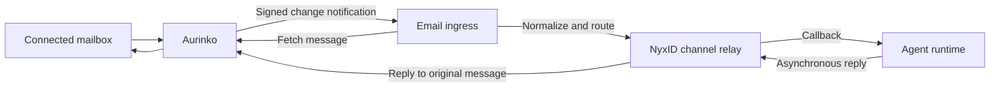

**Aurinko as an email channel for NyxID — feasibility assessment**

Investigated on 2026-09-16 using Aurinko's public documentation, its published OpenAPI specification, Google's Gmail scope documentation, and this checkout. This is a documentation and code assessment; no mailbox was connected and no email was sent. Provider behavior and latency remain unmeasured.

**Recommendation: proceed with a bounded proof of concept.** Aurinko supplies the main capabilities for a bot that receives email in a connected mailbox and replies in its existing threads. Its unified API would save us separate Gmail, Microsoft Graph, and IMAP integrations. NyxID already supplies agent routing and asynchronous replies, but production reliability needs more than adding an adapter. Start with dedicated Gmail/Workspace and Microsoft 365 mailboxes, and qualify IMAP and other providers afterward.

Aurinko connects existing mailboxes; the bot runtime and conversation policy remain ours. This assessment assumes mailbox owners authorize their own accounts. An internally owned bot mailbox is also a good initial use case. Creating arbitrary new addresses on a platform-owned domain would be a different product requirement.

The proposed Gmail and Microsoft 365 proof of concept means **connecting those mailboxes through Aurinko**. NyxID registers its receiving URL with Aurinko using `POST /v1/subscriptions` and `resource: "/email/messages"`. Aurinko then sends HTTP POST notifications to that URL. This does not require NyxID to run a periodic mailbox poller for normal event discovery; fetching a message in response to a notification is a separate operation.

There are two distinct delivery legs: provider-to-Aurinko and Aurinko-to-NyxID. Aurinko documents using provider subscriptions or polling for the first leg, and offers its own webhook for the second. The specific upstream mechanism and latency should be confirmed per provider. Gmail has a push path through Google Cloud Pub/Sub, including push subscriptions that POST to an HTTPS endpoint. Microsoft Graph directly supports message change-notification webhooks. Direct integrations would therefore also have push options, but we would own their provider-specific setup, subscription renewal, and recovery. [Google push documentation](https://developers.google.com/workspace/gmail/api/guides/push), [Microsoft Outlook change notifications](https://learn.microsoft.com/en-us/graph/outlook-change-notifications-overview), [Aurinko webhooks](https://docs.aurinko.io/unified-apis/webhooks-api).

The Twitter polling approach mentioned in the discussion was not located in this checkout, so no claim is made here about reusing its specific implementation. Architecturally, that approach would be an alternative if we choose to operate mailbox polling ourselves. Aurinko's value is providing a unified notification and mailbox API while managing much of the provider integration.

**The documented capabilities fit the core use case.**

| Requirement | Verified Aurinko capability | Implication |
| --- | --- | --- |
| Provider coverage | Email documentation lists Gmail, Office 365, Outlook.com, MS Exchange, Zoho Mail, iCloud, and IMAP. | Broad coverage is credible, but uniform behavior across all providers still needs testing. |
| Incoming notifications | Account-scoped subscriptions to `/email/messages`; webhook examples include `accountId`, `subscription`, and batches of message IDs with `created`, `updated`, or `deleted` change types. | These are mailbox-change notifications. Fetch and classify a message before presenting it as a new user turn. |
| Read a message | `GET /v1/email/messages/{messageId}` exposes sender, recipients, subject, body, headers, labels, attachments, and thread identifiers. | There is enough data to construct a useful channel callback. |
| Reply in context | `POST /v1/email/messages/{messageId}/reply`; the schema accepts subject, body, recipients, and attachments. | Use the original message ID as the reply anchor. Confirm actual threading and recipient behavior per provider. |
| Start a conversation | `POST /v1/email/messages` sends a new email; its schema includes `inReplyTo` and `references`. | Possible later, with an explicit outbound recipient policy. |
| Clean bot input | Fetch parameters include `bodyType=text` and `stripQuoted=true`. | Useful for avoiding repeated quoted history; validate against representative messages. |
| Attachments | Attachment metadata, authenticated download endpoint, and base64 outbound attachment content are documented. | Support exists, but the channel needs an authorized attachment access path and size limits. |
| Recover missed changes | Initial and incremental email sync with page and delta tokens. | A connector/runtime can reconcile after downtime without NyxID storing mailbox bodies. |
| Authentication | Per-account bearer token; Aurinko says it maintains provider authorization and renews underlying provider subscriptions. | NyxID must still store its Aurinko token securely and handle revocation/reconnection. |

Sources: [Email API](https://docs.aurinko.io/unified-apis/email-api), [Webhooks API](https://docs.aurinko.io/unified-apis/webhooks-api), [API reference](https://apirefs.aurinko.io/), [OpenAPI JSON](https://apirefs.aurinko.io/assets/swagger.json), and [platform overview](https://docs.aurinko.io/getting-started/readme). These are vendor descriptions, not independently measured guarantees.

The OpenAPI subscription schema additionally exposes `filters: ["withoutDrafts"]` and `detailLevel` values `signal` and `status`. The documented `signal` mode can omit the data payload entirely for supported Google subscriptions and is intended to trigger sync. Neither documented mode establishes full email-body delivery in the webhook.

**The logical flow is straightforward; ownership of recovery is the significant design choice.**

This diagram is a proposed integration, not an existing route. A separate connector is the best place for mailbox sync, durable acceptance, and retries if we preserve the existing gateway boundary. It can retain account/message identifiers and progress, fetch content when needed, and forward normalized messages through a new authenticated ingress. NyxID continues routing callbacks and sending replies while persisting routing metadata only. The mailbox and agent runtime retain message history. Identifier-only recovery cannot recover a message that has already been deleted from the mailbox; stronger retention would be an explicit connector/runtime responsibility.

An alternative is a native adapter with bounded inline fetch/forward, returning a retryable failure to Aurinko when delivery fails. That requires a new acknowledgment/error policy and validation of notification timeout and batch behavior. It also benefits from external delta reconciliation. Do not silently add a mailbox queue or background redelivery loop to the gateway: [ADR-013](../CHANNEL_EVENT_GATEWAY.md) explicitly excludes that behavior.

**What already fits in NyxID, and what must change:**

| Area | Current implementation | Required email work |
| --- | --- | --- |
| Adapter registration | [Adapter registry](../../backend/src/services/channel_adapters/mod.rs) and [platform trait](../../backend/src/services/channel_platform.rs). | Add an email/Aurinko adapter and registration descriptor. No current email adapter was found. |
| Incoming content | `parse_inbound` receives body bytes. `prepare_webhook` receives bot and verification context, but no explicit shared HTTP client/account-token context. | Introduce a deliberate authenticated fetch/normalization stage, or accept normalized input from a connector. |
| URL verification | Existing POST handler receives headers/body but does not extract query parameters; challenge responses use JSON. A separate subscription hook handles GET. | Aurinko requires a signed **POST** with `?validationToken=...`, answered as exact `text/plain` within 30 seconds. Add support for this shape. |
| Callback delivery | [Bot webhook handler](../../backend/src/handlers/channel_webhooks.rs) suppresses processing errors and acknowledges them; immediate mode uses an in-process task. | Define acceptance and recovery before acknowledging. Current behavior can lose an email event after returning success. |
| Deduplication | Bot retry detection is explicitly a best-effort lookup in [relay service](../../backend/src/services/channel_relay_service.rs); it is not a concurrent claim and checks existence regardless of delivery status. | Use atomic metadata claims and delivery-aware completion. [Event gateway](../../backend/src/services/channel_event_service.rs) has reusable claim/commit/release machinery. |
| Reply anchor | [Reply handler](../../backend/src/handlers/channel_relay.rs) builds `reply_to_platform_message_id` from the stored inbound message. | This maps naturally to Aurinko's reply endpoint. Fetch original context again if necessary to resolve subject and permitted recipients. |
| Content retention | [ChannelMessage](../../backend/src/models/channel_message.rs) stores metadata only. Callbacks can carry transient `raw_platform_data`. | Keep subject/body/recipient detail transient; retain only necessary routing and progress data. |
| User setup | [Frontend schemas](../../frontend/src/schemas/channels.ts), platform configuration, and CLI use existing chat platform fields and flows. | Add mailbox authorization, connection status/reconnect, provider labels, and email-aware conversation presentation. |

Aurinko retries notifications for HTTP statuses other than `200` and `422`, with exponential delays of 1, 2, 4, 8 seconds and a maximum interval of 10 minutes. **A `422` response removes the subscription.** The public page does not specify a total retry duration, normal-event acknowledgment deadline, ordering guarantee, or maximum batch size. The 30-second deadline above is specifically for subscription verification. [Webhook behavior](https://docs.aurinko.io/unified-apis/webhooks-api), [verification handshake](https://docs.aurinko.io/unified-apis/webhooks-api/notification-url-verification).

For a reliable implementation, acknowledge only after the next component has durably accepted the work, or after a bounded delivery succeeds. Deduplicate individual messages within batches; release failed claims so redelivery can recover them. Agent processing also needs deduplication because an accepted callback whose acknowledgment is lost can be delivered again. Advance sync checkpoints only after work is accounted for. Bootstrap a cursor around activation and suppress replies to pre-activation history so reconnecting does not answer old mail.

**Email-specific behavior needs explicit product rules.** These are engineering recommendations, not additional Aurinko guarantees:

- Scope a conversation by mailbox/account plus email thread. A sender address alone would mix unrelated subjects. Keep NyxID's internal UUIDs separate from Aurinko's numeric account ID and opaque message/thread IDs.
- Use Aurinko's documented thread IDs where available. For IMAP without native threading, `requireThreadId=true` can return HTTP `408` with `Retry-After` while Aurinko discovers the thread. The response also has an `omitted` field for missing data. Never silently collapse absent thread IDs into a common conversation.
- Exclude drafts, sent copies, junk/trash, and the connected mailbox's own messages. Treat label/read-status changes as changes rather than new turns; classify previously unseen messages if a provider's behavior requires it.
- Suppress automatic responses to bounces, delivery reports, out-of-office replies, and mailing-list traffic by default. Use available headers and message metadata, and test provider differences.
- Default to one reply to the original correspondent, honoring the original `Reply-To` under the chosen policy. Require explicit configuration for reply-all. Resolve recipients from the verified original message; do not allow a model to turn a channel reply into arbitrary recipient expansion. Do not expose Bcc recipients.
- A signed webhook authenticates Aurinko delivery, not the human identity asserted by an email's `From` header. Mail content must not acquire the bot owner's execution authority merely by reaching the inbox. Apply existing approval rules to sensitive downstream actions.
- Fetch attachments through a scoped authenticated path. Avoid putting account tokens in URLs or forwarding all mailbox credentials to the agent. Disable tracking pixels/follow-up automation unless explicitly needed.
- Do not assume an uncertain send is safe to retry. `returnIds=true` promises IDs only “if possible.” Aurinko's send response permits `processingStatus: Incomplete` after successful submission, including failure to obtain returned IDs. Its SMTP `submittedMessageId` may be rewritten by the server. The reviewed specification has no documented send idempotency parameter/header; confirm available deduplication/reconciliation before promising exactly-once sending.

The thread and send details above come from the [message fetch](https://apirefs.aurinko.io/#tag/Messages/operation/message), [reply](https://apirefs.aurinko.io/#tag/Messages/operation/reply), and `EmailSendResponse`/`EmailSendError` schemas in the [published specification](https://apirefs.aurinko.io/assets/swagger.json).

**Onboarding is the biggest provider prerequisite.** Request `Mail.Read Mail.Send` for basic receive/reply behavior. The current OpenAPI enum and scopes table use those names; older provider setup examples use `Mail.ReadOnly`, so implement against the current contract and verify the real consent flow. Draft workflows require additional permission. Aurinko returns an account token from a server-side code exchange, and its documented flow is not a drop-in standard token endpoint for a generic OAuth connector. [Scopes](https://docs.aurinko.io/authentication/authentication-scopes), [account OAuth](https://docs.aurinko.io/authentication/oauth-flow/account-oauth-flow).

Aurinko explicitly **does not provide a shared verified Google OAuth application**. NyxID would configure its own Google client and applicable verification; individual mailbox users would then consent through that application. Internal Workspace-only deployments have a simpler route, as described in Aurinko's setup guide. Gmail read access is a restricted scope; Google's documentation says server storage or transmission of restricted-scope data requires a security assessment, subject to applicable exceptions. Aurinko removes provider API integration work but does not remove this public-launch prerequisite. [Aurinko FAQ](https://docs.aurinko.io/faq/does-aurinko-provide-a-shared-verified-google-oauth-application), [Google setup](https://docs.aurinko.io/authentication/google-oauth-setup), [Google scope requirements](https://developers.google.com/workspace/gmail/api/auth/scopes).

Gmail push delivery requires configuring a Google Cloud Pub/Sub topic/subscription and granting Gmail publication access. Aurinko documents a mixture of native subscriptions and polling across resources, without a per-provider latency guarantee. Microsoft 365 requires our Azure/Entra app registration and appropriate tenant consent. Its documented flow also requests several identity/offline/mailbox-settings scopes implicitly. [Gmail Pub/Sub](https://docs.aurinko.io/unified-apis/webhooks-api/configuring-pub-sub-for-gmail-api-webhooks), [Microsoft setup](https://docs.aurinko.io/authentication/office-365-oauth-setup).

NyxID requires PKCE for OAuth flows. I found no PKCE/code-challenge parameters in Aurinko's published authorize/code-exchange operations or guide. Confirm support or determine an architecture that satisfies this requirement before implementing managed onboarding; absence from these docs does not prove lack of support. Keep state binding, owner binding, redirect validation, and server-side secret storage in the design.

For webhook authentication, Aurinko documents HMAC-SHA256 over `v0:{timestamp}:{raw_body}`, using an application signing secret and `X-Aurinko-Request-Timestamp` / `X-Aurinko-Signature`. Use constant-time comparison and establish a tested timestamp policy compatible with retries. Bind both account and subscription to the configured mailbox; an app-wide signature alone does not establish the correct tenant. [Signature documentation](https://docs.aurinko.io/unified-apis/webhooks-api/authentication).

**Pricing is attractive, but the published pages conflict.**

| Source retrieved on 2026-09-16 | Published price |
| --- | --- |
| [Billing FAQ](https://docs.aurinko.io/faq/how-does-aurinko-billing-work) | Non-IMAP Email: **$1.50 per active account/month**, up to 1 GB. Full Platform including IMAP: **$2 per active account/month**, unlimited traffic. |
| [Marketing pricing page](https://www.aurinko.io/pricing/) | Unified API: **$1** below 1 GB, **$1.50** below 5 GB, **$2** unlimited; it lists Email among included APIs without the FAQ's distinction. |

Use **$1.50–$2 per active mailbox/month as a provisional planning range**, pending vendor confirmation. At 100 active mailboxes that is $150–$200/month; at 1,000 it is $1,500–$2,000/month. Those are arithmetic estimates, exclude mailbox hosting, our compute/model costs, and any volume terms, and are not a quote.

The FAQ counts an account as active once it exceeds **10 API calls or 1 MB** in a billing month, and says connections to the same mailbox are deduplicated for billing. Deleting a mailbox connection does not reverse that month's active charge. The documented free trial lasts 14 days. The API reference lists 250 API requests/second but does not clearly identify its scope; upstream provider limits also apply. “Unlimited traffic” does not establish unlimited send throughput. [Billing FAQ](https://docs.aurinko.io/faq/how-does-aurinko-billing-work), [trial](https://docs.aurinko.io/getting-started/subscribe-to-aurinko), [API reference](https://apirefs.aurinko.io/).

**The proof of concept should answer concrete production questions.**

1. Connect one dedicated Gmail/Workspace mailbox and one Microsoft 365 mailbox; verify scopes, original-account binding, code exchange, reconnect, and the signed POST handshake.
2. Measure receive-to-callback and reply latency, including a multi-turn thread, two unrelated threads from the same sender, `Reply-To`, CC, HTML, quoted content, and an attachment.
3. Replay the same event concurrently, partially fail a batch, stop the agent, and restart ingress after acceptance. Verify eventual processing without duplicate bot replies and demonstrate who owns recovery.
4. Suppress sent copies, bounces, out-of-office messages, drafts, and pre-activation history. Exercise a mailbox move/label change and a message deleted before it is fetched.
5. Simulate an uncertain send result and `processingStatus: Incomplete`. Demonstrate that recovery does not blindly resend.
6. Then add one IMAP/iCloud/Zoho mailbox relevant to our users and test delayed/missing thread IDs, sending, authentication, and polling latency. Separately qualify Microsoft shared mailboxes and aliases if required.

Before a public rollout, confirm the pricing discrepancy, PKCE support, webhook timeout/retry horizon, sync token lifetime/recovery, provider capability matrix, shared mailbox/send-as support, and send idempotency semantics with Aurinko. Public sources reviewed did not settle these points. Data residency, contractual availability, and provider-specific attachment/send limits also need confirmation if they are requirements of the deployment.

My assessment is that Aurinko is a strong candidate for a **multi-provider conversational email channel**, with a smaller benefit for a single permanently internal mailbox. The proof of concept should prioritize thread correctness and loss/duplicate recovery; happy-path receive/send functionality is already well supported by the documented API.
