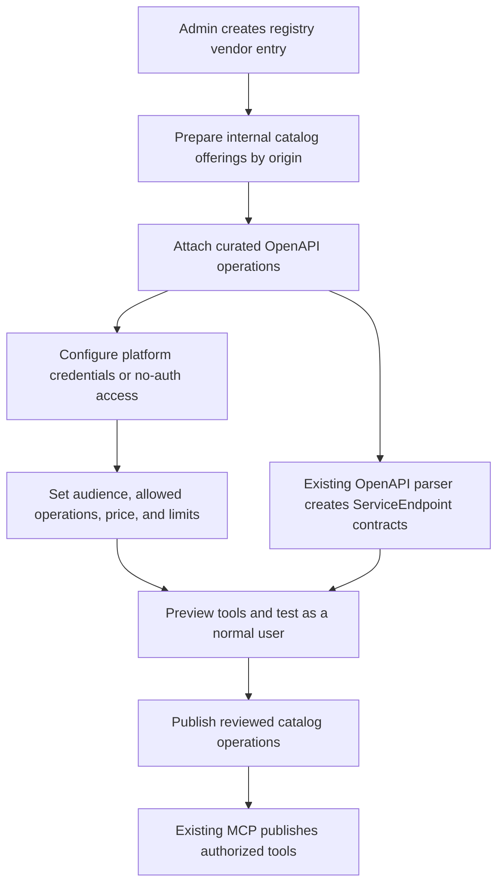
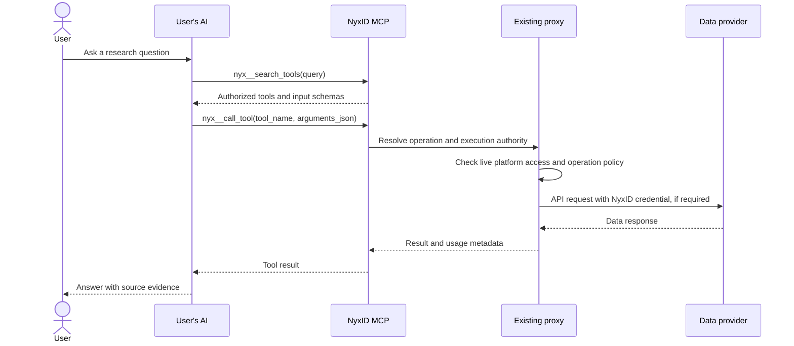
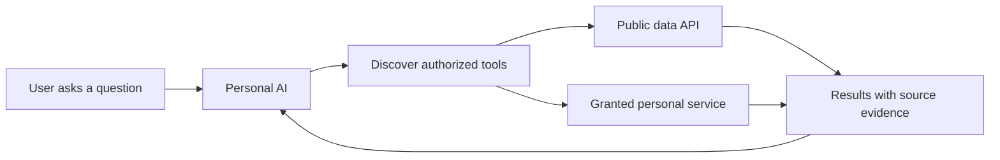

# NyxID platform data tools: approach, implementation plan, and Monid study

Status: design proposal, prepared on 2026-10-07. This document defines the approach before implementation.

The follow-up [complete Monid API audit](monid-api-audit/README.md) collected **2,440 publicly enumerable hosted tools across all 87 providers**, compiled all **699 public-source endpoints**, and established two programmatic integration routes: direct upstream APIs and a centrally configured Monid supplier adapter. The audit includes full endpoint inventories, conversion constraints, and a flow that retains NyxID's existing OpenAPI and MCP interface. Monid's hosted counter reports 2,441 tools; one StockAnalysis record is counted but not returned by its listings.

The [direct provider extraction work plan](monid-api-audit/DIRECT_PROVIDER_PLAN.md) describes importing contracts into NyxID and calling upstream APIs with platform-owned credentials. It includes the implementation work packages, pilot scope, and preliminary delivery estimates.

The follow-up [Tools Registry design and complete migration plan](monid-api-audit/TOOLS_REGISTRY_PLAN.md) defines the new admin sidebar entry, manual vendor setup, user Tools view, safe publication, and a backlog for every audited identity. It supersedes the navigation and consolidated onboarding details below: **Tools Registry** manages setup in admin; **Tools** beside AI Services lets users browse published offerings. Vendor accounts, email verification, and billing setup remain manual. The registry MVP uses existing exact grants; the dynamic public-data bundle proposed below is optional subsequent work.

NyxID can give AIs access to public information while keeping each person's service connections distinct. The proposed product has **My Services** for personal connections and **Public Data Tools** for ready-to-use research APIs. Both use the existing catalog, proxy, and tool execution machinery.

**The provider-to-MCP flow.** Providers are configured by NyxID. Users authenticate to NyxID, and their AIs call the existing MCP tools. A provider's credential and OpenAPI definition are configured once on our side.

The desired admin experience is a provider setup flow with these steps:

1. Add the vendor's name, description, and documentation to registry metadata. Prepare catalog offerings with fixed base URLs. Direct shared-key offerings use internal services without an authentication provider link.
2. Attach an OpenAPI 3.1 definition, using a curated overlay when the provider's full specification is unsuitable. Choose the operations to offer.
3. If the provider needs authentication, store the shared credential through the catalog service's existing encrypted credential field. Enable its platform key with a public audience for access by authenticated owners. A no-auth provider uses the existing credential-free path.
4. Configure the operation policy, user price, and limits. The initial data-tool offering is free for users. Provider-specific shared quotas need enforcement in addition to existing caller rate limits.
5. Preview the generated MCP names and input schemas. Complete a test using a normal user's NyxID identity and no user-owned provider credential.
6. Activate the offering after its operations and platform access are ready. Publishing is the completion of catalog configuration, not a proposed new HTTP protocol.

One registry vendor can reference multiple services when its APIs use different base URLs. TinyFish search and fetch, for example, use different hosts. Each service keeps a fixed server destination and its own existing execution contract. Registry grouping is separate from `ProviderConfig`: current admin service writes reject an operator-supplied master credential combined with `provider_config_id`. Configure these shared-key offerings as `internal`, `requires_user_credential = false`, and `provider_config_id = null`. Use current privileged service fields for each origin/credential class.

The OpenAPI definition supplies the existing tool contract:

| OpenAPI field | MCP behavior |
| --- | --- |
| `operationId` | Supplies the operation's tool name |
| `summary` and `description` | Explain when the AI should use the operation |
| `parameters` | Define path, query, and header inputs |
| `requestBody` | Defines the tool's body inputs |
| `responses` | Describes the provider's returned data |
| `x-aevatar-tool` | Supplies NyxID's existing risk and approval annotations |

The runtime flow uses the existing tools:

Users do not supply a provider key or complete provider OAuth in this flow. Existing automatic provisioning can create the internal connection records needed by the current proxy. Provisioning runs through the owner setup or reconciliation workflow, while MCP discovery and API-key authentication stay read-only.

The user's full-access NyxBot can use available services under its existing authority. Specialists and restricted external MCP keys still require their existing service and operation grants. Making a provider available to the owner and granting it to a scoped AI are separate steps. Neither step requires the user to configure a provider account.

The default-public-toolkit setting proposed below is an additional product choice for granting this curated bundle to AIs. The provider onboarding flow itself uses existing catalog, platform-key, OpenAPI, and MCP machinery.

The product labels describe the access path. **My Services** contains the user's managed connections. **Public Data Tools** contains the platform's ready-to-use data offerings. Platform data tools show their source, availability, price, and limits rather than a Connect account prompt.

The starting assumption is that the first release uses APIs with no upstream usage charge. APIs funded by NyxID can fit the same product, with their cost and quotas declared separately. The complete audit establishes Monid as a possible centrally configured supplier for broader coverage. Direct free sources and the hosted supplier can share the same OpenAPI and MCP interface; selecting paid coverage requires an explicit platform funding policy.

**The product distinction.** A user service connects an AI to a person's or organization's account, endpoint, credentials, and configuration. A public data tool retrieves information through a platform-curated operation without requiring the user to configure a provider account.

| Question | My Services | Public Data Tools |
| --- | --- | --- |
| What does the user manage? | Their connection and configuration | Which AIs may use the public toolkit |
| Whose account supplies access? | The person's or organization's account, or an explicitly selected platform binding | No provider account, or a NyxID-managed provider account |
| What information can it return? | Information allowed by that connection's account and grants | Public information from the published data operation |
| Does it require user setup? | Often requires OAuth, a key, or an endpoint | Requires no provider setup by the user |
| Typical examples | Gmail, Drive, Notion, a private API, a personal LLM connection | Public web search, scholarly metadata, economic indicators |
| How does an AI receive access? | Existing connection and operation grants | An explicit public-data toolkit permission |
| What does it cost? | The connection's existing price | Free for the first release, with quota limits |

The general boundary between AI Services and Tools is whose account answers the call, not whether the operation changes state. Public Data is the first Tools category, admitted by a read-only, public-data, verified-free rule. The [registry plan](monid-api-audit/TOOLS_REGISTRY_PLAN.md#1-navigation-and-product-distinction) defines the boundary and the [ownership design](monid-api-audit/TOOLS_REGISTRY_PLAN.md#owned-resources-and-jobs-on-a-pooled-account) for state-changing Tools on a shared platform account.

An AI agent and a service connection are separate objects. The AI Services page currently manages connections. The agent's persona, memory, and service grants remain on `AssistantAgent`.

Public describes the information supplied by a tool. Calls through NyxID still authenticate the caller and apply that caller's authority.

**Price, credentials, and data scope are separate facts.** A free operation can need an API key. An operation with no authentication can still return unsuitable data. A paid operation can return entirely public information. Classification must therefore describe the operation rather than infer its purpose from price, HTTP method, or authentication.

The proposed discovery response identifies the following facts independently:

| Fact | Purpose |
| --- | --- |
| Product kind | Distinguishes a public data offering from a personal service connection |
| Data scope | Identifies whether the operation returns public or account-specific information |
| Credential binding | Uses the existing no-auth, user, or platform credential resolution |
| Upstream cost model | Declares free, limited free tier, metered, or unknown cost at operation level |
| User price | Reuses the existing billing price view |
| Availability | Computes whether this caller can use the operation now |
| Coverage | Describes topics, geography, time coverage, freshness, and limitations |

Absent upstream cost information means unknown. A free status operation does not make the paid job that precedes it free. The first release admits only operations reviewed as free. A limited free tier needs an enforced quota and cannot switch to paid execution automatically.

**The user experience.** Keep the current AI Services navigation entry for personal connections. Add Tools beside it for platform offerings, starting with Public Data Tools. Add Tools Registry to the admin sidebar for imports, manual setup, validation, and publication. Existing Service Pools and Agent Keys keep their own views. The [registry plan](monid-api-audit/TOOLS_REGISTRY_PLAN.md) gives the exact routes and roles.

My Services continues to offer Add Service, reconnect, credential rotation, and connection settings. Public Data Tools shows a searchable catalog with topic filters and source details. Its cards say Free, Ready to use, and No setup, when those statements are true. A source detail explains what information the tool returns, its limits, and its attribution requirements.

New AI setup includes a Public data tools setting, selected by default. Owners can turn the setting off. Existing specialists receive access when the owner enables the setting. Existing restricted API keys retain their current authority until their owner edits them.

The public catalog must not appear as a list of credentials the user needs to create. Internal automatic connection rows can continue to support execution. The UI groups the public offering by its catalog source rather than presenting those rows as manually connected accounts.

**Reuse the current backend.** Add public-data metadata to the existing catalog and operation contracts. Keep `DownstreamService`, `ServiceEndpoint`, and the existing credential stores as the runtime records. Tools Registry stores onboarding, candidate mappings, and provenance while referencing those records. An independent execution registry would duplicate authentication, auditing, billing, and approvals.

The proposed catalog metadata identifies a public data offering and its topics, terms, license, and coverage. Operation metadata identifies public data scope and upstream cost. These fields are new proposal concepts, not fields implemented on this branch.

Keep `service_category` unchanged. Its current values participate in provisioning, discovery, and execution authority. An additional public-data classification avoids treating every `internal` service as public information.

Publish typed operations through the existing curated OpenAPI overlays. Use stable operation identities and the existing positive `operation_generation`. A data-tool listing contains only the reviewed operations. A generic arbitrary-path request tool does not become part of the public toolkit.

Public bundle eligibility requires an explicit read risk, public data scope, and verified free cost model. A search submitted with POST can qualify. A GET that returns a shared account's private history cannot qualify.

When a provider also offers account-specific operations, publish a dedicated catalog offering for its public subset. The existing catalog operation policy applies to all bindings of a catalog service. A separate offering lets us restrict public execution without narrowing an existing personal connection's operations.

No-auth sources use the current credential-free path. Sources such as TinyFish use the current encrypted platform credential and live platform-key ACL. Platform credentials stay on server transport and never enter the AI's context.

Reuse the current automatic provisioning workflow for the first release. Discovery stays read-only, and API-key authentication does not create connections. Provisioning runs before setup completes where necessary. This retains the existing service-scope behavior, at the cost of automatic connection rows per owner and source. Large catalogs may justify a different storage model later.

**Public-data access needs its own permission.** `allow_auto_connected_services` includes more than public research tools. Enabling that flag for every specialist would grant the wrong set of services.

The proposed permission is `allow_public_data_tools`, defaulting to false when absent. An agent stores the setting beside its existing grants so older grant writers cannot erase it. Thread keys mirror the setting through the existing key lifecycle. New owner-created AIs receive it through their creation settings. Owners enable it explicitly on existing specialists and restricted keys.

The permission selects a live, admin-curated bundle of eligible public-data operations. Adding an eligible source expands that bundle for AIs whose owners enabled it. Removing a source or changing its free/public classification removes it from execution eligibility immediately. Other platform services do not enter the bundle.

Public-data authority is operation-specific. A key with only this permission cannot use unrelated endpoints on a provider, even if those endpoints share the same base URL. Explicit service grants continue to follow their existing rules. Discovery, MCP execution, and HTTP proxy execution must share the same evaluator.

Guest turns, scheduled keys, and service accounts keep their existing authorization contracts. A public-data permission does not grant account management, machine access, or new guest authority. Deploy the permission evaluator to all replicas before enabling this setting.

**The AI discovers tools when it needs them.** Extend the existing `nyx__search_tools` and `nyx__call_tool` behavior. Search returns a few suitable operations with their source, scope, cost, and availability. The AI reads the typed input schema and calls the chosen operation. It does not need every endpoint definition in its initial context.

Keep web search and page retrieval distinct. Search returns titles, URLs, and snippets. Retrieval supplies the full source content. A specialist can combine those results with a separately granted personal service when the owner's request requires personal context.

Use one common response envelope for source attribution, retrieval time, completeness, and errors. Keep the actual payload specific to the tool. A scholarly record, an economic time series, and a web page need different schemas. Include a publication date only when the source supplies one, and identify shortened or partial results.

For the first release, improve descriptions and topic metadata before adding semantic discovery. Current NyxID tool search ranks word matches in names and descriptions. Semantic ranking and source selection by observed reliability can follow once we have enough catalog entries and usage evidence.

**What Monid demonstrates.** The public repository contains its connector framework and execution engine. Its hosted discovery implementation and production operations are not established by that repository. The observations below distinguish public source code from hosted API documentation.

The reviewed repository commit is [`c57aa3d4b2036f518cbc7d3879a097ac1c8af4ea`](https://github.com/monid-ai/monid/tree/c57aa3d4b2036f518cbc7d3879a097ac1c8af4ea).

| Observed Monid pattern | What NyxID can learn |
| --- | --- |
| Hosted API uses discover, inspect, and run | Discover a short list and load the full operation contract only when needed |
| Provider and endpoint definitions declare requests, schemas, descriptions, auth, and timeouts | Keep source onboarding declarative and reviewed |
| The connector usage schema has an explicit `FREE` model | Represent free execution independently from auth and do not interpret missing cost as free |
| TinyFish declares `FREE` while using `X-API-Key` | A free public offering can use a platform key without user setup |
| Endpoint descriptions explain use cases, limitations, and next calls | Write descriptions that help the AI select and combine sources |
| Transport injects credentials separately from endpoint logic | Preserve NyxID's existing separation between tool descriptions and credential materialization |
| Execution validates input and declared output contracts | Check the provider-specific contract before returning data to an AI |
| Fixtures exercise connectors without vendor keys | Capture representative success, empty, partial, and error responses for each source |
| Catalog publishing uses tested versioned artifacts | Treat a source contract change as a reviewable release with a rollback path |
| Hosted run supports immediate results and asynchronous jobs | Declare execution mode and deadlines instead of hiding long-running work in a synchronous request |

Monid's hosted documentation describes natural-language ranking and prices in discovery results. The repository README also describes health and observed latency. Those are useful later features, but this study did not verify the hosted ranking code or its live metrics.

Monid's billing engine is not a replacement for NyxID's exact accounting and ledger. Any later paid integration must settle through NyxID's existing money system. Reuse of Monid connector code is possible under its MIT license, but the initial approach adopts its contract ideas through NyxID's existing OpenAPI format.

The [exhaustive follow-up study](monid-api-audit/README.md) found public APIs for enumerating Monid's hosted catalog and official documentation supporting one platform account behind our own proxy. A supplier adapter can expose reviewed Monid operations through our existing typed MCP tools. It must bind upstream selectors server-side and enforce local run/resource ownership because a platform account pools our users into one Monid workspace. The direct-source route remains suitable for the initial free offering; broad paid enrichment for contacts, reviews, and proprietary datasets requires a funding decision.

**The first sources.** These candidates cover general web information, reference material, research, and economic data. They are a source shortlist, not activated integrations.

| Candidate | Proposed operations | Evidence reviewed | Activation work still required |
| --- | --- | --- | --- |
| TinyFish | Web/news/paper search and public page fetch | Official docs say both products are free at a zero wallet balance. Both require `X-API-Key`. Search defaults to 30 requests/minute, fetch to 150 URLs/minute | Confirm the platform account has product access and acceptable usage terms. Check shared throughput and capture real fixtures |
| Wikipedia/Wikidata | Reference search, page summaries, and entity lookup | MediaWiki documents public API use, attribution, User-Agent requirements, and rate limits | Choose and verify exact API contracts and content attribution |
| Crossref | Scholarly metadata search and DOI lookup | Official docs say anyone can use the REST API without signup. The polite pool uses a contact email | Verify useful result fields, public-pool throughput, and content-specific reuse requirements |
| World Bank | Country and economic indicator lookup | Official Indicators API docs say API keys and other authentication are unnecessary | Verify selected indicators, update frequency, and dataset license metadata |

TinyFish is the best candidate for the core search-and-read workflow discovered in this study. Its 30-request/minute default search limit is a material capacity constraint for a shared platform account. Free pricing alone does not establish production capacity.

Source selection happens per task. A question about a published paper benefits from scholarly metadata. A question about GDP benefits from the World Bank. A current company announcement benefits from web search and the original page. Broad availability does not imply that every source should be called for every question.

**The implementation boundary.** The first release covers the product split, catalog and operation metadata, public-data permission, lazy discovery, source evidence, and a small set of verified free sources. It uses the existing proxy and credential resolver.

The provider onboarding and execution path use existing NyxID mechanisms. The consolidated admin experience, public-data classification, and default-toolkit permission are proposals in this document. Publishing a provider with the existing mechanisms does not require the proposed toolkit permission to exist first.

The implementation plan separates a working provider proof from the broader product rollout:

| Phase | Work | Reviewable result |
| --- | --- | --- |
| 1. Prove one provider | Add curated TinyFish search and fetch definitions. Register the catalog services for their separate hosts. Populate typed endpoint contracts through the existing OpenAPI parser | Tool names, schemas, and operation generations can be inspected through existing catalog and MCP APIs |
| 2. Prove platform access | Configure the shared credential, live audience, operation policies, free pricing, and provider quotas. Provision an eligible user with no personal provider credential. Grant a scoped pilot AI access using existing grants | A normal user and the scoped pilot AI can search and retrieve public content through MCP. Unoffered operations remain unavailable |
| 3. Publish clear discovery | Add the public-data classification and source metadata. Extend current discovery responses with access, price, and coverage information. Keep keyword discovery and typed execution | An AI can find an appropriate public source, inspect its schema, and distinguish it from a personal connection |
| 4. Add product controls | Implement admin Tools Registry with manual setup and a separate user Tools view. Implement the proposed default-toolkit setting if that broader access model is selected | Users see ready-to-use platform offerings. AIs receive the intended grants without provider account setup |
| 5. Verify and release | Exercise the acceptance behaviors below. Deploy any new permission evaluator before enabling its setting. Release the pilot offering, then add verified reference and structured-data sources | A recorded research task works with source evidence, quotas, and live revocation. Existing scoped keys keep their prior authority |

The pilot needs a NyxID-managed TinyFish key with search and fetch access. Until that access is available, prepare the specs and replay fixtures, or prove the same no-auth path with Crossref. No user-owned provider credential is a prerequisite.

The first release does not need a semantic discovery engine, a new connector runtime, or Monid's hosted marketplace. The public provider catalog can grow through reviewed OpenAPI definitions and catalog configuration. Providers with unusual authentication or asynchronous execution may need an adapter within the existing architecture.

A useful initial proof is a new AI that receives the public-data permission, searches a topic, reads one result, and answers with source URLs. The proof must also show that the same AI cannot read a shared provider account's history or an ungranted personal service.

The later implementation needs to establish these behaviors:

1. Public tools work without a user's provider credentials and appear in their own catalog view.
2. Existing personal connections, scoped keys, and specialist grants retain their current behavior.
3. A public-data-only key can call the approved search operations through both MCP and HTTP, but cannot call other provider operations.
4. Disabling the toolkit, source, or live platform grant prevents the next execution.
5. Free calls create no wallet charge while retaining usage measurements and source quotas.
6. Rate limits, timeouts, empty results, and partial fetch failures return understandable outcomes.
7. Source evidence identifies the provider, original URL or record, retrieval time, and partial content.
8. Catalog contract changes update operation generations and retain the existing approval fences.
9. New AIs can use sources added to the enabled public bundle, while existing keys without that permission gain no new scope.

No runtime implementation is part of this design change. Live authenticated source calls, throughput testing, and connector execution remain work for the implementation proof.

**Evidence.** NyxID implementation anchors and external sources reviewed for this proposal follow.

- [AI Services architecture](../AI_SERVICES_ARCHITECTURE.md) defines user connections and the current management and execution boundaries.
- [Catalog and OpenAPI discovery](../API_DISCOVERY.md) explains curated overlays and operation publication.
- [Platform keys and billing](../PLATFORM_KEYS_AND_INFERENCE.md) describes live credential ACLs, automatic connections, and price views.
- [`frontend/src/pages/keys.tsx`](../../frontend/src/pages/keys.tsx) currently mixes automatic and manually managed connections through the auto-connected filter.
- [`backend/src/models/downstream_service.rs`](../../backend/src/models/downstream_service.rs) defines catalog categories and platform credentials.
- [`backend/src/models/service_endpoint.rs`](../../backend/src/models/service_endpoint.rs) defines operation risk and generation.
- [`backend/src/services/unified_key_service.rs`](../../backend/src/services/unified_key_service.rs) provides no-auth and platform provisioning.
- [`backend/src/services/mcp_service.rs`](../../backend/src/services/mcp_service.rs) provides tool discovery, word ranking, and dispatch.
- [Specialist authority](../chat/09-nyxbot-orchestrator.md) describes explicit service grants and the exclusion of automatic services.
- [Monid hosted flow](https://monid.ai/docs/guide/how-it-works) documents discovery, inspection, execution, and per-use pricing.
- [Monid inspection API](https://monid.ai/docs/api/inspect) documents input schemas, pricing, and operator notes.
- [Monid development guide at the reviewed commit](https://github.com/monid-ai/monid/blob/c57aa3d4b2036f518cbc7d3879a097ac1c8af4ea/DEVELOPMENT.md) describes the connector engine and publication workflow.
- [Monid TinyFish provider](https://github.com/monid-ai/monid/blob/c57aa3d4b2036f518cbc7d3879a097ac1c8af4ea/connectors/tinyfish/provider.ts) separates free usage from API-key authentication.
- [Monid free usage model](https://github.com/monid-ai/monid/blob/c57aa3d4b2036f518cbc7d3879a097ac1c8af4ea/shared/core/schema/usage/model/free.ts) declares free operation usage.
- [TinyFish Search](https://docs.tinyfish.ai/search-api/reference) and [TinyFish Fetch](https://docs.tinyfish.ai/fetch-api/reference) document their pricing, authentication, and quotas.
- [MediaWiki API etiquette](https://www.mediawiki.org/wiki/API:Etiquette) documents public API access expectations.
- [Crossref API access](https://www.crossref.org/documentation/retrieve-metadata/rest-api/access-and-authentication/) documents public and polite access.
- [World Bank Indicators API](https://datahelpdesk.worldbank.org/knowledgebase/articles/889392-about-the-indicators-api-documentation) documents access without API keys.
