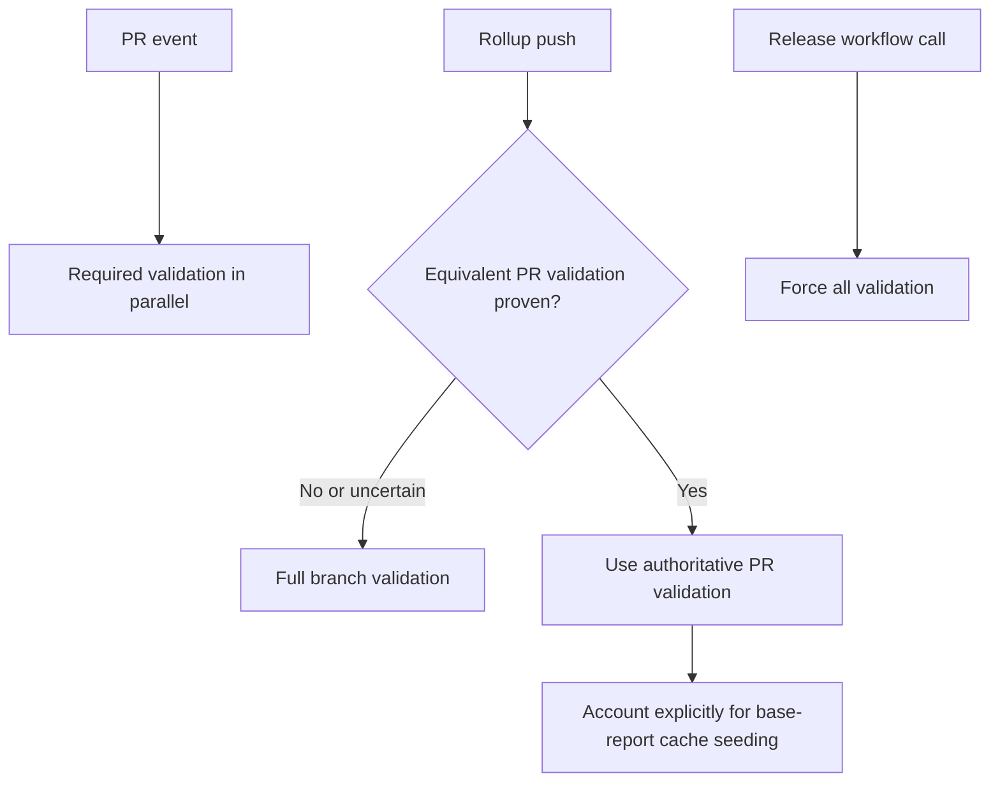

# CI robustness and latency investigation

Status: CI-only implementation for repurposed PR #1711 targeting `main`,
2026-09-30, rebased onto main `1f6fad58` after #1700 merged. Subsequent
stages remain proposals. No repository rules are changed. PR #1707 (NyxChat
setup overlays) is merged. The coverage debug-profile mitigation landed through
#1705 (`a29056ef`). #1711 was initially closed as a duplicate and is being reused
at the user's request for the broader CI reliability fix.

## Implemented first stage

- Retain main's line-table profile for backend tests, smoke and both coverage
  jobs and preserve existing compiler/test concurrency. Pin
  Rust to 1.98.1, cargo-nextest to 0.9.146, cargo-llvm-cov to 0.9.1
  and the MongoDB 8 image to the digest
  from the passing September 30 coverage run. These inputs can be upgraded
  deliberately with full CI instead of changing between identical revisions.
- Ensure at least 8 GiB total swap on those four backend runners, allocating
  only the deficit and requiring at least 8 GiB disk space remain afterward.
  A passing measured compile on the initial PR revision reached 14.2 GiB child
  maximum RSS, less than 1 GiB available RAM and 2.4 GiB of the default 3 GiB
  swap while just one rustc process remained. The reserve adds margin for
  memory peaks without reducing compiler/test concurrency or changing
  swappiness. Failure to establish the reserve fails the setup step explicitly.
- Bound Linux build dependency installation to five minutes per step, with
  noninteractive apt, 20-second HTTP/HTTPS acquisition timeouts and two download
  retries. Failed index updates and installations fail the job. A September 30
  hosted billing job stalled in Ubuntu mirror index acquisition for almost
  24 minutes before a manual diagnostic cancellation; it never reached tests.
  The shared helper is part of the coverage recipe identity. This retries only
  dependency acquisition, never test execution or assertions.
- Wrap backend tests, standalone billing smoke and head/base backend coverage
  with `ci_resources.py`. It preserves arguments, environment, working
  directory, streamed output and command failures. SIGINT/SIGTERM reach the
  child process group; cancellation cannot become success. Unresponsive child
  groups are killed after a bounded grace period.
- Record memory/swap, free disk, relevant process counts, available cgroup
  counters, actual checkout commit/tree, tool versions and selected profile
  settings. Samples appear every 30 seconds in the live log and in
  `resources-*` artifacts retained for 14 days. Unsupported optional telemetry
  or artifact failure does not change the required command's result.
- Set a 45-minute timeout on these four heavy jobs, allowing margin over the
  observed roughly 18–22-minute passing jobs while bounding hung execution.
- Key cached backend base reports by exact source SHA plus workflow/setup
  script contents, architecture and the **measurement job's** runner image.
  Missing image identity disables report reuse. No broad restore prefix is
  permitted. Compilation caches remain separate.
- Cancel only superseded revisions of the same PR's CodeQL scan; keep push
  and schedule groups separate and retain all four language scans.
- Add Mobile to both the aggregate's dependencies and result enforcement.
- Use `cargo llvm-cov --no-report` before the existing exports and final
  threshold check. This removes an unused report pass without changing tests,
  instrumentation, produced artifacts or thresholds.

Resource interpretation: cgroup-root counters can include other processes or
earlier job setup, and `child_max_rss_bytes` is the maximum reported child RSS,
not the sum of simultaneously resident compiler, test and MongoDB processes.
Correlate these with `MemAvailable`, process counts and timestamps. Exit 143
alone is still not an OOM diagnosis. Tool/debug settings are whitelisted; the
recorder does not dump the environment or process command lines.

To update pinned inputs, change the Rust action refs, test/coverage tool versions
and/or Mongo image digest in the workflow/setup script together with their
validation evidence. The recipe fingerprint changes automatically. A runner
image rollout also causes a safe fresh base measurement. Observe future runs
before introducing compiler-worker limits or declaring shutdowns resolved.

## Coverage preservation and review criteria

After rebasing onto main `1f6fad58`, this PR changes no application source,
regression test, nextest configuration, feature matrix, or frontend/mobile
coverage configuration. The earlier NyxBot condition-wait fix is already in
main through #1700 and is no longer part of this PR's net diff.

The test commands retain their package/feature selection. `--no-report` only
suppresses cargo-llvm-cov's initial report generation: instrumentation and test
execution remain enabled, followed by the same LCOV/JSON exports and final
threshold enforcement. Head coverage always measures the current tested tree;
only the informational base report can be restored from an exact-identity
cache. Backend, CLI and frontend thresholds remain 73%, 64% and 15%.

Required command failures and cancellations remain failures. Only optional
resource artifacts and the existing informational base comparison tolerate
failure; head coverage and the aggregate gate do not. Mobile is newly included
in the aggregate. No retries, ignored tests or looser assertions are introduced.

The final hosted validation must compare head/base executed test counts,
ignored/skipped counts and coverage totals as well as job success. Small line
percentage differences alone are not proof of changed coverage scope; compare
source identity and instrumented denominators before attributing them. The
baseline before the reserve passed 6,838 backend nextest tests (2 skipped) and
6,823 backend coverage tests (2 ignored) at 87.40% lines on the previous main
base. The rebased run includes #1700's additional source and tests, so those
older counts are historical evidence, not an exact acceptance count.

Resource reserve provisioning, pinned measurement inputs, bounded jobs,
condition-based waits, failure propagation and exact cache identity follow
established CI practices. Added swap provides measured capacity headroom; it
is not evidence that all previous shutdowns were OOM, and can trade latency for
survival under memory pressure. Preserve useful concurrency and measure future
runs before further tuning. One passing pipeline cannot establish a long-term
flake rate or a guaranteed speedup.

## Recommendation

Prioritize backend coverage reliability: distinguish compilation shutdowns,
test assertions, report/gate failures and explicit cancellation, then capture
resources and resolved build inputs. Keep the useful parallelism introduced
by #1669. Remove redundant and obsolete workflow executions and make merge
gates explicit. Tune concurrency inside a runner only after measuring its
limiting resource. Do not globally serialize the backend correctness gate.

The available evidence establishes substantial duplicate work, repeated
compilation shutdowns, and measured memory/swap pressure in a passing build.
It does **not** establish that GitHub's
shared compute capacity was exhausted, or that the shutdowns were OOM kills.

## Measured evidence

The timing figures below are elapsed job-minutes, including cancelled work.
They are neither CPU utilization measurements nor a billing estimate. This is
a small diagnostic sample, not a statistically controlled benchmark.

| Observation | Evidence | Implication |
| --- | --- | --- |
| Parallelization reduced the correctness gate | #1669 records approximately 34 minutes before the split, then a 19m27s gate / 19m43s CI run, with all tests and thresholds retained. | Reverting to one serial backend job would give up a demonstrated benefit. |
| Duplicate rollup validation | At `3b80d68f`, push run `36715953490` consumed 88.8 job-minutes and PR run `36715962658` consumed 143.5: 232.3 combined, including 48.1 cancelled job-minutes. | Avoidable event-level work is a concrete optimization opportunity. |
| High fan-out, little observed job queueing | Those runs peaked at 35 simultaneously active jobs. Their maximum recorded created-to-start job delays were 6s and 37s. | This sample does not demonstrate exhaustion of the organization's runner-slot allowance. It does not measure contention inside GitHub's infrastructure. |
| Coverage compilation loses runners | Three jobs on `012dd86f` and the push head-coverage job on `3b80d68f` terminated during compilation, before tests, with runner shutdown / exit 143. | Classify this separately from test assertion failures. Memory pressure is a hypothesis; the logs contain no kernel OOM or peak-memory proof. |
| Reduced-debug candidate passes | #1711 source `b2ef3469`, based on `3b80d68f`, passed all 30 applicable checks; 4 intentional skips. Backend head/base coverage jobs took 19.5/19.9 minutes and reported 87.43% lines against the unchanged 73% gate. | The setting is compatible with coverage and this tree; one successful run does not establish causation or necessity. |
| Backend execution is a large part of latency | On that successful run, coverage compiled in 7m28s and ran 6,826 tests in 10m59s (2 ignored). Normal backend tests compiled in 6m07s, then ran 6,841 tests in 12m17s (2 skipped). | Optimizing compilation alone cannot remove the full critical path. |
| Superseded CodeQL work is not cancelled | `codeql.yml` has four parallel languages and no workflow concurrency policy. | Old PR revisions can continue consuming runners after newer revisions start. |

Sources:

- [Parallelization PR #1669](https://github.com/ChronoAIProject/NyxID/pull/1669)
- [Previously successful rollup CI](https://github.com/ChronoAIProject/NyxID/actions/runs/36683146794)
- [Rollup push at 3b80d68f](https://github.com/ChronoAIProject/NyxID/actions/runs/36715953490/attempts/1)
- [Rollup PR at 3b80d68f](https://github.com/ChronoAIProject/NyxID/actions/runs/36715962658)
- [Candidate CI at b2ef3469](https://github.com/ChronoAIProject/NyxID/actions/runs/36716209962)

A targeted unchanged coverage rerun was started as attempt 2 of
`36715953490`. It was explicitly cancelled after approximately 92 seconds,
before providing a result. It is not evidence for or against the candidate.
Do not keep rerunning old revisions on the actively changing rollup: its
workflow concurrency group is shared with current branch validation.

## Backend coverage failure audit

On September 30, inspection of **17 failed backend coverage job logs** found:

| Failure class | Inspected executions | Finding |
| --- | --- | --- |
| Runner shutdown during compilation | 16 | All stopped before tests or coverage threshold enforcement, with runner shutdown and exit 143. |
| Test assertion | 1 | Gmail investigation branch expected `None` for omitted scopes but observed the fixture's retained `openid`. This is a test/behavior mismatch, not established intermittency. |
| Coverage percentage below threshold | 0 | None of these failures reached and failed the 73% line gate. |

This is a diagnostic sample of failures, **not a repository-wide failure
rate**. It includes jobs in workflows whose final conclusion was cancelled,
because an earlier job failure survives subsequent workflow cancellation.
Some history API requests returned 502/504, so a complete population and a
before/after failure-rate comparison are not available. Successful base jobs
may restore cached reports; do not count every green base job as a fresh run.

The inspected executions are linked here for reproducibility:

| Workflow run | Failed coverage job IDs | Classification |
| --- | --- | --- |
| [36659754024](https://github.com/ChronoAIProject/NyxID/actions/runs/36659754024) | 109711723723 | Compilation shutdown |
| [36662907994](https://github.com/ChronoAIProject/NyxID/actions/runs/36662907994) | 109721345681, 109732419443 | Compilation shutdown on attempts 1 and 2 |
| [36670664278](https://github.com/ChronoAIProject/NyxID/actions/runs/36670664278) | 109744807129 | Compilation shutdown |
| [36680454361](https://github.com/ChronoAIProject/NyxID/actions/runs/36680454361) | 109774791477 | Compilation shutdown |
| [36687620425](https://github.com/ChronoAIProject/NyxID/actions/runs/36687620425) | 109797065516 | Compilation shutdown |
| [36700141181](https://github.com/ChronoAIProject/NyxID/actions/runs/36700141181) | 109837452839 | Base compilation shutdown |
| [36709170237](https://github.com/ChronoAIProject/NyxID/actions/runs/36709170237) | 109866625818 | Compilation shutdown |
| [36713311139](https://github.com/ChronoAIProject/NyxID/actions/runs/36713311139) | 109880567254 / 109880567368 | Head assertion / base compilation shutdown |
| [36714150581](https://github.com/ChronoAIProject/NyxID/actions/runs/36714150581) | 109882850943 | Compilation shutdown |
| [36714158685](https://github.com/ChronoAIProject/NyxID/actions/runs/36714158685) | 109882888329, 109882888388 | Base and head compilation shutdown |
| [36715351578](https://github.com/ChronoAIProject/NyxID/actions/runs/36715351578) | 109887276510, 109887276541 | Base and head compilation shutdown |
| [36715953490](https://github.com/ChronoAIProject/NyxID/actions/runs/36715953490/attempts/1) | 109889072708 | Compilation shutdown |
| [36716737302](https://github.com/ChronoAIProject/NyxID/actions/runs/36716737302) | 109891643054 | Compilation shutdown |

Three of these workflows later passed coverage on the **same actual checkout
commit**, verified from `git log -1` in both failed and successful logs:

| Workflow | Actual tested commit | Result sequence |
| --- | --- | --- |
| 36662907994 | `73ac8d685506576ca0a00357f1bb83ad346a8a48` (PR merge commit) | Shutdown, shutdown, 6,817 tests pass / 87.39% lines |
| 36670664278 | `62dd17ac3d98e7bb541cb86a1093dea6046ae2f0` | Shutdown, 6,817 tests pass / 87.38% lines |
| 36680454361 | `ee3923bbfdd860e32d74708ebaf8875233b5d77b` (PR merge commit) | Shutdown, 6,823 tests pass / 87.40% lines |

These establish intermittent job completion on unchanged code. They do not
isolate memory pressure: two runner images (`20260920.314.1` and
`20260927.320.1`) appear, and both have successes and shutdowns. Rust remains
1.98.1 in those pairs. Cache state and host resources are not controlled.

The same signature also predates the coverage split. In the older serial
workflow, September 25 jobs
[107996771807](https://github.com/ChronoAIProject/NyxID/actions/runs/36111800751/job/107996771807),
[108001588786](https://github.com/ChronoAIProject/NyxID/actions/runs/36113291552/job/108001588786)
and [108012078264](https://github.com/ChronoAIProject/NyxID/actions/runs/36113291552/job/108012078264)
passed their head tests, then lost the runner during base compilation with
exit 143. Their logs show the serial `Measure base branch` step; there is no
separate base-coverage job. This disproves attributing the existence of this
failure mode solely to the later split, but does not establish whether its
frequency changed.

There is separately a confirmed timing assumption documented and fixed in
rollup commit `7848cce1`: `the_same_question_is_not_worked_on_twice` slept
300 ms after a callback that returns 202 before recording the message. The
fix waits for the actual expected state, bounded to ten seconds, and retains
the assertions. This is the model for addressing genuine timing flakes.
The Gmail assertion above belongs to `investigate-gmail-send-permission`, not
the current rollup's test; it must be handled with that branch's intended
scope-preservation contract rather than a CI retry or timeout change.

The immediate implementation order is:

1. Retain the landed line-table profile, instrument compilation resource use,
   and label build/test/report phases so the next failure is diagnosable.
2. Record/pin the coverage toolchain and measurement inputs; verify cached
   reports against those inputs. Compare fresh executions separately from
   cache hits and superseding cancellations.
3. Cancel obsolete PR CodeQL runs and remove provably redundant event work.
4. If resource evidence warrants it, compare the existing Cargo worker count
   with a bounded count on an immutable tree. Change one variable at a time
   and measure both resource margin and gate latency. Test worker limits are
   a separate experiment and cannot fix a failure before tests start.

## Preserve these contracts

- Full backend nextest suite, service-adapter tests and transaction-capable
  MongoDB setup.
- Standalone billing smoke: it exercises a different Cargo feature-unification
  path from the combined nextest invocation.
- Production `gcp-kms` backend build and embedded-input guard.
- Existing CLI, frontend, mobile, SDK, Oracle, wizard and plugin validation;
  existing KMS feature combinations and all four CodeQL languages.
- Backend/CLI/frontend coverage thresholds of 73% / 64% / 15%.
- The unconditional `CI Pipeline` aggregate and the full `workflow_call`
  release/publish gate. Publishing tags must still wait for builds and CI.
- A successful gate must identify the code and configuration actually tested.
  An API `head_sha` alone does not identify a PR's synthetic merge tree.

## Stage 1: observability, obsolete work and gate correctness

The first implementation above supplies resource sampling, pinned measurement
inputs, the swap reserve and PR-scoped CodeQL cancellation. Samples and actual
job outcomes must guide subsequent tuning. Further diagnostics can add precise
per-process accounting or kernel OOM evidence where available; missing optional
telemetry must never override required command failure. The recorder's current
RSS and cgroup limitations are described above.

Audit enforcement before describing the aggregate as a guarantee. Before this change, the aggregate omitted `mobile` from its `needs` and result
list; the implementation includes it in both.
Effective `main` rules fetched during this review require a PR and one review
and restrict deletion/force pushes, but contain no `required_status_checks`
rule. The legacy branch-protection endpoint returns 404 because rulesets are
used. The remaining policy proposal is to make the intended CI gate a required
status through repository rules. Rule changes are
a separate operator policy decision; none were made in this investigation.

## Stage 2: admit one authoritative validation where equivalence is proven

Use explicit event admission, not a shared push/PR cancellation group. The
current groups differ (`refs/heads/...` versus `refs/pull/.../merge`), so both
events run. Giving them the same group could let a later push cancel the PR
check required for merging.

The safe design is a small rollup-push dispatcher around reusable CI. Keep PR
validation and force-all release calls authoritative. Suppress a push's full
duplicate only when all of the following are established:

1. An open, eligible, same-repository PR covers the exact pushed head.
2. Its base/head/merge identities are current and the PR is mergeable.
3. The PR run's actual tested merge tree equals the pushed tree, with matching
   workflow, profile and validation inputs. Do not infer this from `head_sha`.
4. The corresponding PR validation exists and will provide the authoritative
   result. Admission must not fabricate a successful aggregate for skipped
   work or hide a failed PR result.

If the API fails, identities are stale, trees differ, or any condition is
ambiguous, run normal push CI. A rollup without an eligible PR still gets full
branch validation. A reusable publish/release invocation always runs in full.

This is a design task, not a one-line trigger deletion. Removing branch runs
also removes some opportunities to seed branch-scoped coverage reports. A
later PR may consequently need one fresh base measurement. Compare total work
over the source-PR/rollup lifecycle before claiming savings. An initial
conservative alternative retains only a head coverage/cache-seeding job on
equivalent pushes; it saves the other duplicate suites but deliberately keeps
one expensive duplicate. Measure that tradeoff rather than silently moving
the cost to the next PR.

Required admission cases: normal PR, rollup with/without PR, diverged base,
conflict, stale head, multiple eligible PRs, API failure, fork, cancelled PR
run, PR closure, rapid successive pushes, and force-all release calls. Check
that a failing test remains a failing required gate in every applicable case.

## Stage 3: reproducible reports and resource budgets

Keep ordinary Cargo build caches separate from cached coverage reports. Cargo
can validate compilation fingerprints; a cached JSON report cannot revalidate
itself. The current exact-base-SHA plus whole-workflow-hash key is conservative
but omits mutable `stable`, cargo-llvm-cov `latest`, runner-image and MongoDB-image
inputs. Pin relevant versions or include their resolved identities in report
metadata/cache keys. Keep the exact SHA initially; do not introduce broad
restore prefixes. PR merge-ref caches cannot generally seed sibling PRs or
branch pushes.

The successful candidate had a cold Cargo cache. It used
`cache-workspace-crates: false` and disabled incremental compilation through the
cache action. That explains some repeated compilation; it does not justify
blindly sharing or retaining all workspace artifacts. Evaluate warm/cold
behavior, correctness and cache eviction before changing this policy.

The line-table profile originally proposed in #1711 has now landed through
#1705. Main now includes it through #1700; the repurposed #1711 adds resource
telemetry and the other first-stage controls without duplicating that change.
If attribution remains necessary, run an isolated paired compile experiment
on immutable, identical application trees with only the debug profile varying.
Keep Rust/LLVM/tool
versions, runner class and cold/warm-cache condition consistent, capture peak
resources, and bound the experiment rather than launching repeated full
pipelines on the active rollup. Both #1711's candidate and #1705's full suites
passed; the experiment
should isolate the failure phase before spending more time on duplicate tests.
Assess resource margin and coverage/latency regressions before further tuning.
One pass or one rerun is not proof of
a lower long-term infrastructure failure rate.

Do not impose a repository-wide single-job semaphore. GitHub concurrency
groups are not counting semaphores and can replace pending work. Matrix
`max-parallel` limits only that matrix. After removing duplicate/obsolete
work, consider caps on noncritical feature-build fan-out if measurements show
queue pressure. Change Cargo workers, test workers or codegen settings one at
a time against memory and wall-time measurements; they solve different
problems. A larger runner for the few heavy jobs is an option only if measured
resource demand and the cost budget justify it.

## Stage 4: shorten measured test bottlenecks

The successful nextest run recorded approximately 2,943.5 aggregate test
seconds across four effective worker slots. Its longest individual tests took
29–47 seconds, including login-code budgets, Aurinko cursor timeout, MFA and
destination reconciliation. Inspect those tests before increasing worker
counts: some may intentionally exercise timeouts, password hashing or
database setup. Replace avoidable real waits with explicit clocks/conditions
and reuse safe setup only where isolation and production-cost assertions are
preserved. Do not loosen assertions, drop suites or substitute retries for
deterministic behavior.

## Acceptance and rollout

Ship the stages separately so each result has an attributable cause. For a
matched set of representative backend-changing revisions, record:

- Time from event to required `CI Pipeline`, and optional report completion
  separately; report median and tail latency.
- Aggregate job-minutes, cancelled job-minutes, peak active jobs and queue time.
- Cold/warm cache outcomes, compile and test time separately, peak memory/disk,
  OOM evidence and runner-shutdown counts.
- Exact tested identities, all expected suite/gate outcomes and coverage.

An initial target is at least 25% less aggregate work on eligible duplicate
rollup events, with no material regression in required-gate latency relative
to a matched baseline. Observe the first 20 applicable runs for new shutdowns
or gate omissions; that is a rollout check, not a statistical reliability
guarantee. Keep the measured approximately 20-minute gate as a baseline rather
than promising a universal runtime on arbitrary future code.

Independent review agrees with retaining useful parallelism and prioritizing
event admission, resource evidence and obsolete-run cancellation. It explicitly
rejected treating SIGTERM as proof of OOM, naive cross-event concurrency keys,
broad coverage-cache reuse, and a global serialization workaround.
