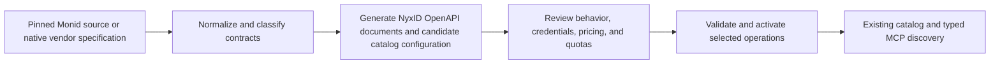
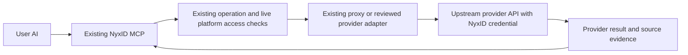

# Direct provider import into NyxID

Status: implementation proposal, prepared on 2026-10-07. No runtime changes or provider activation are included.

The follow-up [Tools Registry plan](TOOLS_REGISTRY_PLAN.md) adds the proposed admin sidebar entry, manual account setup, user Tools view, safe draft/publication workflow, and complete provider/tool backlogs. It extends the estimates below to include this product work. Vendor signup, email verification, and billing enrollment remain manual.

Direct extraction means NyxID owns the tool contracts and calls the upstream providers with platform-owned credentials. Monid's public connector source supplies reusable definitions and behavior. NyxID keeps its existing catalog, OpenAPI, MCP, credential, grant, and proxy architecture.

The immediate reusable source contains 699 operations across 31 providers. The hosted inventory contains 2,440 enumerable operations across 87 providers. Those are different datasets: 637 source operations match hosted identities after two recorded provider aliases. Additional providers require native vendor specifications, documentation, or another verified source of execution contracts. Hosted schemas describe Monid's interface and do not necessarily describe the direct upstream request.

## The resulting flows

The import flow is:

The execution flow is:

The user discovers Public Data Tools and grants the selected AI access. NyxID configures each provider account and key once for the relevant credential class. An upstream API with no authentication uses the current no-auth path. Users authenticate only to NyxID for this access flow.

## What we already have

NyxID already provides catalog services, authentication-provider relationships, encrypted shared credentials, live platform-key audiences, exact operation policies, OpenAPI parsing, typed ServiceEndpoint contracts, operation generations, MCP search/call, and proxy execution. Existing admin configuration can support the first pilot. For new direct shared-key offerings, current create/update validation requires internal, provider-less catalog services: `requires_user_credential = false` and `provider_config_id = null`. A registry vendor can group those services through metadata without creating an authentication-provider link.

Firecrawl already has a native hosted OpenAPI overlay in this repository with search, scrape, map, agent start, and agent status operations. Its presence establishes contract support; it does not establish that a platform credential or shared audience is configured in a deployed environment.

The audit already produced a source analyzer and converter, four example OpenAPI documents, and endpoint inventories. The examples cover eight conservative operations and passed OpenAPI validation. They still need NyxID parser checks, contract review, and live fixtures before publication.

## The work packages

| Work | Concrete implementation | Reviewable result |
| --- | --- | --- |
| Build the production importer | Read pinned source bundles and native specs. Normalize tool identities, wire URLs, inputs, credential classes, descriptions, output contracts, and source provenance. Classify custom hooks instead of dropping them | A repeatable import emits candidate specs plus an exception report |
| Generate and register contracts | Generate bounded OpenAPI documents by provider, origin, and credential class. Give operations stable IDs and accurate risk annotations. Register selected overlays or configure their hosted spec URLs through the existing catalog | NyxID parses the contracts and publishes the expected typed tools |
| Configure platform access | Group vendors in registry metadata and create dedicated internal, provider-less catalog offerings by fixed origin and credential class. Complete vendor account setup manually. Configure shared keys through existing write-only fields, live audiences, policies, and user pricing. Provision eligible owners through existing setup/reconciliation | A normal user with no vendor account can use an approved operation |
| Preserve provider behavior | Verify wire defaults, arrays, headers, body transformations, response/error envelopes, and any model-specific route collisions. Author native contracts or small provider adapters where necessary | Recorded requests and responses match the documented provider contract |
| Add shared capacity controls | Enforce provider-account quotas and limits across all callers. Track upstream usage independently from NyxID user price or subsidy | One busy user cannot consume the whole shared account allocation |
| Support asynchronous work | Add durable job ownership, bounded polling, cancellation, timeout handling, result access, and reconciliation of uncertain starts where the selected provider requires them | A caller can start and retrieve only its own authorized jobs |
| Publish and maintain the offering | Add Public Data Tools classification and source evidence, review import diffs, bump changed operation generations, and retain previous snapshots | Provider changes produce reviewable updates with a rollback path |

The initial contract work fits these existing locations:

- `backend/specs/catalog/`: generated and reviewed native OpenAPI documents.
- `backend/src/services/catalog_spec_registry.rs`: hosted spec registration where in-tree overlays are selected.
- `backend/src/services/catalog_spec_sync.rs`: existing synchronization and operation generation handling.
- `backend/src/services/mcp_service.rs`: serialization improvements needed for broader native contracts.
- New provider behavior belongs in backend services under the existing HTTP handler → service → model layering. A provider adapter is needed only when the chosen contract cannot execute correctly through the current proxy.

A catalog import is a preparation step. It must not activate every generated candidate or add new authority to existing restricted keys. Discovery and execution continue to use the same live grants.

## Where the extraction needs engineering judgment

**A generated schema can describe the Monid input rather than the vendor input.** A transform may wrap a body in an array, rename fields, inject a model, or compose several API calls. The importer must preserve that behavior or expose a reviewed native schema. Likewise, an output schema authored for Monid's projected response cannot be advertised as the raw vendor response without verification.

**The 267 plain HTTP request candidates still require contract review.** They have no request transform, lifecycle replacement, or resource binding. They can still have custom response/error behavior, usage settlement, defaults, or query serialization. The count does not mean 267 production-ready tools.

**Query serialization needs a reusable improvement.** Monid's engine repeats array query keys. NyxID's current MCP builder stringifies arrays into one value. Eighteen source operations expose complex query fields. Implement and verify the declared serialization for the imported operations without changing existing contracts accidentally.

**Start hooks and polling hooks are different.** Source-wide, 380 endpoints have start hooks and 132 have polling hooks. Many start hooks adjust a synchronous envelope or filter results. An OpenAPI document can expose the native operation, but equivalent Monid behavior may require additional provider logic. Polling operations need a durable job contract once we offer them under shared credentials.

**Shared credentials change the ownership requirement.** Users calling a pooled provider account must not receive another user's job, account history, or owned resource. NyxID's existing method/path policy does not establish downstream object ownership. Defer resource tools until the necessary ownership model exists. The source includes 13 resource-bound endpoints, and the hosted resource registry links 65 endpoints to owned resources.

**Credentials and vendor data access are separate from extraction.** The MIT source can supply connector code and schemas with its license attribution retained. It does not supply vendor accounts, paid dataset rights, usable keys, or sufficient shared-account capacity. Provision credentials per provider and credential class; a provider using multiple origins does not necessarily require multiple accounts.

## A practical rollout

Start with a production proof of TinyFish search and fetch. They are two straightforward source definitions on separate hosts. Configure the platform credential, verify current access and limits, capture real success/error fixtures, and prove that a normal NyxID user can discover and call both tools.

Use the existing Firecrawl contracts for a second direct provider when its platform access and funding are configured. Search and scrape exercise a broader response contract without first introducing new resource types. Existing credential configuration can be reused when explicitly selected by the operator; the importer must not copy or overwrite it.

Then expand by provider family:

| Stage | Scope | Completion condition |
| --- | --- | --- |
| Direct pilot | TinyFish search/fetch, plus selected existing Firecrawl operations when access is configured | No-user-credential MCP execution works with accurate schemas, source evidence, live grants, and shared limits |
| Repeatable imports | Source normalization, spec generation, exception classification, catalog registration, and reviewed updates | A provider can be added through a repeatable import and configuration process |
| More synchronous data | Selected search, enrichment, news, legal, and market-data operations | Each activated provider has validated native contracts, credentials, costs, and quotas |
| Asynchronous data | Selected crawl/scrape/research providers | Job ownership, polling, deadlines, errors, and uncertain-start handling are verified |
| Broader tool classes | Generation, communications, storage, browsers, and machines if included in product scope | Each class has its own authority, ownership, and pricing contract |

The existing grants can authorize a pilot AI. The proposed default public-data bundle permission is separate product work. Tools Registry adds the consolidated setup/publication UI without changing the existing pilot grant model. The first direct provider proof can still use current admin screens.

## Planning estimates

These are preliminary engineering estimates, not measured delivery commitments. They assume one backend engineer familiar with NyxID, usable provider credentials, and an existing test environment. Provider onboarding waits and a redesigned admin/user interface are excluded.

| Deliverable | Working estimate |
| --- | --- |
| First direct provider proof and a small production pilot | 5–10 engineering days |
| Reusable importer and reviewed catalog update workflow | An additional 5–10 engineering days; some work overlaps the pilot |
| First asynchronous provider with a reusable job ownership contract | An additional 10–20 engineering days, depending on existing suitable job infrastructure and vendor behavior |
| All 699 source operations with equivalent behavior | A multi-month integration program; requires provider-by-provider validation and explicit decisions about owned resources |
| Full direct coverage of the 2,440 hosted tools | Estimate after inventorying execution contracts, payment protocols, and account access for the additional 56 providers |

Endpoint count is a poor effort multiplier. Hundreds of ordinary GET operations from one provider can share an importer and serializer. A few phone, browser, or machine operations can need substantial new ownership and lifecycle work. The first two-provider proof gives us the evidence to tighten the wider estimate.

The recommended first deliverable is a small set of direct public data operations, Tools Registry's manual setup workflow, the repeatable importer, and an explicit exception queue. That establishes the architecture for additional providers while retaining NyxID's existing OpenAPI and MCP structure. The [registry plan](TOOLS_REGISTRY_PLAN.md) gives the combined product milestones and estimates; the [provider backlog](provider-migration-backlog.csv) and [tool backlog](tool-migration-backlog.csv) account for all audited identities.

## References

- [Complete Monid audit](README.md), [all source endpoints](source-endpoints.csv), [all hosted providers](providers.csv), and [existing conversion examples](openapi-examples/candidate-manifest.json).
- [NyxID discovery and hosted overlays](../../API_DISCOVERY.md), [platform access and pricing](../../PLATFORM_KEYS_AND_INFERENCE.md), and [service policy and provider links](../../SERVICE_CONFIGURATION.md).
- [Existing Firecrawl contract](../../../backend/specs/catalog/firecrawl.openapi.json), [spec registry](../../../backend/src/services/catalog_spec_registry.rs), and [MCP execution](../../../backend/src/services/mcp_service.rs).
