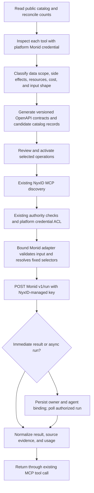

# Monid API audit and programmatic integration plan

Prepared on 2026-10-07. Research and offline conversion examples only; no provider was activated and no paid tool was executed.

For direct upstream execution with NyxID-owned credentials, see the [direct provider extraction work plan](DIRECT_PROVIDER_PLAN.md). It maps the work onto the existing code, separates the first pilot from broader runtime support, and gives preliminary effort estimates.

The [Tools Registry product and migration plan](TOOLS_REGISTRY_PLAN.md) adds manual vendor setup, a new admin sidebar entry, a user Tools view, architecture-specific draft/publication handling, and a complete migration backlog. All **87 providers, 2,440 hosted identities, and 699 source definitions** are accounted for; the union has 2,502 planning rows after 637 matches. No account signup automation is proposed.

**Yes: NyxID can import Monid's catalog programmatically and offer its tools through the existing OpenAPI → MCP interface without users connecting provider accounts.** The broadest execution route is a NyxID-managed Monid account plus a bounded Monid adapter. Direct vendor access is also possible, but requires platform-owned credentials and provider-specific work. Importing definitions does not itself establish access to the data.

This audit collected every publicly enumerable hosted endpoint and its public detail record, compiled every connector in the current public source, and reviewed every operation in Monid's published HTTP API reference. Full hosted input schemas and live execution require authenticated access. Public listing APIs belong to the website and are not documented as a stable integration contract.

## What was scanned

| Surface | Observed coverage | Verification |
| --- | --- | --- |
| Live hosted catalog | **2,440 unique endpoints across 87 providers** | Followed all 49 listing pages; fetched all 2,440 detail records successfully; checked reported counts for all 87 providers |
| Hosted stats | 2,441 endpoints / 87 providers | Same totals at the beginning and end of collection |
| Count discrepancy | StockAnalysis reports 8 endpoints but returns 7 | Repeated with a provider-filtered listing; no additional endpoint was returned. The catalog's aggregate count exceeds the enumerable inventory by one |
| Public tool details | Method, descriptions, prices, categories, documentation links, and optional next-step hints | **None of the 2,440 detail records contains an input schema** |
| Hosted resources | 7 resource types, linked to 65 distinct endpoints | Resource listing contains email inboxes/domains, phone numbers, filesystems, machines, browser sessions/profiles |
| Current public source | **699 endpoints / 31 providers / 35 upstream origins** | Compiled the entire repository at `c57aa3d4b2036f518cbc7d3879a097ac1c8af4ea`; 699 source endpoint files and 699 compiled definitions |
| Latest published source catalog | 520 endpoints / 31 providers | Downloaded `catalog-v0.0.4`; verified its asset SHA-256 against GitHub release metadata |
| Published authenticated HTTP API | 10 operations | Reviewed the complete API documentation index and every API reference page |
| Unauthenticated schema inspection | HTTP 401 | A read-only `/v1/inspect` request without a credential was rejected |

The hosted snapshot was collected from 03:28:59 to 03:31:43 UTC on 2026-10-07. A live catalog is not an atomic database snapshot; the explicit provider reconciliation accounts for the observed one-item discrepancy. Hidden, account-specific, or unpublished endpoints are outside publicly verifiable coverage.

Current source and hosted identities also differ. **617 source endpoints match hosted provider/path identities exactly; 637 match after the explicitly recorded `contextdev` → `context.dev` and `magic-hour` → `magichour` aliases.** The remaining 62 source identities need reconciliation. Some are renamed in the hosted catalog, and some are not listed. An importer must use hosted `/v1/inspect` for hosted execution contracts rather than assume source paths are interchangeable.

## Public APIs that make catalog automation possible

Base URL: `https://api.monid.ai`. These routes were identified in the tools website's shipped JavaScript and called without authentication:

| Route | What it provides | Importer use |
| --- | --- | --- |
| `GET /public/v1/stats` | Endpoint and provider counts | Detect changes and reconcile coverage |
| `GET /public/v1/categories` | Category tree and counts | Classify tools and improve discovery |
| `GET /public/v1/endpoints` | Paginated endpoint inventory | Enumerate provider/path identities, descriptions, prices, and tags |
| `GET /public/v1/providers/{provider}/endpoints/{native-path}` | Individual tool detail | Add HTTP method, documentation URL, summary, and next-step hints |
| `GET /public/v1/resources` | Resource types and affected endpoints | Identify operations requiring ownership and recurring resource charges |

The listing supports `provider`, `category`, `cursor`, `limit`, and `include_all` query parameters. Asking for 100 returned at most 50 records per page. The collector follows cursors until exhausted, checks duplicate identities, and preserves retrieval timestamps. Category counts overlap and do not sum to the total inventory.

`POST /v1/discover` is a ranked natural-language search, capped at 40 results. It is useful for selection, but cannot replace exhaustive enumeration. For production import, prefer a documented authenticated catalog export if Monid provides one; otherwise retain a snapshot and reconcile this public website API with authenticated inspection.

## The complete documented authenticated API

All ten operations use a Bearer credential. A Monid API key is already bound to its workspace; the extra workspace header applies to OAuth/JWT tokens without an organization context.

| Operation | Proposed NyxID use |
| --- | --- |
| `GET /v1/auth/whoami` | Operator connection check |
| `GET /v1/auth/workspaces` | Operator workspace check; unnecessary per-user setup with a platform key |
| `POST /v1/discover` | Optional upstream ranking; intersect results with the caller's NyxID grants |
| `POST /v1/inspect` | Import exact input schemas, body type, prices, notes, and hints |
| `POST /v1/run` | Execute a server-bound provider/endpoint with validated input |
| `GET /v1/runs` | Operator reconciliation; user history must come from locally owned records |
| `GET /v1/runs/{runId}` | Poll only runs bound locally to the authorized NyxID owner/agent |
| `POST /v1/runs/{runId}/stop` | Stop only an authorized locally owned run |
| `GET /v1/wallet/balance` | Platform budget monitoring |
| `GET /v1/wallet/activities` | Operator cost reconciliation |

Monid also documents OAuth integration through its OIDC discovery document. That flow supports users bringing their own Monid workspace; the platform-key flow fits the requested no-user-connection experience. x402 is an additional payment route, not necessary for the one-platform-key design.

## How much can go straight into our existing proxy?

The source bundle is machine-readable JSON, but also contains executable hook references. A declarative document alone cannot reproduce those hooks. The following groups are mutually exclusive, using ownership first, then polling, start hooks, and request transforms:

| Source group | Endpoints | Implication |
| --- | --- | --- |
| Plain HTTP request candidates | **267** | Request URL and input locations can be translated; output, errors, serialization, defaults, and pricing still need review |
| Request transform, without lifecycle/ownership | **49** | Preserve transformation logic in an adapter or author a native upstream contract |
| Start hook, without polling/ownership | **239** | The hook replaces the normal request path; it may transform envelopes, filter results, or compose calls |
| Polling lifecycle, without resource ownership | **131** | Preserve start/poll/stop and timeout behavior |
| Resource ownership | **13** | Preserve tenant ownership checks and resource lifecycle before allowing execution |
| Total | **699** | Full compiled source inventory |

Across those groups, **107 endpoints have request transforms, 380 have lifecycle start hooks, and 132 have polling hooks**; these overlapping flags are available per endpoint in the CSV. A start hook does not necessarily mean an asynchronous job. There are also 317 response transforms, 545 error transforms, and 413 vendor-usage consolidation hooks.

Only **13** definitions have a plain request without request/lifecycle/resource hooks, response/error transforms, or usage consolidation. Five of those use array query parameters whose serialization differs between the engines. The offline converter therefore emitted **8 operations in 4 OpenAPI 3.1 documents** as conservative examples: five Apollo operations, one People Data Labs operation, and TinyFish search/fetch on separate hosts. All four documents passed OpenAPI validation. That proves document generation, not successful provider execution or production suitability.

Concrete conversion constraints found in the existing NyxID implementation:

- **Query arrays:** Monid repeats keys (`k=a&k=b`); the current NyxID MCP builder stringifies non-string values into one query value. Eighteen source endpoints expose complex query fields. Apollo array filters are a specific example. Preserve the intended serialization through an adapter or a separately reviewed serializer change.
- **Schema projection:** 111 source endpoints contain `anyOf`/`oneOf` combinators. The Aevatar workflow schema subset excludes those keywords. General OpenAPI parsing and that narrower workflow contract are different surfaces; generate a suitable workflow projection while preserving runtime validation.
- **Fixed destinations:** The source uses 35 upstream origins. Split direct catalog services by origin and credential class, and preserve static request headers through the existing service defaults.
- **Route collisions:** Multiple model-specific tools share one upstream method/path. OpenAPI has one operation per method/path, so direct conversion must consolidate their contract or expose distinct bound adapter routes.
- **Authentication:** The reviewed source uses Bearer, custom headers, Basic credentials, ContactOut's separate work/personal keys, and Opoint's `Token` prefix. Map reviewed patterns to existing credential injection; retain custom cases for review. A no-op injection hook can still inherit a credential schema, so lack of injection is not evidence of credential-free engine execution.
- **Credentials and costs:** Definitions contain credential shapes, never usable credentials. Import price metadata independently from the chosen NyxID user price and funding policy. Vendor credit units and USD rates are not interchangeable with NyxID credits.

The released catalog has 520 definitions while the current source has 699. An import pipeline should pin a version or commit, diff changes, and update operation generations. Do not treat the latest release as the complete current source.

## Recommended flow for broad access without user setup

Keep the existing catalog, OpenAPI parser, platform credential checks, MCP discovery/call interface, and operation grants. Support two execution routes under that interface: direct upstream APIs for selected free sources, and a Monid supplier adapter for broader managed coverage.

For the Monid route:



An exposed operation could have a stable route such as `POST /tools/{catalog-operation-id}/run`. The catalog operation, rather than caller-supplied fields, resolves the Monid provider and native endpoint. Its request body contains only that tool's inputs. This is a proposed adapter contract; it is not an existing NyxID route.

The adapter constructs the existing upstream request:

```json
{
  "provider": "exa",
  "endpoint": "/search",
  "input": { "query": "recent semiconductor research" }
}
```

The example illustrates Monid's published flat `input` convention. Inspection describes schemas by body/query/path location; the importer must verify how each tool's locations map into the hosted run input, especially when names collide or body types are form/multipart. Do not reuse the local engine's structured `RunInput` shape without checking that boundary.

One raw `/v1/run` operation is insufficient for exact tool grants: its provider and endpoint selectors are in the body, while NyxID's existing operation policy checks method/path and does not validate body selectors. Fixed, server-resolved adapter bindings give the existing OpenAPI/MCP model a distinct operation to authorize. Binding changes must update the operation generation and execution-authority projection so a saved approval cannot authorize a different upstream operation.

Async runs need a local mapping from the run identifier to acting person, authorized owner, agent/key authority, provider, endpoint, and operation contract. Validate that mapping and live authority before poll/stop/result access. A shared Monid workspace's upstream ownership check separates workspaces, not NyxID users. Account-wide run lists, wallet data, and raw resource lists therefore belong to operator workflows; user views come from locally owned records.

Resource tools require their own complete ownership contract before publication. Imported identifiers cannot grant access to another NyxID user's inbox, phone number, machine, filesystem, browser session, or saved profile. The public resource registry identifies 65 affected endpoints; its absence on another endpoint is not sufficient proof that the endpoint has no account-specific effects.

Normal results should distinguish run lifecycle from provider outcome. Monid documents `COMPLETED` with a provider error, and `200` with `BLOCKED`; HTTP success alone does not establish usable data. Retain per-tool input validation, bounded deadlines, polling, cancellation, and a usable partial/error response.

## Free public data versus other tools

The catalog includes search and enrichment, plus media generation, communications, rented resources, browser automation, storage, and machine operations. They are not all public data tools.

**172 hosted entries advertise zero-price `PER_CALL` execution.** Many are metadata lookups or operations on separately paid/rented resources. TinyFish search and fetch are examples of useful zero-priced data operations. The source declares `FREE` for 86 definitions. Neither count proves that the entire provider is free, that all infrastructure costs are zero, or that free capacity is sufficient for a shared platform account.

Publish My Services and Public Data Tools using the distinction already defined in the approach document. Independently record provider, data scope, credential binding, upstream cost, user price, quotas, and side effects. A NyxID-funded paid data operation can require no user setup, but it needs an explicit funding decision before activation. Importing the entire catalog does not automatically publish the entire catalog to every AI.

## Implementation plan after this study

1. **Importer:** enumerate and reconcile the public inventory; obtain authenticated schemas; pin snapshot hashes and hosted provider/path identities; generate candidate OpenAPI documents split into bounded files. Store all candidates as inactive until classified.
2. **One adapter:** bind each exposed operation to a fixed Monid provider/path, validate the inspected inputs, and execute through the existing authorization and platform credential boundary. Keep Monid's key on server transport.
3. **Run ownership:** persist local owner/agent/operation bindings, apply live revocation to follow-up access, and normalize synchronous, blocked, failed, and asynchronous outcomes. Record ambiguous starts for reconciliation; do not retry a potentially effected operation merely because the response was lost.
4. **Cost controls:** enforce platform and caller budgets/quotas. Import upstream price metadata, but settle user charges or platform subsidy through NyxID's existing exact accounting rather than transplanting Monid's billing engine.
5. **Pilot:** validate TinyFish search/fetch plus one paid synchronous enrichment and one asynchronous scrape using a normal NyxID user with no provider account. Confirm tool selection, schema mapping, cost, timeout, polling, and source evidence.
6. **Expand:** activate reviewed public-data operations first. Add generation, communications, or owned resources only with their appropriate product classification and authority contracts. Refresh imports as reviewable diffs that update operation generations.

For independent direct access, use the same importer/front-end contract with native vendor specs and NyxID-owned vendor credentials. The MIT source is useful material, but does not supply credentials or account provisioning. An alternative is hosting the MIT connector engine; doing so retains lifecycle/resource/runtime obligations and still requires vendor accounts. It does not produce the hosted catalog's full 87-provider coverage from the current 31-provider source alone.

## Artifacts and reproduction

- [Hosted endpoint inventory](hosted-endpoints.csv): all 2,440 records, method, complete listed price JSON, tags, categories, resource links, and public detail URL.
- [Provider inventory](providers.csv): all 87 hosted providers, with current source coverage and adaptation counts where available.
- [Source endpoint audit](source-endpoints.csv): all 699 compiled definitions, request origins, auth mapping, hooks, schema/serialization flags, release/hosted identity matches, and pinned source links.
- [Machine-readable summary](summary.json): exact counts, snapshot times, commit and artifact hashes.
- [Pagination reconciliation](pagination-reconciliation.json): all 87 provider totals and the StockAnalysis discrepancy.
- [OpenAPI examples](openapi-examples/candidate-manifest.json): four documents containing eight conservative conversion examples; every manifest record is inactive.
- [Public collector](fetch_public_catalog.py) and [offline analyzer/converter](scan_catalog.py): reproduce the public inventory and source classification.
- [Registry design and migration flow](TOOLS_REGISTRY_PLAN.md), [provider migration backlog](provider-migration-backlog.csv), [tool migration backlog](tool-migration-backlog.csv), [backlog summary](migration-backlog-summary.json), and [offline backlog generator](build_migration_backlog.py): manual setup and complete, reproducible planning coverage.

```bash
python3 docs/plans/monid-api-audit/fetch_public_catalog.py \
  --output /tmp/monid-hosted-snapshot

# In a temporary checkout pinned to the reviewed Monid commit:
deno task compiler:compile --frozen-meta

# Use the downloaded catalog-v0.0.4 release asset and compiled source bundle:
python3 docs/plans/monid-api-audit/scan_catalog.py \
  --bundle /tmp/monid-source/.output/catalog.json \
  --hosted /tmp/monid-hosted-snapshot/hosted-catalog.json \
  --release /tmp/catalog-v0.0.4.tar.gz \
  --output /tmp/monid-audit-results
```

The source bundle compiled successfully. The collector verified unique identities and all public detail requests succeeded. The example OpenAPI documents passed `@apidevtools/swagger-parser` validation. No NyxID runtime parser execution, authenticated full-catalog schema inspection, or live provider execution was performed. Those are the next proof steps once the platform Monid connection is configured.

## Evidence

- [Monid tools website](https://monid.ai/tools), [public stats](https://api.monid.ai/public/v1/stats), [public endpoint listing](https://api.monid.ai/public/v1/endpoints), and [public resources](https://api.monid.ai/public/v1/resources).
- [Monid's published API index](https://monid.ai/docs/api/overview), [inspection](https://monid.ai/docs/api/inspect), [execution](https://monid.ai/docs/api/run), [run access](https://monid.ai/docs/api/runs/get), and [workspace run listing](https://monid.ai/docs/api/runs/list).
- [Direct platform access](https://monid.ai/docs/integrations/direct/setup), [proxy integration](https://monid.ai/docs/integrations/proxy), and [when to use a proxy](https://monid.ai/docs/integrations/proxy/when-to-use) explicitly support platform-owned access without user Monid accounts.
- [Reviewed source](https://github.com/monid-ai/monid/tree/c57aa3d4b2036f518cbc7d3879a097ac1c8af4ea), [compiled endpoint contract](https://github.com/monid-ai/monid/blob/c57aa3d4b2036f518cbc7d3879a097ac1c8af4ea/shared/core/schema/endpoint/doc.ts), [query serialization](https://github.com/monid-ai/monid/blob/c57aa3d4b2036f518cbc7d3879a097ac1c8af4ea/engine/request.ts), and [Saperly pooled ownership](https://github.com/monid-ai/monid/blob/c57aa3d4b2036f518cbc7d3879a097ac1c8af4ea/connectors/saperly/provider.ts).
- [Published catalog release](https://github.com/monid-ai/monid/releases/tag/catalog-v0.0.4); asset digest `78206c510d4f1cc1d07eddbb93d42a989234be8d7f01e912c8dedbb315326dea`.
- [NyxID catalog discovery](../../API_DISCOVERY.md), [service policy](../../SERVICE_CONFIGURATION.md), [platform credentials](../../PLATFORM_KEYS_AND_INFERENCE.md), [OpenAPI parser](../../../backend/src/services/openapi_parser.rs), and [MCP request builder](../../../backend/src/services/mcp_service.rs).
