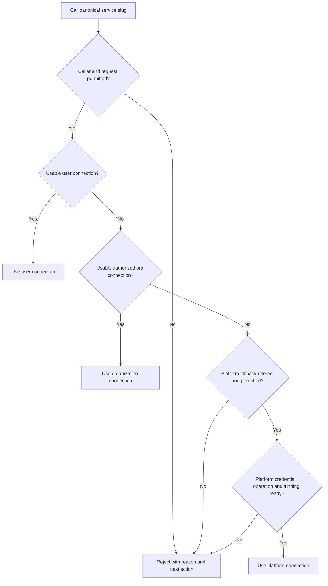

# Slug routing and connection availability

Status: proposal for review; application behavior is unchanged.

The current product flow is [Consolidated Services](consolidated-services-flow.md)
(revised 27 September 2026). This document retains the detailed execution rationale;
the newer flow supersedes its UI terminology and presentation.

The current UI flow is in [service connections and pool ordering](ai-service-connection-user-flow.md),
revised 17 September: omit absent platform sources, require verified readiness,
retain individual cards, and drag only actual members within a ServicePool after
opting into Priority. Catalog grouping is a view, not a pool. This document
retains the execution and security rationale behind that flow.

Date: 2026-09-16. Prepared by Codex with the independent
[Fable review](slug-routing-fable-review.md) incorporated. This document is the
reconciled recommendation; the review retains its original alternatives.

User clarification: the required execution order is **user → organization →
platform**. Organization fallback after an unusable user connection is part of
the core delivery. This supersedes the earlier review's recommendation to defer it.

Source choice: users can explicitly select **NyxID platform only** even when their
personal connection is usable. The three-tier order is the **Automatic** mode,
not a restriction on an authorized explicit source choice.

## Product contract

In Automatic mode, calling a service's canonical slug selects the first usable, authorized
connection in this order: the user's connection, an authorized organization
connection, then a platform connection explicitly offered for that service.
Missing or unusable user credentials advance to the organization tier; missing
or unusable organization credentials advance to the platform tier.
If none qualifies, NyxID rejects the request before
forwarding it and explains what the caller can do next.

The user should see the same decision before calling: which connection the slug
would use, why an earlier connection cannot be used, and which account pays.

This selection happens on the server for every canonical slug API request. The
client keeps one URL and does not need to choose a source or implement fallback.
In Automatic mode, repairing a user connection makes the next new request prefer
it again. In platform-only mode, the platform remains selected. An
in-flight request or established stream remains on its selected connection.

“Usable” means the credential and route can be prepared for this operation and
pass its access and billing checks. It cannot promise that a third-party service
will accept the next request. Show verification evidence and its age separately
from connection configuration, and recheck at execution time.

## What exists and where the behavior falls short

These observations were checked against the current code, rather than inferred
from older design documents:

| Current behavior | Consequence | Evidence |
| --- | --- | --- |
| Personal `UserService` resolution immediately calls `finish_resolution()` and propagates its error. Personal pools, legacy personal records and org resolution follow separate branches. | A matching but unusable personal row can stop resolution before another source is considered. | `backend/src/services/proxy_service.rs`, `resolve_proxy_target_from_user_service`, `finish_resolution` |
| An inactive personal row is skipped by active-only lookup; for an eligible master-credential catalog service, the legacy path can then select the platform credential, subject to its authorization and scope gates. | Expiry can stop access while Disable/Delete can permit platform fallthrough. The new resolver must own the terminal decision, including explicit platform opt-out. | `user_service_service.rs`, `find_by_slug`; `handlers/proxy.rs`, slug legacy fallback; `proxy_service.rs`, `resolve_proxy_target` |
| Auto-provisioned platform services are stored under the user's ID. | Ownership alone cannot identify a user-supplied credential. | `proxy_service.rs`, `AUTO_PROVISION_SOURCE` handling; `unified_key_service.rs`, `auto_provision_no_auth_services` |
| Auto-provisioning skips a catalog service if any matching user row exists, including inactive rows, and is invoked from the key listing. | A platform candidate must be derived from authorized catalog configuration without requiring an auto-provision row or a visit to `/keys`. | `unified_key_service.rs`, `auto_provision_no_auth_services`, `list_keys` |
| Concrete connection slugs can receive suffixes; catalog-ID lookup uses `find_one` without a preference order. | Calling the catalog slug may miss a healthy user connection named `llm-openai-2`; selecting by catalog ID is not a defined multiple-account policy. | `unified_key_service.rs`, `resolve_unique_slug`; `user_service_service.rs`, `find_by_catalog_service_id`; `frontend/src/types/keys.ts`, `catalog_service_slug` |
| Master credentials already require a qualified catalog service and authorization. They are not generic provider OAuth app credentials. | A configured OAuth client does not make a platform execution connection available. Existing platform authorization must be retained. | `proxy_service.rs`, `authorize_master_credential`, `is_valid_master_credential_service` |
| `/keys` combines credential status, connection expiry, node status and provenance in the frontend. Proxy discovery uses connection presence; MCP has its own credential classifier. | Surfaces can disagree about whether the same service is callable. | `frontend/src/pages/keys.tsx`; `proxy_discovery_service.rs`; `mcp_service.rs`, `classify_credential` |
| Approval-owner and approval-hint lookups mirror routing independently. Pools already exist; selection increments a database counter. | New precedence must cover approvals and previews, and merely opening a page must not rotate a pool. | `proxy_service.rs`, `find_effective_service_owner`, approval hint resolvers; `service_pool_service.rs`, `resolve_member` |
| Billing already distinguishes the final credential class; resale requires `NyxidManagedMaster`. | Charge attribution should consume the final selected route. User credentials do not imply that every NyxID proxy fee is zero. | `backend/src/services/billing/route_context.rs` |

## Resolve service identity before choosing a credential

A catalog slug names a logical service. A connection UUID or custom/instance slug
names a particular connection. Preserve that distinction:

- **Canonical catalog slug:** enables the user-first selection rule. Find user
  candidates by the catalog ID, including connections whose concrete slug has a
  suffix. Never match credentials by a slug prefix or provider name alone.
- **Concrete connection UUID, the existing `_nyxid_via` selector, custom slug or pool
  slug:** retain their declared target. An explicit account choice must not turn
  into another account or platform identity when it fails. Existing pool selection
  remains inside its member set.
- **Existing custom/pool slug colliding with a catalog slug:** preserve its current
  meaning until an explicit migration resolves the conflict. Never silently
  retarget that traffic. Block new ambiguous assignments for enabled canonical
  routes.
- **An existing same-slug connection linked to the same catalog:** can remain the
  preferred member of that canonical route. The detail page exposes a UUID-based
  exact URL for callers that require that particular connection.
- **Agent credential overrides and exact approvals:** are execution constraints,
  not optional preferences. A missing bound credential fails that bound request.
  An approval for one concrete identity never authorizes another by implication.

For multiple user connections, persist a preferred connection. Preserve the
existing same-catalog exact personal slug match as the initial default. When
there is no such match or stored preference, automatically use the only configured
compatible personal connection. With several unchosen accounts, ask the user to
choose a default; do not choose an arbitrary MongoDB row or silently change
accounts because one has failed. A default is an ID preference, never a slug
rename. Existing pools cover intentional balancing; v1 adds no ordered list of
alternative user accounts.

## Selection policy



User-first includes legacy personal credentials during migration. A user
connection that fails a typed eligibility/preparation check advances to eligible
organization connections, then platform. Label the organization with its actual
name and billing owner. For multiple organizations, retain primary-organization
priority and a defined stable order for remaining eligible memberships; expose
that order in the expanded routing view. Apply role, service/node scope, consent,
operation/account compatibility, approval and payment gates to each candidate.
An unauthorized organization is not a usable candidate. Caller-wide denials and
exact execution constraints still stop the request. Public catalog visibility
does not confer execution permission.

Eligibility has four parts:

1. **Authority:** authenticated caller, owner ACL, API-key service/node scope,
   consent, operation policy, resource restrictions and approval constraints.
2. **Configuration:** enabled connection, existing endpoint and credential,
   correct provider/operation/account compatibility, and an eligible catalog
   service. A deliberately no-auth service needs no credential; a missing
   credential row does not mean no-auth.
3. **Preparation:** materialize an authorized credential; perform the existing
   bounded OAuth refresh when needed; confirm the required node route can be
   dispatched. An offline primary node may use existing permitted node failover.
4. **Payment:** resolve the actual billing owner and final credential class,
   enforce entitlements and reserve any required funding before provider effects.

Classify failures rather than catch every `AppError` and continue:

| Condition | Action |
| --- | --- |
| No configured personal connection | Consider the next permitted source. |
| Missing/expired personal credential, terminal refresh rejection, or unavailable permitted node routes | Consider the next source only for a canonical route whose policy allows that substitution; retain a repair reason. |
| Credential refresh is pending or its result is unknown | Bound the preparation attempt; report uncertainty or a permitted alternative without declaring the credential revoked. |
| Explicit connection/agent binding, node-only execution constraint, platform opt-out, or an approval bound to another target | Honor the constraint; do not reinterpret it as a health failure. A disabled pinned connection remains unavailable. |
| Caller-wide permission, consent, operation policy or rate-limit denial | Return the applicable denial. Fallback must not bypass it. |
| Candidate-specific org ACL does not permit use | Exclude that candidate without revealing private details; any alternative requires its own complete authorization. Preserve existing denial semantics unless explicitly migrated. |
| Database/KMS/decrypt failure or an integrity violation such as a dangling credential/endpoint reference or inconsistent ownership | Return the server error; do not mask it as “no connection” or silently introduce paid fallback. Typed incomplete credential setup is distinct from corrupt references. |
| Business request already sent, response timed out, stream interrupted, or upstream returned an error | Return that outcome. Do not replay the request through a different source in v1. |

Use existing typed credential/refresh outcomes to inform subsequent calls. Do not
globally disable a credential based on an arbitrary resource-specific 403, a 429,
or a provider outage. Defer a new persisted health/circuit-breaker subsystem;
v1 reports known configuration and credential states. If health observations are
added later, bind them to the credential version and operation/account scope.
Existing refresh behavior must not increment `credential_epoch`.

## Platform fallback is an explicit product offering

Start with an inventory of the actual catalog configuration. Production catalog
data has not been inspected for this proposal. For a catalog row that already
supports BYOK and a master credential, reuse the existing validated platform
predicate and authorization path, including `provider_config_id.is_none()`.
Use the existing `proxy_operation_policy` for its operation allowlist, with
additional compatibility checks where the request references account resources.
Do not relax `requires_user_credential` or infer an execution credential from an
OAuth client ID/secret. Server-only `platform-*` vendor templates remain outside
user-addressed slug fallback.

Only if the inventory shows that the logical user service and its platform
offering are distinct catalog rows, add an explicit administrator mapping by
catalog ID. Follow at most that configured target, with no recursive alias chain
and no slug-prefix matching. The platform candidate is virtual: derive it from
authorized catalog configuration even if no auto-provisioned `UserService` row
exists and the user has never opened `/keys`.

Examples:

- A platform OpenAI offering may support stateless inference with its own billing
  and model limits. A request referring to user-owned files, assistants, batches
  or other provider resources requires the original account. Unknown compatibility
  fails closed; a matching HTTP method/path alone may be insufficient.
- A platform GitHub OAuth app helps users authorize their own accounts. It is not
  a fallback GitHub account for reading repositories or creating issues.
- A valid public no-auth route can be available without either credential source;
  its ordinary execution and node rules still apply.

The normal mode is **Automatic: You → Organization → NyxID**. An **Allow NyxID
fallback** setting controls the last tier; turning it off leaves user →
organization → error. Enable that last tier where fallback is offered and the
payer already has any required billing authorization for the route. Otherwise
keep it off until the user opts in with payer and pricing disclosed. This setting
never moves platform ahead of an eligible organization. Do not silently opt
existing BYOK-only users into new charges during migration.

Once the evaluator handles a request, its decision is terminal. A rejected or
automatically opted-out platform candidate must not be retried through the old catalog
fallthrough. Existing legitimate legacy personal connections remain candidates.

## Explicit platform choice

Expose a **Connection choice** control on the logical service:

| Choice | Execution behavior |
| --- | --- |
| Automatic — You → Organization → NyxID | Select the first usable authorized tier, respecting the automatic platform-fallback setting. |
| NyxID platform only | Evaluate the platform candidate directly, even if personal and org connections are ready. Return its error if unavailable or denied; never silently use personal/org instead. |

Allow the user to save this preference per service and override it for an
individual canonical API request. A proposed request header is
`X-NyxID-Connection-Source: platform` (use `auto` to explicitly request Automatic).
This is a proposed interface, not a currently implemented header. Keep the same
canonical slug URL. Validate the header, reject invalid/ambiguous values and
consume it inside NyxID; do not forward it downstream. CLI/MCP controls should
map to the same resolver input where those transports expose source choice.

The effective choice is the request's explicit mode, otherwise the saved
per-service mode, otherwise Automatic. This precedence applies only to source
selection; exact connection pins, agent bindings, approval authority, caller
permissions and administrator constraints remain mandatory. Reject conflicting
explicit choices rather than silently dropping a pin or source request.

Selecting platform is a choice of an already configured, authorized offering,
not permission to access an arbitrary internal platform service. Apply its
operation compatibility, rate-limit, consent, funding and approval gates even
when a working user credential is available. Show the actual payer and pricing
when saving the preference. A per-request header never grants new billing or
execution authority.

**Allow NyxID fallback** only controls Automatic mode. An explicit platform-only
choice can use the platform when authorized even if automatic fallback is off;
any hard platform-use restriction continues to deny it. Hide the fallback toggle
while platform-only is selected to avoid presenting it as a contradictory setting.

For example, the card becomes **Ready via NyxID · Platform selected**. Show personal
and org connections as **Ready · Not selected** when healthy, rather than implying
they failed. If platform is unavailable, show **Platform unavailable · Platform
selected**, its repair reason, and **Switch to Automatic**. The user's own
connection stays enabled and immediately becomes eligible again in Automatic.

## One decision shared by execution and display

Extend the existing proxy resolver boundary with a typed resolution result;
avoid a second registry of credentials or endpoints. Its input includes the
verified caller, logical or exact target, operation descriptor and execution
constraints. Candidate provenance is explicit: `personal`, `organization`,
`platform`, or `no_auth`, independently of the row's owner.

Conceptual result (field names are proposed, not an existing API):

```text
ServiceResolution
  requested_slug / catalog_service_id / target_kind
  requested_mode / effective_mode / selection_origin: request | saved | default
  availability: ready | conditional | unavailable | blocked
  selected_source / selected_connection_id / display_label
  reason / recovery_action
  candidates[]: source, allowed display label, eligibility, reason
  verification: not_verified | known_credential_failure
  evaluated_at / last_used_at
  billing: payer, applicable charge layers, pricing reference
  constraints: exact binding, required node, approval requirement
```

Execution enumerates permitted candidates and evaluates the selected concrete
route through the existing ordered gates. In particular, exact approvals retain
their claim and live policy/authority checks before credential materialization,
and their second authority comparison after materialization and before provider
effects. Bind approval/execution-authority digests and audit attribution to that
concrete route. A candidate change restarts the applicable route gates; never
reuse a grant obtained for the failed one. Once an approval or execution has
pinned the target, changes require revalidation or a new approval as appropriate.
Billing reservation occurs only for the final authorized route before dispatch.

Build each candidate as a complete `ProxyTarget`: endpoint, credential, default
headers, identity propagation and node constraints travel together. Switching
sources must never send a personal credential or private connection header to a
platform endpoint, or transplant platform authority onto a user-controlled URL.

The read-only projection uses the same candidate rules without decrypting,
refreshing OAuth tokens, probing providers, incrementing pool counters, consuming
rate-limit allowances or reserving funds. It reports `conditional` when refresh,
operation details, pool selection, billing reservation or verification must still
be resolved. It is an explanation of current facts, not a reusable execution
grant. Reevaluate live state on every call.

Expose this projection on the service listing/detail and an actor-authorized
availability read. HTTP proxy, MCP discovery/execution, LLM ingress and CLI should
consume the same rule set for canonical calls. Preserve exact instance endpoints
and instance-specific MCP operation schemas. Do not publish a canonical MCP tool
whose schema or account semantics differ across its permitted candidates.

Batch projection inputs for a page and avoid one credential/node/provider lookup
per card. Keep any preview cache short and keyed by caller/agent, owner, operation
and policy/credential version. Execution never trusts a cached preview.

## What the user sees

Keep the existing AI Services page and individual connection management. Add a
service-level row or header for each canonical service that answers **“What will
this slug use?”** Its connection details remain expandable/manageable underneath.

Show one top-level service card per canonical catalog identity, with source
connections underneath. The service header always shows its canonical slug/API
URL, **Ready via [source]** (or a blocking state), and either the priority caption
**Automatic · You → Organization → NyxID** or **Platform selected**. Use actual organization names when
known. This makes clear that one service address can use several connections.
Associate personal and organization rows with that service by catalog ID; derive
the platform candidate from its validated catalog configuration/mapping. Custom
services remain independently addressed.

| Primary status | Supporting text | Primary action |
| --- | --- | --- |
| Ready via your connection | `Personal OpenAI · last used 2 min ago` | View routing |
| Ready via Acme | `Organization connection · billed to Acme` | View routing |
| Ready via NyxID | `Your connection needs reconnection; no usable org connection · platform pricing applies` | Reconnect |
| Ready via NyxID | `No usable personal or org connection · platform pricing applies` | Connect your account |
| Connection check needed | `Your connection will be checked on use` | View routing |
| Unavailable | `Your connection needs reconnection; no usable org or platform connection` | Reconnect |
| Unavailable | `No usable personal, org or platform connection` | Connect |
| Payment required | `NyxID fallback requires credits` | Add credits |
| Access denied | Specific caller-safe reason | Request access, when applicable |

These are illustrative states, not live service claims. “Ready” describes route
readiness. For an unverified API key, say **Not yet verified**. Existing
`last_used_at` means last use/attempt, not success. A future last-success indicator
must be backed by actual outcome evidence. Do not synthesize a green health
indicator from `status: active` or `auto_connected: true`.

An expanded example:

```text
OpenAI                                      Ready via Acme
Slug: llm-openai
Automatic · You → Acme → NyxID

Connection order
1  Your connection   Skipped: needs reconnection      Reconnect
2  Acme              Selected for the next request
3  NyxID             Available as fallback

Billing: Acme · View pricing
Last request: Acme · 2 minutes ago

View connections    Copy service URL
```

Label every visible candidate **Selected**, **Available as fallback**,
**Not selected**, or **Skipped: [reason]**, according to the effective mode.
Give missing/unusable connections an appropriate repair
action. Explain why the selected candidate wins: “Your connection needs
reconnection, so new requests use Acme.” In Automatic mode, higher-priority recovery
changes the preview and the next request's source automatically; refresh the projection
after connection edits/reconnection and on page focus. Record the actual source
per request so users can inspect when fallback occurred.

The default card is scoped to the signed-in user. If an API key or agent has
narrower scope or a pinned credential, its result can differ. An expanded **Access
as: You / [authorized agent key]** preview should make that distinction visible;
evaluate the selected caller's real constraints server-side. The group status
is general readiness, while an operation-specific preview can explain additional
request-specific restrictions.

Use text plus an icon for status; color is supplementary. The actual final route
also appears in request history/audit and response metadata, because the next call
can differ from the preview. CLI output should show `SOURCE`, `AVAILABILITY` and
`REASON`. MCP discovery should return repair information for unavailable services
while executable tool publication follows the shared eligibility result.

**Disable remains a connection action.** It turns off that connection and states
the resulting source before the change: for example, “This service will use Acme
while your connection is disabled.” Exact calls to a disabled connection still
fail. Turning off **Allow NyxID fallback** excludes only the platform tier; a
usable authorized org connection still precedes the terminal error. Disabling a
connection must not be presented as disabling every source of the logical service.
Auto-provisioned platform rows remain platform-managed; the opt-out belongs in
the routing preference because those rows reject user mutation. Conservatively
migrate existing disabled/disconnected intent instead of interpreting an old
Disable action as new consent to paid fallback. Delete retains its existing
credential/endpoint removal behavior.

## Failure contract

Return a stable machine-readable reason, a safe human message, and an authorized
recovery action. Preserve the existing error envelope and numeric code registry
in `backend/src/errors/mod.rs`; allocate any new variant there during
implementation rather than inventing a competing code table in this proposal.

Add structured reasons while retaining existing applicable HTTP status/code
contracts: credential setup failures are generally 400, access denial 403, and
funding failures 402. Preserve existing node/pool error mappings. Unknown or
invisible services remain 404. Define a new aggregate failure only where no
existing variant accurately represents it, with allocation in the error registry.
No failure path forwards without a qualified route.

Illustrative new reason: `no_usable_connection`, message: “OpenAI is unavailable.
Your connection needs reconnection, and no usable organization or NyxID connection
is available.” The
response can include caller-visible candidate reasons and a reconnect action;
never include platform secrets, private endpoint URLs or unauthorized org/account
details. Real database/decryption errors retain their sanitized server-fault
contract rather than being rewritten as connection setup failures.

## Implementation sequence and proof of completion

1. **Explain existing decisions.** Extract candidate provenance and read-only
   availability from the current resolver. Share the decision rules with proxy,
   MCP, approval ownership and display. Add the service status/header, routing
   explanation, repair actions, billing/approval disclosure and response/audit
   metadata. This stage preserves routing choices; it must not silently replace
   the unordered catalog-ID selection with a different identity.
2. **Deliver user → organization → platform fallback.** Introduce catalog-identity
   selection and typed pre-dispatch fallback across all three tiers behind a
   rollout switch. Organization fallback is required in this stage, including
   when the user's configured connection is unusable. Check each organization's
   permissions, compatibility, approval requirements and billing ownership.
   Handle a single unambiguous personal connection even with a suffixed slug,
   preserve exact matches/pins, and return a choice action for ambiguous accounts.
   Ship the automatic platform opt-out and explicit platform-only choice, both
   saved per service and overridable per canonical request, in the same stage. Inventory the
   actual catalog, preserve disabled intent and billing authorization, and close
   the legacy fallthrough around the new decision. Cover HTTP/WS, MCP and LLM
   call sites for the same logical target; LLM ingress already shares the core
   resolver. Verify consistency rather than adding a separate LLM resolver.
3. **Extend account selection separately.** Add richer default-selection UI and
   organization preference controls. Keep alternative-account balancing in
   existing pools. This stage is not required to ship the core three-tier order.

Use the existing service models for credentials and routes. If a separate
per-owner `ServiceRoutePreference` document is needed, keep it small: UUID ID,
`user_id`, catalog ID, optional preferred connection,
`routing_mode: automatic | platform_only`, and `allow_platform_fallback` for
Automatic mode.
Apply the repository's MongoDB
datetime/collection conventions and owner ACLs. It records routing intent, not a
duplicate connection inventory. A unique owner/catalog key prevents competing
defaults. Review concurrent changes and rollout migration with execution checks.

Acceptance cases must demonstrate:

- In Automatic mode, a working personal connection beats platform even when its concrete slug is
  suffixed and a platform auto-provision row exists.
- In Automatic mode, a working personal connection beats an available organization connection; an
  unusable personal connection selects a usable authorized organization before
  platform. Missing/unusable user and org candidates select eligible platform;
  no usable tier returns an error without business dispatch.
- In Automatic mode, reconnecting the personal connection restores its priority on the next request
  with the same API slug. Multiple organizations follow the displayed order.
- A recoverably expired OAuth credential refreshes and stays selected; a terminal
  refresh failure permits an authorized fallback before business dispatch.
- No usable route produces an actionable error with zero business dispatches.
- Disabled connections stay disabled; turning off platform fallback excludes it
  through every path while retaining eligible org routing. Existing disconnected
  intent survives migration.
- Explicit connection IDs, agent bindings, custom/pool slugs, node-only contracts,
  org ACLs and exact approvals retain their constraints.
- Platform substitution happens only for the configured compatible operation;
  a GitHub account, OpenAI file ID or instance-only MCP operation cannot drift to
  another account.
- Multiple accounts without a default are deterministic and actionable; no
  unordered `find_one` decides identity.
- Preview performs no credential refresh, decryption, pool advancement, provider
  request, billing reservation or grant issuance/redemption, and labels unknowns.
- Fallback billing uses the final route and payer; a rejected or abandoned
  candidate does not create duplicate usage or leak a funding reservation.
- Platform-only selects an eligible platform while personal and org connections
  are healthy; an unavailable/denied platform errors without fallback. Repairing
  a personal connection does not override the saved platform choice.
- Per-request source choice overrides the saved mode without changing that
  preference. Conflicting exact pins/agent bindings are rejected. Invalid source
  values fail validation and the source selector never reaches the provider.
- UI preview and actual request attribution distinguish Automatic fallback from
  deliberate platform selection, including payer and approval requirements.
- A timed-out write or interrupted stream is never sent through a second
  connection. A stale health observation cannot disable a replaced credential.
- Proxy, MCP, LLM and CLI agree for the same caller, operation and current state;
  a platform database row alone is insufficient to report availability.

No application implementation or deployment is part of this proposal.
