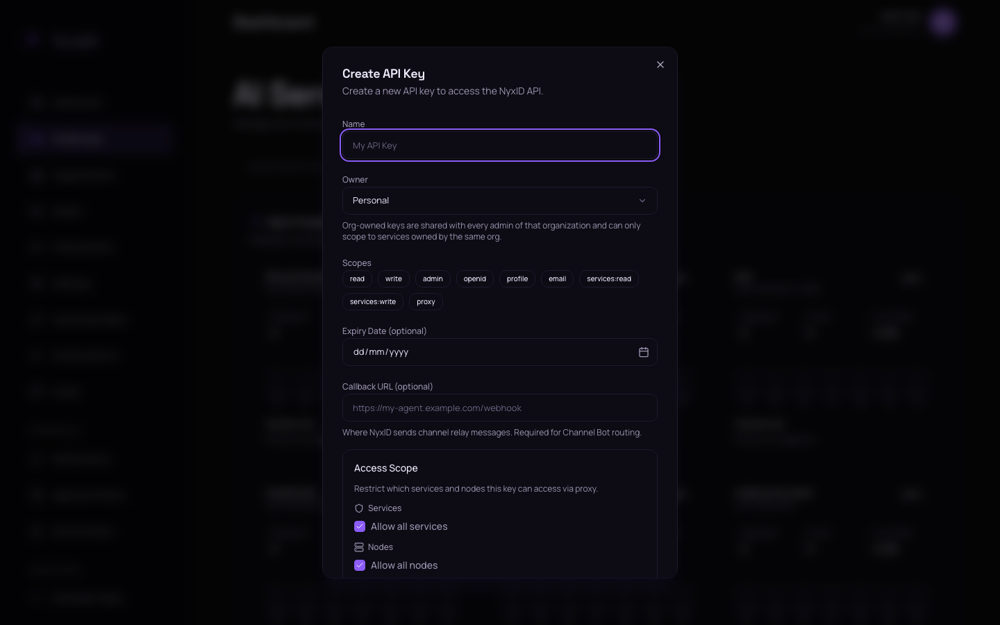
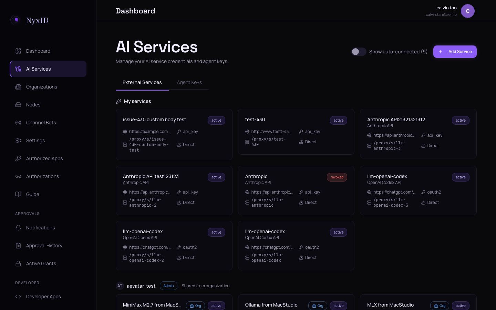
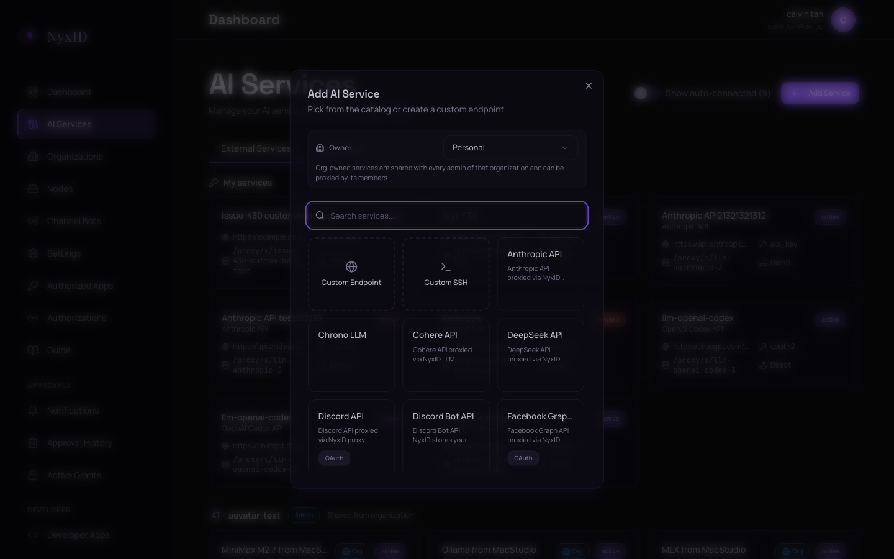
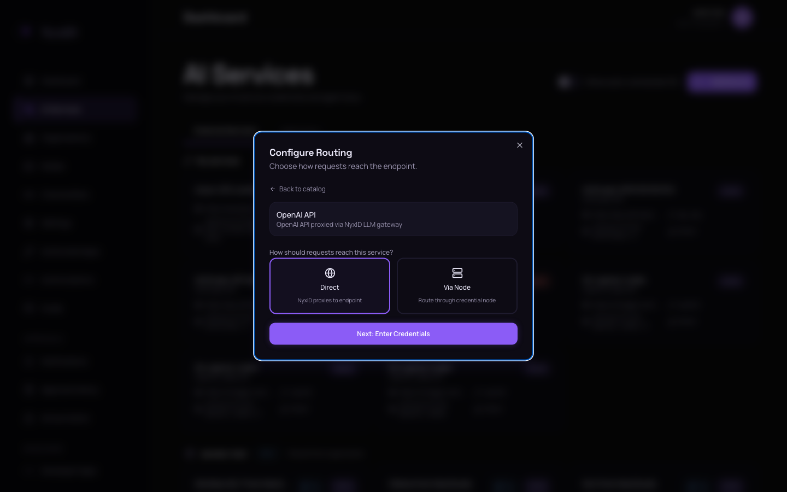
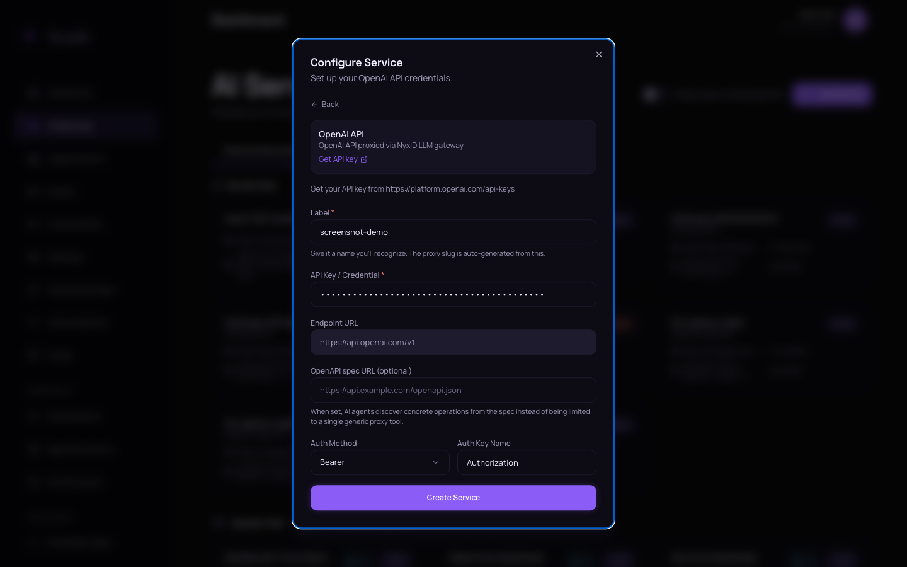
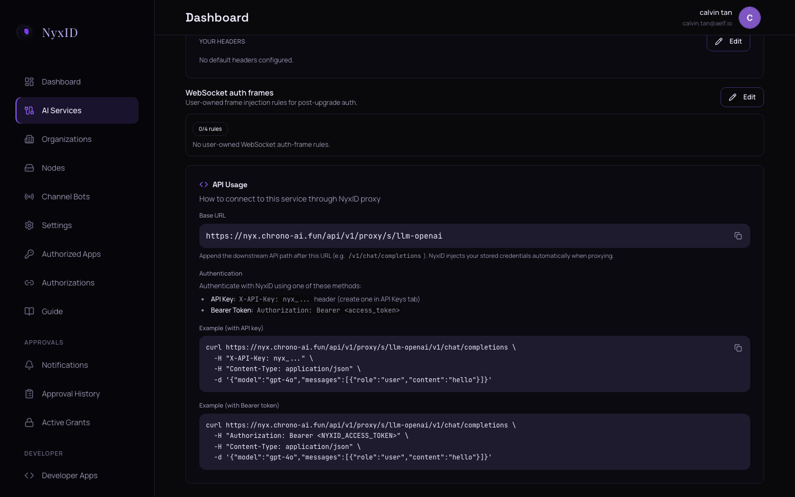

# n8n: One Credential for Every Upstream API

Instead of storing separate API keys for Gemini, TwitterAPI.io, Google Sheets, Telegram, and every other service inside n8n, store only one NyxID Agent Key. NyxID holds the real upstream credentials and injects them at proxy time, so n8n never sees or stores any upstream secret.

```
n8n  ─┐
curl ─┼──(X-API-Key: nyx_…)──►  NyxID Proxy  ──►  Gemini · TwitterAPI.io · Google Sheets · Telegram · …
agent─┘                                            (NyxID injects the right auth per service)
```

This guide uses four upstream APIs as worked examples — Gemini (header auth), TwitterAPI.io (custom header), Google Sheets (OAuth2), and Telegram Bot (path-based auth). The same flow works for any HTTP API.

## Concepts

### What gets stored where

| Item | Stored in | Purpose |
|---|---|---|
| NyxID Agent Key (`nyx_…`) | n8n | Authenticates n8n to NyxID |
| Gemini API key | NyxID | Injected when calling Gemini |
| TwitterAPI.io key | NyxID | Injected when calling TwitterAPI.io |
| Google OAuth refresh token | NyxID | Used to refresh and inject Google access tokens |
| Telegram bot token | NyxID | Injected into the Telegram Bot API path |

n8n only stores the NyxID Agent Key (sent as `X-API-Key: nyx_…`). It never holds Gemini, TwitterAPI.io, Google, or Telegram credentials.

### Credential terms used in this guide

| Term | Meaning |
|---|---|
| **Agent Key** | The NyxID key that n8n uses to authenticate to NyxID. Looks like `nyx_…`. |
| **Upstream credential** | The real API key, OAuth token, or bot token for an upstream service (e.g. a Gemini API key). NyxID stores these encrypted. |
| **n8n Header Auth credential** | The reusable n8n credential that wraps the NyxID Agent Key in an `X-API-Key` header. |

### Before and after

**Without NyxID**, every n8n workflow holds upstream credentials directly:

```
n8n → Gemini API key
n8n → Telegram bot token
n8n → Google OAuth credential
n8n → TwitterAPI.io key
```

Rotating any credential means editing every workflow that uses it.

**With NyxID**, n8n holds one credential and NyxID handles upstream injection:

```
n8n → NyxID Agent Key
       │
       └─► NyxID → Gemini · TwitterAPI.io · Google Sheets · Telegram
```

Rotating an upstream credential happens in NyxID — no n8n change needed.

### Service slugs

Each NyxID service has a **slug** that appears in every proxy URL:

```
https://<nyxid-host>/api/v1/proxy/s/<service-slug>/<downstream-api-path>
```

For example, `api-telegram-bot` is the Telegram service slug:

```
https://<nyxid-host>/api/v1/proxy/s/api-telegram-bot/getMe
```

NyxID prints the slug after every `service add` (and shows it on the service detail page). On a fresh account it matches the catalog or custom name; if you already have a service with that slug, NyxID appends `-2`, `-3`, etc. to keep slugs unique.

## Prerequisites

- A NyxID account and an Agent Key with the `proxy` scope. If you don't have these yet, complete **Step 0** below.
- An n8n instance (cloud or self-hosted) where you can add a credential and `HTTP Request` nodes.
- An upstream API token for each service you want n8n to call. The walkthrough below uses four; obtain each before starting:

  | Upstream service | Where to obtain the token | Auth used | NyxID slug |
  |---|---|---|---|
  | Gemini | [aistudio.google.com/apikey](https://aistudio.google.com/apikey) → `Create API key` | API key (header `x-goog-api-key`) | `llm-google-ai` (catalog) |
  | TwitterAPI.io | [twitterapi.io](https://twitterapi.io) → sign up → `API Keys` | API key (header `x-api-key`) | `twitterapi-io` (custom) |
  | Telegram Bot | Chat with [@BotFather](https://t.me/BotFather) on Telegram → `/newbot` and follow the prompts | Bot token (path `/bot<token>/`) | `api-telegram-bot` (catalog) |
  | Google Sheets | Google Cloud Console — see [Advanced: OAuth services](#advanced-oauth-services) | OAuth 2.0 (refresh token) | `api-google` (catalog) |

  Each token in this table is the **upstream credential** — what NyxID injects into the proxied request. The Agent Key from Step 0 is separate; that is what n8n authenticates to NyxID with.

### Step 0 — Get NyxID running and create an Agent Key

**Hosted (recommended).** Sign up at [nyx.chrono-ai.fun/register](https://nyx.chrono-ai.fun/register) using the invite code in the [README Getting Started](../../README.md#1-install-nyxid). After signing in, open `AI Services` → `Agent Keys` → `Create API Key`. In the dialog, name the key `n8n`, click the `proxy` badge under `Scopes` so it's highlighted, then click `Create key`. Copy the displayed `nyx_…` value (shown once).



**Self-host.** Follow [docs/SETUP.md](../SETUP.md) to bring up the Docker stack, register at `http://localhost:3000`, then create the Agent Key via the same web console flow.

Save the Agent Key value somewhere safe — a password manager works, or a local file with `chmod 600`.

## Quickstart: one service end-to-end (Telegram)

This quickstart walks through one upstream service end-to-end before adding the other three. Telegram is the easiest path because the Telegram catalog entry is already in NyxID and the bot token is straightforward to obtain. After you finish, the same pattern applies to every additional service — see [Add more services](#add-more-services) for Gemini and TwitterAPI.io, [Advanced: OAuth services](#advanced-oauth-services) for Google Sheets.

### 1. Register Telegram Bot in NyxID

> The screenshots below show OpenAI being registered (from the [Web UI walkthrough](../connecting-services/web-ui.md)). The dialog is identical for every service — substitute the upstream service name and token for the one you're registering.

In the web console:

1. Click `AI Services` in the left sidebar. The page shows your existing services and the `Add Service` button at top right.

   

2. Click `Add Service`. The `Add AI Service` dialog opens. Type `Telegram Bot` in the catalog search and click `Connect` on the matching entry.

   

3. The `Configure Routing` step appears. Click `Direct` (NyxID proxies to Telegram directly — `Via Node` is for self-hosted services behind a firewall). Click `Next: Enter Credentials`.

   

4. The `Configure Service` step appears. Paste your Telegram bot token (from `@BotFather`) into the `API Key / Credential` field and click `Create Service`.

   

5. NyxID lands on the service detail page. Note the `Slug` at the top — typically `api-telegram-bot`, but suffixed (`-2`, `-3`, …) if you already have a Telegram service.

   

The Telegram bot token is now stored encrypted in NyxID. n8n will call NyxID with the Agent Key, and NyxID will inject the bot token into every request to Telegram.

### 2. Create the n8n Header Auth credential

The Agent Key from [Step 0](#step-0--get-nyxid-running-and-create-an-agent-key) is what n8n uses to authenticate to NyxID. n8n stores it as a reusable `Header Auth` credential.

1. Open your n8n instance. In the left sidebar, click `Credentials`.

   <!-- TODO: screenshot of n8n Credentials page on n8n.aelf.dev -->

2. Click `Add Credential` (or `Create New` on first use).
3. Type `Header Auth` in the search box and click the `Header Auth` result.

   <!-- TODO: screenshot of n8n credential type search showing Header Auth -->

4. Fill the credential form:

   | Field | Value |
   |---|---|
   | `Name` | `NyxID API Key` |
   | `Header Name` | `X-API-Key` |
   | `Header Value` | The `nyx_…` Agent Key from Step 0 |

   <!-- TODO: screenshot of completed n8n Header Auth credential form -->

5. Click `Save`.

> **Pasting the key safely.** If you saved the Agent Key to a local file, copy it into your clipboard with `cat ~/.nyx_key | pbcopy` (macOS) or `cat ~/.nyx_key | xclip -selection clipboard` (Linux), paste into the `Header Value` field, then securely delete the file with `rm -P ~/.nyx_key` (macOS) or `shred -u ~/.nyx_key` (Linux). Avoid pasting the key into chat, terminal history, or any shared shell.

### 3. Configure an HTTP Request node

Add an `HTTP Request` node to your workflow and configure these fields. The auth fields cascade — selecting one reveals the next.

| Field | Value |
|---|---|
| `Method` | `GET` |
| `URL` | `https://<nyxid-host>/api/v1/proxy/s/api-telegram-bot/getMe` |
| `Authentication` | `Generic Credential Type` |
| `Generic Auth Type` | `Header Auth` |
| `Credential for Header Auth` | `NyxID API Key` |

<!-- TODO: screenshot of HTTP Request node with all auth dropdowns filled -->

> **Important — pick `Generic Credential Type`, not `Predefined Credential Type`.**
>
> n8n's `Predefined Credential Type` list shows built-in OpenAI, GitHub, Google, Telegram, etc. credentials that call those upstream APIs **directly**. Using one of those bypasses NyxID and defeats the purpose of this setup.
>
> `Generic Credential Type` → `Header Auth` is the path that sends the request through NyxID, where the upstream credential is injected.

> **Don't add upstream authentication to the n8n node.**
>
> NyxID injects each service's authentication automatically. Do **not** also add headers or path tokens like:
>
> - `x-goog-api-key` (Gemini)
> - `x-api-key` (TwitterAPI.io)
> - `Authorization: Bearer …` (Google Sheets)
> - The bot token in the URL (Telegram)
>
> If you add them in n8n, the request may "succeed" because of the duplicate header, masking a routing mistake — and your upstream credential ends up in n8n's database, exactly what NyxID is meant to avoid.

### 4. Verify

Run the workflow. The `HTTP Request` node should return a JSON response from Telegram with `"ok": true` and your bot's identity.

You can also verify from your terminal:

```bash
curl -sf "https://<nyxid-host>/api/v1/proxy/s/api-telegram-bot/getMe" \
  -H "X-API-Key: nyx_…"
# → {"ok": true, "result": {...}}
```

If the response is `200 OK` with the expected body, NyxID is correctly injecting the Telegram bot token. The Agent Key in n8n carries no Telegram-specific information — NyxID derived the injection from the service registration in Step 1.

## Add more services

The pattern from the Quickstart applies to every additional service. Register the service in NyxID (Step 1 of the Quickstart), then add an `HTTP Request` node in n8n with the same auth configuration as the Quickstart's Step 3 — only the `Method`, `URL`, and (for `POST` requests) `Body` change.

### Catalog services (Gemini)

Catalog services prefill the endpoint URL and auth method. Repeat Quickstart Steps 1.1–1.5, but in step 1.2 search for `Gemini AI` and paste your Gemini API key in step 1.4.

Sample n8n `HTTP Request` node:

| Field | Value |
|---|---|
| `Method` | `POST` |
| `URL` | `https://<nyxid-host>/api/v1/proxy/s/llm-google-ai/models/gemini-2.5-flash:generateContent` |
| `Authentication` | `Generic Credential Type` |
| `Generic Auth Type` | `Header Auth` |
| `Credential for Header Auth` | `NyxID API Key` |
| `Body` | The Gemini request body the upstream API expects |

NyxID injects `x-goog-api-key: <your Gemini key>` before forwarding to Google.

### Custom services (TwitterAPI.io)

For services not in the catalog, register a custom service. Repeat Quickstart Step 1.1, then in step 1.2 scroll past the catalog and click `Add custom service`. Fill in:

| Field | Value |
|---|---|
| `Slug` | `twitterapi-io` |
| `Label` | `TwitterAPI.io` |
| `Endpoint URL` | `https://api.twitterapi.io` |
| `Auth method` | `header` |
| `Auth key name` | `x-api-key` |
| `API Key / Credential` | Your TwitterAPI.io key |

Click `Create Service`, record the slug, then add an `HTTP Request` node in n8n:

| Field | Value |
|---|---|
| `Method` | `GET` |
| `URL` | `https://<nyxid-host>/api/v1/proxy/s/twitterapi-io/twitter/user/last_tweets?userName={{ $json.username }}` |
| `Authentication` | `Generic Credential Type` |
| `Generic Auth Type` | `Header Auth` |
| `Credential for Header Auth` | `NyxID API Key` |

NyxID injects `x-api-key: <your TwitterAPI.io key>` before forwarding.

### Using n8n expressions

n8n's expression syntax (`{{ $json.field }}`, `{{ $now }}`, etc.) works inside proxy URLs, headers, query strings, and request bodies. NyxID only handles authentication; the URL path, method, query parameters, and body are still controlled by n8n.

The TwitterAPI.io example above uses `{{ $json.username }}` to inject a dynamic username from the previous node's output.

### CLI alternative

If you have the `nyxid` CLI installed and logged in, the equivalent service registrations are:

```bash
GEMINI_KEY="$(cat ~/.gemini_key)" \
  nyxid service add llm-google-ai \
  --credential-env GEMINI_KEY \
  --label "Gemini AI"

TWITTER_KEY="$(cat ~/.twitterapi_key)" \
  nyxid service add --custom \
  --slug twitterapi-io \
  --label "TwitterAPI.io" \
  --endpoint-url "https://api.twitterapi.io" \
  --auth-method header \
  --auth-key-name x-api-key \
  --credential-env TWITTER_KEY

TG_TOKEN="$(cat ~/.tg_token)" \
  nyxid service add api-telegram-bot \
  --credential-env TG_TOKEN \
  --label "Telegram Bot"
```

## Advanced: OAuth services

OAuth services (Google Sheets, GitHub via OAuth, etc.) require extra setup in the upstream provider's developer console — creating an OAuth client, configuring redirect URIs, enabling APIs, declaring scopes, and approving the consent screen. Skip this section if you only want to test the basic NyxID proxy flow with API-key or bot-token services first.

This section uses Google Sheets as the worked example.

### Cloud Console steps (required either way)

1. In Google Cloud Console, create an `OAuth 2.0 Client ID` (Web application) and add `https://<your-nyxid-host>/api/v1/providers/callback` to `Authorized redirect URIs`.
2. Enable the `Google Sheets API` and `Google Drive API`.
3. On the `OAuth consent screen`, open `Data access` → `Add or remove scopes` and add `https://www.googleapis.com/auth/spreadsheets`. NyxID's scope flag only takes effect for scopes already declared on the consent screen.
4. Add your Google account to `Test users`.
5. Note the **Client ID** and **Client Secret** for the OAuth 2.0 Client. You'll paste both into NyxID in the next step.

### Web UI

1. In the NyxID web console, click `AI Services` → `Add Service`.
2. Search for `Google` and click `Connect` on the Google catalog entry. NyxID detects OAuth and opens the OAuth client form.
3. Paste the `Client ID` and `Client Secret` and click `Continue to Authentication`.
4. On the next screen, paste `https://www.googleapis.com/auth/spreadsheets` into `Additional scopes`, then click `Connect with Google`.
5. Approve the Google consent screen. NyxID redirects back and lands on the service detail page.
6. The catalog default for `api-google` is `www.googleapis.com`, but Google Sheets lives on `sheets.googleapis.com`. On the service detail page, edit the `Endpoint URL` field to `https://sheets.googleapis.com` and save.

### CLI

Save the Client ID to `~/.gc_id` and the Client Secret to `~/.gc_secret` (`chmod 600` both), then:

```bash
GC_ID="$(cat ~/.gc_id)" GC_SECRET="$(cat ~/.gc_secret)" \
  nyxid service credentials api-google \
  --client-id-env GC_ID \
  --client-secret-env GC_SECRET

nyxid service add api-google \
  --oauth \
  --scope "https://www.googleapis.com/auth/spreadsheets" \
  --label "Google Sheets"

# CLI prints an authorization URL. Open it, sign in, and approve.
# After approval, override the endpoint URL (sheets, not www):
nyxid service update <ID> --endpoint-url "https://sheets.googleapis.com"
```

NyxID stores the resulting refresh token and refreshes the access token automatically on every proxied call. Replace `<ID>` with the user-side service ID printed by `nyxid service add` (or run `nyxid service list` to find it).

### Sample n8n HTTP Request node for Google Sheets

| Field | Value |
|---|---|
| `Method` | `POST` |
| `URL` | `https://<nyxid-host>/api/v1/proxy/s/api-google/v4/spreadsheets/<sheet-id>/values/Sheet1!A:H:append` |
| `Authentication` | `Generic Credential Type` |
| `Generic Auth Type` | `Header Auth` |
| `Credential for Header Auth` | `NyxID API Key` |

NyxID refreshes the OAuth access token if needed and injects `Authorization: Bearer …`.

## Verification (all four services)

Once all four services are registered, verify each one independently from your terminal. Each test exercises a different injection mode (path token, two header styles, OAuth bearer), so a `200 OK` from each confirms NyxID handles every auth pattern correctly before any of them are invoked from n8n.

```bash
NYX_API_KEY="nyx_…"                     # the Agent Key from Step 0
NYXID_BASE="https://<your-nyxid-host>"  # use http://localhost:3001 for self-host

# Telegram — getMe (path-based token)
curl -sf "$NYXID_BASE/api/v1/proxy/s/api-telegram-bot/getMe" \
  -H "X-API-Key: $NYX_API_KEY" | jq .ok
# → true

# Gemini — list models (x-goog-api-key header)
curl -sf "$NYXID_BASE/api/v1/proxy/s/llm-google-ai/v1beta/models" \
  -H "X-API-Key: $NYX_API_KEY" | jq '.models | length'
# → integer > 0

# TwitterAPI.io — last_tweets (x-api-key header)
curl -sf "$NYXID_BASE/api/v1/proxy/s/twitterapi-io/twitter/user/last_tweets?userName=elonmusk" \
  -H "X-API-Key: $NYX_API_KEY" | jq '.tweets | length'
# → integer ≥ 0

# Google Sheets — read a sheet (refreshed OAuth bearer)
# Replace <SHEET_ID> with a spreadsheet ID your account can read.
curl -sf "$NYXID_BASE/api/v1/proxy/s/api-google/v4/spreadsheets/<SHEET_ID>?fields=spreadsheetId" \
  -H "X-API-Key: $NYX_API_KEY" | jq -r .spreadsheetId
# → "<SHEET_ID>"
```

If a request returns `401`, `403`, or 5xx, see [Troubleshooting](#troubleshooting).

## Troubleshooting

| Symptom | Cause | Fix |
|---|---|---|
| `401` from NyxID, body says `Missing API key` / `Invalid API key` | The `X-API-Key` header in n8n is empty or wrong | Re-paste the Agent Key into the `Header Auth` credential |
| `403` from NyxID | The Agent Key is missing the `proxy` scope, or the `Service Scope` card excludes this service | Add `proxy` to the key's scopes, or open the key's `Service Scope` card and either include the service or re-enable `Allow all services` |
| `404` from NyxID | The service slug in the proxy URL is wrong, or the URL is malformed | Confirm the slug on the NyxID service detail page; the URL pattern is `/api/v1/proxy/s/<slug>/<path>` |
| `401` from the upstream API | The upstream credential stored in NyxID is wrong or revoked | `nyxid service rotate-credential <ID>` (or rotate via the web console) and re-paste the upstream credential |
| n8n request works with `curl` but fails in the workflow | The `HTTP Request` node is using `Predefined Credential Type` (calling the upstream directly) instead of `Generic Credential Type` → `Header Auth` | Switch the node's `Authentication` to `Generic Credential Type`, then `Header Auth`, then pick `NyxID API Key` |
| Google Sheets `ACCESS_TOKEN_SCOPE_INSUFFICIENT` | The Sheets scope was passed to NyxID but not declared on the Cloud Console consent screen | Add `https://www.googleapis.com/auth/spreadsheets` to the OAuth consent screen, then redo the OAuth registration |
| Google Sheets returns `404 was not found on this server` | Service points at `www.googleapis.com` instead of `sheets.googleapis.com` | Edit the service's `Endpoint URL` to `https://sheets.googleapis.com` |
| Google Sheets returns `429 Too Many Requests` | n8n's default `1 req/500ms` exceeds Google's `60 writes/min/user` quota around row 60 | Set the `HTTP Request` node's `Batch Interval` to ≥ 1200 ms and enable `Retry On Fail` (max 3, wait 30 s) |
| Gemini returns truncated JSON | `thinkingConfig` is consuming `maxOutputTokens` | Set `maxOutputTokens: 65536` and `thinkingConfig.thinkingBudget: 1024` |

## Production patterns

For production workflows, create one Agent Key per workflow (or per agent) and scope each one to only the services that workflow needs. This keeps the audit log readable and limits the blast radius if a key leaks.

| Workflow | Agent Key name | Allowed services |
|---|---|---|
| Lead enrichment | `n8n-leads` | `twitterapi-io`, `api-google` |
| Support notifications | `n8n-support` | `api-telegram-bot` |
| LLM summarization | `n8n-llm` | `llm-google-ai` |

To scope a key, open `AI Services` → `Agent Keys` → `[your key]` in the web console, locate the `Service Scope` card, uncheck `Allow all services`, pick the services that workflow needs, and click `Save`. The CLI equivalent is `nyxid api-key update <KEY_ID> --allowed-services <SERVICE_IDS> --allow-all-services false` (the update endpoint uses UUIDs; look up service and key IDs with `nyxid service list` and `nyxid api-key list` first).

Rotate any single upstream credential with `nyxid service rotate-credential <SERVICE_ID>` — workflows continue to use the same proxy URL with no n8n change.

The same Agent Key works as `X-API-Key` from `curl`, Claude Code, Cursor, or any HTTP client. Treat each Agent Key as scoped to one workflow context, not "the n8n key" or "the curl key".

## Reference

- **Connecting AI Services hub** (Web UI / CLI / AI-driven / Direct API reference): [docs/connecting-services/](../connecting-services/)
- **Per-agent isolation** (one scoped key per agent): [Claude Code & Codex per-agent quickstart](claude-code.md)
- **Reach localhost APIs from a cloud-hosted n8n**: [Node Proxy quickstart](node-proxy.md)
- **Wrap any REST API as MCP tools**: [MCP wrapping quickstart](mcp-wrapping.md)
- **NyxID architecture**: [docs/ARCHITECTURE.md](../ARCHITECTURE.md)
